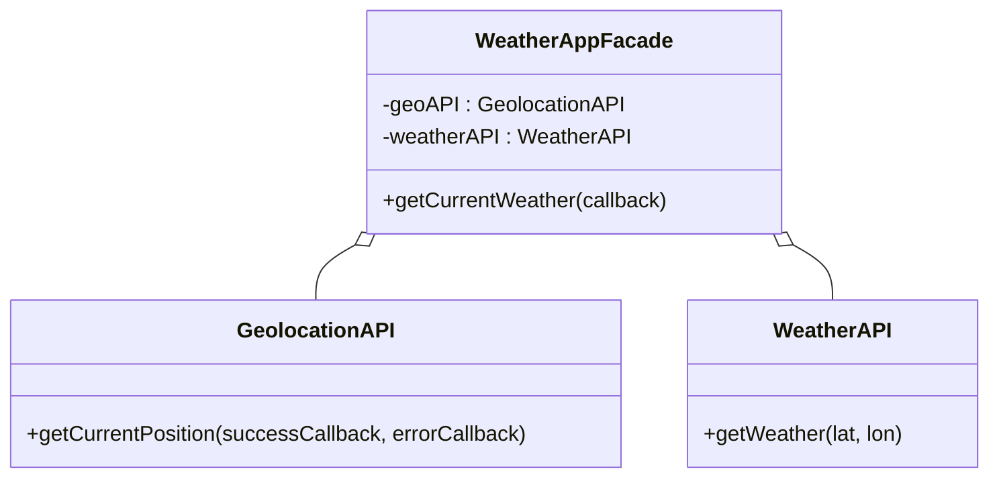

## 9.3.3 Facade Pattern in JavaScript Libraries

In the ever-evolving world of software development, where complexity is a constant companion, design patterns offer a beacon of simplicity and clarity. Among these patterns, the **Facade Pattern** stands out for its ability to provide a unified and simplified interface to a set of interfaces within a subsystem. This chapter delves into the Facade Pattern, particularly its implementation in JavaScript libraries, and how you can leverage it to manage complexity in your own projects.

### Understanding the Facade Pattern

The Facade Pattern is a structural design pattern that offers a simplified interface to a complex subsystem. It acts as a front-facing interface that masks the more intricate and detailed operations of the underlying system. By doing so, it reduces the number of objects that the client interacts with and promotes a cleaner and more manageable codebase.

#### Key Characteristics of the Facade Pattern:

- **Simplification:** Provides a straightforward interface to complex subsystems.
- **Decoupling:** Reduces dependencies between client code and subsystems.
- **Ease of Use:** Facilitates easier interaction with libraries or frameworks by hiding complex details.

### Facade Pattern in JavaScript Libraries

JavaScript libraries often use the Facade Pattern to abstract complex operations and provide developers with easy-to-use APIs. Two popular libraries that exemplify this pattern are **jQuery** and **Axios**.

#### jQuery: Simplifying DOM Manipulation

jQuery is a classic example of the Facade Pattern in action. It abstracts the complexities of DOM manipulation, event handling, and AJAX calls, providing a simple and consistent API for developers.

- **DOM Manipulation:** jQuery's `$()` function allows developers to select and manipulate DOM elements effortlessly, hiding the complexities of native DOM API interactions.
- **Event Handling:** jQuery simplifies event handling with methods like `.on()` and `.off()`, abstracting the nuances of event listeners.
- **AJAX Calls:** jQuery's `$.ajax()` method provides a streamlined interface for making asynchronous HTTP requests, abstracting the complexities of `XMLHttpRequest`.

#### Axios: Simplifying HTTP Requests

Axios is another library that demonstrates the Facade Pattern by simplifying HTTP requests. It abstracts the intricacies of `XMLHttpRequest` or the `fetch` API, offering a promise-based interface for making HTTP requests.

- **Unified API:** Axios provides a consistent API for making GET, POST, and other HTTP requests.
- **Promise-Based:** It uses promises to handle asynchronous operations, simplifying error handling and response processing.
- **Interceptors:** Axios allows for request and response interceptors, providing a way to modify requests or responses globally.

### Implementing a Facade: A Practical Example

To illustrate the implementation of the Facade Pattern, let's consider a scenario where we create a simplified API for complex browser APIs, such as the Geolocation and Weather APIs.

#### Example Scenario: Weather Application

In this example, we'll build a `WeatherAppFacade` that provides a simple method to get the current weather based on the user's location. This facade will interact with two subsystems: `GeolocationAPI` and `WeatherAPI`.

```javascript
// Subsystem classes
class GeolocationAPI {
  getCurrentPosition(successCallback, errorCallback) {
    navigator.geolocation.getCurrentPosition(successCallback, errorCallback);
  }
}

class WeatherAPI {
  getWeather(lat, lon) {
    // Simulate an API call
    return new Promise((resolve) => {
      setTimeout(() => {
        resolve(`The weather at (${lat}, ${lon}) is Sunny.`);
      }, 1000);
    });
  }
}

// Facade
class WeatherAppFacade {
  constructor() {
    this.geoAPI = new GeolocationAPI();
    this.weatherAPI = new WeatherAPI();
  }

  getCurrentWeather(callback) {
    this.geoAPI.getCurrentPosition(
      (position) => {
        const { latitude, longitude } = position.coords;
        this.weatherAPI.getWeather(latitude, longitude).then((weather) => {
          callback(weather);
        });
      },
      (error) => {
        callback(`Error: ${error.message}`);
      }
    );
  }
}

// Usage
const app = new WeatherAppFacade();
app.getCurrentWeather((message) => {
  console.log(message);
});
```

#### Explanation:

- **Subsystems:** `GeolocationAPI` and `WeatherAPI` represent complex APIs that handle geolocation and weather data retrieval.
- **Facade (`WeatherAppFacade`):** This class provides a simple `getCurrentWeather` method that abstracts the complexities of obtaining the user's location and fetching the weather data. It coordinates between the subsystems and presents a unified interface to the client.

### Best Practices for Implementing the Facade Pattern

When implementing the Facade Pattern, consider the following best practices:

- **Design for Client Needs:** Ensure the facade interface meets the specific needs of your client code. It should simplify interactions and reduce dependencies.
- **Cohesive Methods:** Keep facade methods focused on specific tasks to maintain clarity and ease of use.
- **Encapsulation:** Use the facade to encapsulate subsystem interactions, allowing for easier updates and changes without affecting client code.

### Real-World Applications of the Facade Pattern

The Facade Pattern finds numerous applications in real-world software development:

- **Simplifying Browser API Interactions:** Facades can simplify interactions with complex browser APIs, such as those for geolocation, notifications, or media devices.
- **Managing State in Libraries:** In state management libraries, facades can provide a simplified interface for managing application state, abstracting complex state transitions and updates.
- **Stable API Provision:** By using a facade, you can provide a stable API to client code, even if the underlying implementation changes over time.

### Visual Representation: Class Diagram

To better understand the relationships between the facade and subsystems, consider the following class diagram:



### Key Points to Remember

- **Managing Complexity:** The Facade Pattern is invaluable in managing complexity and improving code maintainability by providing a simplified interface to complex subsystems.
- **Decoupling Client Code:** It decouples client code from the intricate details of subsystems, allowing for easier updates and changes.
- **Improved Maintainability:** By using facades, you can improve the maintainability of your codebase, making it easier to understand and modify.

### Conclusion

The Facade Pattern is a powerful tool in the software developer's toolkit, especially when working with JavaScript libraries. It simplifies interactions with complex systems, promotes cleaner code, and enhances maintainability. By understanding and implementing this pattern, you can create more robust and user-friendly applications.

As you continue your journey in software design, remember that the Facade Pattern is just one of many patterns that can help you manage complexity and build better software. Keep exploring and experimenting to find the best solutions for your projects.

## Quiz Time!



### What is the primary purpose of the Facade Pattern in software design?

- [x] To provide a simplified interface to a complex subsystem
- [ ] To enhance the performance of a system
- [ ] To ensure data security within a system
- [ ] To manage memory efficiently

> **Explanation:** The Facade Pattern is primarily used to provide a unified and simplified interface to a set of interfaces in a subsystem, making it easier for client code to interact with complex systems.

### How does jQuery exemplify the Facade Pattern?

- [x] By abstracting complex DOM manipulations, event handling, and AJAX calls
- [ ] By providing low-level access to the DOM
- [ ] By enhancing the security of web applications
- [ ] By offering direct access to browser APIs

> **Explanation:** jQuery exemplifies the Facade Pattern by providing a simple API that abstracts the complexities of DOM manipulations, event handling, and AJAX calls, making it easier for developers to work with these features.

### What is one of the benefits of using Axios as a facade for HTTP requests?

- [x] It abstracts the complexities of `XMLHttpRequest` or `fetch` API
- [ ] It provides direct access to server-side databases
- [ ] It ensures data encryption during transmission
- [ ] It reduces the size of HTTP requests

> **Explanation:** Axios simplifies HTTP requests by providing a promise-based interface that abstracts the complexities of the `XMLHttpRequest` or `fetch` API, making it easier to handle asynchronous operations.

### In the WeatherAppFacade example, what role does the `WeatherAppFacade` class play?

- [x] It acts as a facade to simplify interactions with geolocation and weather APIs
- [ ] It directly manipulates the DOM to display weather information
- [ ] It encrypts weather data before transmission
- [ ] It provides direct access to the weather database

> **Explanation:** The `WeatherAppFacade` class acts as a facade that simplifies interactions with the `GeolocationAPI` and `WeatherAPI`, providing a single method to get the current weather based on the user's location.

### Why is it important to keep facade methods cohesive and focused?

- [x] To maintain clarity and ease of use
- [ ] To increase the complexity of the interface
- [x] To ensure the facade meets client needs
- [ ] To enhance security features

> **Explanation:** Keeping facade methods cohesive and focused helps maintain clarity and ease of use, ensuring the facade effectively meets the needs of the client code.

### What is a potential real-world application of the Facade Pattern?

- [x] Simplifying interactions with complex browser APIs
- [ ] Directly accessing hardware components
- [ ] Encrypting user data for security
- [ ] Managing low-level memory operations

> **Explanation:** The Facade Pattern can be used to simplify interactions with complex browser APIs, providing a more user-friendly interface for developers.

### How does the Facade Pattern improve code maintainability?

- [x] By decoupling client code from intricate subsystem details
- [ ] By increasing the number of interfaces a client interacts with
- [x] By allowing easier updates and changes to subsystems
- [ ] By reducing the need for documentation

> **Explanation:** The Facade Pattern improves code maintainability by decoupling client code from the intricate details of subsystems, allowing for easier updates and changes without affecting client code.

### Which of the following is a key characteristic of the Facade Pattern?

- [x] Simplification
- [ ] Performance enhancement
- [ ] Direct hardware access
- [ ] Memory management

> **Explanation:** Simplification is a key characteristic of the Facade Pattern, as it provides a straightforward interface to complex subsystems.

### What is the relationship between `WeatherAppFacade` and `GeolocationAPI` in the class diagram?

- [x] `WeatherAppFacade` has a composition relationship with `GeolocationAPI`
- [ ] `WeatherAppFacade` inherits from `GeolocationAPI`
- [ ] `WeatherAppFacade` directly modifies `GeolocationAPI`
- [ ] `WeatherAppFacade` has no relationship with `GeolocationAPI`

> **Explanation:** In the class diagram, `WeatherAppFacade` has a composition relationship with `GeolocationAPI`, meaning it contains an instance of `GeolocationAPI` to simplify interactions with it.

### True or False: The Facade Pattern can be used to provide a stable API while the underlying implementation changes.

- [x] True
- [ ] False

> **Explanation:** True. The Facade Pattern can provide a stable API to client code, even if the underlying implementation changes, by abstracting the complexities and details of the subsystems.


