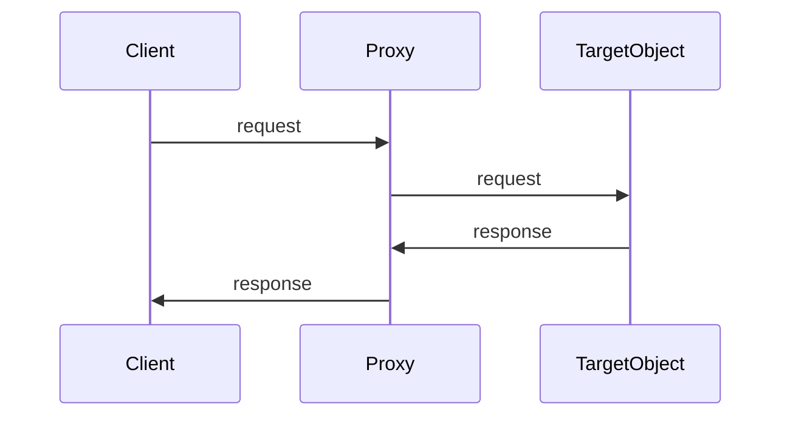

## 9.3.4 Proxy Pattern with ES6 Proxy Object

In the realm of software design patterns, the **Proxy Pattern** stands out for its ability to provide a surrogate or placeholder for another object, controlling access to it. This pattern is particularly useful in scenarios where you want to add an additional layer of functionality or control without altering the original object's code. With the advent of ECMAScript 6 (ES6), JavaScript developers have been equipped with a native `Proxy` object, a powerful tool that allows for the customization of fundamental operations on objects. In this section, we'll delve deep into the Proxy Pattern, explore the capabilities of the ES6 `Proxy` object, and demonstrate its practical applications through detailed examples.

### Understanding the Proxy Pattern

The Proxy Pattern is a structural design pattern that provides an object representing another object. This pattern is used to control access to the original object, allowing you to intercept and redefine operations performed on it. The proxy can perform additional actions before or after forwarding the operation to the original object, such as logging, access control, caching, or lazy initialization.

#### Key Concepts of the Proxy Pattern

- **Surrogate or Placeholder:** The proxy serves as an intermediary, providing a stand-in for the actual object.
- **Access Control:** The proxy can restrict or modify access to the original object.
- **Additional Functionality:** The proxy can add new functionality or modify existing behavior without changing the original object's code.

### Introducing the ES6 Proxy Object

The ES6 `Proxy` object is a built-in feature of JavaScript that allows developers to define custom behavior for fundamental operations on objects. These operations include property lookup, assignment, enumeration, and function invocation. The `Proxy` object is created by specifying a target object and a handler object that defines traps for intercepting operations.

#### Syntax of the ES6 Proxy Object

```javascript
const proxy = new Proxy(targetObject, handlerObject);
```

- **`targetObject`:** The original object whose operations you want to intercept.
- **`handlerObject`:** An object containing traps, which are methods that provide property access.

### Implementing Access Control with Proxies

One of the most common uses of the Proxy Pattern is to implement access control. This involves validating or modifying property assignments on an object, ensuring that only valid data is stored.

#### Example Scenario: Validating Property Assignments

Consider a scenario where you have a `user` object, and you want to ensure that the `age` property is always a positive number. You can achieve this using a proxy with a `set` trap.

```javascript
const user = {
  name: 'Alice',
  age: 25,
};

const validator = {
  set(target, property, value) {
    if (property === 'age') {
      if (typeof value !== 'number' || value <= 0) {
        throw new TypeError('Age must be a positive number');
      }
    }
    target[property] = value;
    return true;
  },
};

const userProxy = new Proxy(user, validator);

// Usage
userProxy.age = 30;  // Valid
console.log(userProxy.age); // Output: 30
// userProxy.age = -5; // Throws error: Age must be a positive number
```

##### Explanation:

- **Target Object (`user`):** This is the original object whose properties we want to control.
- **Handler (`validator`):** This object contains the `set` trap, which intercepts property assignments. It checks if the property being set is `age` and validates the value.
- **Proxy (`userProxy`):** This is the proxy object that enforces the validation rules defined in the handler.

### Implementing Virtual Proxy for Lazy Initialization

Another powerful use of proxies is to implement a virtual proxy that performs lazy initialization. This means that an expensive object is only created when it is actually needed, saving resources.

#### Code Example: Lazy Initialization of a Heavy Object

```javascript
class HeavyObject {
  constructor() {
    console.log('HeavyObject is being created...');
    // Expensive initialization
  }

  doWork() {
    console.log('HeavyObject is working...');
  }
}

const heavyObjectProxy = new Proxy({}, {
  get: function(target, property) {
    if (!target.heavyObject) {
      target.heavyObject = new HeavyObject();
    }
    return target.heavyObject[property];
  },
});

// Usage
// HeavyObject is not created yet
heavyObjectProxy.doWork();
// Output:
// HeavyObject is being created...
// HeavyObject is working...
```

##### Explanation:

- **Lazy Initialization:** The `HeavyObject` is only instantiated when a property is accessed for the first time. This is achieved by checking if `target.heavyObject` exists in the `get` trap.
- **Efficiency:** This approach defers the creation of the `HeavyObject` until it's necessary, optimizing resource usage.

### Best Practices for Using Proxies

While proxies are powerful, they should be used judiciously to avoid unnecessary complexity and performance overhead.

- **Performance Considerations:** Proxies can introduce a performance overhead, especially if they are used extensively or in performance-critical parts of your application. Always measure the impact of proxies on your application's performance.
- **Clear Documentation:** Document the behavior of proxies clearly to avoid confusion for other developers who may work with your code. This includes explaining the purpose of the proxy and the operations it intercepts.
- **Use Cases:** Proxies are ideal for scenarios like access control, logging, change detection in data binding frameworks, and implementing virtual proxies for resource optimization.

### Real-World Applications of Proxies

Proxies are widely used in modern JavaScript applications, often in frameworks and libraries to enhance functionality without altering the core logic.

- **Data Binding Frameworks:** Proxies are used in frameworks like Vue.js for change detection and reactivity, allowing the framework to automatically update the UI when data changes.
- **Access Control:** Proxies can be used to implement fine-grained access control mechanisms, ensuring that only authorized operations are performed on sensitive data.
- **Logging and Monitoring:** Proxies can intercept method calls and property accesses to log operations, providing insights into application behavior and performance.

### Visualizing the Proxy Pattern

To better understand how the Proxy Pattern works, consider the following sequence diagram, which illustrates the interaction between a client, a proxy, and a target object:



In this diagram, the client sends a request to the proxy, which then forwards the request to the target object. The target object processes the request and sends a response back to the proxy, which in turn sends the response to the client. This sequence highlights the role of the proxy as an intermediary, controlling access to the target object.

### Key Points to Emphasize

- **Powerful Tool:** The ES6 `Proxy` object provides a powerful mechanism to implement the Proxy Pattern in JavaScript, offering fine-grained control over object operations.
- **Interception and Redefinition:** Proxies can intercept and redefine fundamental operations on objects, such as property access and method invocation.
- **Enhanced Control:** By using proxies, developers can enhance control over objects, adding custom behavior without modifying the original object's code.

### Conclusion

The Proxy Pattern, when implemented using the ES6 `Proxy` object, offers a versatile and powerful way to control access to objects and add custom behavior in JavaScript applications. Whether you're looking to enforce validation rules, implement lazy initialization, or enhance logging and monitoring, proxies provide a clean and efficient solution. As with any powerful tool, it's important to use proxies judiciously, ensuring that they add value without introducing unnecessary complexity or performance overhead. By understanding and applying the Proxy Pattern, you can create more robust and flexible software architectures that meet the demands of modern development.

## Quiz Time!



### What is the primary purpose of the Proxy Pattern?

- [x] To provide a surrogate or placeholder for another object to control access to it.
- [ ] To directly modify the original object.
- [ ] To create a new object that replaces the original.
- [ ] To remove the need for the original object.

> **Explanation:** The Proxy Pattern provides a surrogate or placeholder for another object, allowing controlled access without modifying the original object.

### How does the ES6 `Proxy` object enhance JavaScript applications?

- [x] By allowing custom behavior for fundamental operations on objects.
- [ ] By replacing the need for classes.
- [ ] By improving the speed of JavaScript execution.
- [ ] By eliminating the need for functions.

> **Explanation:** The ES6 `Proxy` object allows developers to define custom behavior for fundamental operations like property lookup and assignment, enhancing control over object behavior.

### In the provided code example, what does the `set` trap do?

- [x] It intercepts property assignments and validates the value for the `age` property.
- [ ] It deletes the `age` property.
- [ ] It logs every property assignment.
- [ ] It prevents all property assignments.

> **Explanation:** The `set` trap in the example intercepts assignments to the `age` property, ensuring that only positive numbers are assigned.

### What is lazy initialization in the context of the Proxy Pattern?

- [x] Creating an expensive object only when it is needed.
- [ ] Initializing all objects at the start of the program.
- [ ] Creating objects in a random order.
- [ ] Avoiding object creation altogether.

> **Explanation:** Lazy initialization refers to deferring the creation of an expensive object until it is actually needed, optimizing resource usage.

### Which of the following is a best practice when using proxies?

- [x] Documenting proxy behavior clearly.
- [ ] Using proxies for every object in your application.
- [ ] Avoiding the use of handlers.
- [ ] Never using proxies in production code.

> **Explanation:** It's important to document proxy behavior clearly to avoid confusion, as proxies can introduce complexity.

### How can proxies be used in data binding frameworks?

- [x] For change detection and reactivity.
- [ ] To replace HTML elements.
- [ ] To speed up rendering.
- [ ] To eliminate the need for JavaScript.

> **Explanation:** Proxies can be used in data binding frameworks for change detection, allowing automatic updates to the UI when data changes.

### What is a potential downside of using proxies extensively?

- [x] They can introduce performance overhead.
- [ ] They make code execution faster.
- [ ] They simplify all code structures.
- [ ] They eliminate the need for testing.

> **Explanation:** Proxies can introduce performance overhead, especially if used extensively, so their impact should be measured.

### In the sequence diagram, what role does the proxy play?

- [x] It acts as an intermediary between the client and the target object.
- [ ] It replaces the client.
- [ ] It directly modifies the target object.
- [ ] It eliminates the need for a client.

> **Explanation:** The proxy acts as an intermediary, controlling access to the target object and potentially modifying requests and responses.

### What is a common application of proxies in logging and monitoring?

- [x] Intercepting method calls to log operations.
- [ ] Replacing log files.
- [ ] Speeding up log processing.
- [ ] Eliminating the need for monitoring.

> **Explanation:** Proxies can intercept method calls and property accesses to log operations, providing insights into application behavior.

### True or False: Proxies can only be used for access control.

- [x] False
- [ ] True

> **Explanation:** Proxies can be used for a variety of purposes, including access control, logging, lazy initialization, and more.


