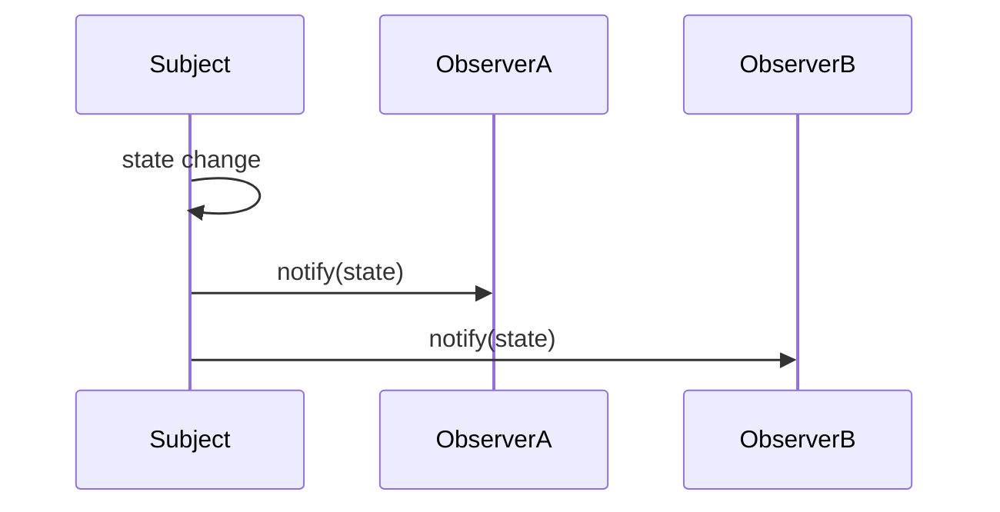

## 9.4.1 Observer Pattern with Event Emitters

The Observer pattern is a fundamental design pattern in software engineering, establishing a one-to-many dependency between objects. When the state of one object (the subject) changes, all its dependents (the observers) are notified and updated automatically. This pattern is particularly useful in scenarios where a change in one part of an application should propagate to other parts, such as in user interface updates or real-time data handling.

In this section, we explore how to implement the Observer pattern in JavaScript using Node.js's `EventEmitter` class and browser events. JavaScript's event-driven nature makes it an ideal language for implementing this pattern, providing built-in mechanisms that simplify the process.

### Understanding the Observer Pattern

Before diving into code, let's review the core concepts of the Observer pattern:

- **Subject:** The object that holds the state and notifies observers of changes.
- **Observers:** Objects that need to be informed about changes in the subject.
- **Notification Mechanism:** The process by which the subject informs observers of state changes.

The Observer pattern is widely used in various programming paradigms, particularly in event-driven and reactive programming, where it helps decouple the subject and observers, allowing for more modular and maintainable code.

### Implementing the Observer Pattern with Node.js `EventEmitter`

Node.js provides a robust mechanism for implementing the Observer pattern through its `EventEmitter` class. This class allows objects to emit named events and attach listeners to those events. Here's how you can use `EventEmitter` to implement the Observer pattern:

#### Code Example

```javascript
const EventEmitter = require('events');

class Subject extends EventEmitter {
  constructor() {
    super();
    this.state = 0;
  }

  setState(state) {
    this.state = state;
    this.emit('stateChange', this.state);
  }
}

// Observers
function observerA(state) {
  console.log(`Observer A: State changed to ${state}`);
}

function observerB(state) {
  console.log(`Observer B: State changed to ${state}`);
}

// Usage
const subject = new Subject();
subject.on('stateChange', observerA);
subject.on('stateChange', observerB);

subject.setState(1);
// Output:
// Observer A: State changed to 1
// Observer B: State changed to 1
```

#### Explanation

- **Subject Class:** Extends `EventEmitter`, allowing it to emit events. The `setState` method changes the state and emits a `stateChange` event.
- **Observers:** Functions `observerA` and `observerB` respond to the `stateChange` event, logging the new state.

This implementation demonstrates how `EventEmitter` simplifies the Observer pattern by handling the registration and notification of observers.

### Implementing the Observer Pattern with Browser Events

In the browser environment, the Document Object Model (DOM) provides a natural way to implement the Observer pattern through event handling. HTML elements can emit events, and JavaScript functions can listen to these events.

#### Code Example

```html
<!DOCTYPE html>
<html>
<body>
  <button id="notifyButton">Notify Observers</button>

  <script>
    // Subject
    const button = document.getElementById('notifyButton');

    // Observers
    function observerA() {
      console.log('Observer A: Button clicked');
    }

    function observerB() {
      console.log('Observer B: Button clicked');
    }

    // Attach observers
    button.addEventListener('click', observerA);
    button.addEventListener('click', observerB);

    // Emitting event manually
    // button.click();
  </script>
</body>
</html>
```

#### Explanation

- **Subject:** The button element acts as the subject, emitting `click` events.
- **Observers:** Functions `observerA` and `observerB` are attached to the button's `click` event using `addEventListener`.

This example illustrates how the DOM's event system naturally supports the Observer pattern, allowing multiple functions to respond to user interactions.

### Best Practices for Using the Observer Pattern

While the Observer pattern is powerful, it's essential to follow best practices to ensure efficient and maintainable code:

- **Clean Up Event Listeners:** Always remove event listeners when they are no longer needed to prevent memory leaks. In Node.js, use `removeListener` or `off`, and in the browser, use `removeEventListener`.
- **Meaningful Event Names:** Use descriptive event names to improve code readability and maintainability. This practice helps other developers understand the purpose of each event.
- **Avoid Overuse:** While the Observer pattern is useful, overusing it can lead to complex and hard-to-debug code. Use it judiciously and consider alternative patterns when appropriate.

### Real-World Applications of the Observer Pattern

The Observer pattern is prevalent in modern software development, with numerous real-world applications:

- **React's Event System:** React uses a synthetic event system that abstracts browser differences and provides a consistent interface for handling events.
- **State Management Libraries:** Libraries like Redux and MobX use the Observer pattern to manage application state, allowing components to react to state changes.
- **Real-Time Data Updates:** Web applications that require real-time updates, such as chat applications or live dashboards, often use the Observer pattern in conjunction with WebSockets or Pub/Sub systems.

### Visualizing the Observer Pattern

To better understand the flow of events in the Observer pattern, consider the following sequence diagram:



This diagram illustrates how a state change in the subject triggers notifications to the observers, emphasizing the one-to-many relationship central to the Observer pattern.

### Key Points to Emphasize

- **Event-Driven Nature:** JavaScript's event-driven architecture makes implementing the Observer pattern intuitive and straightforward.
- **Built-In Mechanisms:** Both Node.js and browser environments provide built-in mechanisms for handling events, simplifying the implementation of the Observer pattern.
- **Proper Management:** Effective management of event listeners is crucial for maintaining application performance and reliability.

By understanding and applying the Observer pattern using Node.js and browser events, developers can create responsive and maintainable applications that efficiently handle changes in state and user interactions.

## Quiz Time!



### What is the primary purpose of the Observer pattern?

- [x] To establish a one-to-many dependency between objects
- [ ] To encapsulate a request as an object
- [ ] To define a family of algorithms
- [ ] To provide a way to access elements of an aggregate object

> **Explanation:** The Observer pattern establishes a one-to-many dependency between objects, allowing changes in one object to notify and update all its dependents.

### Which Node.js class is commonly used to implement the Observer pattern?

- [x] EventEmitter
- [ ] Stream
- [ ] Buffer
- [ ] Process

> **Explanation:** The `EventEmitter` class in Node.js is used to implement the Observer pattern by emitting events and attaching listeners.

### In a browser environment, which method is used to attach an event listener to an element?

- [x] addEventListener
- [ ] on
- [ ] attachEvent
- [ ] bindEvent

> **Explanation:** The `addEventListener` method is used to attach an event listener to an element in the browser environment.

### What should you do to prevent memory leaks when using event listeners?

- [x] Remove event listeners when they are no longer needed
- [ ] Use global variables for event listeners
- [ ] Avoid using event listeners altogether
- [ ] Use inline event handlers

> **Explanation:** Removing event listeners when they are no longer needed helps prevent memory leaks in applications.

### Which of the following is a real-world application of the Observer pattern?

- [x] React's event system
- [ ] Sorting algorithms
- [x] State management libraries like Redux
- [ ] Database indexing

> **Explanation:** React's event system and state management libraries like Redux are real-world applications of the Observer pattern.

### What is the main advantage of using meaningful event names?

- [x] Improves code readability and maintainability
- [ ] Increases execution speed
- [ ] Reduces code size
- [ ] Enhances security

> **Explanation:** Using meaningful event names improves code readability and maintainability, making it easier for developers to understand the purpose of each event.

### How does the Observer pattern help in decoupling code?

- [x] By separating the subject from its observers
- [ ] By combining multiple classes into one
- [x] By allowing observers to subscribe to specific events
- [ ] By embedding all logic within a single function

> **Explanation:** The Observer pattern helps decouple code by separating the subject from its observers, allowing them to subscribe to specific events independently.

### In the Node.js example, what method is used to emit an event?

- [x] emit
- [ ] dispatch
- [ ] trigger
- [ ] fire

> **Explanation:** The `emit` method is used in Node.js to emit an event, notifying all attached listeners.

### Which of the following best describes the role of observers in the Observer pattern?

- [x] Objects that respond to state changes in the subject
- [ ] Objects that initiate state changes
- [ ] Objects that store application data
- [ ] Objects that manage user authentication

> **Explanation:** Observers are objects that respond to state changes in the subject, reacting to notifications when the subject's state changes.

### True or False: The Observer pattern is only applicable in JavaScript environments.

- [x] False
- [ ] True

> **Explanation:** The Observer pattern is a general design pattern applicable in many programming languages and environments, not just JavaScript.



By understanding the Observer pattern and its implementation in JavaScript, you can create dynamic applications that efficiently handle changes and updates. Explore further by experimenting with the provided examples and consider how this pattern can be applied to your projects.
