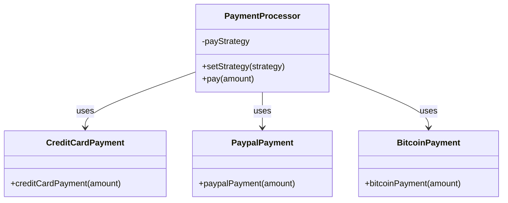

## 9.4.2 Strategy Pattern with Dynamic Function Assignment

### Introduction

In the realm of software design, the **Strategy Pattern** stands out as a powerful behavioral pattern that enables the selection of algorithms at runtime. This flexibility is particularly beneficial in dynamic programming languages like JavaScript, where functions can be assigned and re-assigned on the fly. In this section, we'll delve into how the Strategy Pattern can be implemented in JavaScript through dynamic function assignment, explore practical examples, and understand its real-world applications.

### Review of the Strategy Pattern

The Strategy Pattern is a design pattern that allows you to define a family of algorithms, encapsulate each one, and make them interchangeable. The key idea is to separate the algorithm from the host class, enabling the algorithm to vary independently from the clients that use it.

#### Key Components of the Strategy Pattern

- **Strategy Interface:** Defines a common interface for all supported algorithms. Each algorithm is encapsulated in a class that implements this interface.
- **Concrete Strategies:** These are the classes that implement the Strategy interface, each providing a different implementation of the algorithm.
- **Context:** This is the class that uses the Strategy interface to call the algorithm defined by a Concrete Strategy. The Context maintains a reference to a Strategy object and delegates the algorithm execution to this object.

### Dynamic Function Assignment in JavaScript

JavaScript's dynamic nature allows functions to be assigned to variables and object properties, which can then be invoked as methods. This capability makes JavaScript an ideal language for implementing the Strategy Pattern, as it allows for behavior to be changed at runtime without altering the structure of the program.

#### Explanation

In JavaScript, functions are first-class citizens, meaning they can be:
- Assigned to variables.
- Passed as arguments to other functions.
- Returned from other functions.
- Stored in data structures.

This flexibility allows us to dynamically assign and swap out functions, enabling the Strategy Pattern's behavior selection at runtime.

### Example Scenario: Payment Processing System

Let's consider a practical example where we implement a payment processing system. This system needs to support multiple payment methods, such as credit card, PayPal, and Bitcoin. Each payment method is implemented as a separate strategy, and the payment processor can switch between these strategies dynamically.

#### Code Example

```javascript
// Strategies as functions
function creditCardPayment(amount) {
  console.log(`Processing credit card payment of $${amount}`);
}

function paypalPayment(amount) {
  console.log(`Processing PayPal payment of $${amount}`);
}

function bitcoinPayment(amount) {
  console.log(`Processing Bitcoin payment of $${amount}`);
}

// Context
class PaymentProcessor {
  constructor() {
    this.payStrategy = null;
  }

  setStrategy(strategy) {
    this.payStrategy = strategy;
  }

  pay(amount) {
    if (this.payStrategy) {
      this.payStrategy(amount);
    } else {
      console.log('No payment strategy selected.');
    }
  }
}

// Usage
const paymentProcessor = new PaymentProcessor();

// User selects payment method
paymentProcessor.setStrategy(creditCardPayment);
paymentProcessor.pay(100); // Output: Processing credit card payment of $100

paymentProcessor.setStrategy(paypalPayment);
paymentProcessor.pay(200); // Output: Processing PayPal payment of $200
```

#### Explanation

- **Strategies:** Each payment method is implemented as a standalone function. These functions represent different strategies for processing payments.
- **Context (`PaymentProcessor`):** This class holds a reference to the current strategy and executes it through the `pay` method. The `setStrategy` method allows changing the strategy at runtime.

### Best Practices

When implementing the Strategy Pattern with dynamic function assignment in JavaScript, consider the following best practices:

1. **Consistent Interface:** Ensure that all strategy functions share a consistent interface, typically by having the same function signature. This consistency allows the Context to interact with strategies interchangeably.

2. **Strategy Validation:** Before executing a strategy, validate that a strategy has been set. This prevents runtime errors and ensures that the Context behaves predictably.

3. **Encapsulation and Modularity:** Encapsulate strategies in a way that promotes modularity. This approach not only adheres to the Open/Closed Principle but also makes the codebase easier to maintain and extend.

4. **Error Handling:** Implement error handling within strategies to manage exceptions and edge cases gracefully.

### Real-World Applications

The Strategy Pattern with dynamic function assignment is applicable in various real-world scenarios:

- **Data Validation:** Switching between different validation rules based on user input or configuration.
- **Logging Strategies:** Changing logging behavior dynamically, such as switching between console logging and file logging.
- **Rendering Methods:** Adapting rendering strategies in web applications based on device type or user preferences.

### Visuals and Diagrams

To better understand the relationship between the Context and strategies, consider the following diagram:



### Key Points to Emphasize

- **JavaScript's Dynamic Nature:** JavaScript's ability to treat functions as first-class citizens allows for easy implementation of the Strategy Pattern.
- **Function Assignment:** By assigning functions dynamically, you can change behavior at runtime without altering the program's structure.
- **Modularity and Flexibility:** This approach promotes modularity, making it easier to add new strategies or modify existing ones without impacting other parts of the system.

### Conclusion

The Strategy Pattern with dynamic function assignment leverages JavaScript's flexibility to create adaptable and maintainable code. By encapsulating algorithms in interchangeable functions, you can build systems that are both robust and extensible. As you explore this pattern, consider how it can be applied to your projects to enhance code quality and adaptability.

## Quiz Time!



### What is the primary benefit of using the Strategy Pattern?

- [x] It allows selecting algorithms at runtime.
- [ ] It reduces code duplication.
- [ ] It simplifies class hierarchies.
- [ ] It improves performance.

> **Explanation:** The Strategy Pattern allows for selecting and changing algorithms at runtime by encapsulating them in interchangeable components.

### In JavaScript, how can functions be used to implement the Strategy Pattern?

- [x] By assigning functions to variables and object properties.
- [ ] By using functions only as callbacks.
- [ ] By creating new classes for each function.
- [ ] By using functions only within closures.

> **Explanation:** JavaScript functions can be assigned to variables and object properties, enabling dynamic behavior changes.

### What is the role of the Context in the Strategy Pattern?

- [x] It holds a reference to a strategy and delegates algorithm execution.
- [ ] It defines the algorithm interface.
- [ ] It implements the algorithm.
- [ ] It creates new strategies.

> **Explanation:** The Context maintains a reference to a Strategy object and uses it to execute the algorithm.

### Why is it important for strategy functions to have a consistent interface?

- [x] To ensure they can be used interchangeably by the Context.
- [ ] To reduce memory usage.
- [ ] To increase execution speed.
- [ ] To simplify logging.

> **Explanation:** A consistent interface allows the Context to interact with strategies interchangeably.

### Which of the following is a real-world application of the Strategy Pattern?

- [x] Switching data validation rules.
- [ ] Managing database connections.
- [ ] Optimizing network requests.
- [ ] Caching data.

> **Explanation:** The Strategy Pattern can be used to switch between different data validation rules based on context.

### What should be validated before executing a strategy?

- [x] That a strategy has been set.
- [ ] That the Context is initialized.
- [ ] That the algorithm is optimized.
- [ ] That the strategy is unique.

> **Explanation:** It's important to validate that a strategy has been set to avoid runtime errors.

### How does the Strategy Pattern adhere to the Open/Closed Principle?

- [x] By allowing new strategies to be added without modifying existing code.
- [ ] By reducing the number of classes.
- [ ] By increasing code execution speed.
- [ ] By simplifying debugging.

> **Explanation:** The Strategy Pattern allows new strategies to be added without changing the existing Context or strategies, adhering to the Open/Closed Principle.

### What is a key advantage of using dynamic function assignment in JavaScript?

- [x] It allows behavior to be changed at runtime.
- [ ] It reduces memory usage.
- [ ] It simplifies error handling.
- [ ] It increases code readability.

> **Explanation:** Dynamic function assignment allows behavior to be changed at runtime, providing flexibility in code execution.

### How can error handling be incorporated into strategies?

- [x] By implementing error handling within each strategy function.
- [ ] By using global error handlers.
- [ ] By avoiding exceptions.
- [ ] By logging errors to the console.

> **Explanation:** Error handling should be implemented within each strategy function to manage exceptions and edge cases.

### True or False: The Strategy Pattern is only useful in object-oriented programming languages.

- [ ] True
- [x] False

> **Explanation:** The Strategy Pattern is applicable in any programming paradigm that supports encapsulating algorithms and changing them at runtime, including functional and procedural programming.


