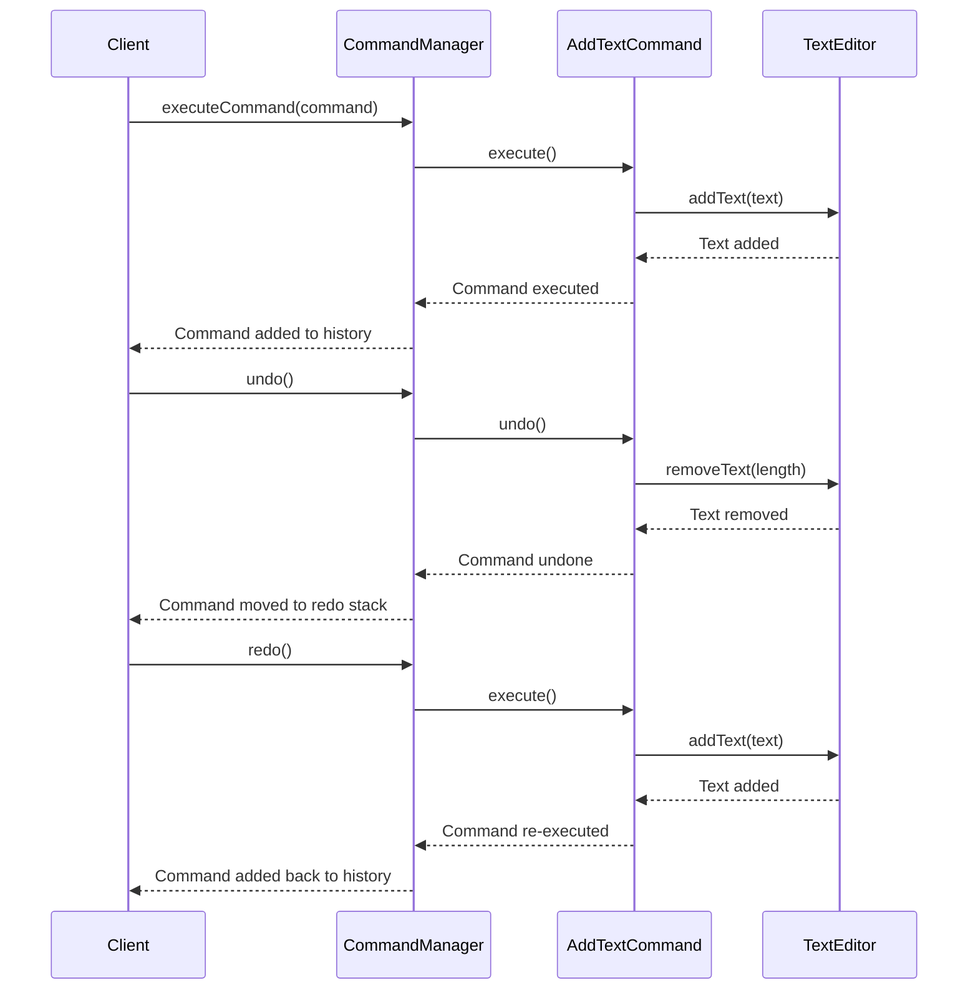

## 9.4.3 Command Pattern in UI Interactions

In the ever-evolving landscape of software development, particularly in user interface (UI) design, the ability to handle complex user interactions efficiently is paramount. One of the key challenges is implementing features that allow users to undo and redo actions seamlessly. The Command pattern, a fundamental behavioral design pattern, offers an elegant solution to this challenge. In this section, we will delve into the Command pattern, exploring its implementation in JavaScript to create robust UI interactions, specifically focusing on undo/redo functionalities.

### Understanding the Command Pattern

The **Command pattern** is a behavioral design pattern that turns a request into a stand-alone object that contains all information about the request. This transformation allows for parameterizing clients with queues, requests, and operations, and supports operations such as undo/redo and logging.

#### Key Concepts of the Command Pattern

- **Command Object:** Encapsulates a request as an object, allowing for the parameterization of clients with queues, requests, and operations.
- **Invoker:** The object that knows how to execute a command but does not know how the command has been implemented.
- **Receiver:** The object that performs the actual work when the command's `execute` method is called.
- **Client:** The object that creates a command and sets its receiver.

By encapsulating requests as objects, the Command pattern decouples the sender of a request from its receiver, providing flexibility in executing commands, delaying execution, and supporting undoable operations.

### Example Scenario: Building a Text Editor with Undo/Redo

To illustrate the Command pattern in action, let's consider a simple text editor application. Our goal is to implement undo and redo functionalities for text operations. This will involve creating command objects for each text operation, managing these commands with a command manager, and executing them on a text editor.

#### Components of Our Text Editor Example

1. **TextEditor (Receiver):** The core component that performs text operations like adding and removing text.
2. **AddTextCommand (Command):** A command that encapsulates the action of adding text to the editor.
3. **CommandManager (Invoker):** Manages the execution and history of commands, facilitating undo and redo operations.

Let's dive into the implementation of these components in JavaScript.

```javascript
class CommandManager {
  constructor() {
    this.history = [];
    this.redoStack = [];
  }

  executeCommand(command) {
    command.execute();
    this.history.push(command);
    this.redoStack = [];
  }

  undo() {
    if (this.history.length === 0) return;
    const command = this.history.pop();
    command.undo();
    this.redoStack.push(command);
  }

  redo() {
    if (this.redoStack.length === 0) return;
    const command = this.redoStack.pop();
    command.execute();
    this.history.push(command);
  }
}

class AddTextCommand {
  constructor(receiver, text) {
    this.receiver = receiver;
    this.text = text;
  }

  execute() {
    this.receiver.addText(this.text);
  }

  undo() {
    this.receiver.removeText(this.text.length);
  }
}

class TextEditor {
  constructor() {
    this.content = '';
  }

  addText(text) {
    this.content += text;
    console.log(`Content: "${this.content}"`);
  }

  removeText(length) {
    this.content = this.content.slice(0, -length);
    console.log(`Content: "${this.content}"`);
  }
}

// Usage
const editor = new TextEditor();
const commandManager = new CommandManager();

const command1 = new AddTextCommand(editor, 'Hello');
const command2 = new AddTextCommand(editor, ' World');

commandManager.executeCommand(command1); // Content: "Hello"
commandManager.executeCommand(command2); // Content: "Hello World"

commandManager.undo(); // Content: "Hello"
commandManager.redo(); // Content: "Hello World"
```

#### Explanation of the Code

- **CommandManager:** This class manages the execution of commands and maintains a history of executed commands for undo functionality. It also manages a redo stack to allow re-execution of undone commands.
  
- **AddTextCommand:** This command encapsulates the operation of adding text to the `TextEditor`. It stores the necessary information (the text to be added) to execute and undo the action.

- **TextEditor:** Acts as the receiver that performs the actual text manipulation. It provides methods to add and remove text, which are invoked by the command objects.

### Best Practices for Implementing the Command Pattern

1. **Encapsulation of Information:** Ensure that each command object encapsulates all information needed to execute and undo its operation. This makes commands self-contained and reusable.

2. **Decoupling:** Keep the `CommandManager` decoupled from specific command implementations. This allows for flexibility in adding new commands without modifying the command manager.

3. **Command History Management:** Manage a history of executed commands to facilitate undo operations. Similarly, maintain a redo stack for re-executing undone commands.

4. **Clear Interface:** Define a clear interface for commands, typically including `execute` and `undo` methods, to standardize how commands interact with the receiver.

### Real-World Applications of the Command Pattern

The Command pattern is widely used in various applications beyond text editors. Here are some real-world scenarios where this pattern is beneficial:

- **Drawing Tools:** In applications like graphic design software, the Command pattern can manage user actions such as drawing, erasing, and transforming shapes, allowing users to undo and redo these actions.

- **Spreadsheets:** In spreadsheet applications, user actions like cell edits, formula changes, and formatting can be encapsulated as commands, enabling undo/redo functionalities.

- **IDEs (Integrated Development Environments):** IDEs use the Command pattern to handle code edits, refactorings, and other user interactions, providing a robust history of actions for undo/redo.

- **Task Scheduling:** The Command pattern can be used to schedule tasks or operations that can be queued or delayed, allowing for flexible task management.

### Visualizing the Command Pattern

To better understand how the Command pattern operates, let's visualize the sequence of interactions between the components using a sequence diagram.



### Key Points to Emphasize

- **Flexibility in Handling User Actions:** The Command pattern provides a flexible way to handle user actions, allowing for easy implementation of features like undo/redo, macros, and transaction management.

- **Decoupling:** By decoupling the invoker, command, and receiver, the Command pattern promotes a clean separation of concerns, enhancing maintainability and scalability.

- **Encapsulation of Actions:** Commands encapsulate actions as objects, making it easy to parameterize, queue, and manage requests, which is particularly useful in complex UI interactions.

### Conclusion

The Command pattern is a powerful tool for managing user interactions in software applications. By encapsulating actions as objects, it provides a structured approach to handling requests, enabling features like undo/redo, task scheduling, and more. In this section, we have explored how to implement the Command pattern in JavaScript, using a text editor example to demonstrate its practical application. By following best practices and understanding the pattern's real-world applications, developers can leverage the Command pattern to create flexible, maintainable, and user-friendly interfaces.

## Quiz Time!



### What is the main purpose of the Command pattern?

- [x] To encapsulate a request as an object, allowing for parameterization and queuing of requests.
- [ ] To optimize memory usage in applications.
- [ ] To enhance the graphical user interface.
- [ ] To improve network communication.

> **Explanation:** The Command pattern encapsulates a request as an object, enabling parameterization, queuing, and undo/redo functionalities.

### In the text editor example, what role does the `CommandManager` play?

- [x] It manages command execution and history for undo/redo.
- [ ] It directly manipulates the text content.
- [ ] It creates command objects.
- [ ] It stores the application's state.

> **Explanation:** The `CommandManager` is responsible for executing commands and maintaining a history of executed commands for undo/redo operations.

### What method must a command object implement to support undo functionality?

- [x] undo()
- [ ] redo()
- [ ] cancel()
- [ ] revert()

> **Explanation:** A command object must implement the `undo()` method to reverse its action, supporting undo functionality.

### How does the Command pattern promote decoupling in software design?

- [x] By separating the invoker, command, and receiver.
- [ ] By combining all components into a single class.
- [ ] By using global variables for communication.
- [ ] By eliminating the need for interfaces.

> **Explanation:** The Command pattern promotes decoupling by separating the invoker, command, and receiver, allowing them to interact without direct dependencies.

### Which of the following is a real-world application of the Command pattern?

- [x] Implementing undo/redo in a drawing tool.
- [ ] Compressing data files.
- [ ] Enhancing image resolution.
- [ ] Streaming video content.

> **Explanation:** The Command pattern is used in applications like drawing tools to manage user actions and provide undo/redo functionalities.

### What information should a command object encapsulate?

- [x] All necessary information to execute and undo its actions.
- [ ] Only the name of the command.
- [ ] The entire application's state.
- [ ] The user's personal data.

> **Explanation:** A command object should encapsulate all necessary information to execute and undo its actions, making it self-contained.

### In the provided code example, what does the `AddTextCommand` class represent?

- [x] A command that encapsulates the action of adding text to the editor.
- [ ] The main application logic.
- [ ] The user interface component.
- [ ] The database connection handler.

> **Explanation:** The `AddTextCommand` class represents a command that encapsulates the action of adding text to the `TextEditor`.

### How does the `CommandManager` handle redo operations?

- [x] By re-executing commands from the redo stack.
- [ ] By clearing the history of commands.
- [ ] By directly modifying the text content.
- [ ] By resetting the application state.

> **Explanation:** The `CommandManager` handles redo operations by re-executing commands from the redo stack and adding them back to the history.

### What is the benefit of using the Command pattern for task scheduling?

- [x] It allows tasks to be queued or delayed easily.
- [ ] It reduces the need for user input.
- [ ] It increases the application's speed.
- [ ] It simplifies error handling.

> **Explanation:** The Command pattern allows tasks to be queued or delayed easily, providing flexibility in task scheduling.

### True or False: The Command pattern can be used to implement macros in applications.

- [x] True
- [ ] False

> **Explanation:** True. The Command pattern can be used to implement macros by recording and executing a sequence of commands.


