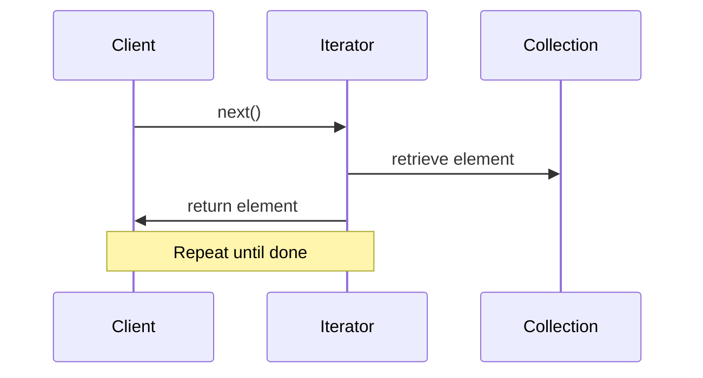

## 9.4.4 Iterator Pattern with Iterables and Generators

In the realm of software design, the **Iterator Pattern** stands out as a fundamental concept for traversing collections without exposing their underlying representations. JavaScript, with its robust support for iterables and generators, provides a streamlined approach to implementing this pattern. This section delves into how these features simplify the creation and usage of iterators in JavaScript, offering practical examples and insights into their real-world applications.

### Understanding the Iterator Pattern

The **Iterator Pattern** is a behavioral design pattern that allows sequential access to the elements of an aggregate object without exposing its internal structure. This pattern is particularly useful when dealing with collections of objects, as it provides a standard way to iterate over elements, regardless of the collection's type.

#### Key Characteristics of the Iterator Pattern

- **Encapsulation:** The pattern encapsulates the iteration logic, separating it from the collection's structure.
- **Consistency:** Provides a uniform interface for traversing different types of collections.
- **Flexibility:** Allows multiple traversals of a collection simultaneously, if needed.

### JavaScript Iterables: A Deep Dive

In JavaScript, an object is considered iterable if it implements the `Symbol.iterator` method. This method returns an iterator, which is an object with a `next()` method. The `next()` method returns an object with two properties: `value` (the next value in the sequence) and `done` (a boolean indicating whether the iteration is complete).

#### Implementing Iterables in JavaScript

To illustrate the concept of iterables, let's consider a scenario where we create a custom data structure—a collection of tasks—that can be iterated over.

```javascript
class TaskCollection {
  constructor() {
    this.tasks = [];
  }

  add(task) {
    this.tasks.push(task);
  }

  // Implementing the iterable protocol
  [Symbol.iterator]() {
    let index = 0;
    const tasks = this.tasks;

    return {
      next() {
        if (index < tasks.length) {
          return { value: tasks[index++], done: false };
        } else {
          return { done: true };
        }
      },
    };
  }
}

// Usage
const tasks = new TaskCollection();
tasks.add('Task 1');
tasks.add('Task 2');
tasks.add('Task 3');

for (const task of tasks) {
  console.log(task);
}
// Output:
// Task 1
// Task 2
// Task 3
```

#### Explanation

- **`[Symbol.iterator]()` Method:** This method defines how the object will be iterated over. It returns an iterator object with a `next()` method.
- **Iterator Logic:** The `next()` method manages the iteration state, returning each task until all tasks have been iterated over.

### Generators: Simplifying Iteration

Generators in JavaScript provide a powerful way to simplify the implementation of iterators by handling the iteration state internally. A generator is a special type of function that can pause its execution and resume later, allowing it to yield multiple values over time.

#### Implementing Iterables with Generators

Let's revisit our `TaskCollection` class, but this time using a generator to implement the iterable protocol.

```javascript
class TaskCollection {
  constructor() {
    this.tasks = [];
  }

  add(task) {
    this.tasks.push(task);
  }

  *[Symbol.iterator]() {
    for (const task of this.tasks) {
      yield task;
    }
  }
}

// Usage remains the same
```

#### Explanation

- **Generator Function `*[Symbol.iterator]()`**: The asterisk `*` denotes a generator function. The `yield` keyword is used to return each task, simplifying the iterator logic.
- **State Management**: The generator automatically manages the iteration state, pausing and resuming execution as needed.

### Best Practices for Using Iterables and Generators

- **Use Generators for Simplicity**: Generators greatly simplify custom iterator implementations by abstracting away the complexity of state management.
- **Handle Edge Cases**: Ensure that iterators correctly handle edge cases, such as empty collections or termination conditions.
- **Leverage Built-In Iterables**: JavaScript's built-in iterables (e.g., arrays, strings, maps) provide powerful iteration capabilities out of the box.

### Real-World Applications

Iterables and generators are not just theoretical constructs; they have practical applications in modern software development:

- **Complex Data Structures**: Iterate over complex data structures like trees, graphs, or custom collections with ease.
- **Lazy Evaluation**: Implement lazy evaluation of sequences or streams of data, processing elements only as needed.
- **Asynchronous Iteration**: Combine with asynchronous programming techniques for handling streams of data in real-time applications.

### Visualizing the Iteration Process

To better understand the interaction between the client, iterator, and collection, consider the following sequence diagram:



### Key Points to Emphasize

- **Built-In Support**: JavaScript's built-in support for iterables and generators makes the Iterator pattern easy to implement and use.
- **Power of Generators**: Generators provide a powerful tool for handling sequences and iteration logic, simplifying the development process.
- **Enhanced Usability**: Implementing custom iterables enhances the usability and integration of your data structures with language features like `for...of` loops.

### Conclusion

The Iterator Pattern, when combined with JavaScript's iterables and generators, provides a robust framework for traversing collections efficiently and elegantly. By leveraging these features, developers can create flexible and powerful data structures that integrate seamlessly with JavaScript's language features. As you continue to explore and implement design patterns, consider how iterables and generators can simplify your code and enhance its functionality.

## Quiz Time!



### What is the primary purpose of the Iterator Pattern?

- [x] To provide a way to access elements of an aggregate object sequentially without exposing its internal structure.
- [ ] To modify the elements of a collection.
- [ ] To sort the elements of a collection.
- [ ] To duplicate the elements of a collection.

> **Explanation:** The Iterator Pattern is designed to provide a standard way to traverse elements of a collection without exposing the underlying structure.

### What method must an object implement to be considered iterable in JavaScript?

- [x] Symbol.iterator
- [ ] toString
- [ ] valueOf
- [ ] next

> **Explanation:** An object must implement the `Symbol.iterator` method to be considered iterable, which returns an iterator.

### In the context of iterables, what does the `next()` method return?

- [x] An object with `value` and `done` properties.
- [ ] A single value from the collection.
- [ ] The last element of the collection.
- [ ] A boolean indicating if the iteration is complete.

> **Explanation:** The `next()` method returns an object containing `value` (the next value in the iteration) and `done` (a boolean indicating if the iteration is complete).

### How do generators simplify the implementation of iterators?

- [x] By handling the iteration state internally and using `yield` to return values.
- [ ] By automatically sorting the elements.
- [ ] By converting all elements to strings.
- [ ] By duplicating the elements.

> **Explanation:** Generators manage the iteration state internally and use the `yield` keyword to return values, simplifying the iterator logic.

### What keyword is used in a generator function to return values?

- [x] yield
- [ ] return
- [ ] break
- [ ] continue

> **Explanation:** The `yield` keyword is used in generator functions to return values and pause execution.

### Which of the following is a benefit of using iterables and generators?

- [x] They provide a uniform interface for traversing different types of collections.
- [ ] They automatically sort collections.
- [ ] They increase the memory usage of collections.
- [ ] They convert collections to strings.

> **Explanation:** Iterables and generators provide a consistent way to traverse collections, regardless of their type.

### Which JavaScript language feature is commonly used with iterables?

- [x] for...of loop
- [ ] while loop
- [ ] if statement
- [ ] switch statement

> **Explanation:** The `for...of` loop is commonly used with iterables to iterate over their elements.

### What is the role of the `Symbol.iterator` method in an iterable object?

- [x] It defines how the object will be iterated over.
- [ ] It sorts the elements of the object.
- [ ] It duplicates the elements of the object.
- [ ] It converts the object to a string.

> **Explanation:** The `Symbol.iterator` method defines the iteration behavior of an object, returning an iterator.

### In the provided example, what does the `add` method do in the `TaskCollection` class?

- [x] It adds a task to the tasks array.
- [ ] It removes a task from the tasks array.
- [ ] It sorts the tasks array.
- [ ] It duplicates the tasks array.

> **Explanation:** The `add` method appends a task to the `tasks` array within the `TaskCollection` class.

### True or False: Generators can be used to implement both synchronous and asynchronous iteration in JavaScript.

- [x] True
- [ ] False

> **Explanation:** Generators can be used for both synchronous and asynchronous iteration, especially when combined with async/await syntax for handling asynchronous data streams.


