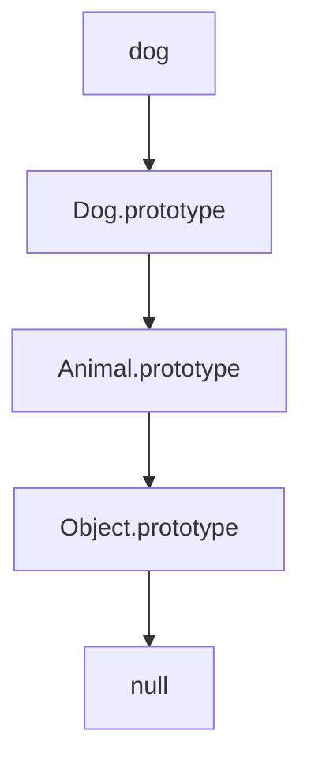

## 1.3.1 Classes and Prototypes

JavaScript's approach to object-oriented programming (OOP) is unique, primarily due to its prototype-based inheritance model. Unlike classical OOP languages like Java or C++, which use classes as blueprints to create objects, JavaScript uses prototypes. This section delves into the prototype-based inheritance model, the introduction of ES6 classes as syntactic sugar, and how these concepts are implemented in JavaScript and TypeScript.

### Understanding Prototype-Based Inheritance

Prototype-based inheritance is a core concept in JavaScript. In this model, objects inherit directly from other objects. Each object in JavaScript has a hidden property known as `[[Prototype]]`, which can be accessed via the `__proto__` property or the `Object.getPrototypeOf()` method.

When you attempt to access a property on an object, JavaScript first looks at the object itself. If it doesn't find the property, it searches up the prototype chain. This chain is a series of links between objects, each pointing to its prototype, until it reaches `null`.

#### Example: Prototype Chain

```javascript
function Animal(name) {
    this.name = name;
}

Animal.prototype.speak = function() {
    console.log(`${this.name} makes a noise.`);
};

const dog = new Animal('Dog');
dog.speak(); // Dog makes a noise.
```

In this example, `dog` is an instance of `Animal`. When `speak` is called, JavaScript looks for the `speak` method on `dog`. Not finding it there, it moves up the prototype chain to `Animal.prototype`, where it finds and executes the method.

### ES6 Classes: Syntactic Sugar

With the introduction of ES6, JavaScript gained a `class` syntax, which provides a more familiar way of creating objects and handling inheritance, similar to other OOP languages. However, it's crucial to understand that this is syntactic sugar over the existing prototype-based inheritance.

#### Example: Defining a Class

```javascript
class Animal {
    constructor(name) {
        this.name = name;
    }

    speak() {
        console.log(`${this.name} makes a noise.`);
    }
}

const dog = new Animal('Dog');
dog.speak(); // Dog makes a noise.
```

Here, the `Animal` class is defined with a constructor and a `speak` method. Internally, the methods defined in the class are added to `Animal.prototype`.

### Constructors, Methods, and Inheritance

In ES6 classes, the `constructor` method is a special method for creating and initializing an object created with a class. Each class can have only one constructor method. If a class has a parent class, you can use the `super` keyword to call the parent's constructor.

#### Example: Inheritance with Classes

```javascript
class Animal {
    constructor(name) {
        this.name = name;
    }

    speak() {
        console.log(`${this.name} makes a noise.`);
    }
}

class Dog extends Animal {
    speak() {
        console.log(`${this.name} barks.`);
    }
}

const dog = new Dog('Dog');
dog.speak(); // Dog barks.
```

In this example, `Dog` extends `Animal`, and the `speak` method is overridden to provide a specific implementation for `Dog`.

#### The `super` Keyword

The `super` keyword is used to call functions on an object's parent. This is particularly useful in constructors and overridden methods.

```javascript
class Animal {
    constructor(name) {
        this.name = name;
    }

    speak() {
        console.log(`${this.name} makes a noise.`);
    }
}

class Dog extends Animal {
    constructor(name, breed) {
        super(name);
        this.breed = breed;
    }

    speak() {
        super.speak();
        console.log(`${this.name} barks.`);
    }
}

const dog = new Dog('Dog', 'Labrador');
dog.speak(); 
// Dog makes a noise.
// Dog barks.
```

### Static Methods

Static methods are defined on the class itself, not on instances of the class. They are often used for utility functions that are related to the class but do not require an instance to operate.

#### Example: Static Method

```javascript
class MathUtils {
    static add(a, b) {
        return a + b;
    }
}

console.log(MathUtils.add(2, 3)); // 5
```

Here, `add` is a static method that can be called directly on the `MathUtils` class without creating an instance.

### Impact on Code Organization and Maintainability

The introduction of classes in JavaScript has significantly improved code organization and maintainability. Classes provide a clear structure for defining objects and their behavior, making it easier to understand and manage code, especially in large applications.

#### Benefits of Using Classes

- **Encapsulation**: Classes allow you to group related functions and variables, encapsulating them within a single entity.
- **Reusability**: You can create base classes and extend them, promoting code reuse.
- **Readability**: The class syntax is more readable and familiar to developers coming from other OOP languages.

### Understanding the Prototype Chain

Despite the convenience of class syntax, it's essential to understand the underlying prototype chain. This knowledge helps in debugging and optimizing JavaScript code.

#### Prototype Chain Visualization



In this diagram, the `dog` object has a prototype chain that links to `Dog.prototype`, then to `Animal.prototype`, and finally to `Object.prototype`.

### Private and Protected Members

JavaScript does not natively support private or protected members as seen in other OOP languages. However, there are ways to simulate them.

#### Simulating Private Members

One common approach is using closures or the new `#` syntax for private fields.

```javascript
class Counter {
    #count = 0;

    increment() {
        this.#count++;
    }

    getCount() {
        return this.#count;
    }
}

const counter = new Counter();
counter.increment();
console.log(counter.getCount()); // 1
```

In this example, `#count` is a private field, accessible only within the class.

### Best Practices for Class Design and Inheritance

- **Favor Composition Over Inheritance**: Use composition to combine behaviors rather than relying heavily on inheritance.
- **Keep Classes Small**: Each class should have a single responsibility.
- **Use Interfaces in TypeScript**: Define interfaces to ensure classes adhere to specific contracts.

### Polymorphism and Method Overriding

Polymorphism allows objects to be treated as instances of their parent class. Method overriding is a key aspect of achieving polymorphism.

#### Example: Polymorphism

```javascript
class Animal {
    speak() {
        console.log('Animal speaks');
    }
}

class Dog extends Animal {
    speak() {
        console.log('Dog barks');
    }
}

class Cat extends Animal {
    speak() {
        console.log('Cat meows');
    }
}

const animals = [new Dog(), new Cat()];

animals.forEach(animal => animal.speak());
// Dog barks
// Cat meows
```

### Exercises

1. **Create a Class**: Define a class `Vehicle` with a constructor that takes `make` and `model` as parameters. Add a method `getDetails` that returns a string with the vehicle's details.

2. **Extend a Class**: Create a subclass `Car` that extends `Vehicle`. Add a method `getCarType` that returns the type of car (e.g., Sedan, SUV).

3. **Static Method**: Add a static method `compareCars` to the `Car` class that compares two cars based on a given attribute.

4. **Private Members**: Implement private members in your `Vehicle` class using the `#` syntax.

5. **Polymorphism**: Create a new class `Motorcycle` that extends `Vehicle`. Implement a method `getDetails` that overrides the parent class method. Instantiate both `Car` and `Motorcycle` and call `getDetails` on them to demonstrate polymorphism.

### Conclusion

Understanding classes and prototypes in JavaScript and TypeScript is crucial for leveraging the full potential of object-oriented programming in these languages. By mastering these concepts, you can write more organized, maintainable, and efficient code. Remember to explore the prototype chain even when using class syntax, as it provides deeper insights into how JavaScript operates under the hood.

### Further Reading

- [MDN Web Docs: JavaScript Classes](https://developer.mozilla.org/en-US/docs/Web/JavaScript/Reference/Classes)
- [TypeScript Handbook: Classes](https://www.typescriptlang.org/docs/handbook/classes.html)
- [You Don't Know JS: this & Object Prototypes](https://github.com/getify/You-Dont-Know-JS/tree/2nd-ed/this%20%26%20object%20prototypes)

## Quiz Time!



### What is the purpose of the prototype chain in JavaScript?

- [x] To enable inheritance by linking objects to their prototypes.
- [ ] To create a new instance of an object.
- [ ] To define static methods on a class.
- [ ] To enforce encapsulation.

> **Explanation:** The prototype chain allows objects to inherit properties and methods from their prototypes, enabling a form of inheritance in JavaScript.


### How do ES6 classes relate to prototype-based inheritance?

- [x] They are syntactic sugar over prototype-based inheritance.
- [ ] They replace prototype-based inheritance entirely.
- [ ] They are unrelated to prototypes.
- [ ] They are only used for static methods.

> **Explanation:** ES6 classes provide a more familiar syntax for defining objects and inheritance but are built on top of the existing prototype-based inheritance model.


### Which keyword is used to call a parent class's constructor in a subclass?

- [x] super
- [ ] this
- [ ] parent
- [ ] extends

> **Explanation:** The `super` keyword is used to call the constructor of a parent class from within a subclass's constructor.


### What is a static method in a class?

- [x] A method defined on the class itself, not on instances.
- [ ] A method that cannot be overridden.
- [ ] A method that is only accessible within the class.
- [ ] A method that is always asynchronous.

> **Explanation:** Static methods are defined on the class itself and can be called without creating an instance of the class.


### How can private members be simulated in JavaScript classes?

- [x] Using closures or the `#` syntax for private fields.
- [ ] Using the `private` keyword.
- [ ] By declaring them in a constructor.
- [ ] By using the `static` keyword.

> **Explanation:** JavaScript uses closures or the `#` syntax to simulate private members, as it does not natively support private access like some other languages.


### What is a key benefit of using classes in JavaScript?

- [x] Improved code organization and maintainability.
- [ ] Increased execution speed.
- [ ] Automatic memory management.
- [ ] Guaranteed security.

> **Explanation:** Classes help organize code better, making it more readable and maintainable, especially in larger applications.


### What does the `extends` keyword do in a class definition?

- [x] It allows a class to inherit from another class.
- [ ] It creates a new instance of a class.
- [ ] It defines a static method.
- [ ] It makes a method private.

> **Explanation:** The `extends` keyword is used in class definitions to create a subclass that inherits from a parent class.


### What is polymorphism in the context of OOP?

- [x] The ability of different classes to be treated as instances of the same class through a common interface.
- [ ] The process of creating multiple instances of a class.
- [ ] The use of static methods in a class.
- [ ] The ability to override a method in a subclass.

> **Explanation:** Polymorphism allows objects of different classes to be treated as objects of a common superclass, enabling flexibility and reuse of code.


### Why is it important to understand the prototype chain even when using class syntax?

- [x] It helps in debugging and optimizing JavaScript code.
- [ ] It is required for using static methods.
- [ ] It is necessary for defining private members.
- [ ] It is essential for using the `super` keyword.

> **Explanation:** Understanding the prototype chain provides deeper insights into JavaScript's behavior, aiding in debugging and optimization.


### True or False: ES6 classes in JavaScript provide true classical inheritance.

- [ ] True
- [x] False

> **Explanation:** ES6 classes are syntactic sugar over JavaScript's prototype-based inheritance and do not provide true classical inheritance as seen in languages like Java or C++.


