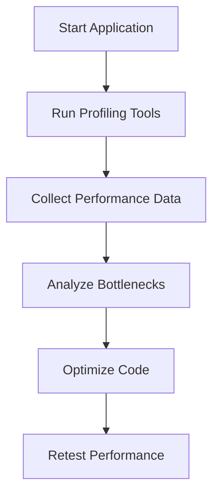

## 12.1.2 Profiling and Benchmarking Techniques

In the world of software development, performance optimization is a crucial aspect that can significantly impact the user experience and efficiency of applications. Profiling and benchmarking are two fundamental techniques that developers use to identify and address performance bottlenecks in their code. This section delves into these techniques, providing a comprehensive guide on how to effectively profile and benchmark JavaScript and TypeScript applications.

### Introduction to Profiling and Benchmarking

Profiling and benchmarking are processes that help developers understand the performance characteristics of their applications. While they are closely related, they serve distinct purposes:

- **Profiling** involves collecting detailed information about the execution of a program, such as CPU usage, memory consumption, and execution time of functions. It helps identify specific areas of the code that are causing performance issues.

- **Benchmarking** involves measuring the performance of a program or a specific piece of code under controlled conditions. It provides a way to compare different implementations or versions of code to determine which is more efficient.

Both techniques are essential for identifying performance bottlenecks and making informed decisions about optimization.

### Using Browser Developer Tools for Profiling

Modern browsers come equipped with powerful developer tools that can be used to profile JavaScript applications. These tools provide insights into various aspects of performance, including CPU usage, memory consumption, and network activity.

#### Profiling JavaScript in Chrome DevTools

Chrome DevTools is one of the most popular tools for profiling JavaScript applications. It offers a comprehensive set of features for analyzing performance:

1. **Performance Panel**: This panel provides a timeline of your application's performance. You can record a session to capture CPU activity, memory usage, and network requests. The timeline helps identify long-running tasks, rendering issues, and other bottlenecks.

2. **Memory Panel**: This panel helps analyze memory usage and detect memory leaks. You can take heap snapshots to see the memory allocation at different points in time and use the allocation profiler to track memory allocations over time.

3. **Network Panel**: This panel shows all network requests made by the application, including their timing and size. It helps identify slow or large requests that could be impacting performance.

#### Example: Profiling a JavaScript Application

Let's walk through a simple example of profiling a JavaScript application using Chrome DevTools:

```javascript
function calculatePrimes(limit) {
  const primes = [];
  for (let i = 2; i <= limit; i++) {
    let isPrime = true;
    for (let j = 2; j < i; j++) {
      if (i % j === 0) {
        isPrime = false;
        break;
      }
    }
    if (isPrime) {
      primes.push(i);
    }
  }
  return primes;
}

console.time("primeCalculation");
calculatePrimes(100000);
console.timeEnd("primeCalculation");
```

- **Step 1**: Open Chrome DevTools by pressing `F12` or `Ctrl+Shift+I`.
- **Step 2**: Navigate to the "Performance" panel.
- **Step 3**: Click the record button, then execute the `calculatePrimes` function in the console.
- **Step 4**: Stop the recording to analyze the captured data.

The performance panel will display a timeline showing CPU usage and function execution times, helping you identify any performance bottlenecks in the code.

### Node.js Profiling Tools for Server-Side Performance

For server-side applications, Node.js offers several profiling tools that can help analyze performance:

#### Node.js Built-in Profiler

Node.js includes a built-in profiler that can be used to collect CPU profiles. You can start the profiler using the `--prof` flag:

```bash
node --prof app.js
```

This command generates a `v8.log` file containing CPU profiling data, which can be processed using the `node-tick-processor` tool to produce a human-readable report.

#### Using `clinic.js`

`clinic.js` is a popular tool for profiling Node.js applications. It provides a user-friendly interface for collecting and analyzing performance data. To use `clinic.js`, install it globally:

```bash
npm install -g clinic
```

Then, run your application with `clinic doctor`:

```bash
clinic doctor -- node app.js
```

`clinic.js` will generate an interactive report that helps identify performance bottlenecks.

### Measuring Execution Time with Performance APIs

JavaScript provides several APIs for measuring execution time, which can be useful for benchmarking specific code segments:

#### Using `performance.now()`

The `performance.now()` method returns a high-resolution timestamp, which can be used to measure the execution time of code:

```javascript
const start = performance.now();

// Code to measure
for (let i = 0; i < 1000000; i++) {
  Math.sqrt(i);
}

const end = performance.now();
console.log(`Execution time: ${end - start} ms`);
```

#### Using `console.time()` and `console.timeEnd()`

The `console.time()` and `console.timeEnd()` methods provide a simple way to measure execution time:

```javascript
console.time("loop");

for (let i = 0; i < 1000000; i++) {
  Math.sqrt(i);
}

console.timeEnd("loop");
```

These methods are particularly useful for quick performance checks during development.

### Creating Custom Benchmarks with Benchmark.js

Benchmark.js is a popular library for creating custom benchmarks in JavaScript. It provides a robust framework for measuring and comparing the performance of different code snippets.

#### Example: Benchmarking with Benchmark.js

```javascript
const Benchmark = require('benchmark');
const suite = new Benchmark.Suite();

suite
  .add('Math.sqrt', function() {
    for (let i = 0; i < 1000; i++) {
      Math.sqrt(i);
    }
  })
  .add('Math.pow', function() {
    for (let i = 0; i < 1000; i++) {
      Math.pow(i, 0.5);
    }
  })
  .on('cycle', function(event) {
    console.log(String(event.target));
  })
  .on('complete', function() {
    console.log('Fastest is ' + this.filter('fastest').map('name'));
  })
  .run({ 'async': true });
```

This example compares the performance of `Math.sqrt` and `Math.pow` for calculating square roots. Benchmark.js provides detailed statistics on execution time and variance.

### Profiling CPU Usage, Memory Consumption, and Network Activity

Profiling involves analyzing various aspects of application performance, including CPU usage, memory consumption, and network activity.

#### CPU Profiling

CPU profiling helps identify functions that consume excessive CPU resources. By analyzing CPU profiles, you can pinpoint inefficient algorithms or operations that need optimization.

#### Memory Profiling

Memory profiling helps detect memory leaks and excessive memory usage. Tools like Chrome DevTools and Node.js profilers provide insights into memory allocation and garbage collection.

#### Network Profiling

Network profiling helps identify slow or large network requests that impact performance. By analyzing network activity, you can optimize resource loading and reduce latency.

### Testing Performance in Real-World Conditions

It's essential to test application performance in real-world conditions to ensure that optimizations are effective under actual usage scenarios. Consider factors such as:

- **Network Conditions**: Test under different network speeds and latencies to simulate real user environments.
- **Device Performance**: Test on various devices to account for differences in processing power and memory.
- **User Behavior**: Simulate typical user interactions to identify performance issues that arise during common usage patterns.

### Best Practices for Interpreting Profiling Data

Interpreting profiling data requires careful analysis to identify actionable insights. Consider the following best practices:

- **Focus on Bottlenecks**: Identify the most significant performance bottlenecks and prioritize their optimization.
- **Understand the Context**: Consider the context in which performance issues occur, such as specific user actions or data sets.
- **Look for Patterns**: Identify recurring patterns or issues that may indicate underlying architectural problems.

### Risks of Premature Optimization

Premature optimization can lead to complex code that is difficult to maintain. It's important to focus on critical performance issues that have a significant impact on user experience, rather than optimizing every aspect of the application.

### Automated Performance Testing in CI/CD

Integrating automated performance testing into the CI/CD pipeline ensures that performance regressions are detected early. Tools like Lighthouse CI and WebPageTest can be used to automate performance testing and generate reports.

### Comparing Performance Across Implementations

Benchmarking allows you to compare the performance of different code implementations or versions. This can help determine the most efficient approach for a given task.

### Profiling Asynchronous and Concurrent Code

Profiling asynchronous and concurrent code presents unique challenges. Use tools that support asynchronous profiling and consider the impact of concurrency on performance.

### Repeated Profiling to Track Optimizations

Repeated profiling is essential to track the impact of optimizations over time. By regularly profiling your application, you can ensure that performance improvements are effective and identify new bottlenecks as they arise.

### Documenting Profiling Results and Optimization Decisions

Documenting profiling results and optimization decisions provides a valuable reference for future development. It helps track the history of performance improvements and informs decision-making.

### Conclusion

Profiling and benchmarking are essential techniques for optimizing the performance of JavaScript and TypeScript applications. By leveraging the tools and techniques discussed in this section, developers can identify and address performance bottlenecks, ensuring that their applications run efficiently and provide a smooth user experience.



The process of profiling and optimizing performance is iterative, requiring continuous monitoring and adjustment to achieve the best results.

## Quiz Time!



### What is the primary purpose of profiling in software development?

- [x] To collect detailed information about the execution of a program
- [ ] To measure the performance of a program under controlled conditions
- [ ] To generate random data for testing
- [ ] To compile code into machine language

> **Explanation:** Profiling involves collecting detailed information about the execution of a program, such as CPU usage and memory consumption, to identify performance bottlenecks.

### Which tool is commonly used for profiling JavaScript applications in the browser?

- [x] Chrome DevTools
- [ ] Node.js Built-in Profiler
- [ ] Benchmark.js
- [ ] WebPageTest

> **Explanation:** Chrome DevTools is a popular tool for profiling JavaScript applications in the browser, offering features like CPU and memory profiling.

### What is the purpose of the `performance.now()` method in JavaScript?

- [x] To measure the execution time of code with high-resolution timestamps
- [ ] To generate random numbers
- [ ] To create new HTML elements
- [ ] To manage asynchronous tasks

> **Explanation:** The `performance.now()` method provides high-resolution timestamps, which are useful for measuring the execution time of code.

### What is Benchmark.js used for?

- [x] Creating custom benchmarks in JavaScript
- [ ] Profiling network activity
- [ ] Managing asynchronous code
- [ ] Debugging memory leaks

> **Explanation:** Benchmark.js is a library for creating custom benchmarks in JavaScript, allowing developers to measure and compare the performance of different code snippets.

### Which of the following is a best practice for interpreting profiling data?

- [x] Focus on the most significant performance bottlenecks
- [ ] Optimize every aspect of the application
- [ ] Ignore patterns in the data
- [ ] Focus only on memory usage

> **Explanation:** Focusing on the most significant performance bottlenecks is a best practice for interpreting profiling data, as it helps prioritize optimization efforts.

### What is a risk associated with premature optimization?

- [x] It can lead to complex code that is difficult to maintain
- [ ] It always improves performance
- [ ] It simplifies code structure
- [ ] It reduces the need for testing

> **Explanation:** Premature optimization can lead to complex code that is difficult to maintain, which is why it's important to focus on critical performance issues.

### Why is it important to test performance in real-world conditions?

- [x] To ensure optimizations are effective under actual usage scenarios
- [ ] To generate random test data
- [ ] To simplify the testing process
- [ ] To avoid using profiling tools

> **Explanation:** Testing performance in real-world conditions ensures that optimizations are effective under actual usage scenarios, accounting for factors like network conditions and device performance.

### What is the benefit of integrating automated performance testing into the CI/CD pipeline?

- [x] It helps detect performance regressions early
- [ ] It eliminates the need for manual testing
- [ ] It simplifies code deployment
- [ ] It reduces code complexity

> **Explanation:** Integrating automated performance testing into the CI/CD pipeline helps detect performance regressions early, ensuring that performance issues are addressed promptly.

### How can repeated profiling benefit performance optimization?

- [x] It helps track the impact of optimizations over time
- [ ] It reduces the need for code reviews
- [ ] It simplifies debugging
- [ ] It eliminates the need for manual testing

> **Explanation:** Repeated profiling helps track the impact of optimizations over time, allowing developers to ensure that performance improvements are effective and identify new bottlenecks.

### True or False: Profiling asynchronous and concurrent code is straightforward and requires no special tools.

- [ ] True
- [x] False

> **Explanation:** Profiling asynchronous and concurrent code presents unique challenges and requires tools that support asynchronous profiling to effectively analyze performance.


