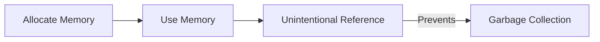

## 12.2.3 Minimizing Memory Usage and Avoiding Leaks

In the world of software development, especially in JavaScript and TypeScript, efficient memory management is crucial for maintaining optimal application performance. Excessive memory usage can lead to sluggish applications, unresponsive user interfaces, and even crashes. This section delves into the intricacies of minimizing memory usage and avoiding memory leaks, providing you with the knowledge and tools necessary to build efficient, high-performance applications.

### Understanding Memory Usage and Its Impact on Performance

Memory usage in an application is a critical factor that influences its performance and responsiveness. When an application consumes more memory than necessary, it can lead to several issues:

- **Decreased Performance**: Excessive memory usage can slow down an application, as the system struggles to allocate resources efficiently.
- **Increased Latency**: Applications may take longer to respond to user interactions, leading to a poor user experience.
- **Crashes and Freezes**: In extreme cases, high memory consumption can cause applications to crash or become unresponsive.

Understanding how memory is managed and utilized in JavaScript and TypeScript is the first step toward optimizing your applications.

### Common Causes of Memory Leaks

Memory leaks occur when an application retains memory that is no longer needed, preventing it from being reclaimed by the garbage collector. Common causes of memory leaks include:

- **Unattached Event Listeners**: Event listeners that are not properly removed can retain references to DOM elements, preventing them from being garbage collected.
- **References to Unused Objects**: Holding onto references to objects that are no longer needed can prevent them from being garbage collected.
- **Global Variables**: Variables declared in the global scope remain in memory for the lifetime of the application, potentially leading to leaks if not managed properly.
- **Closures**: While closures are a powerful feature in JavaScript, they can inadvertently retain references to variables, leading to memory leaks if not used carefully.

### Detecting and Analyzing Memory Leaks with Developer Tools

Modern browsers provide powerful developer tools that can help detect and analyze memory leaks. Here's how you can use these tools effectively:

1. **Open Developer Tools**: In most browsers, you can open the developer tools by pressing `F12` or `Ctrl+Shift+I`.
2. **Navigate to the Memory Tab**: This tab provides insights into memory usage, allowing you to take heap snapshots, record allocation timelines, and more.
3. **Take Heap Snapshots**: Heap snapshots capture the memory state of your application at a specific point in time. By comparing snapshots, you can identify objects that are not being garbage collected.
4. **Analyze Memory Allocation**: The allocation timeline records memory allocations over time, helping you identify patterns and potential leaks.

### Garbage Collection in JavaScript

JavaScript uses a garbage collector to automatically manage memory. The garbage collector reclaims memory that is no longer in use, freeing it up for future allocations. However, understanding how garbage collection works is essential for avoiding memory leaks:

- **Mark-and-Sweep Algorithm**: This is the most common garbage collection algorithm used in JavaScript. It marks objects that are reachable and sweeps away those that are not.
- **Generational Garbage Collection**: Some JavaScript engines use generational garbage collection, which divides objects into young and old generations, optimizing the collection process.

### Managing Scope and Closures

Closures and scope are powerful features in JavaScript, but they can also lead to memory leaks if not managed properly. Here are some tips to avoid unintended memory retention:

- **Limit Closure Scope**: Ensure that closures only capture the variables they need. Avoid capturing unnecessary variables, as this can lead to memory leaks.
- **Use `let` and `const`**: These keywords provide block-scoped variables, reducing the risk of memory leaks compared to `var`, which is function-scoped.

### Minimizing Global Variables

Global variables persist for the lifetime of the application, potentially leading to memory leaks. To minimize their usage:

- **Encapsulate Variables**: Use modules or closures to encapsulate variables, reducing their scope to the minimum necessary.
- **Use `const` for Constants**: Declare constants with `const` to ensure they are not accidentally modified.

### Cleaning Up Resources

Properly cleaning up resources is crucial for avoiding memory leaks. Here are some best practices:

- **Remove Event Listeners**: Always remove event listeners when they are no longer needed. This prevents them from holding references to DOM elements.
- **Clear Timers and Intervals**: Use `clearTimeout` and `clearInterval` to clear timers and intervals when they are no longer needed.

### Managing Large Data Structures and Arrays

Large data structures and arrays can consume significant memory. Here are some strategies for managing them effectively:

- **Use Typed Arrays**: Typed arrays provide a way to handle binary data efficiently, reducing memory usage.
- **Slice and Splice**: Use `slice` and `splice` to create new arrays from existing ones, minimizing memory usage.

### Lazy Loading and Code Splitting

Lazy loading and code splitting are powerful techniques for reducing the initial memory footprint of an application:

- **Lazy Loading**: Load resources only when they are needed, reducing the initial load time and memory usage.
- **Code Splitting**: Divide your application into smaller chunks that are loaded on demand, reducing the initial memory footprint.

### Memory Leak Detection Diagram

To illustrate the process of memory leak detection, consider the following diagram:

This diagram highlights how unintentional references can prevent garbage collection, leading to memory leaks.

### Using WeakMap and WeakSet for Weak References

`WeakMap` and `WeakSet` provide a way to store weak references to objects, allowing them to be garbage collected when no longer needed. This is useful for managing memory in certain scenarios:

- **WeakMap**: A collection of key/value pairs where the keys are weakly referenced. This means that if there are no other references to the key, it can be garbage collected.
- **WeakSet**: A collection of objects where each object is weakly referenced.

### Monitoring and Limiting Memory Usage in Node.js

In Node.js applications, monitoring and limiting memory usage is crucial for maintaining performance:

- **Use the `--max-old-space-size` Flag**: This flag allows you to set the maximum memory size for the V8 heap, preventing excessive memory usage.
- **Monitor Memory Usage**: Use tools like `heapdump` and `v8-profiler` to monitor memory usage and identify leaks.

### Regular Profiling and Memory Audits

Regular profiling and memory audits are essential for maintaining optimal performance:

- **Profile Regularly**: Use profiling tools to regularly monitor memory usage and identify potential leaks.
- **Conduct Memory Audits**: Perform memory audits to identify areas of improvement and ensure efficient memory management.

### Optimizing Image and Asset Usage

Images and assets can consume significant memory. Here are some tips for optimizing their usage:

- **Use Optimized Formats**: Use optimized image formats like WebP to reduce file size and memory usage.
- **Lazy Load Images**: Load images only when they are visible on the screen, reducing initial memory usage.

### Conclusion

Understanding and managing memory usage is crucial for building high-performance applications. By minimizing memory usage and avoiding leaks, you can enhance the performance and reliability of your JavaScript and TypeScript applications. Regular profiling, effective use of developer tools, and adherence to best practices are key to achieving efficient memory management.

## Quiz Time!



### What is a common cause of memory leaks in JavaScript applications?

- [x] Unattached event listeners
- [ ] Properly scoped variables
- [ ] Using `const` for all variables
- [ ] Using `let` instead of `var`

> **Explanation:** Unattached event listeners can retain references to DOM elements, leading to memory leaks.

### How can you detect memory leaks using browser developer tools?

- [x] By taking heap snapshots
- [ ] By checking the console for errors
- [ ] By using the network tab
- [ ] By inspecting the DOM

> **Explanation:** Heap snapshots capture the memory state of the application, allowing you to identify objects not being garbage collected.

### What is the role of garbage collection in JavaScript?

- [x] To reclaim memory that is no longer in use
- [ ] To allocate memory for new objects
- [ ] To manage CPU usage
- [ ] To optimize network requests

> **Explanation:** Garbage collection reclaims memory that is no longer in use, freeing it up for future allocations.

### How can closures lead to memory leaks?

- [x] By retaining references to variables unintentionally
- [ ] By creating new objects
- [ ] By optimizing code execution
- [ ] By using `var` instead of `let`

> **Explanation:** Closures can retain references to variables, leading to memory leaks if not managed properly.

### What is a benefit of using `WeakMap` in JavaScript?

- [x] It allows objects to be garbage collected when no longer needed
- [ ] It prevents all memory leaks
- [ ] It improves performance by caching data
- [ ] It makes code execution faster

> **Explanation:** `WeakMap` stores weak references to objects, allowing them to be garbage collected when no longer needed.

### Which of the following is a strategy to minimize global variables?

- [x] Encapsulate variables using modules
- [ ] Declare all variables in the global scope
- [ ] Use `var` for all variables
- [ ] Avoid using functions

> **Explanation:** Encapsulating variables using modules reduces their scope, minimizing global variables.

### What is lazy loading?

- [x] Loading resources only when they are needed
- [ ] Loading all resources at once
- [ ] A method to increase memory usage
- [ ] A technique to improve CPU performance

> **Explanation:** Lazy loading reduces initial load time and memory usage by loading resources only when needed.

### How can you clear timers and intervals to prevent memory leaks?

- [x] Use `clearTimeout` and `clearInterval`
- [ ] Use `setTimeout` and `setInterval`
- [ ] Use `setImmediate`
- [ ] Use `requestAnimationFrame`

> **Explanation:** `clearTimeout` and `clearInterval` clear timers and intervals, preventing them from holding references.

### What is a common tool for monitoring memory usage in Node.js?

- [x] `heapdump`
- [ ] `console.log`
- [ ] `fs`
- [ ] `http`

> **Explanation:** `heapdump` is a tool for monitoring memory usage and identifying leaks in Node.js applications.

### True or False: Regular profiling and memory audits are unnecessary if your application is running smoothly.

- [ ] True
- [x] False

> **Explanation:** Regular profiling and memory audits are essential for maintaining optimal performance and identifying potential issues.


