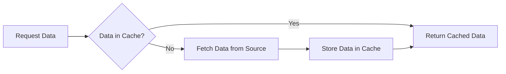

---

linkTitle: "12.3.2 Caching Strategies and Memoization"
title: "Caching Strategies and Memoization: Boosting Performance in JavaScript and TypeScript"
description: "Explore caching strategies and memoization techniques to enhance performance in JavaScript and TypeScript applications. Learn about in-memory caching, browser caching, service workers, CDN caching, and more."
categories:
- Performance Optimization
- JavaScript
- TypeScript
tags:
- Caching
- Memoization
- Performance
- JavaScript
- TypeScript
date: 2024-10-25
type: docs
nav_weight: 12320

---

## 12.3.2 Caching Strategies and Memoization

In the world of software development, performance optimization is a critical consideration, especially in JavaScript and TypeScript applications where responsiveness and speed are paramount. Caching and memoization are two powerful techniques that developers can leverage to significantly enhance application performance by reducing redundant data processing and network requests.

### The Power of Caching

Caching is a technique used to store copies of data in a temporary storage location, or cache, so that future requests for that data can be served faster. By storing and reusing frequently accessed data, caching minimizes the need to repeatedly fetch or compute the same information, thus reducing load times and improving application responsiveness.

#### Types of Caching

There are several types of caching, each suited to different scenarios and offering unique benefits:

- **In-Memory Caching**: This involves storing data in the memory of the application process. It's fast and ideal for caching data that is frequently accessed during a session. However, it is limited by the memory capacity and is volatile, meaning data is lost when the application restarts.

- **Browser Caching**: Browsers can cache web pages, images, and other resources. By using caching headers like `Cache-Control` and `ETag`, developers can instruct browsers on how to cache resources, reducing the need to re-download them on subsequent visits.

- **Service Workers**: These are scripts that run in the background of a web application, enabling features like offline support and background sync. Service workers can cache assets and API responses, allowing applications to function even without a network connection.

- **CDN Caching**: Content Delivery Networks (CDNs) cache content at multiple locations around the world, allowing users to access data from a server that is geographically closer to them. This reduces latency and improves load times for global users.

### Implementing Memoization

Memoization is a specific form of caching that involves storing the results of expensive function calls and returning the cached result when the same inputs occur again. This technique is particularly useful in scenarios where functions are called repeatedly with the same arguments.

Here's a simple example of memoization in JavaScript:

```javascript
function memoize(fn) {
  const cache = {};
  return function(...args) {
    const key = JSON.stringify(args);
    if (cache[key]) {
      return cache[key];
    }
    const result = fn(...args);
    cache[key] = result;
    return result;
  };
}

const factorial = memoize(function(n) {
  if (n === 0) return 1;
  return n * factorial(n - 1);
});

console.log(factorial(5)); // Computed
console.log(factorial(5)); // Cached
```

In this example, the `memoize` function creates a cache object that stores the results of the `factorial` function. When `factorial` is called with the same argument, the cached result is returned instead of recomputing it.

### Browser Caching with Headers

To enable browser caching, developers can use HTTP headers that control how resources are cached:

- **Cache-Control**: This header specifies directives for caching mechanisms in both requests and responses. For example, `Cache-Control: max-age=3600` tells the browser to cache the resource for 3600 seconds.

- **ETag**: This header is used for cache validation. It provides a unique identifier for a resource version. When a resource is requested, the server can compare the ETag of the cached version with the current version to determine if the resource has changed.

Here's an example of setting these headers in an Express.js application:

```javascript
app.get('/resource', (req, res) => {
  res.set('Cache-Control', 'public, max-age=3600');
  res.set('ETag', '12345');
  res.send('Hello, world!');
});
```

### Service Workers for Offline Caching

Service workers can intercept network requests and serve cached responses, providing offline support for web applications. Here's a basic example of a service worker that caches assets:

```javascript
self.addEventListener('install', event => {
  event.waitUntil(
    caches.open('my-cache').then(cache => {
      return cache.addAll([
        '/',
        '/index.html',
        '/styles.css',
        '/script.js',
      ]);
    })
  );
});

self.addEventListener('fetch', event => {
  event.respondWith(
    caches.match(event.request).then(response => {
      return response || fetch(event.request);
    })
  );
});
```

In this example, the service worker caches the specified assets during the installation phase. During the fetch event, it attempts to serve the cached version of the requested resource, falling back to the network if the resource is not in the cache.

### Cache Invalidation

One of the challenges of caching is ensuring data consistency, which requires appropriate cache invalidation strategies. Here are some common techniques:

- **Time-Based Invalidation**: Set a time-to-live (TTL) for cached data, after which it is considered stale and must be refreshed.

- **Event-Based Invalidation**: Invalidate the cache when certain events occur, such as data updates or user actions.

- **Versioning**: Use version numbers or timestamps to manage cache entries. When data changes, update the version to invalidate old cache entries.

### Caching in Server-Side Applications

On the server side, caching can reduce database load by storing frequently accessed data in memory or using distributed caches like Redis or Memcached. Here's an example of using Redis for caching in a Node.js application:

```javascript
const redis = require('redis');
const client = redis.createClient();

function getCachedData(key, fetchFunction) {
  return new Promise((resolve, reject) => {
    client.get(key, (err, data) => {
      if (err) return reject(err);
      if (data) return resolve(JSON.parse(data));

      fetchFunction().then(result => {
        client.setex(key, 3600, JSON.stringify(result));
        resolve(result);
      }).catch(reject);
    });
  });
}
```

In this example, `getCachedData` checks Redis for cached data. If not found, it fetches the data using `fetchFunction`, caches it, and returns the result.

### Caching Flow Diagram

To illustrate the caching process, consider the following flow diagram:



This diagram shows the decision flow for handling data requests with caching. If data is in the cache, it is returned immediately. Otherwise, it is fetched from the source, stored in the cache, and then returned.

### Cache Hierarchies and Fallbacks

Implementing cache hierarchies involves organizing caches in layers, where each layer serves as a fallback for the previous one. For example, an application might use an in-memory cache as the first layer, a Redis cache as the second, and a database as the third. This approach maximizes cache hits and minimizes latency.

### Trade-Offs in Caching

When designing caching strategies, consider the trade-offs between cache size, freshness, and hit rates:

- **Cache Size**: Larger caches can store more data but require more memory. Balance cache size with available resources.

- **Freshness**: Ensure cached data remains fresh and consistent with the source. Use invalidation strategies to manage stale data.

- **Hit Rates**: Aim for high cache hit rates to maximize performance benefits. Analyze access patterns to optimize cache contents.

### Secure Caching Practices

Caching can expose sensitive data if not handled properly. Follow these best practices to ensure secure caching:

- **Avoid Caching Sensitive Data**: Do not cache sensitive information like passwords or personal data.

- **Use Secure Protocols**: Ensure cached data is transmitted over secure channels (e.g., HTTPS).

- **Implement Access Controls**: Restrict access to caches and their contents to authorized users only.

### Monitoring and Adjusting Cache Strategies

Regularly monitor cache performance using metrics such as hit rates, latency, and error rates. Use these insights to adjust caching strategies and configurations for optimal performance.

### Leveraging CDN Services

CDNs are essential for delivering content to a global audience efficiently. By caching content at multiple locations, CDNs reduce latency and improve user experience. When using a CDN, configure caching rules and headers to control how content is cached and served.

### Impact on User Experience and Scalability

Effective caching strategies enhance user experience by reducing load times and improving responsiveness. They also contribute to application scalability by reducing server load and network traffic, allowing applications to handle more users and requests.

### Evaluating Caching Effectiveness

To evaluate caching effectiveness, consider the following metrics:

- **Cache Hit Rate**: The percentage of requests served from the cache. Higher hit rates indicate more effective caching.

- **Latency Reduction**: The decrease in response times due to caching. Measure before and after implementing caching.

- **Resource Utilization**: The reduction in server and network load. Analyze resource usage to assess caching impact.

### Conclusion

Caching and memoization are indispensable tools in the performance optimization arsenal of any JavaScript or TypeScript developer. By understanding and implementing effective caching strategies, developers can create applications that are not only faster and more responsive but also scalable and capable of delivering a superior user experience.

As you apply these techniques, remember to continuously monitor and refine your caching strategies to adapt to changing access patterns and technological advancements. By doing so, you'll ensure that your applications remain performant and efficient in an ever-evolving digital landscape.

## Quiz Time!



### What is caching primarily used for in software applications?

- [x] Storing and reusing frequently accessed data to improve performance
- [ ] Encrypting data for security purposes
- [ ] Compressing data to save space
- [ ] Synchronizing data across multiple devices

> **Explanation:** Caching is used to store and reuse frequently accessed data, reducing the need to repeatedly fetch or compute the same information, thus improving performance.

### Which of the following is NOT a type of caching?

- [ ] In-Memory Caching
- [ ] Browser Caching
- [ ] CDN Caching
- [x] Database Indexing

> **Explanation:** Database indexing is a technique for optimizing query performance, not a caching method.

### What is memoization?

- [x] A technique to cache the results of expensive function calls
- [ ] A method to encrypt function results for security
- [ ] A process of breaking down functions into smaller parts
- [ ] A way to iterate over data structures efficiently

> **Explanation:** Memoization is a technique that involves caching the results of expensive function calls and returning the cached result when the same inputs occur again.

### Which HTTP header is used for cache validation?

- [ ] Content-Type
- [ ] Accept-Encoding
- [x] ETag
- [ ] Authorization

> **Explanation:** The ETag header is used for cache validation, providing a unique identifier for a resource version to determine if it has changed.

### What is the primary role of service workers in web applications?

- [x] To enable offline support and cache assets
- [ ] To manage user authentication
- [ ] To optimize database queries
- [ ] To handle server-side rendering

> **Explanation:** Service workers run in the background of web applications, enabling offline support and caching assets and API responses.

### What is a common challenge associated with caching?

- [ ] Increased data accuracy
- [ ] Reduced application complexity
- [x] Ensuring data consistency
- [ ] Improved security

> **Explanation:** Ensuring data consistency is a common challenge with caching, as cached data may become stale and not reflect the latest state of the source data.

### What is a cache hierarchy?

- [x] Organizing caches in layers to maximize cache hits
- [ ] A method of encrypting cached data
- [ ] A process of synchronizing caches across devices
- [ ] A way to compress cached data

> **Explanation:** A cache hierarchy involves organizing caches in layers, where each layer serves as a fallback for the previous one, maximizing cache hits and minimizing latency.

### Why is it important to monitor cache performance?

- [x] To adjust strategies for optimal performance
- [ ] To increase application complexity
- [ ] To reduce server costs
- [ ] To ensure data is always encrypted

> **Explanation:** Monitoring cache performance allows developers to adjust caching strategies and configurations for optimal performance based on metrics such as hit rates and latency.

### How do CDNs improve application performance?

- [x] By caching content at multiple locations to reduce latency
- [ ] By encrypting all data transmissions
- [ ] By compressing data before sending it to the user
- [ ] By synchronizing data across all servers

> **Explanation:** CDNs cache content at multiple locations around the world, allowing users to access data from a server that is geographically closer, reducing latency and improving performance.

### True or False: Caching can expose sensitive data if not handled properly.

- [x] True
- [ ] False

> **Explanation:** True. Caching can expose sensitive data if not handled properly, so it's important to follow secure caching practices to avoid exposing sensitive information.


