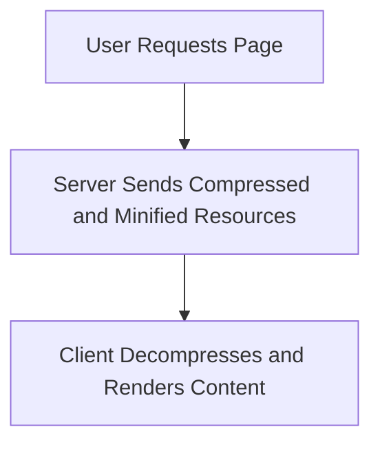

## 12.3.4 Network Optimization and Resource Delivery

In today's fast-paced digital landscape, optimizing network performance is crucial for delivering responsive and efficient applications. Network optimization not only enhances load times but also significantly improves user satisfaction and engagement. This section delves into various strategies and techniques to optimize network performance and resource delivery in modern web applications.

### The Role of Network Optimization

Network optimization plays a pivotal role in enhancing the performance of web applications by reducing latency, improving load times, and ensuring a smooth user experience. It involves a series of techniques aimed at minimizing the amount of data transferred over the network and optimizing the way resources are delivered to the client. By focusing on network optimization, developers can create applications that are not only faster but also more reliable and scalable.

### Minimizing HTTP Requests

One of the fundamental aspects of network optimization is minimizing the number and size of HTTP requests. Each request adds overhead, which can slow down the application. Here are some strategies to achieve this:

- **Combine Files:** By merging multiple JavaScript and CSS files into a single file, you can reduce the number of HTTP requests. This can be achieved using build tools like Webpack or Gulp.
- **Use Sprites for Images:** Image sprites combine multiple images into a single file, reducing the number of requests needed to fetch images.
- **Inline Small Assets:** For small CSS and JavaScript files, consider inlining them directly into the HTML to eliminate additional requests.

### Compressing Assets

Compressing assets is a powerful technique to reduce the size of data transferred over the network. Gzip and Brotli are two popular compression methods:

- **Gzip Compression:** Widely supported by all major browsers, Gzip can significantly reduce the size of HTML, CSS, and JavaScript files.
- **Brotli Compression:** Developed by Google, Brotli offers better compression rates than Gzip, especially for text-based files.

Enabling compression on your server can drastically decrease the amount of data sent over the network, leading to faster load times.

### Image Optimization Techniques

Images often account for a large portion of a web page's payload. Optimizing images can lead to substantial performance gains:

- **Resizing Images:** Ensure that images are not larger than necessary for their display size. Use responsive images to serve different sizes based on the device.
- **Format Selection:** Choose the appropriate image format. For example, use JPEG for photographs and PNG for images with transparency. Consider using modern formats like WebP for better compression.
- **Lazy Loading:** Implement lazy loading to defer loading of off-screen images until they are needed, reducing initial page load time.

### Leveraging HTTP/2 Features

HTTP/2 introduces several features that can enhance network performance:

- **Multiplexing:** Allows multiple requests and responses to be sent over a single connection, reducing latency and improving resource delivery.
- **Server Push:** Enables the server to send resources to the client before they are requested, reducing load times for subsequent requests.

### Minifying JavaScript and CSS

Minification involves removing unnecessary characters from code, such as whitespace and comments, to reduce file size. Tools like UglifyJS for JavaScript and cssnano for CSS can automate this process, leading to smaller payloads and faster downloads.

### Resource Hints

Resource hints are directives that inform the browser about resources it may need in the near future:

- **Prefetching:** Instructs the browser to fetch resources that might be used on subsequent pages.
- **Preloading:** Specifies resources that are necessary for the current page and should be loaded as soon as possible.
- **DNS Prefetching:** Resolves domain names in advance to reduce latency for future requests.

### Content Delivery Networks (CDNs)

CDNs distribute content across multiple geographically dispersed servers, bringing resources closer to users:

- **Reduced Latency:** By serving content from a server near the user, CDNs reduce the time it takes to fetch resources.
- **Improved Availability:** CDNs provide redundancy, ensuring that content is available even if one server fails.

### Managing Third-Party Scripts

Third-party scripts can introduce performance bottlenecks. Here are some best practices:

- **Asynchronous Loading:** Load third-party scripts asynchronously to prevent them from blocking the main thread.
- **Defer Non-Critical Scripts:** Use the `defer` attribute for scripts that are not essential for initial rendering.
- **Monitor Performance:** Regularly audit the impact of third-party scripts on performance and remove any that are not essential.

### Implementing HTTP Caching Strategies

Effective caching strategies can reduce redundant network requests and improve load times:

- **Cache-Control Headers:** Use headers to specify how long resources should be cached by the browser.
- **ETags:** Enable ETags to allow the browser to validate cached resources and only download them if they have changed.
- **Service Workers:** Implement service workers to cache resources and serve them offline or during network disruptions.

### Optimizing WebSocket and API Communication

For real-time applications, optimizing WebSocket and API communication is crucial:

- **Batch Requests:** Combine multiple API requests into a single request to reduce overhead.
- **Use Efficient Data Formats:** Opt for binary formats like Protocol Buffers or MessagePack over JSON for reduced payload size.
- **Implement Compression:** Use compression for WebSocket messages to reduce data transfer size.

### Regular Network Performance Audits

Regular audits can help identify and address performance issues:

- **Lighthouse:** Use Google's Lighthouse tool to analyze network performance and receive actionable insights.
- **Wireshark:** Monitor network traffic with Wireshark to identify bottlenecks and optimize resource delivery.

### Secure and Encrypted Communication

Ensuring secure communication is essential for protecting user data and maintaining trust:

- **HTTPS:** Always use HTTPS to encrypt data in transit and prevent interception.
- **HSTS:** Implement HTTP Strict Transport Security (HSTS) to enforce secure connections.

### Impact on Performance and User Satisfaction

Network optimization directly impacts the overall performance of an application and user satisfaction. Faster load times lead to higher user engagement, reduced bounce rates, and improved conversion rates. By implementing the strategies discussed in this section, developers can create applications that are not only performant but also deliver a superior user experience.

### Conclusion

Network optimization and resource delivery are critical components of modern web development. By minimizing HTTP requests, compressing assets, optimizing images, leveraging HTTP/2, and using CDNs, developers can significantly enhance the performance of their applications. Regular audits and adherence to best practices ensure that applications remain fast, secure, and responsive, ultimately leading to greater user satisfaction and success.

---

## Quiz Time!



### What is one of the primary goals of network optimization in web applications?

- [x] To reduce latency and improve load times
- [ ] To increase the number of HTTP requests
- [ ] To make images larger
- [ ] To remove the need for compression

> **Explanation:** Network optimization aims to reduce latency and improve load times, enhancing the overall performance and user experience of web applications.

### Which compression method offers better compression rates than Gzip for text-based files?

- [ ] Zip
- [ ] LZMA
- [x] Brotli
- [ ] RAR

> **Explanation:** Brotli, developed by Google, offers better compression rates than Gzip, especially for text-based files like HTML, CSS, and JavaScript.

### What is the benefit of using image sprites?

- [x] They reduce the number of HTTP requests needed to fetch images.
- [ ] They increase the size of image files.
- [ ] They decrease image quality.
- [ ] They make images load slower.

> **Explanation:** Image sprites combine multiple images into a single file, reducing the number of HTTP requests needed to fetch images, which can improve load times.

### What feature of HTTP/2 allows multiple requests and responses to be sent over a single connection?

- [ ] Compression
- [x] Multiplexing
- [ ] Caching
- [ ] Prefetching

> **Explanation:** Multiplexing in HTTP/2 allows multiple requests and responses to be sent over a single connection, reducing latency and improving resource delivery.

### Which of the following is a directive that informs the browser about resources it may need in the near future?

- [ ] Compression
- [ ] Minification
- [x] Prefetching
- [ ] Caching

> **Explanation:** Prefetching is a resource hint that instructs the browser to fetch resources that might be used on subsequent pages, reducing latency for future requests.

### What is the primary advantage of using a CDN?

- [ ] It increases the server load.
- [ ] It decreases the number of servers needed.
- [x] It reduces latency by serving content closer to users.
- [ ] It makes content delivery slower.

> **Explanation:** CDNs reduce latency by serving content from a server geographically closer to the user, improving load times and availability.

### How can third-party scripts impact performance?

- [x] They can introduce performance bottlenecks.
- [ ] They always improve performance.
- [ ] They have no impact on performance.
- [ ] They make pages load faster.

> **Explanation:** Third-party scripts can introduce performance bottlenecks if not managed properly, as they may block the main thread or increase load times.

### What is the purpose of using Cache-Control headers?

- [ ] To increase the size of resources
- [ ] To remove the need for caching
- [x] To specify how long resources should be cached by the browser
- [ ] To disable caching entirely

> **Explanation:** Cache-Control headers are used to specify how long resources should be cached by the browser, reducing redundant network requests and improving load times.

### Which tool can be used to analyze network performance and receive actionable insights?

- [ ] Photoshop
- [ ] Excel
- [x] Lighthouse
- [ ] Word

> **Explanation:** Google's Lighthouse tool can be used to analyze network performance and provide actionable insights to improve web application performance.

### True or False: HTTPS is essential for encrypting data in transit and preventing interception.

- [x] True
- [ ] False

> **Explanation:** HTTPS is essential for encrypting data in transit, preventing interception, and ensuring secure communication between the client and server.


