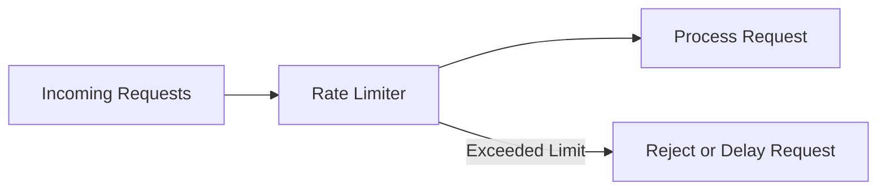

## 12.4.3 Implementing Rate Limiting and Throttling

In the ever-evolving landscape of modern applications, managing resource usage and ensuring system stability are paramount. Rate limiting and throttling are critical techniques employed to control the flow of requests, protect resources, and maintain service quality. This comprehensive guide delves into the intricacies of implementing these mechanisms, providing practical insights and examples that can be applied to a wide range of applications.

### Understanding the Purpose of Rate Limiting

Rate limiting is a strategy used to control the number of requests a client can make to a server within a specified timeframe. Its primary purpose is to:

- **Prevent Abuse**: By limiting the number of requests, rate limiting protects APIs from malicious users or bots attempting to overwhelm the system.
- **Ensure Fair Usage**: It helps distribute resources fairly among users, preventing any single user from monopolizing the service.
- **Maintain Performance**: By controlling the load on the server, rate limiting ensures that the system remains responsive and performs optimally even under heavy traffic.

### Throttling: Managing Resource Usage

Throttling, closely related to rate limiting, is a technique used to manage the processing rate of requests. While rate limiting focuses on the number of requests, throttling controls the speed at which requests are processed. This is particularly useful in:

- **Resource Management**: Ensuring that resource-intensive operations do not degrade system performance.
- **Load Balancing**: Distributing requests evenly to prevent sudden spikes in resource usage.
- **Quality of Service**: Maintaining consistent service levels by smoothing out traffic bursts.

### Implementing Rate Limiting in APIs

APIs are often the gateway to a system's resources, making them prime candidates for rate limiting. Implementing rate limiting in APIs involves:

1. **Defining Limits**: Establishing the maximum number of requests allowed per user or IP address within a given timeframe.
2. **Tracking Requests**: Monitoring incoming requests to enforce the defined limits.
3. **Responding to Violations**: Handling cases where the rate limit is exceeded, typically by rejecting requests or imposing delays.

#### Example: Basic Rate Limiting in JavaScript

```javascript
const express = require('express');
const rateLimit = require('express-rate-limit');

const app = express();

// Define rate limit: 100 requests per 15 minutes
const limiter = rateLimit({
  windowMs: 15 * 60 * 1000, // 15 minutes
  max: 100, // limit each IP to 100 requests per windowMs
  message: 'Too many requests, please try again later.',
});

// Apply rate limiting to all requests
app.use(limiter);

app.get('/', (req, res) => {
  res.send('Welcome to the API!');
});

app.listen(3000, () => {
  console.log('Server running on port 3000');
});
```

### Algorithms for Rate Limiting

Several algorithms are commonly used to implement rate limiting, each with its own advantages and trade-offs:

- **Token Bucket**: This algorithm allows a burst of requests by accumulating tokens over time. Requests consume tokens, and if the bucket is empty, requests are denied or delayed.
- **Leaky Bucket**: Similar to the token bucket, but with a fixed output rate, ensuring a consistent flow of requests.
- **Fixed Window**: Counts requests in fixed time intervals, resetting the count at the start of each interval.
- **Sliding Window**: A more granular approach that uses a rolling time window to track requests, providing smoother rate limiting.

#### Mermaid.js Diagram: Rate Limiting Flow



### Setting Appropriate Rate Limits

Determining the right rate limits requires balancing resource capacity with user needs. Consider:

- **Server Capacity**: Set limits that prevent the server from being overwhelmed.
- **User Experience**: Ensure limits are not so restrictive that they degrade the user experience.
- **Usage Patterns**: Analyze historical data to understand typical usage and set limits accordingly.

### Handling Rate Limit Violations

When a client exceeds the rate limit, it's crucial to handle the situation gracefully:

- **Return Appropriate Status Codes**: Use HTTP status codes like 429 (Too Many Requests) to indicate rate limit violations.
- **Provide Retry Information**: Include headers indicating when the client can retry, such as `Retry-After`.
- **Log Violations**: Track violations for monitoring and analysis.

### Implementing Rate Limiting at Different Levels

Rate limiting can be implemented at various levels within an application:

- **Application Level**: Directly within the application code, as shown in the earlier example.
- **Server Level**: Using server configurations or middleware, such as NGINX or Apache modules.
- **Network Level**: Employing network devices or services that manage traffic flow.

### Centralized Rate Limiting with Middleware or Gateways

Centralizing rate limiting through middleware or gateways offers several benefits:

- **Consistency**: Ensures uniform rate limiting policies across different services.
- **Scalability**: Allows for easier scaling and management of rate limiting rules.
- **Flexibility**: Enables dynamic adjustments to rate limits based on changing conditions.

### Best Practices for Communicating Rate Limits

Clear communication of rate limits to clients is essential for a seamless user experience:

- **Documentation**: Include rate limit details in API documentation.
- **Response Headers**: Use headers like `X-RateLimit-Limit`, `X-RateLimit-Remaining`, and `X-RateLimit-Reset` to convey rate limit status.

### Accommodating Burst Traffic

Legitimate usage spikes can occur, such as during promotions or events. Strategies to handle bursts include:

- **Burst Allowance**: Permitting short bursts of traffic without immediate penalties.
- **Dynamic Adjustments**: Temporarily increasing limits during known high-traffic periods.

### Testing Rate Limiting Mechanisms

Testing is crucial to ensure rate limiting functions as intended:

- **Simulate Traffic**: Use tools to generate traffic patterns and test rate limit enforcement.
- **Monitor Logs**: Analyze logs to verify correct handling of rate limit violations.

### Impact on User Experience and Service Availability

While rate limiting is essential for protecting resources, it can impact user experience:

- **Balancing Act**: Strive for a balance between security and accessibility.
- **Feedback Loops**: Use user feedback to adjust rate limits and improve service quality.

### Monitoring and Adjusting Rate Limit Policies

Continuous monitoring of rate limit metrics is vital for maintaining optimal performance:

- **Track Usage Patterns**: Identify trends and adjust rate limits based on real-world usage.
- **Adapt to Changes**: Be prepared to modify rate limits in response to evolving user needs or system capabilities.

### Conclusion

Implementing rate limiting and throttling is a critical aspect of modern application design, ensuring resources are used efficiently and services remain reliable. By understanding the principles and techniques outlined in this guide, developers can create robust systems that balance performance, security, and user experience.

## Quiz Time!



### What is the primary purpose of rate limiting?

- [x] To control the flow of requests and protect resources
- [ ] To increase server capacity
- [ ] To enhance user interface design
- [ ] To reduce code complexity

> **Explanation:** Rate limiting is primarily used to control the flow of requests to a server, protecting resources from being overwhelmed and ensuring fair usage among clients.

### Which algorithm allows a burst of requests by accumulating tokens over time?

- [x] Token Bucket
- [ ] Leaky Bucket
- [ ] Fixed Window
- [ ] Sliding Window

> **Explanation:** The Token Bucket algorithm allows a burst of requests by accumulating tokens over time, which can be used to handle sudden spikes in traffic.

### What HTTP status code is commonly used to indicate rate limit violations?

- [x] 429
- [ ] 404
- [ ] 500
- [ ] 200

> **Explanation:** HTTP status code 429 (Too Many Requests) is used to indicate that a client has sent too many requests in a given amount of time.

### What is a key benefit of centralizing rate limiting through middleware or gateways?

- [x] Ensures uniform rate limiting policies across different services
- [ ] Increases server memory usage
- [ ] Enhances user interface design
- [ ] Reduces network latency

> **Explanation:** Centralizing rate limiting through middleware or gateways ensures uniform application of rate limiting policies across different services, enhancing consistency and scalability.

### Which of the following is a strategy to handle legitimate usage spikes?

- [x] Burst Allowance
- [ ] Reducing server capacity
- [ ] Increasing user quotas permanently
- [ ] Disabling rate limiting

> **Explanation:** Burst Allowance permits short bursts of traffic without immediate penalties, accommodating legitimate usage spikes without compromising system stability.

### What is the role of response headers like `X-RateLimit-Remaining`?

- [x] To convey rate limit status to the client
- [ ] To increase server response time
- [ ] To reduce code complexity
- [ ] To enhance user interface design

> **Explanation:** Response headers like `X-RateLimit-Remaining` are used to convey rate limit status to the client, informing them of their remaining quota.

### Why is testing rate limiting mechanisms important?

- [x] To ensure they function correctly and handle violations appropriately
- [ ] To increase server capacity
- [ ] To enhance user interface design
- [ ] To reduce code complexity

> **Explanation:** Testing rate limiting mechanisms is crucial to ensure they function correctly, handle violations appropriately, and do not adversely affect user experience.

### What should be considered when setting rate limits?

- [x] Server capacity and user needs
- [ ] Code complexity
- [ ] User interface design
- [ ] Server memory usage

> **Explanation:** When setting rate limits, it's important to consider server capacity and user needs to ensure optimal performance and user satisfaction.

### How can rate limiting impact user experience?

- [x] By balancing security and accessibility
- [ ] By increasing server memory usage
- [ ] By enhancing user interface design
- [ ] By reducing code complexity

> **Explanation:** Rate limiting impacts user experience by balancing security and accessibility, ensuring resources are protected without unduly restricting legitimate users.

### True or False: Rate limiting can be implemented at the application, server, and network levels.

- [x] True
- [ ] False

> **Explanation:** True. Rate limiting can be implemented at various levels, including application, server, and network, to effectively manage resource usage and protect against abuse.


