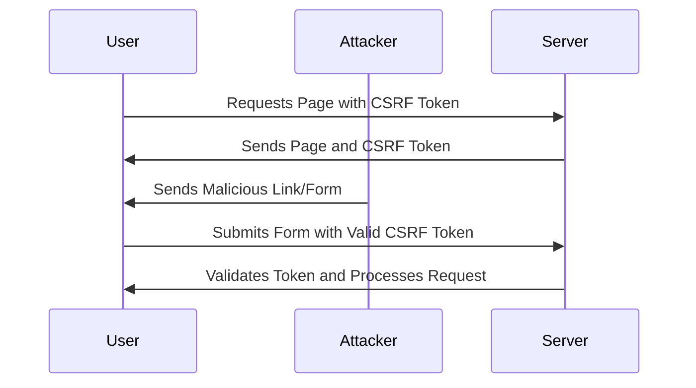

## 13.3.4 Cross-Site Request Forgery (CSRF) Protection

In the realm of web security, Cross-Site Request Forgery (CSRF) stands as a formidable adversary. This attack vector exploits the trust that a web application places in a user's browser, allowing malicious actors to perform unauthorized actions on behalf of authenticated users. Understanding CSRF and implementing robust defenses is crucial for safeguarding your applications and protecting user data.

### Understanding Cross-Site Request Forgery (CSRF)

CSRF attacks occur when an attacker tricks a victim into executing unwanted actions on a web application in which they are authenticated. This is typically achieved by embedding malicious requests within a webpage or email that the victim interacts with. The attack leverages the user's authenticated session to perform actions like changing account settings, making purchases, or even transferring funds without the user's consent.

#### How CSRF Attacks Work

1. **Victim Authentication**: The user logs into a web application and establishes a session.
2. **Malicious Link/Form**: The attacker crafts a malicious link or form that triggers a request to the target application.
3. **User Interaction**: The user unknowingly interacts with the malicious link or form.
4. **Request Execution**: The request is sent to the application with the user's session cookies, executing the attacker's intended action.

### The Impact of CSRF Attacks

The consequences of a successful CSRF attack can be severe, leading to unauthorized actions and potential data breaches. Some of the impacts include:

- **Unauthorized Transactions**: Attackers can initiate financial transactions or change account settings.
- **Data Breaches**: Sensitive information can be exposed or altered.
- **Reputation Damage**: Organizations may suffer reputational harm and loss of user trust.
- **Regulatory Consequences**: Non-compliance with data protection regulations can result in legal penalties.

### Implementing Anti-CSRF Tokens

One of the most effective defenses against CSRF attacks is the use of anti-CSRF tokens. These tokens are unique, unpredictable values associated with a user's session and included in requests to verify their legitimacy.

#### Generating and Validating CSRF Tokens

1. **Token Generation**: When a user accesses a form or page requiring protection, the server generates a unique CSRF token and associates it with the user's session.
2. **Token Inclusion**: The token is included in the form or request, often as a hidden input field or a request header.
3. **Token Validation**: Upon receiving a request, the server validates the token against the session-stored token. If they match, the request is processed; otherwise, it is rejected.

Here's a basic implementation in JavaScript:

```javascript
// Server-side: Generate and store CSRF token
function generateCSRFToken(session) {
  const token = crypto.randomBytes(64).toString('hex');
  session.csrfToken = token;
  return token;
}

// Client-side: Include CSRF token in form
<form method="POST" action="/submit">
  <input type="hidden" name="csrfToken" value="<%= csrfToken %>">
  <!-- Other form fields -->
</form>

// Server-side: Validate CSRF token
function validateCSRFToken(request, session) {
  const token = request.body.csrfToken;
  return token === session.csrfToken;
}
```

### Utilizing SameSite Cookie Attributes

The `SameSite` attribute for cookies is a powerful tool in mitigating CSRF risks by restricting how cookies are sent with cross-site requests. It can be set to `Strict`, `Lax`, or `None`, each providing different levels of protection:

- **Strict**: Cookies are only sent in a first-party context, preventing them from being sent with cross-site requests.
- **Lax**: Cookies are sent with top-level navigations and GET requests, offering a balance between usability and security.
- **None**: Cookies are sent with cross-site requests but must be secured with `Secure`.

Implementing `SameSite` in your application can significantly reduce CSRF vulnerabilities.

### CSRF Protection Flow

The following diagram illustrates the flow of CSRF protection using anti-CSRF tokens:



### Handling AJAX Requests and CSRF Tokens in SPAs

Single-page applications (SPAs) often rely heavily on AJAX requests, making CSRF protection crucial. Here’s how to securely handle CSRF tokens with AJAX:

```javascript
// Include CSRF token in AJAX request headers
function sendAjaxRequest(url, data) {
  const csrfToken = document.querySelector('meta[name="csrf-token"]').getAttribute('content');
  fetch(url, {
    method: 'POST',
    headers: {
      'Content-Type': 'application/json',
      'CSRF-Token': csrfToken
    },
    body: JSON.stringify(data)
  })
  .then(response => response.json())
  .then(data => console.log(data))
  .catch(error => console.error('Error:', error));
}
```

### Double Submit Cookies as an Alternative

The double submit cookie method involves sending the CSRF token in a cookie and a request parameter. The server verifies both values match:

1. **Set CSRF Token Cookie**: The server sets a CSRF token as a cookie.
2. **Include Token in Request**: The token is included in a request parameter.
3. **Validate Tokens**: The server checks if the cookie and request parameter tokens match.

### Verifying Origin and Referer Headers

Another layer of protection involves checking the `Origin` and `Referer` headers to ensure requests originate from trusted sources. This method is not foolproof but can complement other defenses.

### CORS Policies and Misconfiguration

Cross-Origin Resource Sharing (CORS) policies dictate how resources are shared across domains. Misconfigurations can expose your application to CSRF attacks. Ensure CORS policies are correctly set to allow only trusted origins.

### Best Practices for CSRF Protection

- **Educate Users**: Inform users about safe browsing habits and the risks of interacting with unknown links.
- **Test Regularly**: Use security testing tools to verify CSRF protections.
- **Stay Updated**: Keep frameworks and libraries updated to leverage built-in CSRF defenses.
- **Defense-in-Depth**: Combine multiple strategies for robust protection.

### Conclusion

Defending against CSRF attacks requires a multi-faceted approach, combining anti-CSRF tokens, SameSite cookies, header verification, and secure CORS policies. By implementing these strategies, you can significantly enhance the security of your web applications.

## Quiz Time!



### What is a CSRF attack?

- [x] An attack where a malicious actor tricks a user into submitting a request they did not intend to make.
- [ ] An attack that exploits vulnerabilities in cross-site scripting.
- [ ] An attack that involves stealing user credentials.
- [ ] An attack that targets database systems directly.

> **Explanation:** CSRF attacks involve tricking a user into performing actions they did not intend, leveraging their authenticated session.

### What is the primary purpose of an anti-CSRF token?

- [x] To verify the legitimacy of requests by ensuring they originate from the authenticated user.
- [ ] To encrypt sensitive data in transit.
- [ ] To authenticate users during login.
- [ ] To validate the user's identity.

> **Explanation:** Anti-CSRF tokens are used to verify that requests are legitimate and originate from the authenticated user.

### Which SameSite attribute offers the strictest protection against CSRF?

- [x] Strict
- [ ] Lax
- [ ] None
- [ ] Secure

> **Explanation:** The `Strict` attribute ensures cookies are only sent in a first-party context, providing the highest level of protection.

### How can AJAX requests include CSRF tokens?

- [x] By including the CSRF token in the request headers.
- [ ] By sending the CSRF token as a query parameter.
- [ ] By embedding the CSRF token in the URL.
- [ ] By storing the CSRF token in local storage.

> **Explanation:** Including the CSRF token in request headers is a secure way to protect AJAX requests.

### What is the double submit cookie method?

- [x] A method where the CSRF token is sent in both a cookie and a request parameter.
- [ ] A method where the CSRF token is only stored in a cookie.
- [ ] A method where the CSRF token is encrypted.
- [ ] A method where the CSRF token is sent as a query string.

> **Explanation:** The double submit cookie method involves sending the CSRF token in both a cookie and a request parameter for validation.

### Why is it important to verify the Origin and Referer headers?

- [x] To ensure requests originate from trusted sources.
- [ ] To encrypt data being transmitted.
- [ ] To authenticate user credentials.
- [ ] To validate the CSRF token.

> **Explanation:** Verifying these headers helps ensure that requests are coming from trusted sources, adding an additional layer of security.

### How can CORS policies be misconfigured to allow CSRF attacks?

- [x] By allowing requests from untrusted origins.
- [ ] By restricting requests to specific methods.
- [ ] By enabling strict mode.
- [ ] By setting the `Content-Type` to JSON.

> **Explanation:** Allowing requests from untrusted origins can expose your application to CSRF attacks.

### What is a key component of defense-in-depth for CSRF protection?

- [x] Combining multiple mitigation strategies.
- [ ] Relying solely on anti-CSRF tokens.
- [ ] Using only SameSite cookies.
- [ ] Disabling all forms of cookies.

> **Explanation:** Defense-in-depth involves using multiple strategies to provide comprehensive protection.

### How can users be informed about safe browsing habits?

- [x] Through educational resources and alerts about suspicious activities.
- [ ] By disabling all cookies.
- [ ] By restricting access to all external links.
- [ ] By requiring multi-factor authentication for every action.

> **Explanation:** Educating users about safe browsing habits can help them avoid falling victim to CSRF attacks.

### True or False: Keeping frameworks and libraries up to date is unnecessary for CSRF protection.

- [ ] True
- [x] False

> **Explanation:** Keeping frameworks and libraries updated is crucial to benefit from the latest security patches and built-in defenses.


