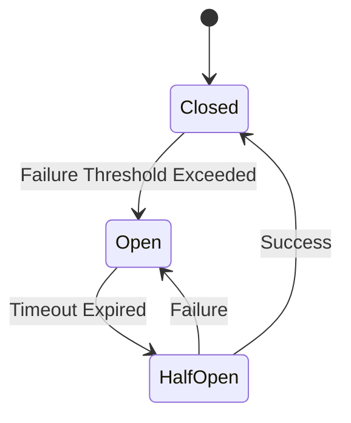

## 14.2.1 Circuit Breaker Pattern

In the world of microservices and distributed systems, ensuring system resilience and fault tolerance is paramount. The Circuit Breaker pattern is a crucial design pattern that helps prevent cascading failures and enhances the robustness of microservices architectures. This comprehensive article delves into the intricacies of the Circuit Breaker pattern, providing insights into its implementation, benefits, and best practices.

### Understanding the Circuit Breaker Pattern

The Circuit Breaker pattern is inspired by electrical circuit breakers, which prevent an overload from damaging the system by interrupting the flow of electricity. Similarly, in software systems, a Circuit Breaker monitors service calls and interrupts the flow when failures exceed a predetermined threshold. This prevents a chain reaction of failures that could potentially bring down an entire system.

#### Purpose and Benefits

- **Prevent Cascading Failures**: By halting requests to a failing service, the Circuit Breaker prevents the failure from propagating to other services.
- **Improve System Resilience**: It allows the system to recover gracefully from failures, maintaining overall stability.
- **Enhance Fault Tolerance**: By providing fallback mechanisms, the Circuit Breaker ensures that the system can continue to function, albeit in a degraded mode.

### How the Circuit Breaker Works

The Circuit Breaker pattern operates by monitoring the number of failures and successes in service calls. When the number of failures exceeds a specified threshold, the Circuit Breaker "trips" and transitions between different states.

#### States of a Circuit Breaker

1. **Closed**: The Circuit Breaker is in the closed state when everything is functioning normally. All requests pass through, and failures are monitored. If failures exceed the threshold, the Circuit Breaker transitions to the open state.

2. **Open**: In the open state, the Circuit Breaker blocks all requests to the service to prevent further failures. After a timeout period, it transitions to the half-open state to test if the service has recovered.

3. **Half-Open**: In this state, the Circuit Breaker allows a limited number of requests to pass through. If these requests succeed, the Circuit Breaker transitions back to the closed state. If they fail, it returns to the open state.

### Implementing Circuit Breakers in Microservices

Implementing a Circuit Breaker involves several steps, including setting thresholds, defining fallback logic, and integrating with existing services. Here are key considerations and steps for implementation:

#### Setting Thresholds and Timeouts

- **Failure Threshold**: Determine the number of failures that should trigger the Circuit Breaker. This should be based on the criticality of the service and historical data.
- **Timeout Period**: Define the duration the Circuit Breaker remains open before transitioning to half-open. This allows the system to recover and prevents premature reactivation.

#### Handling Fallback Logic

When a Circuit Breaker is open, it's crucial to have fallback logic in place to handle requests. This could involve returning default values, serving cached data, or redirecting to an alternative service.

#### Monitoring and Logging

- **Monitoring**: Implement real-time monitoring to track the state of Circuit Breakers and detect anomalies.
- **Logging**: Maintain detailed logs of Circuit Breaker activity to analyze patterns and refine thresholds.

### Libraries and Tools Supporting Circuit Breaker Pattern

Several libraries and tools facilitate the implementation of the Circuit Breaker pattern in JavaScript and TypeScript:

- **Hystrix**: Originally developed by Netflix, Hystrix is a popular library for implementing Circuit Breakers in Java. While not directly applicable to JavaScript, it has inspired similar libraries.
- **Opossum**: A Node.js library that provides a robust implementation of the Circuit Breaker pattern, allowing for easy integration with microservices.
- **Polly.js**: A JavaScript library that provides resilience features, including Circuit Breakers, for HTTP requests.

### Real-World Scenarios and Best Practices

#### Scenarios Where Circuit Breakers Are Beneficial

- **High Traffic Systems**: In systems with high traffic, a failing service can quickly lead to a cascade of failures. Circuit Breakers prevent this by isolating the failure.
- **Unstable External Services**: When relying on external services that may be unstable, Circuit Breakers can provide a safety net by preventing repeated failures.
- **Critical Services**: For services that are critical to the application's functionality, Circuit Breakers ensure that failures are contained and do not affect the entire system.

#### Best Practices

- **Start with Conservative Thresholds**: Begin with conservative failure thresholds and adjust based on monitoring data.
- **Integrate with Monitoring Tools**: Use monitoring tools to gain insights into Circuit Breaker performance and make data-driven adjustments.
- **Combine with Retries and Timeouts**: Circuit Breakers complement retries and timeouts by providing an additional layer of fault tolerance.

### Challenges and Pitfalls

While the Circuit Breaker pattern offers significant benefits, there are potential challenges:

- **Misconfiguration**: Incorrect thresholds or timeouts can lead to unnecessary failures or delayed recovery.
- **Complexity**: Integrating Circuit Breakers adds complexity to the system, requiring careful planning and testing.
- **Overhead**: Monitoring and managing Circuit Breakers can introduce overhead, impacting performance if not optimized.

### Conclusion

The Circuit Breaker pattern is an essential tool in the arsenal of any microservices architect. By preventing cascading failures and enhancing system resilience, it plays a crucial role in maintaining the stability and reliability of distributed systems. By understanding its principles, implementing it effectively, and monitoring its performance, developers can ensure that their microservices architectures are robust and fault-tolerant.

### Further Reading and Resources

- [Resilience4j](https://resilience4j.readme.io/docs/circuitbreaker) - A lightweight, easy-to-use Java library inspired by Netflix Hystrix, providing Circuit Breaker capabilities.
- [Opossum GitHub Repository](https://github.com/nodeshift/opossum) - Explore Opossum for implementing Circuit Breakers in Node.js applications.
- [Polly.js Documentation](https://netflix.github.io/pollyjs/) - Learn more about Polly.js for resilience in JavaScript applications.

## Quiz Time!



### What is the primary purpose of the Circuit Breaker pattern?

- [x] To prevent cascading failures in distributed systems
- [ ] To increase the speed of service calls
- [ ] To enhance data security
- [ ] To reduce memory usage

> **Explanation:** The Circuit Breaker pattern is designed to prevent cascading failures by interrupting service calls when failures exceed a threshold.

### Which state does a Circuit Breaker transition to after exceeding the failure threshold?

- [ ] Half-Open
- [x] Open
- [ ] Closed
- [ ] Broken

> **Explanation:** When the failure threshold is exceeded, the Circuit Breaker transitions from the Closed state to the Open state.

### What happens in the Half-Open state of a Circuit Breaker?

- [x] A limited number of requests are allowed to test if the service has recovered
- [ ] All requests are blocked
- [ ] The Circuit Breaker resets all thresholds
- [ ] The service is permanently disabled

> **Explanation:** In the Half-Open state, a limited number of requests are allowed to determine if the service has recovered.

### Which library is commonly used in Node.js for implementing Circuit Breakers?

- [ ] Hystrix
- [x] Opossum
- [ ] Resilience4j
- [ ] Polly.js

> **Explanation:** Opossum is a Node.js library that provides an implementation of the Circuit Breaker pattern.

### How can Circuit Breakers improve system resilience?

- [x] By isolating failures and allowing systems to recover gracefully
- [ ] By increasing the speed of service calls
- [ ] By reducing memory usage
- [ ] By enhancing data encryption

> **Explanation:** Circuit Breakers improve system resilience by isolating failures and allowing systems to recover without affecting the entire architecture.

### What should be configured carefully to avoid unnecessary Circuit Breaker activations?

- [x] Thresholds and timeouts
- [ ] Memory usage
- [ ] Data encryption
- [ ] Service endpoints

> **Explanation:** Proper configuration of thresholds and timeouts is crucial to avoid unnecessary activations of the Circuit Breaker.

### Which state allows all requests to pass through in a Circuit Breaker?

- [x] Closed
- [ ] Open
- [ ] Half-Open
- [ ] Reset

> **Explanation:** In the Closed state, all requests pass through, and failures are monitored.

### What is a potential pitfall of using Circuit Breakers?

- [x] Misconfiguration leading to unnecessary failures
- [ ] Increased data security
- [ ] Reduced system complexity
- [ ] Enhanced performance

> **Explanation:** Misconfiguration of Circuit Breakers can lead to unnecessary failures or delayed recovery.

### In which scenario is the Circuit Breaker pattern particularly useful?

- [x] When dealing with unstable external services
- [ ] When optimizing data encryption
- [ ] When reducing memory usage
- [ ] When enhancing user interface design

> **Explanation:** The Circuit Breaker pattern is useful when dealing with unstable external services to prevent cascading failures.

### True or False: Circuit Breakers eliminate the need for retries and timeouts.

- [ ] True
- [x] False

> **Explanation:** Circuit Breakers complement retries and timeouts but do not eliminate the need for them.


