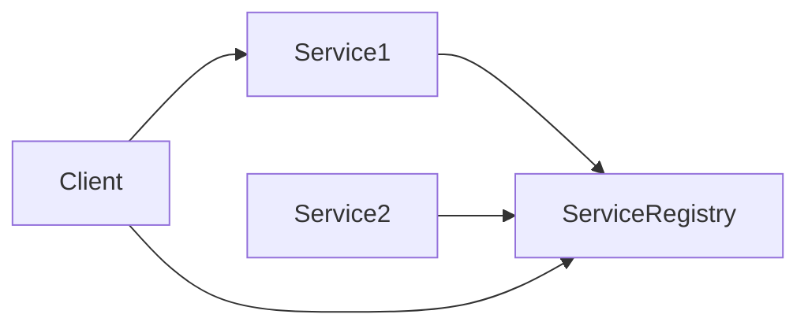

## 14.2.3 Service Discovery Pattern

In the dynamic world of microservices architecture, where services are deployed across multiple hosts and environments, the Service Discovery pattern emerges as a critical component. It enables services to find each other without relying on hard-coded network addresses, which can change due to scaling, failure, or updates. This article delves into the intricacies of the Service Discovery pattern, exploring its necessity, implementation strategies, tools, and best practices.

### The Need for Service Discovery

In traditional monolithic applications, components communicate within a single process or through well-defined interfaces. However, in a microservices architecture, services are decoupled and distributed across different network locations. This distribution introduces several challenges:

- **Dynamic Nature of Microservices**: Services can be scaled up or down, moved, or replaced without warning. Hard-coding service addresses is impractical and error-prone.
- **Fault Tolerance**: Services may fail and restart on different hosts or ports, requiring a dynamic mechanism to track their current locations.
- **Load Balancing**: Efficiently distributing requests across service instances is essential to maintain performance and reliability.

Service discovery addresses these challenges by providing a mechanism for services to register themselves and for clients to discover them dynamically.

### Understanding the Service Discovery Pattern

The Service Discovery pattern involves three main components:

1. **Service Registry**: A centralized database where services register their network locations. It serves as the source of truth for service locations.
2. **Service Providers**: The microservices that register themselves with the service registry.
3. **Service Consumers**: Clients or other services that query the service registry to locate service providers.

#### How It Works

1. **Registration**: When a service starts, it registers its network location (e.g., IP address, port) with the service registry.
2. **Discovery**: Clients query the service registry to find the network location of a service instance.
3. **Deregistration**: When a service instance shuts down, it deregisters itself from the service registry.

This pattern eliminates the need for hard-coded addresses, allowing services to find each other dynamically.

### Implementing Service Discovery

Service discovery can be implemented using two primary methods: client-side discovery and server-side discovery. Each has its own advantages and trade-offs.

#### Client-Side Discovery

In client-side discovery, the client is responsible for querying the service registry and selecting an available service instance. This approach requires the client to have built-in logic for service discovery and load balancing.

**Pros:**
- Simplifies the architecture by eliminating the need for a dedicated load balancer.
- Clients can implement custom load-balancing strategies.

**Cons:**
- Increases client complexity, as they must handle service discovery logic.
- Changes to the discovery logic require updating all clients.

**Example Implementation:**

```typescript
// Example of a client-side discovery using a hypothetical service registry API
async function discoverService(serviceName: string): Promise<string> {
  const response = await fetch(`http://service-registry/api/services/${serviceName}`);
  const instances = await response.json();
  
  // Simple round-robin load balancing
  const selectedInstance = instances[Math.floor(Math.random() * instances.length)];
  return `${selectedInstance.host}:${selectedInstance.port}`;
}

async function callService() {
  const serviceUrl = await discoverService('OrderService');
  const response = await fetch(`http://${serviceUrl}/api/orders`);
  const data = await response.json();
  console.log(data);
}

callService();
```

#### Server-Side Discovery

In server-side discovery, the client makes a request to a load balancer, which queries the service registry and forwards the request to an appropriate service instance. This approach offloads the discovery logic to the server.

**Pros:**
- Simplifies client implementation, as they only need to know the load balancer's address.
- Centralizes discovery logic, making it easier to update and maintain.

**Cons:**
- Introduces a single point of failure and potential bottleneck at the load balancer.
- Requires additional infrastructure for the load balancer.

**Example Implementation:**

In server-side discovery, tools like Netflix's Ribbon or Spring Cloud Gateway can be used to handle the routing and load balancing.

### Service Registry Tools

Several tools and frameworks facilitate service discovery by acting as service registries. Some popular options include:

- **Consul**: A service mesh solution that provides service discovery, configuration, and segmentation functionality.
- **Eureka**: Developed by Netflix, Eureka is a service registry for resilient mid-tier load balancing and failover.
- **etcd**: A distributed key-value store that can be used for service discovery, among other use cases.

#### Consul Example

Consul provides a robust solution for service discovery with health checking, key-value storage, and multi-datacenter support.



**Consul Configuration Example:**

1. **Service Registration**: Services register themselves with Consul using a simple configuration file or HTTP API.

```json
{
  "service": {
    "name": "web",
    "tags": ["rails"],
    "port": 80
  }
}
```

2. **Service Discovery**: Clients query the Consul API to discover services.

```bash
curl http://localhost:8500/v1/catalog/service/web
```

### Load Balancers and Service Discovery

Load balancers play a crucial role in server-side service discovery. They distribute incoming requests across multiple service instances to ensure high availability and reliability. Commonly used load balancers include:

- **NGINX**: Can be configured to perform load balancing and service discovery.
- **HAProxy**: A reliable and high-performance load balancer.
- **Envoy**: A modern, high-performance proxy designed for cloud-native applications.

### Health Checks and Service Registration

Health checks are vital for maintaining an accurate service registry. They ensure that only healthy service instances are registered and available for discovery.

- **Active Health Checks**: Periodically ping service instances to verify their health.
- **Passive Health Checks**: Monitor service instance responses and mark them as unhealthy if they fail.

**Service Registration/Deregistration Tips:**

- Implement robust health checks to ensure only healthy instances are available.
- Use TTL (Time-To-Live) settings to automatically deregister instances that do not send heartbeats.
- Ensure services deregister themselves gracefully on shutdown.

### Handling Service Instance Failures and Updates

Microservices environments are dynamic, and service instances can fail or be updated frequently. Service discovery mechanisms must handle these changes gracefully:

- **Automatic Deregistration**: Use health checks to automatically remove unhealthy instances.
- **Graceful Shutdowns**: Ensure services deregister themselves before shutting down.
- **Rolling Updates**: Gradually update service instances to avoid downtime.

### Security Considerations

Security is paramount in service discovery to prevent unauthorized access and ensure data integrity:

- **Access Control**: Implement authentication and authorization for service registration and discovery.
- **TLS Encryption**: Use TLS to secure communication between services and the service registry.
- **Audit Logs**: Maintain logs of service registrations and requests for auditing purposes.

### Integration with Orchestration Platforms

Orchestration platforms like Kubernetes provide built-in service discovery mechanisms. Integrating service discovery with these platforms can simplify management and deployment:

- **Kubernetes Service Discovery**: Uses DNS and environment variables to expose services.
- **Service Mesh**: Tools like Istio provide advanced service discovery, load balancing, and security features.

### Challenges and Considerations

Implementing service discovery comes with its own set of challenges:

- **Scalability**: Ensure the service registry can handle a large number of service instances.
- **Consistency**: Maintain consistency across distributed service registries.
- **Latency**: Minimize latency in service discovery to ensure fast response times.

### Testing Service Discovery Mechanisms

Thorough testing is crucial to ensure the reliability and performance of service discovery mechanisms:

- **Unit Tests**: Test individual components of the service discovery logic.
- **Integration Tests**: Validate the interaction between services and the service registry.
- **Load Tests**: Simulate high traffic to test scalability and performance.

### Real-World Examples

Service discovery is widely used in various industries to enable scalable and resilient microservices architectures. For instance:

- **Netflix**: Uses Eureka for service discovery, enabling its services to scale dynamically.
- **Uber**: Employs a custom service discovery solution to manage its large-scale microservices architecture.

### Conclusion

The Service Discovery pattern is a cornerstone of microservices architecture, enabling dynamic service interaction and scaling. By understanding and implementing this pattern effectively, organizations can build resilient, scalable, and maintainable distributed systems.

For further exploration, consider delving into the official documentation of service discovery tools like [Consul](https://www.consul.io/), [Eureka](https://github.com/Netflix/eureka), and [etcd](https://etcd.io/). Additionally, resources like [Kubernetes documentation](https://kubernetes.io/docs/concepts/services-networking/service/) provide insights into integrating service discovery with orchestration platforms.

## Quiz Time!



### What is the primary role of a service registry in the Service Discovery pattern?

- [x] To store and provide the network locations of service instances.
- [ ] To manage client requests and distribute them to services.
- [ ] To perform load balancing between service instances.
- [ ] To handle authentication and authorization for services.

> **Explanation:** The service registry acts as a centralized database where services register their network locations, allowing clients to discover them dynamically.

### Which of the following is a benefit of client-side service discovery?

- [x] Clients can implement custom load-balancing strategies.
- [ ] Simplifies client implementation by centralizing discovery logic.
- [ ] Introduces a single point of failure at the load balancer.
- [ ] Requires additional infrastructure for the load balancer.

> **Explanation:** Client-side discovery allows clients to implement their own load-balancing strategies, offering flexibility and customization.

### What is a potential drawback of server-side service discovery?

- [x] It introduces a single point of failure and potential bottleneck at the load balancer.
- [ ] It increases client complexity by requiring discovery logic.
- [ ] It requires clients to know the addresses of all service instances.
- [ ] It complicates the architecture by adding a service registry.

> **Explanation:** Server-side discovery centralizes discovery logic at the load balancer, which can become a single point of failure.

### Which tool is commonly used for service discovery in microservices?

- [x] Consul
- [ ] Docker
- [ ] Jenkins
- [ ] Git

> **Explanation:** Consul is a popular tool for service discovery, providing features like health checks and multi-datacenter support.

### What is the purpose of health checks in service discovery?

- [x] To ensure only healthy service instances are registered and available for discovery.
- [ ] To perform load balancing across service instances.
- [ ] To encrypt communication between services.
- [ ] To manage client requests and distribute them to services.

> **Explanation:** Health checks verify the health of service instances, ensuring that only healthy ones are registered and discoverable.

### How can security be enhanced in service discovery?

- [x] Implement authentication and authorization for service registration and discovery.
- [ ] Use plain HTTP for communication between services.
- [ ] Avoid using audit logs for service registrations.
- [ ] Allow any service to register without verification.

> **Explanation:** Implementing authentication and authorization ensures that only authorized services can register and be discovered.

### What role do load balancers play in server-side service discovery?

- [x] They distribute incoming requests across multiple service instances.
- [ ] They store and provide the network locations of service instances.
- [ ] They perform health checks on service instances.
- [ ] They encrypt communication between clients and services.

> **Explanation:** Load balancers in server-side discovery distribute client requests across available service instances, ensuring efficient load distribution.

### Which orchestration platform provides built-in service discovery mechanisms?

- [x] Kubernetes
- [ ] Jenkins
- [ ] GitLab
- [ ] Docker Compose

> **Explanation:** Kubernetes offers built-in service discovery features, using DNS and environment variables to expose services.

### What is a key challenge when implementing service discovery?

- [x] Ensuring scalability and consistency across distributed service registries.
- [ ] Simplifying client implementation by centralizing discovery logic.
- [ ] Allowing any service to register without verification.
- [ ] Avoiding the use of load balancers.

> **Explanation:** Scalability and consistency are critical challenges in distributed service registries, requiring careful design and management.

### True or False: Service discovery eliminates the need for load balancing in microservices.

- [ ] True
- [x] False

> **Explanation:** Service discovery facilitates dynamic service location, but load balancing is still necessary to efficiently distribute requests across service instances.


