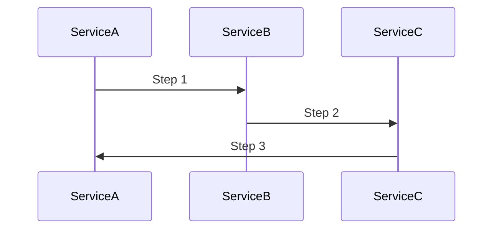

## 14.2.4 Saga Pattern for Distributed Transactions

In the world of microservices, ensuring data consistency across distributed systems is a formidable challenge. Traditional transaction management techniques, like ACID transactions, are not feasible in distributed environments due to their inherent limitations in scalability and availability. This is where the Saga pattern comes into play, offering a robust solution for managing distributed transactions while maintaining data consistency.

### Challenges of Maintaining Data Consistency in Distributed Microservices

Microservices architecture decomposes a large application into smaller, independent services that communicate over a network. This decomposition leads to several challenges, particularly in maintaining data consistency:

- **Network Latency and Failures**: Communication between services can be delayed or fail, leading to inconsistent states.
- **Independent Data Stores**: Each microservice often manages its own database, making global transactions difficult to implement.
- **Scalability and Availability**: Traditional distributed transactions can hinder scalability and availability, which are critical in microservices.

These challenges necessitate a pattern that allows for consistency without compromising the core benefits of microservices.

### Introducing the Saga Pattern

The Saga pattern is a design pattern that provides a way to manage distributed transactions by breaking them into a series of smaller, manageable transactions that can be coordinated across services. Each of these smaller transactions is a local transaction that updates the database and publishes an event or message. If one of these transactions fails, the Saga pattern ensures that compensating transactions are executed to undo the changes made by previous transactions, thereby maintaining consistency.

### How a Saga Coordinates Local Transactions Across Services

A saga is composed of multiple steps, each representing a local transaction within a service. These steps are coordinated in a sequence to achieve a business goal. The key idea is that each step can succeed or fail independently, and in the case of failure, compensating actions can be executed to revert the system to a consistent state.

### Types of Sagas: Choreography-Based and Orchestration-Based

There are two primary approaches to implementing the Saga pattern: choreography-based and orchestration-based.

#### Choreography-Based Sagas

In a choreography-based saga, each service involved in the saga listens for specific events and performs its transaction in response. This approach is decentralized, meaning there's no central coordinator. Each service knows which event to listen for and which event to publish after completing its transaction.

**Advantages:**
- Simplicity: No need for a central orchestrator.
- Loose Coupling: Services are loosely coupled, as they only need to know about the events they handle.

**Disadvantages:**
- Complexity in Event Management: As the number of services increases, managing events can become complex.
- Harder to Debug: Tracing the flow of a saga can be challenging without a central view.

#### Orchestration-Based Sagas

In an orchestration-based saga, a central orchestrator service is responsible for coordinating the saga. The orchestrator sends commands to each service to execute their transactions and listens for responses to decide the next step.

**Advantages:**
- Centralized Control: Easier to manage and debug with a single point of control.
- Clear Workflow: The orchestrator defines the workflow, making it easier to understand.

**Disadvantages:**
- Single Point of Failure: The orchestrator can become a bottleneck or a point of failure.
- Increased Complexity: The orchestrator adds an additional layer of complexity.

### Implementing Sagas with Compensation Actions

Compensation actions are crucial in the Saga pattern as they ensure that the system can revert to a consistent state in case of a failure. Each step in a saga should have a corresponding compensation action that can undo its effects.

For example, consider a travel booking system where a saga involves booking a flight, a hotel, and a car rental. If the car rental fails, the saga should execute compensation actions to cancel the flight and hotel bookings.

### Mermaid.js Diagram of a Saga

To illustrate a simple saga, consider the following sequence diagram:

In this diagram, Service A initiates the saga, Service B performs the next step, and Service C completes the saga. Each service can perform its local transaction and publish an event to trigger the next step.

### Handling Failures and Rollbacks

Handling failures in a saga involves executing compensation actions to rollback changes. This requires careful design to ensure that each step is idempotent, meaning executing it multiple times has the same effect as executing it once.

**Strategies for Handling Failures:**
- **Compensation Actions**: Define clear compensation actions for each step.
- **Timeouts and Retries**: Implement timeouts and retries to handle transient failures.
- **Idempotency**: Ensure that each transaction and compensation action is idempotent.

### Scenarios Where the Saga Pattern is Applicable

The Saga pattern is particularly useful in scenarios where:

- **Long-Running Transactions**: Transactions span multiple services and take time to complete.
- **High Availability Requirements**: The system must remain available even if some transactions fail.
- **Decentralized Data Management**: Each service manages its own data store.

### Using Message Queues and Event Buses

Message queues and event buses are essential components for implementing sagas, especially in choreography-based sagas. They facilitate communication between services and ensure reliable message delivery.

**Key Considerations:**
- **Reliable Messaging**: Use durable message queues to ensure messages are not lost.
- **Eventual Consistency**: Design the system to be eventually consistent, acknowledging that immediate consistency is not always possible.

### Importance of Idempotency in Saga Transactions

Idempotency ensures that repeating a transaction or compensation action has no additional effect. This is crucial in distributed systems where messages can be delivered more than once.

**Implementing Idempotency:**
- **Unique Identifiers**: Use unique identifiers for transactions to track their status.
- **State Management**: Maintain a state to track completed transactions and prevent duplicates.

### Managing Complexities in Sagas

Implementing sagas can introduce complexities, such as managing the sequence of events, handling failures, and ensuring idempotency. To manage these complexities:

- **Design for Failure**: Assume that failures will occur and design compensation actions accordingly.
- **Use Monitoring Tools**: Implement monitoring and logging to track saga execution and identify issues.
- **Test Thoroughly**: Test sagas under various failure scenarios to ensure reliability.

### Testing and Monitoring Sagas

Testing and monitoring are critical to ensure the reliability of sagas. Use automated tests to simulate various failure scenarios and validate compensation actions. Monitoring tools can provide insights into saga execution and help identify bottlenecks.

**Testing Strategies:**
- **Unit Tests**: Test individual transactions and compensation actions.
- **Integration Tests**: Test the entire saga flow across services.
- **Chaos Engineering**: Introduce failures to test the system's resilience.

### Designing for Data Consistency and Reliability

When designing sagas, focus on achieving eventual consistency and reliability. This involves careful planning of compensation actions, ensuring idempotency, and using reliable messaging systems.

### Trade-offs Between Consistency and Availability

The Saga pattern embodies the trade-off between consistency and availability, as described by the CAP theorem. While it provides eventual consistency, it prioritizes availability and partition tolerance. This trade-off is essential in distributed systems where immediate consistency is not always achievable.

### Conclusion

The Saga pattern is a powerful tool for managing distributed transactions in microservices. By breaking down transactions into smaller, manageable steps and using compensation actions, it ensures data consistency while maintaining the benefits of microservices architecture. However, it requires careful design and implementation to handle failures, manage complexities, and ensure reliability. By understanding the trade-offs and applying best practices, developers can effectively use the Saga pattern to build robust distributed systems.

## Quiz Time!



### What is the primary purpose of the Saga pattern in microservices?

- [x] To manage distributed transactions and maintain data consistency
- [ ] To improve the performance of microservices
- [ ] To simplify the deployment process
- [ ] To enhance security in microservices

> **Explanation:** The Saga pattern is primarily used to manage distributed transactions and maintain data consistency across services in a microservices architecture.

### What is a key difference between choreography-based and orchestration-based sagas?

- [x] Choreography-based sagas use events for coordination, while orchestration-based sagas use a central orchestrator.
- [ ] Choreography-based sagas are faster than orchestration-based sagas.
- [ ] Orchestration-based sagas are more scalable than choreography-based sagas.
- [ ] Choreography-based sagas require more storage than orchestration-based sagas.

> **Explanation:** In choreography-based sagas, services coordinate through events, whereas orchestration-based sagas rely on a central orchestrator to manage the workflow.

### What is a compensation action in the context of the Saga pattern?

- [x] An action that undoes the effects of a transaction in case of failure
- [ ] An action that speeds up the transaction process
- [ ] An action that encrypts data for security
- [ ] An action that logs transaction details

> **Explanation:** A compensation action is used to undo the effects of a transaction if a failure occurs, ensuring the system remains consistent.

### Which of the following is a disadvantage of orchestration-based sagas?

- [x] The orchestrator can become a single point of failure.
- [ ] They are harder to debug than choreography-based sagas.
- [ ] They require more complex event management.
- [ ] They are less scalable than choreography-based sagas.

> **Explanation:** The orchestrator in orchestration-based sagas can become a single point of failure, which is a disadvantage compared to the decentralized approach of choreography-based sagas.

### Why is idempotency important in the Saga pattern?

- [x] To ensure that repeating a transaction has no additional effect
- [ ] To increase the speed of transactions
- [ ] To reduce the storage requirements
- [ ] To enhance the security of transactions

> **Explanation:** Idempotency ensures that repeating a transaction or compensation action has no additional effect, which is crucial in distributed systems where messages may be delivered multiple times.

### What role do message queues play in implementing sagas?

- [x] They facilitate communication between services and ensure reliable message delivery.
- [ ] They increase the speed of transactions.
- [ ] They encrypt data for security.
- [ ] They reduce storage requirements.

> **Explanation:** Message queues facilitate communication between services and ensure reliable message delivery, which is essential for implementing sagas, especially in choreography-based sagas.

### Which of the following is a scenario where the Saga pattern is applicable?

- [x] Long-running transactions spanning multiple services
- [ ] Simple transactions within a single service
- [ ] Transactions that require immediate consistency
- [ ] Static data processing tasks

> **Explanation:** The Saga pattern is particularly useful for long-running transactions that span multiple services, where traditional distributed transactions are not feasible.

### How can failures be handled in a saga?

- [x] By executing compensation actions to rollback changes
- [ ] By increasing the speed of transactions
- [ ] By encrypting transaction data
- [ ] By logging transaction details

> **Explanation:** Failures in a saga are handled by executing compensation actions to rollback changes, ensuring the system remains consistent.

### What is a trade-off of using the Saga pattern?

- [x] It provides eventual consistency but prioritizes availability and partition tolerance.
- [ ] It increases the speed of transactions but reduces security.
- [ ] It simplifies deployment but increases storage requirements.
- [ ] It enhances security but reduces scalability.

> **Explanation:** The Saga pattern provides eventual consistency but prioritizes availability and partition tolerance, which is a trade-off in distributed systems.

### True or False: Sagas can only be implemented using orchestration-based approaches.

- [ ] True
- [x] False

> **Explanation:** Sagas can be implemented using both choreography-based and orchestration-based approaches, each with its own advantages and disadvantages.


