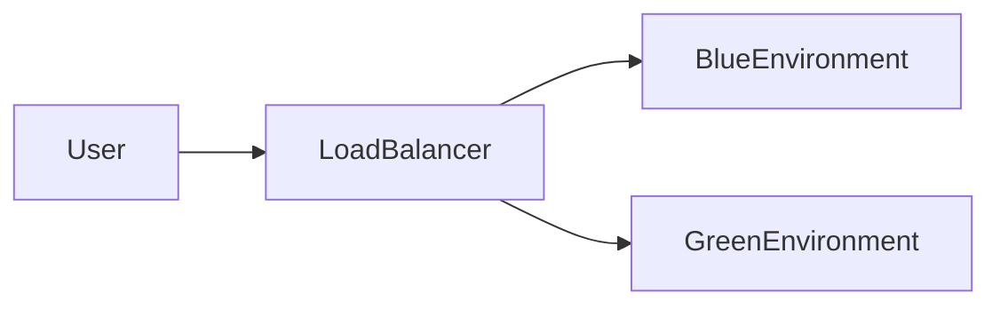

## 14.3.2 Blue-Green and Canary Deployments

In the realm of microservices and distributed systems, deployment strategies play a crucial role in ensuring smooth and reliable software releases. Two popular deployment patterns that have gained traction in modern software development are Blue-Green and Canary deployments. These strategies are designed to minimize downtime, reduce risk, and improve the overall deployment process. In this section, we will explore these deployment patterns in detail, providing practical guidance on implementation, benefits, challenges, and best practices.

### Understanding Blue-Green Deployment

**Blue-Green Deployment** is a strategy that involves maintaining two identical environments, referred to as the "blue" and "green" environments. This approach allows for seamless transitions between software versions, minimizing downtime and reducing the risk of deployment failures.

#### Setting Up Blue-Green Environments

To implement a Blue-Green deployment, you need to set up two identical environments:

- **Blue Environment**: This is the current production environment serving live traffic.
- **Green Environment**: This is the staging environment where the new version of the application is deployed and tested.

The key to a successful Blue-Green deployment is the ability to switch traffic between these environments seamlessly.

#### Switching Traffic Between Environments

A load balancer is typically used to manage traffic routing between the blue and green environments. Here's a simple illustration of how this setup works:

- **Load Balancer**: Directs user traffic to the active environment (either blue or green).
- **Traffic Switching**: Once the new version is tested and verified in the green environment, the load balancer redirects traffic from the blue environment to the green environment.

#### Implementing Blue-Green Deployments in Microservices

In a microservices architecture, Blue-Green deployments can be particularly advantageous due to the modular nature of services. Here's how you can implement this strategy:

1. **Environment Duplication**: Ensure that both environments are identical in terms of infrastructure, configuration, and services.
2. **Automated Testing**: Deploy the new version to the green environment and run automated tests to verify functionality and performance.
3. **Traffic Switch**: Once testing is successful, switch traffic from the blue environment to the green environment using the load balancer.
4. **Rollback Capability**: If issues arise, you can quickly switch back to the blue environment, minimizing downtime and impact.

#### Benefits of Blue-Green Deployment

- **Quick Rollback**: Easily revert to the previous version if issues are detected.
- **Minimal Service Interruption**: Users experience little to no downtime during the transition.
- **Testing in Production-like Environment**: The green environment mirrors production, allowing for realistic testing.

#### Challenges of Blue-Green Deployment

- **Resource Usage**: Maintaining two identical environments can be resource-intensive.
- **Database Synchronization**: Ensuring database consistency across environments can be complex.
- **Cost**: Duplicating environments may increase operational costs.

#### Tips for Planning and Executing Blue-Green Deployments

- **Automate the Process**: Use automation tools to manage deployments, testing, and traffic switching.
- **Monitor Performance**: Continuously monitor both environments to detect anomalies.
- **Plan for Database Changes**: Implement strategies for database versioning and migration to ensure consistency.

### Exploring Canary Deployment

**Canary Deployment** is a strategy that introduces changes to a small subset of users before rolling out to the entire user base. This gradual approach allows for real-world testing and minimizes the risk of widespread issues.

#### Implementing Canary Releases

1. **Feature Flags**: Use feature flags to enable or disable features for specific user segments.
2. **Traffic Routing**: Gradually route a small percentage of user traffic to the new version.
3. **Monitor Metrics**: Collect and analyze metrics to assess the impact of the new version.

#### Best Practices for Canary Deployments

- **Start Small**: Begin with a small percentage of users and gradually increase as confidence grows.
- **Monitor Key Metrics**: Focus on performance, error rates, and user feedback.
- **Automate Rollback**: Have automated rollback procedures in place to quickly revert changes if needed.

#### Tools Supporting Canary Deployments

- **Feature Management Platforms**: Tools like LaunchDarkly and Optimizely provide feature flagging capabilities.
- **Traffic Management Solutions**: Use solutions like Istio or AWS App Mesh to manage traffic routing.

#### Making Data-Driven Decisions

- **Analyze User Feedback**: Collect user feedback to identify potential issues.
- **Monitor System Metrics**: Use monitoring tools to track system performance and stability.
- **Decide on Rollout or Rollback**: Based on data, decide whether to proceed with the rollout or rollback changes.

### Incorporating Deployment Patterns into CI/CD Pipelines

Integrating Blue-Green and Canary deployments into your CI/CD pipelines can streamline the deployment process and enhance reliability. Here are some tips:

- **Automate Testing and Deployment**: Use CI/CD tools like Jenkins, GitLab CI, or GitHub Actions to automate the deployment process.
- **Version Control**: Maintain version control for both application code and infrastructure configurations.
- **Continuous Monitoring**: Implement continuous monitoring to detect issues early and ensure system health.

### Importance of Communication and Coordination

Successful deployments require effective communication and coordination among development, operations, and business teams. Consider the following:

- **Clear Communication**: Keep all stakeholders informed about deployment plans and progress.
- **Collaborative Planning**: Involve cross-functional teams in planning and execution.
- **Post-Deployment Review**: Conduct post-deployment reviews to identify areas for improvement.

### Conclusion

Blue-Green and Canary deployments are powerful strategies for minimizing downtime and ensuring smooth software releases in microservices architectures. By understanding the benefits and challenges of each approach and implementing best practices, you can enhance the reliability and efficiency of your deployment process. Incorporating these patterns into your CI/CD pipelines, along with effective communication and coordination, will further improve your deployment success.

## Quiz Time!



### What is the primary goal of Blue-Green deployment?

- [x] Minimize downtime during software releases
- [ ] Increase the number of environments
- [ ] Reduce the cost of deployment
- [ ] Increase the complexity of the deployment process

> **Explanation:** The primary goal of Blue-Green deployment is to minimize downtime during software releases by switching traffic between two identical environments.

### In a Blue-Green deployment, what is the role of the load balancer?

- [x] To switch traffic between the blue and green environments
- [ ] To manage database synchronization
- [ ] To increase resource usage
- [ ] To automate testing

> **Explanation:** The load balancer is used to switch traffic between the blue and green environments, ensuring a seamless transition during deployments.

### What is a key benefit of Canary deployment?

- [x] Gradual introduction of changes to a subset of users
- [ ] Immediate rollback capability
- [ ] Reduced need for monitoring
- [ ] Increased resource usage

> **Explanation:** Canary deployment allows for the gradual introduction of changes to a subset of users, enabling real-world testing and minimizing risk.

### Which tool can be used for feature flagging in Canary deployments?

- [x] LaunchDarkly
- [ ] Jenkins
- [ ] Docker
- [ ] Kubernetes

> **Explanation:** LaunchDarkly is a feature management platform that provides feature flagging capabilities, which are useful for Canary deployments.

### What is a challenge associated with Blue-Green deployments?

- [x] Resource usage and cost
- [ ] Lack of rollback capability
- [ ] Inability to test in production-like environments
- [ ] Reduced service availability

> **Explanation:** A challenge associated with Blue-Green deployments is the increased resource usage and cost due to maintaining two identical environments.

### How can CI/CD pipelines enhance deployment strategies?

- [x] By automating testing and deployment processes
- [ ] By increasing manual intervention
- [ ] By reducing the number of environments
- [ ] By eliminating the need for monitoring

> **Explanation:** CI/CD pipelines enhance deployment strategies by automating testing and deployment processes, improving efficiency and reliability.

### What is a best practice for monitoring during Canary deployments?

- [x] Focus on performance, error rates, and user feedback
- [ ] Ignore user feedback
- [ ] Only monitor after full rollout
- [ ] Avoid using automated monitoring tools

> **Explanation:** Best practices for monitoring during Canary deployments include focusing on performance, error rates, and user feedback to assess the impact of changes.

### Which deployment strategy involves maintaining two identical environments?

- [x] Blue-Green deployment
- [ ] Canary deployment
- [ ] Rolling deployment
- [ ] A/B testing

> **Explanation:** Blue-Green deployment involves maintaining two identical environments (blue and green) to facilitate seamless transitions during software releases.

### What is a benefit of incorporating deployment patterns into CI/CD pipelines?

- [x] Streamlined deployment process and enhanced reliability
- [ ] Increased manual intervention
- [ ] Reduced need for communication
- [ ] Increased deployment complexity

> **Explanation:** Incorporating deployment patterns into CI/CD pipelines streamlines the deployment process and enhances reliability through automation.

### True or False: Effective communication and coordination are crucial for successful deployments.

- [x] True
- [ ] False

> **Explanation:** Effective communication and coordination among teams are crucial for successful deployments, ensuring that all stakeholders are informed and aligned.


