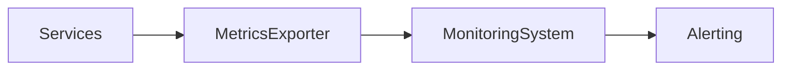

## 14.3.3 Monitoring, Logging, and Tracing

In the realm of microservices and distributed systems, observability is not just a luxury—it's a necessity. As applications grow in complexity and scale, ensuring their reliability and performance becomes increasingly challenging. This section delves into the critical aspects of monitoring, logging, and tracing, providing you with the tools and techniques needed to maintain robust and efficient microservices architectures.

### Understanding Observability in Microservices

Observability is the capability to infer the internal state of a system based on the data it produces, such as logs, metrics, and traces. In microservices environments, where applications are composed of numerous interconnected services, observability becomes crucial for several reasons:

- **Complex Interactions**: Microservices often communicate over a network, introducing latency and potential points of failure. Observability helps identify and troubleshoot these issues.
- **Dynamic Scaling**: Services can scale independently, which means their interactions and performance characteristics can change dynamically.
- **Decentralized Data**: Each service may maintain its own logs and metrics, making centralized visibility essential for understanding the overall system state.

### Challenges of Monitoring Distributed Systems

Monitoring distributed systems presents unique challenges:

- **Data Volume**: The sheer volume of logs and metrics generated can be overwhelming.
- **Data Correlation**: Correlating data from different services to understand a single transaction's journey is complex.
- **Latency and Performance**: Network latency can affect the timeliness and accuracy of monitoring data.
- **Dynamic Environments**: Services can be added, removed, or updated frequently, requiring adaptable monitoring solutions.

### Centralized Logging: Implementing with ELK Stack or Graylog

Centralized logging is essential for aggregating logs from various services into a single location, making it easier to search, analyze, and correlate data.

#### ELK Stack

The ELK stack, consisting of Elasticsearch, Logstash, and Kibana, is a popular choice for centralized logging:

- **Elasticsearch**: A search and analytics engine that stores and indexes logs.
- **Logstash**: A data processing pipeline that ingests, transforms, and sends logs to Elasticsearch.
- **Kibana**: A visualization tool that allows you to explore and analyze logs.

To set up ELK:

1. **Install Elasticsearch**: Configure it to store logs.
2. **Install Logstash**: Set up pipelines to ingest logs from your services.
3. **Install Kibana**: Connect it to Elasticsearch for visualizations.

Example Logstash configuration:

```plaintext
input {
  beats {
    port => 5044
  }
}

filter {
  grok {
    match => { "message" => "%{COMBINEDAPACHELOG}" }
  }
}

output {
  elasticsearch {
    hosts => ["localhost:9200"]
    index => "logs-%{+YYYY.MM.dd}"
  }
}
```

#### Graylog

Graylog is another centralized logging solution that offers a user-friendly interface and powerful search capabilities. It integrates with Elasticsearch and provides its own processing and alerting mechanisms.

### Importance of Structured Logging and Log Correlation

Structured logging involves formatting logs in a consistent way, often as JSON, to enable easy parsing and analysis. This approach allows for:

- **Efficient Searching**: Structured logs can be queried more effectively.
- **Correlation**: By including contextual information like request IDs or user IDs, logs from different services can be correlated to trace a single transaction.

Example of structured logging in JSON:

```json
{
  "timestamp": "2024-10-25T14:48:00.000Z",
  "level": "INFO",
  "service": "user-service",
  "message": "User login successful",
  "userId": "12345",
  "requestId": "abcde-12345"
}
```

### Monitoring and Alerting with Prometheus and Grafana

Prometheus and Grafana are commonly used together to monitor microservices:

- **Prometheus**: An open-source monitoring system that collects metrics from configured targets at given intervals, stores them, and allows for querying.
- **Grafana**: A visualization tool that integrates with Prometheus to display metrics in dashboards.

#### Setting Up Prometheus

1. **Install Prometheus**: Configure it to scrape metrics from your services.
2. **Define Metrics**: Use client libraries to expose metrics in your services.

Example Prometheus configuration:

```yaml
scrape_configs:
  - job_name: 'my-service'
    static_configs:
      - targets: ['localhost:9090']
```

#### Visualizing with Grafana

1. **Install Grafana**: Connect it to Prometheus.
2. **Create Dashboards**: Use Grafana's UI to create and customize dashboards.

Example Grafana dashboard configuration:

```json
{
  "dashboard": {
    "panels": [
      {
        "type": "graph",
        "title": "CPU Usage",
        "targets": [
          {
            "expr": "rate(container_cpu_usage_seconds_total[5m])"
          }
        ]
      }
    ]
  }
}
```

#### Mermaid.js Diagram of Monitoring Architecture



### Distributed Tracing with Jaeger or Zipkin

Distributed tracing is crucial for understanding the flow of requests across microservices. It helps identify performance bottlenecks and failures by tracking the path of a request through the system.

#### Implementing Tracing

- **Jaeger**: An open-source distributed tracing system that helps monitor and troubleshoot transactions.
- **Zipkin**: Another popular tracing system that collects timing data needed to troubleshoot latency problems.

To implement tracing:

1. **Instrument Your Code**: Use libraries to add tracing to your services.
2. **Deploy a Tracing Backend**: Set up Jaeger or Zipkin to collect and visualize traces.

Example of instrumenting code with OpenTelemetry for Jaeger:

```typescript
import { trace } from '@opentelemetry/api';

const tracer = trace.getTracer('my-service');

const span = tracer.startSpan('operation-name');
// Perform operation
span.end();
```

### Identifying Performance Bottlenecks and Failures

Tracing provides insights into:

- **Latency**: Measure the time taken by each service in a request's path.
- **Failures**: Identify where errors occur in the transaction flow.

### Tips for Instrumenting Code for Tracing and Metrics

- **Use OpenTelemetry**: A versatile library for metrics, logs, and traces.
- **Consistent Naming**: Ensure spans and metrics have meaningful names.
- **Minimal Overhead**: Instrumentation should have minimal impact on performance.

### Log Aggregation and Analysis Best Practices

- **Centralize Logs**: Use tools like ELK or Graylog.
- **Structure Logs**: Use JSON or other structured formats.
- **Correlate Logs**: Include identifiers to correlate logs across services.

### Setting Up Meaningful Alerts

Alerts should be:

- **Actionable**: Provide clear steps for resolution.
- **Relevant**: Avoid alert fatigue by focusing on critical issues.
- **Timely**: Ensure alerts are delivered promptly.

### Monitoring Key Performance Indicators (KPIs)

KPIs might include:

- **Response Time**: Measure the time taken to handle requests.
- **Error Rate**: Track the frequency of errors.
- **Throughput**: Monitor the number of requests handled.

### Continuous Monitoring and Improvement

- **Iterate**: Regularly review and refine monitoring strategies.
- **Automate**: Use automated tools to detect anomalies and trends.
- **Feedback Loops**: Use monitoring data to inform development and operations.

### Security Considerations for Logging and Monitoring

- **Data Privacy**: Ensure logs do not contain sensitive information.
- **Access Control**: Restrict access to logs and monitoring data.
- **Encryption**: Secure data in transit and at rest.

### The Role of Observability in Maintaining System Reliability

Observability is a cornerstone of system reliability, enabling:

- **Proactive Issue Detection**: Identify and address issues before they impact users.
- **Informed Decision-Making**: Use data to guide architectural and operational decisions.
- **Continuous Improvement**: Leverage insights to enhance system performance and resilience.

### Conclusion

Monitoring, logging, and tracing are integral to managing microservices and distributed systems. By implementing robust observability practices, you can ensure your systems remain reliable, performant, and resilient in the face of complexity and change. As you continue to develop and refine your microservices architecture, remember that observability is an ongoing journey that requires continuous attention and adaptation.

## Quiz Time!



### What is the primary purpose of observability in microservices?

- [x] To infer the internal state of a system based on external outputs
- [ ] To replace manual testing with automated scripts
- [ ] To reduce the number of services in an architecture
- [ ] To eliminate the need for logging

> **Explanation:** Observability helps infer the internal state of a system by analyzing logs, metrics, and traces, which is crucial for understanding and managing complex microservices architectures.

### Which tool is not part of the ELK stack?

- [ ] Elasticsearch
- [x] Grafana
- [ ] Logstash
- [ ] Kibana

> **Explanation:** Grafana is not part of the ELK stack; it is typically used with Prometheus for monitoring and visualization.

### What is structured logging?

- [x] Logging with a consistent format, often in JSON, to enable easy parsing and analysis
- [ ] Logging that uses random formats for flexibility
- [ ] Logging that excludes metadata for simplicity
- [ ] Logging that is only used in development environments

> **Explanation:** Structured logging involves using a consistent format, such as JSON, to make logs easier to parse and analyze, facilitating better correlation and searchability.

### What is the role of Prometheus in monitoring?

- [x] To collect and store metrics from configured targets
- [ ] To provide visualization dashboards
- [ ] To replace traditional logging systems
- [ ] To handle user authentication

> **Explanation:** Prometheus is a monitoring system that collects and stores metrics from various targets, allowing for querying and alerting.

### Which of the following is a benefit of distributed tracing?

- [x] Identifying performance bottlenecks and failures
- [ ] Reducing the number of logs generated
- [ ] Eliminating the need for monitoring
- [ ] Increasing the complexity of the system

> **Explanation:** Distributed tracing helps identify performance bottlenecks and failures by tracking the flow of requests across services.

### What is a key consideration when setting up alerts?

- [x] Alerts should be actionable and relevant
- [ ] Alerts should be as frequent as possible
- [ ] Alerts should only be set up for informational messages
- [ ] Alerts should be ignored during business hours

> **Explanation:** Alerts should be actionable and relevant to avoid alert fatigue and ensure that they provide meaningful insights for resolution.

### What does KPIs stand for in the context of monitoring?

- [x] Key Performance Indicators
- [ ] Known Performance Issues
- [ ] Key Process Improvements
- [ ] Knowledge Performance Insights

> **Explanation:** KPIs stand for Key Performance Indicators, which are metrics used to evaluate the performance and success of a system or service.

### Why is continuous monitoring important?

- [x] It allows for ongoing improvement and adaptation
- [ ] It eliminates the need for manual intervention
- [ ] It reduces the number of services in an architecture
- [ ] It automatically resolves all system issues

> **Explanation:** Continuous monitoring provides ongoing insights that help improve and adapt systems to changing conditions and requirements.

### What is a security consideration for logging?

- [x] Ensuring logs do not contain sensitive information
- [ ] Making logs publicly accessible for transparency
- [ ] Disabling logging in production environments
- [ ] Using unencrypted communication for log transmission

> **Explanation:** It's important to ensure that logs do not contain sensitive information to protect user privacy and comply with security policies.

### True or False: Observability is only needed during the development phase of a microservices architecture.

- [ ] True
- [x] False

> **Explanation:** Observability is crucial throughout the entire lifecycle of a microservices architecture, not just during development, to ensure reliability and performance.


