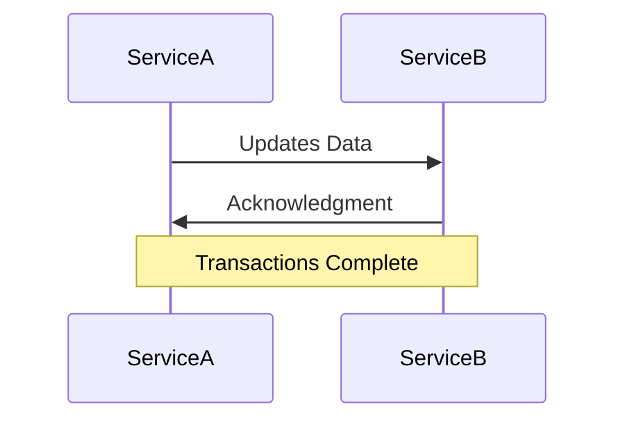

## 14.4.3 Data Consistency and Transactions

In the landscape of microservices and distributed systems, maintaining data consistency is a critical challenge. As applications scale and components become distributed across multiple servers or even geographic locations, ensuring that all parts of the system have a consistent view of the data becomes increasingly complex. In this section, we will explore the intricacies of data consistency, the challenges it presents, and the strategies available to manage it effectively.

### Challenges of Maintaining Data Consistency in Distributed Systems

Distributed systems inherently introduce complexity due to their nature of spreading data and processes across multiple nodes. This distribution leads to several challenges:

- **Network Latency and Partitioning:** Communication between nodes can be delayed or interrupted, leading to temporary inconsistencies.
- **Concurrency Issues:** Simultaneous operations on data can lead to race conditions and data conflicts.
- **Failure Handling:** Nodes can fail independently, making it difficult to ensure that all parts of the system agree on the current state of the data.
- **Scalability Needs:** As systems grow, maintaining a consistent state across an increasing number of nodes becomes more difficult.

### Eventual Consistency vs. Strong Consistency

Understanding the types of consistency models is crucial for designing distributed systems:

- **Strong Consistency:** Ensures that all nodes see the same data at the same time. This model is akin to traditional ACID transactions in databases, where operations are atomic, consistent, isolated, and durable. However, achieving strong consistency in distributed systems can be costly in terms of performance and availability.

- **Eventual Consistency:** Guarantees that, given enough time, all nodes will converge to the same state. This model is more suitable for distributed systems where availability and partition tolerance are prioritized over immediate consistency. It allows for temporary inconsistencies but ensures that they are resolved eventually.

### Distributed Transactions and Two-Phase Commit (2PC)

In scenarios where strong consistency is required, distributed transactions come into play. The Two-Phase Commit (2PC) protocol is a common approach:

1. **Prepare Phase:** The coordinator node asks all participating nodes to prepare for a transaction. Each node performs the necessary operations and locks the resources, then reports back whether it can commit.

2. **Commit Phase:** If all nodes agree to commit, the coordinator sends a commit request. If any node cannot commit, a rollback is initiated.

#### Limitations of 2PC

While 2PC ensures strong consistency, it has significant drawbacks:

- **Blocking Nature:** If a node fails during the commit phase, the entire transaction can be blocked until the failure is resolved.
- **Performance Overhead:** Locking resources across nodes can lead to increased latency and reduced throughput.
- **Single Point of Failure:** The coordinator node is a potential single point of failure, risking the entire transaction process.

### Compensating Transactions and Handling Failures

Given the limitations of 2PC, compensating transactions offer an alternative for handling failures in distributed systems. These are essentially "undo" operations that revert the effects of a transaction when a failure occurs. They are particularly useful in systems where eventual consistency is acceptable.

#### Designing Idempotent Operations

Idempotency is a key concept in distributed systems, ensuring that repeated operations have the same effect as a single execution. This property is crucial for:

- **Retry Logic:** In the face of network failures, operations can be retried without adverse effects.
- **Compensating Transactions:** Ensuring that undo operations do not lead to further inconsistencies.

### Role of Message Queues and Events

Message queues and event-driven architectures can help synchronize data across distributed systems:

- **Decoupling Services:** By using message queues, services can communicate asynchronously, reducing the need for immediate consistency.
- **Event Sourcing:** Capturing state changes as a sequence of events allows systems to reconstruct the current state and ensures consistency across different components.

### Distributed Caching for Shared Data Management

Distributed caching can enhance performance and consistency in distributed systems:

- **Reducing Load:** By caching frequently accessed data, systems reduce the load on the primary data store.
- **Consistency Models:** Implementing cache invalidation strategies ensures that cached data remains consistent with the source of truth.

### Conflict Resolution Strategies

When discrepancies in data occur, conflict resolution strategies are essential:

- **Last Write Wins:** The most recent update takes precedence, though this may lead to data loss.
- **Merge Operations:** Combining conflicting updates into a coherent result, often requiring domain-specific logic.
- **Versioning:** Keeping track of data versions to resolve conflicts based on historical context.

### Monitoring Data Consistency and Detecting Anomalies

Effective monitoring is vital for maintaining consistency:

- **Consistency Checks:** Regular audits to ensure that all nodes have a consistent view of the data.
- **Anomaly Detection:** Using machine learning algorithms to identify patterns that indicate inconsistencies.

### The CAP Theorem and Its Implications

The CAP theorem states that a distributed system can only guarantee two of the following three properties at any given time:

- **Consistency:** Every read receives the most recent write.
- **Availability:** Every request receives a response, regardless of success or failure.
- **Partition Tolerance:** The system continues to operate despite network partitions.

Understanding the CAP theorem helps in designing systems with acceptable trade-offs based on business requirements.

### Best Practices for Designing Consistent Systems

- **Define Consistency Requirements:** Clearly outline the consistency needs for different parts of the system.
- **Use Appropriate Models:** Choose between strong and eventual consistency based on use case.
- **Document Data Flows:** Maintain clear documentation of data flows and consistency models used.
- **Communicate Expectations:** Ensure stakeholders understand the consistency guarantees provided by the system.

### Communicating Consistency Expectations

Effective communication with stakeholders is crucial for aligning expectations:

- **Set Clear SLAs:** Define Service Level Agreements that outline the consistency guarantees.
- **Educate Stakeholders:** Provide training and resources to help stakeholders understand the implications of different consistency models.

In conclusion, managing data consistency in distributed systems is a multifaceted challenge that requires a careful balance of trade-offs. By understanding the available models and strategies, and by implementing best practices, developers can design systems that meet their consistency requirements while maintaining performance and availability. As you continue to explore this field, consider how these principles can be applied to your own projects, and remain open to new techniques and tools that can enhance data consistency.

## Quiz Time!



### What is a key challenge of maintaining data consistency in distributed systems?

- [x] Network latency and partitioning
- [ ] Centralized data storage
- [ ] Single-threaded execution
- [ ] Low data volume

> **Explanation:** Network latency and partitioning can lead to temporary inconsistencies in distributed systems, making it a key challenge for maintaining data consistency.

### How does eventual consistency differ from strong consistency?

- [x] Eventual consistency allows temporary inconsistencies, while strong consistency ensures immediate consistency.
- [ ] Eventual consistency is faster than strong consistency.
- [ ] Strong consistency requires no coordination between nodes.
- [ ] Eventual consistency is the same as weak consistency.

> **Explanation:** Eventual consistency allows temporary inconsistencies and ensures that all nodes will eventually converge to the same state, while strong consistency ensures that all nodes see the same data at the same time.

### What is a major drawback of the Two-Phase Commit (2PC) protocol?

- [x] It is blocking and can lead to increased latency.
- [ ] It does not ensure data consistency.
- [ ] It is only suitable for small-scale systems.
- [ ] It does not require coordination between nodes.

> **Explanation:** The Two-Phase Commit (2PC) protocol is blocking, meaning that if a node fails during the commit phase, the entire transaction can be blocked, leading to increased latency.

### What are compensating transactions used for?

- [x] Reverting the effects of a transaction in case of failure
- [ ] Increasing transaction speed
- [ ] Ensuring strong consistency
- [ ] Reducing network latency

> **Explanation:** Compensating transactions are used to revert the effects of a transaction in case of failure, providing a way to handle failures in distributed systems.

### Why is idempotency important in distributed systems?

- [x] It ensures that repeated operations have the same effect as a single execution.
- [ ] It increases system throughput.
- [ ] It reduces the need for data synchronization.
- [ ] It eliminates the need for compensating transactions.

> **Explanation:** Idempotency ensures that repeated operations have the same effect as a single execution, which is crucial for retry logic and compensating transactions in distributed systems.

### How can message queues help in synchronizing data across distributed systems?

- [x] By decoupling services and allowing asynchronous communication
- [ ] By enforcing strong consistency
- [ ] By reducing network latency
- [ ] By eliminating the need for data replication

> **Explanation:** Message queues help in synchronizing data across distributed systems by decoupling services and allowing asynchronous communication, which reduces the need for immediate consistency.

### What is a common strategy for conflict resolution in distributed systems?

- [x] Last Write Wins
- [ ] First Write Wins
- [ ] No Conflict Resolution
- [ ] Random Resolution

> **Explanation:** "Last Write Wins" is a common strategy for conflict resolution in distributed systems, where the most recent update takes precedence.

### What does the CAP theorem state about distributed systems?

- [x] A distributed system can only guarantee two of the following: Consistency, Availability, Partition Tolerance.
- [ ] A distributed system can guarantee all three: Consistency, Availability, Partition Tolerance.
- [ ] A distributed system can only guarantee one of the following: Consistency, Availability, Partition Tolerance.
- [ ] The CAP theorem is not applicable to distributed systems.

> **Explanation:** The CAP theorem states that a distributed system can only guarantee two of the following three properties at any given time: Consistency, Availability, and Partition Tolerance.

### What is the role of distributed caching in managing shared data?

- [x] Reducing load on the primary data store and improving performance
- [ ] Ensuring strong consistency
- [ ] Eliminating the need for data replication
- [ ] Reducing network latency

> **Explanation:** Distributed caching reduces the load on the primary data store and improves performance by caching frequently accessed data.

### True or False: Communicating consistency expectations to stakeholders is not important in distributed systems.

- [ ] True
- [x] False

> **Explanation:** Communicating consistency expectations to stakeholders is crucial in distributed systems to align expectations and ensure that all parties understand the consistency guarantees provided by the system.


