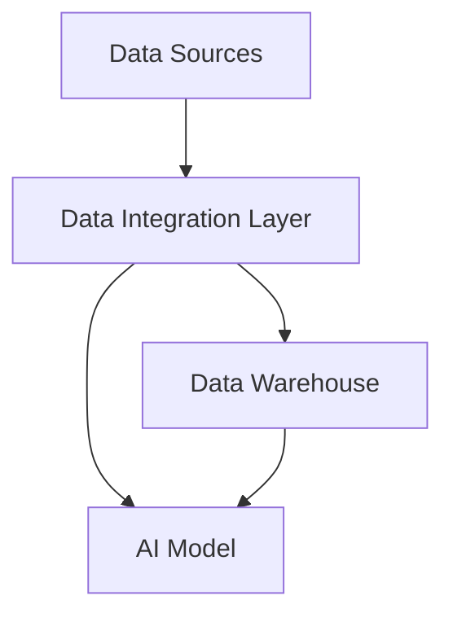

## 16.1.3 Challenges in Integrating AI into Software Systems

The integration of Artificial Intelligence (AI) into software systems presents a unique set of challenges that span technical, operational, and ethical dimensions. As AI technologies continue to evolve, the need to seamlessly incorporate them into existing architectures becomes increasingly crucial. This section delves into the core challenges faced when integrating AI into software systems, offering insights and strategies to overcome these hurdles.

### Technical Challenges in AI Integration

#### Incorporating AI Components into Existing Architectures

Integrating AI components into existing software architectures is a complex task that often requires significant modifications to accommodate AI's unique requirements. Traditional software systems are typically designed with deterministic operations in mind, whereas AI systems introduce probabilistic and data-driven elements. This fundamental difference necessitates a reevaluation of architectural design principles.

- **Modular Design:** To facilitate AI integration, systems should adopt a modular architecture that allows for the seamless addition and replacement of components. This approach enables AI modules to be integrated without disrupting the entire system.
  
- **Scalability:** AI models can be computationally intensive, requiring scalable infrastructure to handle varying workloads. Ensuring that the architecture can scale horizontally (adding more nodes) or vertically (enhancing existing nodes) is crucial.

- **Interoperability:** AI components often rely on diverse technologies and platforms. Ensuring interoperability between these components and the existing system is essential for smooth integration.

#### Data Integration Challenges

Data is the lifeblood of AI systems, and integrating data from various sources presents significant challenges.

- **Data Silos:** Many organizations struggle with data silos, where information is isolated within different departments or systems. Breaking down these silos to provide a unified data source for AI models is a critical step.

- **Inconsistent Data Formats:** Data from different sources may be in varying formats, requiring normalization and transformation processes to ensure consistency and usability.

- **Data Quality and Availability:** AI models require high-quality, relevant data for training and inference. Ensuring data availability and addressing issues such as missing or noisy data are ongoing challenges.

*Figure 1: Data integration process for AI systems.*

### Computational Demands and System Resources

AI models, particularly deep learning models, can be computationally demanding, requiring substantial processing power and memory.

- **Resource Allocation:** Efficiently allocating resources such as CPU, GPU, and memory is critical to ensure optimal AI model performance without degrading other system functions.

- **Infrastructure Costs:** The computational demands of AI can lead to increased infrastructure costs. Organizations must balance performance needs with budget constraints.

- **Energy Consumption:** High computational demands also translate to increased energy consumption, raising concerns about sustainability and operational costs.

### Latency Concerns in Real-Time Applications

Deploying AI models in real-time applications introduces latency concerns that can impact user experience and system performance.

- **Inference Latency:** The time taken for an AI model to process inputs and produce outputs (inference latency) must be minimized to meet real-time application requirements.

- **Network Latency:** In distributed systems, network latency can further exacerbate delays. Strategies such as edge computing can help reduce latency by processing data closer to the source.

### Model Interpretability and Explainability

As AI systems are increasingly used in critical decision-making processes, the need for interpretability and explainability becomes paramount.

- **Black Box Models:** Many AI models, particularly deep learning models, are often considered "black boxes" due to their complex inner workings. This lack of transparency can be a barrier to adoption.

- **Explainable AI (XAI):** Techniques such as feature importance analysis, surrogate models, and visualization tools are employed to make AI models more interpretable.

### Managing AI Model Lifecycle

The lifecycle of an AI model encompasses training, deployment, and monitoring, each presenting its own set of challenges.

- **Model Training:** Training AI models requires access to large datasets and significant computational resources. Ensuring that models are trained on representative data is crucial to avoid bias.

- **Deployment:** Deploying AI models in production environments requires robust infrastructure and processes to ensure reliability and scalability.

- **Monitoring and Maintenance:** Continuous monitoring of AI models is essential to detect issues such as model drift and degradation. Regular updates and retraining are necessary to maintain performance.

### Risks of Overfitting and Model Degradation

AI models are susceptible to overfitting, where they perform well on training data but poorly on unseen data.

- **Regularization Techniques:** Implementing regularization techniques such as dropout, L1/L2 regularization, and early stopping can help mitigate overfitting.

- **Model Degradation:** Over time, AI models can degrade due to changes in the underlying data distribution. Continuous monitoring and retraining are necessary to address this issue.

### Handling Edge Cases and Ensuring Robust Performance

AI systems must be robust enough to handle edge cases and unexpected inputs.

- **Robustness Testing:** Conducting extensive testing to identify and address potential edge cases is crucial to ensure reliable performance.

- **Error Handling:** Implementing effective error handling mechanisms can prevent system failures and ensure graceful degradation in the face of unexpected inputs.

### Ethical Considerations in AI Integration

Ethical considerations play a significant role in the integration of AI into software systems.

- **Bias Mitigation:** AI models can inadvertently perpetuate biases present in training data. Implementing bias detection and mitigation strategies is essential to ensure fairness.

- **Fairness and Transparency:** Ensuring that AI systems operate fairly and transparently is crucial to building trust with users and stakeholders.

### Compliance with Regulations and Standards

As AI technologies become more prevalent, regulatory bodies are establishing standards and guidelines to ensure their safe and ethical use.

- **Data Privacy Regulations:** Compliance with data privacy regulations such as GDPR and CCPA is essential to protect user data and maintain trust.

- **AI Ethics Guidelines:** Adhering to ethical guidelines and standards, such as those proposed by organizations like IEEE and ISO, is critical to responsible AI deployment.

### Integration Challenges Across Platforms and Technologies

AI systems often need to integrate with various platforms and technologies, each presenting unique challenges.

- **Cross-Platform Compatibility:** Ensuring compatibility across different platforms and technologies is crucial for seamless integration.

- **API Integration:** Robust APIs are essential for facilitating communication between AI components and other system elements.

### Logging and Auditing AI Decisions

Logging and auditing AI decisions is crucial for accountability and transparency.

- **Decision Logging:** Implementing logging mechanisms to record AI decisions and their rationale is essential for auditing and compliance purposes.

- **Audit Trails:** Maintaining comprehensive audit trails can help organizations track AI system performance and identify potential issues.

### Failure Modes Unique to AI Systems

AI systems can exhibit unique failure modes that require specialized strategies to address.

- **Model Failures:** AI models can fail due to issues such as data drift, adversarial attacks, and unexpected inputs. Implementing robust monitoring and error handling mechanisms is essential.

- **System Failures:** AI components can introduce new failure points in a system. Conducting thorough testing and validation is crucial to mitigate these risks.

### Cross-Functional Teams for Multidisciplinary Challenges

Addressing the challenges of AI integration requires collaboration across multiple disciplines.

- **Interdisciplinary Collaboration:** Bringing together experts from fields such as data science, software engineering, and ethics can help address the multifaceted challenges of AI integration.

- **Continuous Learning:** Encouraging continuous learning and knowledge sharing among team members is essential to keep pace with the rapidly evolving AI landscape.

### Aligning AI Components with System Architecture

Aligning AI components with the overall system architecture is crucial for successful integration.

- **Architectural Alignment:** Ensuring that AI components align with the system's architectural principles and design patterns is essential for seamless integration.

- **Design Principles:** Adopting design principles such as modularity, scalability, and interoperability can facilitate the integration of AI components.

### Conclusion

Integrating AI into software systems presents a myriad of challenges, ranging from technical and operational to ethical considerations. By understanding and addressing these challenges, organizations can harness the full potential of AI technologies while ensuring robust, ethical, and compliant systems. The journey of AI integration is complex, but with careful planning, interdisciplinary collaboration, and adherence to best practices, it is possible to successfully incorporate AI into existing architectures and drive innovation.

## Quiz Time!



### What is a significant challenge when integrating AI into existing software architectures?

- [x] Ensuring modular design for seamless component addition
- [ ] Reducing the number of system components
- [ ] Increasing system complexity
- [ ] Eliminating the need for data integration

> **Explanation:** Ensuring a modular design allows for the seamless addition and replacement of AI components without disrupting the entire system.

### Why is data integration challenging for AI systems?

- [x] Data silos and inconsistent formats
- [ ] Lack of data sources
- [ ] Overabundance of high-quality data
- [ ] Elimination of data transformation processes

> **Explanation:** Data integration is challenging due to data silos and inconsistent formats, which require normalization and transformation.

### What impact do AI models have on system resources?

- [x] High computational demands and increased infrastructure costs
- [ ] Reduced need for memory and processing power
- [ ] Elimination of energy consumption concerns
- [ ] Decreased infrastructure costs

> **Explanation:** AI models have high computational demands, leading to increased infrastructure costs and energy consumption.

### What is a latency concern in real-time AI applications?

- [x] Inference and network latency
- [ ] Reduced system response time
- [ ] Elimination of data processing time
- [ ] Increased user wait time

> **Explanation:** Inference and network latency are concerns in real-time applications, affecting user experience and system performance.

### How can AI model interpretability be improved?

- [x] Using Explainable AI (XAI) techniques
- [ ] Increasing model complexity
- [x] Employing feature importance analysis
- [ ] Reducing model transparency

> **Explanation:** Explainable AI (XAI) techniques and feature importance analysis help improve AI model interpretability.

### What is a risk associated with AI models over time?

- [x] Model degradation due to data distribution changes
- [ ] Permanent model improvement
- [ ] Elimination of retraining needs
- [ ] Constant model accuracy

> **Explanation:** AI models can degrade over time due to changes in data distribution, necessitating continuous monitoring and retraining.

### Why is ethical consideration important in AI integration?

- [x] To ensure fairness and transparency
- [ ] To increase model complexity
- [x] To mitigate bias
- [ ] To eliminate ethical guidelines

> **Explanation:** Ethical considerations ensure fairness, transparency, and bias mitigation in AI systems.

### What is a challenge in integrating AI across platforms?

- [x] Ensuring cross-platform compatibility
- [ ] Reducing the number of platforms
- [ ] Eliminating API integration
- [ ] Increasing platform isolation

> **Explanation:** Ensuring cross-platform compatibility is crucial for seamless AI integration.

### How can AI decisions be audited?

- [x] Implementing decision logging and audit trails
- [ ] Eliminating logging mechanisms
- [ ] Reducing audit trails
- [ ] Increasing system opacity

> **Explanation:** Implementing decision logging and maintaining audit trails are essential for auditing AI decisions.

### True or False: Cross-functional teams are unnecessary for AI integration.

- [ ] True
- [x] False

> **Explanation:** Cross-functional teams are essential for addressing the multidisciplinary challenges of AI integration.


