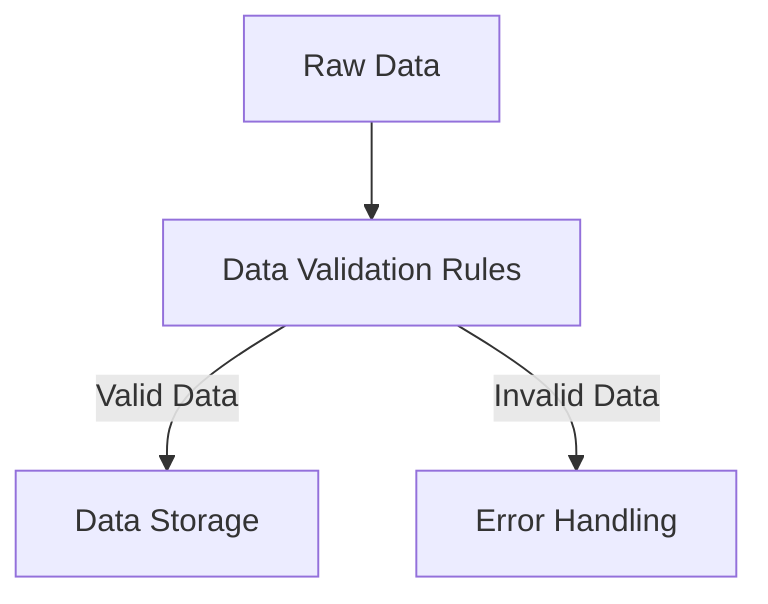

## 16.2.3 Data Validation and Testing Pattern

In the realm of Artificial Intelligence (AI), the quality and integrity of data are paramount. Ensuring that data is valid, consistent, and reliable is a cornerstone of building robust AI systems. This section delves into the Data Validation and Testing Pattern, a critical aspect of AI design that safeguards the reliability and performance of AI models.

### The Importance of Data Validation

Data validation is the process of ensuring that data meets specific quality standards before it is used in model training or inference. It acts as a gatekeeper, filtering out erroneous, inconsistent, or incomplete data that could compromise the integrity of AI models. The importance of data validation cannot be overstated, as it directly impacts:

- **Model Reliability**: Valid data ensures that models are trained on accurate and representative datasets, leading to more reliable predictions.
- **Performance**: High-quality data enhances model performance by reducing noise and improving the signal-to-noise ratio.
- **Fairness and Bias Mitigation**: Validating data helps identify and mitigate biases, promoting fairness in AI systems.
- **Compliance and Ethics**: Adhering to data validation protocols ensures compliance with legal and ethical standards, particularly in sensitive domains.

### Defining Data Quality Rules and Acceptance Criteria

To effectively validate data, it is essential to establish clear data quality rules and acceptance criteria. These rules serve as benchmarks against which data is evaluated. Key considerations include:

- **Completeness**: Ensuring that all required fields are present and populated.
- **Consistency**: Verifying that data is consistent across different datasets and sources.
- **Accuracy**: Checking that data values are correct and within expected ranges.
- **Timeliness**: Ensuring that data is up-to-date and relevant.
- **Uniqueness**: Identifying and removing duplicate records.

By defining these criteria, organizations can systematically assess data quality and make informed decisions about its suitability for use.

### Data Validation Process

The data validation process involves several stages, as illustrated in the following Mermaid.js diagram:



- **Raw Data**: The initial dataset that requires validation.
- **Data Validation Rules**: A set of predefined criteria against which the data is evaluated.
- **Valid Data**: Data that meets the validation criteria and is stored for further processing.
- **Invalid Data**: Data that fails validation and triggers error handling procedures.

### Tools and Libraries for Data Validation

Numerous tools and libraries facilitate data validation, each offering unique features tailored to different needs. Some notable options include:

- **Great Expectations**: An open-source library that provides a flexible framework for defining, executing, and sharing data validation tests.
- **TensorFlow Data Validation (TFDV)**: A library that helps analyze and validate machine learning data to ensure it is clean and consistent.
- **Pandas**: While primarily a data manipulation library, Pandas offers robust validation capabilities through custom functions and assertions.

These tools enable developers to automate data validation processes, ensuring consistency and efficiency.

### Implementing Unit Tests for Data Processing Functions

Unit testing is a fundamental practice in software development, and it extends to data processing functions in AI systems. By implementing unit tests, developers can:

- **Verify Functionality**: Ensure that data processing functions perform as expected under various conditions.
- **Detect Errors Early**: Identify and address issues before they propagate through the system.
- **Facilitate Refactoring**: Safely modify and improve code with confidence that existing functionality is preserved.

Example of a simple unit test for a data validation function in Python using the `unittest` framework:

```python
import unittest

def validate_data(data):
    # Example validation logic
    return data is not None and len(data) > 0

class TestDataValidation(unittest.TestCase):
    def test_validate_data(self):
        self.assertTrue(validate_data([1, 2, 3]))
        self.assertFalse(validate_data([]))
        self.assertFalse(validate_data(None))

if __name__ == '__main__':
    unittest.main()
```

### Testing for Data Schema Consistency

Data schema consistency is crucial for maintaining the integrity of datasets across different stages of the data pipeline. Schema validation involves:

- **Checking Field Names and Types**: Ensuring that fields are correctly named and typed.
- **Verifying Constraints**: Confirming that constraints such as primary keys and foreign keys are respected.
- **Ensuring Compatibility**: Validating that data formats are compatible with downstream systems.

Tools like `JSON Schema` and `Apache Avro` provide robust frameworks for defining and validating data schemas.

### Handling Validation Failures and Stakeholder Notification

When data validation fails, it is important to have a clear strategy for handling these failures and notifying relevant stakeholders. Key strategies include:

- **Logging and Monitoring**: Record validation errors for analysis and troubleshooting.
- **Automated Alerts**: Use automated systems to notify stakeholders of validation issues in real-time.
- **Fallback Mechanisms**: Implement fallback mechanisms to handle invalid data gracefully, such as using default values or excluding problematic records.

### Incorporating Data Validation into Continuous Integration Pipelines

Integrating data validation into continuous integration (CI) pipelines ensures that data quality checks are performed automatically as part of the development workflow. This integration offers several benefits:

- **Early Detection**: Identify data quality issues early in the development cycle.
- **Consistency**: Maintain consistent data quality standards across different environments.
- **Automation**: Reduce manual effort and increase efficiency through automation.

CI tools like Jenkins, GitLab CI/CD, and Travis CI can be configured to run data validation tests as part of the build process.

### Synthetic Data Generation for Testing Purposes

Synthetic data generation involves creating artificial datasets that mimic real-world data. This approach is particularly useful for:

- **Testing**: Providing controlled datasets for testing data validation functions.
- **Privacy**: Ensuring data privacy by using synthetic data instead of sensitive real-world data.
- **Exploration**: Exploring edge cases and scenarios that may not be present in real-world data.

Libraries like `Faker` and `SDV (Synthetic Data Vault)` offer powerful tools for generating synthetic data.

### Validating Unstructured Data

Validating unstructured data, such as text or images, presents unique challenges. Key considerations include:

- **Text Data**: Use natural language processing (NLP) techniques to validate text data, such as checking for language consistency or detecting spam.
- **Image Data**: Validate image data by checking for resolution, format, and content quality.
- **Audio and Video**: Ensure that audio and video data meet quality standards, such as bitrate and format.

Specialized libraries and frameworks, such as `spaCy` for text and `OpenCV` for images, provide tools for validating unstructured data.

### Impact of Data Quality on Model Performance and Fairness

Data quality has a profound impact on model performance and fairness. Poor data quality can lead to:

- **Biased Models**: Models trained on biased data may produce unfair outcomes.
- **Reduced Accuracy**: Inaccurate or incomplete data can degrade model accuracy.
- **Overfitting**: Noisy data can cause models to overfit, reducing their generalization ability.

Ensuring high data quality is essential for building reliable and fair AI systems.

### Maintaining Comprehensive Data Validation Documentation

Comprehensive documentation is crucial for maintaining transparency and accountability in data validation processes. Key elements of documentation include:

- **Validation Rules**: Clearly define and document data validation rules and criteria.
- **Testing Procedures**: Document testing procedures and results to ensure reproducibility.
- **Error Logs**: Maintain detailed logs of validation errors and resolutions.

Documentation serves as a valuable resource for stakeholders and helps ensure consistent data quality practices.

### Statistical Methods for Anomaly Detection and Distribution Shifts

Statistical methods play a key role in detecting anomalies and distribution shifts in data. Techniques such as:

- **Z-Score Analysis**: Identify outliers by measuring the number of standard deviations a data point is from the mean.
- **Chi-Square Test**: Assess the independence of categorical variables.
- **Kolmogorov-Smirnov Test**: Compare the distribution of two datasets to detect shifts.

These methods help identify potential issues in data quality that may impact model performance.

### Integrating Data Validation with Model Training Workflows

Integrating data validation with model training workflows ensures that only high-quality data is used for training. This integration involves:

- **Pre-Training Validation**: Validate data before it enters the training pipeline.
- **Real-Time Validation**: Continuously validate incoming data in real-time systems.
- **Feedback Loops**: Implement feedback loops to refine data validation rules based on model performance.

By integrating data validation with model training, organizations can enhance model reliability and performance.

### Ongoing Data Validation in Production Environments

Data validation is not a one-time task but an ongoing process, especially in production environments. Key practices include:

- **Monitoring**: Continuously monitor data quality metrics and validation results.
- **Alerting**: Set up alerts to notify stakeholders of validation issues.
- **Adaptation**: Regularly update validation rules to adapt to changing data landscapes.

Ongoing validation ensures that AI systems remain reliable and performant over time.

### Conclusion

Data validation and testing are critical components of AI design patterns, ensuring that models are built on a foundation of high-quality data. By implementing robust data validation processes, organizations can improve model reliability, performance, and fairness. As AI systems continue to evolve, ongoing data validation will remain a key factor in their success.

## Quiz Time!



### Why is data validation important in AI systems?

- [x] It ensures model reliability and performance.
- [ ] It increases the size of the dataset.
- [ ] It reduces the need for data preprocessing.
- [ ] It eliminates the need for model training.

> **Explanation:** Data validation ensures that the data used for training AI models is accurate, consistent, and reliable, which directly impacts model reliability and performance.

### What is a key benefit of defining data quality rules?

- [x] They provide benchmarks for assessing data quality.
- [ ] They eliminate the need for data storage.
- [ ] They increase data processing speed.
- [ ] They reduce the complexity of data models.

> **Explanation:** Data quality rules serve as benchmarks to evaluate whether data meets the necessary standards for use in AI systems.

### What does the Mermaid.js diagram illustrate in the context of data validation?

- [x] The flow of data through validation, storage, and error handling.
- [ ] The process of model training.
- [ ] The architecture of a neural network.
- [ ] The steps in a CI/CD pipeline.

> **Explanation:** The diagram illustrates how raw data is processed through validation rules, leading to either data storage or error handling based on the validation outcome.

### Which tool is specifically designed for data validation in machine learning?

- [ ] Pandas
- [x] TensorFlow Data Validation (TFDV)
- [ ] Matplotlib
- [ ] NumPy

> **Explanation:** TensorFlow Data Validation (TFDV) is a library specifically designed to analyze and validate machine learning data.

### What is a primary use of synthetic data generation?

- [x] Providing controlled datasets for testing.
- [ ] Increasing the amount of real-world data.
- [ ] Reducing data processing time.
- [ ] Improving data visualization.

> **Explanation:** Synthetic data generation creates artificial datasets that mimic real-world data, providing controlled environments for testing and experimentation.

### What is a challenge in validating unstructured data?

- [x] Ensuring consistency in text or image quality.
- [ ] Increasing the volume of data.
- [ ] Reducing data processing speed.
- [ ] Simplifying data models.

> **Explanation:** Validating unstructured data, such as text or images, involves ensuring consistency and quality, which can be challenging due to the diverse nature of the data.

### How can data validation be integrated into CI pipelines?

- [x] By automating validation tests as part of the build process.
- [ ] By manually reviewing data after each build.
- [ ] By increasing the frequency of model training.
- [ ] By reducing the number of validation rules.

> **Explanation:** Integrating data validation into CI pipelines involves automating validation tests to ensure data quality is consistently maintained throughout the development process.

### What is the impact of poor data quality on AI models?

- [x] It can lead to biased models and reduced accuracy.
- [ ] It increases the speed of model training.
- [ ] It simplifies data preprocessing.
- [ ] It enhances model fairness.

> **Explanation:** Poor data quality can result in biased models and reduced accuracy, negatively impacting the performance and fairness of AI systems.

### What statistical method can detect distribution shifts?

- [ ] Linear Regression
- [ ] K-Means Clustering
- [x] Kolmogorov-Smirnov Test
- [ ] Decision Trees

> **Explanation:** The Kolmogorov-Smirnov Test is a statistical method used to compare the distribution of two datasets, helping to detect shifts that may affect model performance.

### True or False: Data validation is a one-time task performed before model training.

- [ ] True
- [x] False

> **Explanation:** Data validation is an ongoing process, especially in production environments, to ensure continuous data quality and model reliability.


