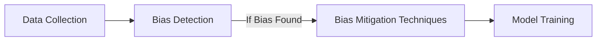

## 16.4.1 Bias Detection and Mitigation Pattern

In the realm of Artificial Intelligence (AI), the Bias Detection and Mitigation Pattern is a crucial design pattern aimed at identifying and reducing biases in AI systems. This pattern is essential for ensuring that AI models are fair, ethical, and do not inadvertently perpetuate or amplify societal biases. In this section, we will delve into how bias can infiltrate AI systems, the societal consequences of biased AI, methods for detecting and mitigating bias, and the legal and ethical considerations involved.

### Understanding Bias in AI Systems

Bias in AI systems can originate from two primary sources: data and algorithms. Understanding these sources is the first step in addressing bias.

#### Data-Driven Bias

- **Historical Bias**: Data often reflects historical inequalities and prejudices. For example, if a hiring dataset predominantly features male candidates, an AI model trained on this data might favor male candidates.
- **Sampling Bias**: This occurs when the data collected is not representative of the entire population. For instance, a facial recognition system trained primarily on Caucasian faces may perform poorly on individuals of other ethnicities.
- **Measurement Bias**: This arises when the data collected is flawed or incomplete, leading to inaccurate model predictions. An example is using proxy variables that do not adequately capture the intended concept.

#### Algorithmic Bias

- **Model Assumptions**: Algorithms may incorporate assumptions that inadvertently lead to biased outcomes. For example, assuming linear relationships in data that are inherently non-linear can skew results.
- **Feature Selection**: The choice of features used in model training can introduce bias. Features that correlate with sensitive attributes, such as race or gender, can lead to biased predictions.
- **Optimization Objectives**: Algorithms are often optimized for accuracy, which may not account for fairness. This can result in models that perform well overall but poorly for specific subgroups.

### Consequences of Biased AI Models

The impact of biased AI models can be profound, affecting individuals and society at large. Some of the key consequences include:

- **Discrimination**: Biased models can lead to discriminatory practices, such as denying loans or job opportunities based on race, gender, or other protected attributes.
- **Loss of Trust**: If AI systems are perceived as biased, public trust in AI technology can erode, hindering its adoption and potential benefits.
- **Legal Repercussions**: Organizations deploying biased AI systems may face legal challenges, particularly if they violate anti-discrimination laws.
- **Reinforcement of Inequality**: Biased AI systems can perpetuate and even exacerbate existing societal inequalities, leading to unfair treatment of marginalized groups.

### Detecting Bias in AI Systems

Detecting bias is a critical step in the Bias Detection and Mitigation Pattern. It involves analyzing datasets and model outputs to identify potential biases.

#### Methods for Bias Detection

1. **Statistical Analysis**: Use statistical methods to analyze datasets for imbalances. For example, check the distribution of different demographic groups in the training data.
2. **Fairness Metrics**: Evaluate model outputs using fairness metrics such as demographic parity, equal opportunity, and disparate impact.
3. **Visualizations**: Create visualizations to identify patterns that may indicate bias. For instance, confusion matrices can reveal disparities in model performance across different groups.
4. **Cross-Validation**: Perform cross-validation to assess model performance across various subgroups, ensuring consistent accuracy and fairness.

### Bias Mitigation Techniques

Once bias is detected, the next step is to mitigate it. Several techniques can be employed to address bias in AI systems:

#### Re-sampling and Re-weighting

- **Re-sampling**: Adjust the dataset to ensure a balanced representation of different groups. This can involve oversampling underrepresented groups or undersampling overrepresented ones.
- **Re-weighting**: Assign different weights to samples based on their group membership to ensure fair representation during model training.

#### Adversarial Debiasing

- **Adversarial Networks**: Use adversarial networks to reduce bias. These networks train a model to make predictions while simultaneously training an adversary to detect bias, encouraging the model to produce unbiased outputs.

#### Fair Representation Learning

- **Transform Features**: Learn fair representations of the data that are invariant to sensitive attributes, ensuring that the model's decisions are not based on biased features.

#### Post-Processing Techniques

- **Adjust Predictions**: Modify model predictions to achieve fairness. For example, apply thresholds to ensure equal opportunity across different groups.

### The Importance of Diverse and Representative Data

A fundamental aspect of mitigating bias is ensuring that the data used to train AI models is diverse and representative of the population. This involves:

- **Inclusive Data Collection**: Collect data from diverse sources to capture a wide range of perspectives and experiences.
- **Regular Audits**: Conduct regular audits of datasets to identify and address any imbalances or biases.
- **Collaboration with Domain Experts**: Involve domain experts in the data collection process to identify potential biases and ensure data quality.

### Legal and Ethical Obligations

Organizations deploying AI systems have legal and ethical obligations to ensure fairness and non-discrimination. This includes:

- **Compliance with Anti-Discrimination Laws**: Ensure that AI systems comply with relevant laws and regulations, such as the Equal Credit Opportunity Act (ECOA) in the United States.
- **Ethical Guidelines**: Adhere to ethical guidelines and principles, such as the AI Ethics Guidelines set forth by organizations like the European Commission.

### Evaluating Models Using Fairness Metrics

Evaluating models using fairness metrics is essential for ensuring that they are unbiased and equitable. Some common fairness metrics include:

- **Demographic Parity**: Ensures that the model's predictions are independent of sensitive attributes.
- **Equal Opportunity**: Ensures that the model has equal true positive rates across different groups.
- **Disparate Impact**: Measures the ratio of positive outcomes between different groups, ensuring that no group is disproportionately affected.

### Transparency and Reporting

Transparency in reporting model performance across different groups is crucial for building trust and accountability. This involves:

- **Detailed Reporting**: Provide detailed reports on model performance, including fairness metrics and subgroup analysis.
- **Open Communication**: Communicate the limitations and potential biases of AI systems to stakeholders and users.

### Continuous Monitoring and Addressing Bias

Bias detection and mitigation is not a one-time process but a continuous effort. Organizations should:

- **Implement Monitoring Systems**: Use monitoring systems to track model performance and detect any emerging biases.
- **Iterative Improvements**: Continuously update models and datasets to address biases and improve fairness.
- **Feedback Loops**: Establish feedback loops to gather input from users and stakeholders, using it to refine AI systems.

### Tools and Frameworks for Bias Detection and Mitigation

Several tools and frameworks can assist in bias detection and mitigation, including:

- **AI Fairness 360 (AIF360)**: An open-source toolkit by IBM that provides metrics and algorithms for bias detection and mitigation.
- **Fairness Indicators**: A library by TensorFlow that helps evaluate the fairness of machine learning models.
- **Themis-ML**: A Python library that provides tools for fairness-aware machine learning.

### Balancing Fairness with Accuracy

Balancing fairness with accuracy and other performance metrics is a common challenge in AI development. It requires:

- **Trade-off Analysis**: Analyze trade-offs between fairness and accuracy, considering the specific context and goals of the AI system.
- **Stakeholder Engagement**: Engage stakeholders in discussions about fairness and accuracy to align on priorities and values.

### Organizational Policies and Ethical AI Practices

Promoting ethical AI practices requires strong organizational policies and a commitment to fairness. This involves:

- **Developing Ethical Guidelines**: Establish clear ethical guidelines for AI development and deployment.
- **Training and Education**: Provide training and education on bias and fairness for team members involved in AI projects.
- **Leadership Commitment**: Ensure that organizational leaders are committed to ethical AI practices and hold teams accountable.

### Education and Training on Bias

Education and training are essential for raising awareness and understanding of bias in AI. Organizations should:

- **Conduct Workshops and Seminars**: Organize workshops and seminars on bias detection and mitigation for employees.
- **Develop Educational Materials**: Create educational materials and resources to help team members understand and address bias.
- **Encourage Continuous Learning**: Foster a culture of continuous learning and improvement in AI ethics and fairness.

### Conclusion

The Bias Detection and Mitigation Pattern is a vital component of ethical AI design. By understanding the sources and consequences of bias, employing effective detection and mitigation techniques, and adhering to legal and ethical obligations, organizations can develop AI systems that are fair, equitable, and trustworthy. This pattern not only enhances the performance and reliability of AI systems but also promotes social justice and equality.

### Visualizing the Bias Mitigation Workflow

Below is a Mermaid.js diagram illustrating the bias mitigation workflow:

This diagram highlights the iterative process of collecting data, detecting bias, applying mitigation techniques, and retraining models to ensure fairness and accuracy.

## Quiz Time!



### What are the primary sources of bias in AI systems?

- [x] Data and algorithms
- [ ] User interfaces and hardware
- [ ] Network infrastructure and protocols
- [ ] Cloud services and storage

> **Explanation:** Bias in AI systems primarily stems from data (e.g., historical and sampling bias) and algorithms (e.g., model assumptions and feature selection).

### Which of the following is a consequence of biased AI models?

- [x] Discrimination
- [ ] Improved accuracy
- [ ] Increased trust
- [ ] Enhanced user experience

> **Explanation:** Biased AI models can lead to discrimination, eroding trust and potentially violating legal and ethical standards.

### What is a common method for detecting bias in datasets?

- [x] Statistical analysis
- [ ] Data encryption
- [ ] Cloud storage
- [ ] User feedback

> **Explanation:** Statistical analysis helps identify imbalances and biases in datasets, facilitating bias detection.

### What technique involves adjusting datasets to ensure balanced representation?

- [x] Re-sampling
- [ ] Data encryption
- [ ] Model pruning
- [ ] Feature extraction

> **Explanation:** Re-sampling adjusts datasets to ensure balanced representation of different groups, mitigating bias.

### Which fairness metric ensures equal true positive rates across groups?

- [x] Equal Opportunity
- [ ] Demographic Parity
- [ ] Disparate Impact
- [ ] Precision

> **Explanation:** Equal Opportunity ensures that the model has equal true positive rates across different groups.

### What is the role of adversarial networks in bias mitigation?

- [x] Reducing bias by training models to produce unbiased outputs
- [ ] Increasing model accuracy
- [ ] Enhancing data security
- [ ] Improving user interface design

> **Explanation:** Adversarial networks help reduce bias by training models to produce unbiased outputs while an adversary detects bias.

### Why is transparency in reporting model performance important?

- [x] It builds trust and accountability
- [ ] It increases model complexity
- [ ] It enhances data security
- [ ] It improves user interface design

> **Explanation:** Transparency in reporting model performance builds trust and accountability, ensuring stakeholders are informed about model fairness.

### What is a challenge in balancing fairness with accuracy?

- [x] Trade-off analysis
- [ ] Data encryption
- [ ] Model pruning
- [ ] Feature extraction

> **Explanation:** Balancing fairness with accuracy involves trade-off analysis, considering the specific context and goals of the AI system.

### Which tool assists in bias detection and mitigation?

- [x] AI Fairness 360
- [ ] TensorFlow Lite
- [ ] Apache Kafka
- [ ] Docker

> **Explanation:** AI Fairness 360 is an open-source toolkit that provides metrics and algorithms for bias detection and mitigation.

### True or False: Bias detection and mitigation is a one-time process.

- [ ] True
- [x] False

> **Explanation:** Bias detection and mitigation is a continuous process, requiring regular monitoring and updates to ensure fairness.


