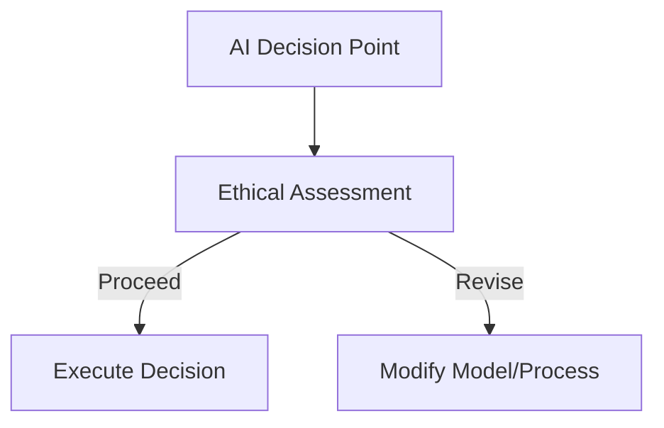

## 16.4.3 Ethical Decision-Making Framework Pattern

In the rapidly evolving landscape of artificial intelligence (AI), embedding ethical considerations into decision-making processes is not just a moral imperative but also a strategic necessity. As AI systems increasingly influence various aspects of our lives, ensuring that they operate within ethical boundaries is crucial for maintaining public trust and promoting responsible innovation. This section delves into the Ethical Decision-Making Framework Pattern, providing comprehensive guidance on developing and implementing ethical frameworks that align with organizational values, assess stakeholder impact, and foster transparency and accountability.

### Importance of Embedding Ethical Considerations

AI systems are powerful tools that can drive significant benefits across industries. However, their potential for harm, whether through bias, privacy violations, or unintended consequences, necessitates a careful approach to their design and deployment. Embedding ethical considerations into AI decision-making processes serves several critical purposes:

- **Mitigating Risks:** By proactively addressing ethical concerns, organizations can reduce the risk of negative outcomes, such as discrimination or data breaches, which can lead to legal and reputational damage.
- **Enhancing Trust:** Transparent and accountable AI systems foster trust among users, stakeholders, and the public, which is essential for widespread adoption and acceptance.
- **Aligning with Values:** An ethical framework ensures that AI systems align with organizational values and societal norms, contributing to a positive impact on communities and the environment.

### Developing an Ethical Framework

Creating an ethical framework for AI involves a structured approach that aligns with an organization's core values and operational context. Here are key steps to consider:

1. **Define Ethical Principles:** Begin by articulating the ethical principles that will guide AI development and deployment. These principles should reflect the organization's mission and values, as well as broader societal expectations.

2. **Establish Governance Structures:** Implement governance mechanisms, such as ethics review boards or committees, to oversee AI projects and ensure compliance with ethical standards.

3. **Integrate Stakeholder Input:** Engage diverse stakeholders, including employees, customers, and external experts, to gather insights and perspectives on ethical considerations.

4. **Assess Ethical Implications:** Conduct thorough assessments of potential ethical implications for each AI project, considering factors such as fairness, transparency, accountability, and privacy.

5. **Document Decisions:** Maintain comprehensive documentation of ethical deliberations and decisions, providing a clear rationale for the chosen course of action.

6. **Implement Oversight Mechanisms:** Establish oversight mechanisms to monitor AI systems post-deployment, ensuring ongoing compliance with ethical standards.

### Assessing Stakeholder Impact

Understanding the potential impact of AI decisions on stakeholders is a critical component of ethical decision-making. This involves:

- **Identifying Stakeholders:** Map out all relevant stakeholders, including direct users, affected communities, and regulatory bodies.
- **Analyzing Impact:** Evaluate how AI decisions may affect each stakeholder group, considering both positive and negative consequences.
- **Balancing Interests:** Strive to balance competing interests and address potential conflicts through dialogue and negotiation.

### Ethical Decision-Making Process

The ethical decision-making process can be visualized using the following Mermaid.js diagram:

- **AI Decision Point:** The starting point where a decision is required in the AI system.
- **Ethical Assessment:** A critical evaluation of the decision's ethical implications, involving stakeholder input and alignment with ethical principles.
- **Proceed:** If the decision passes the ethical assessment, it is executed.
- **Revise:** If ethical concerns are identified, the model or process is modified to address these issues before proceeding.

### Addressing Ethical Dilemmas

AI systems often encounter ethical dilemmas, such as balancing privacy with data utility or ensuring fairness across diverse user groups. Addressing these dilemmas requires:

- **Scenario Analysis:** Explore various scenarios and outcomes to understand the ethical trade-offs involved.
- **Ethical Guidelines:** Refer to established ethical guidelines and standards, such as the IEEE Ethically Aligned Design, to inform decision-making.
- **Iterative Evaluation:** Continuously evaluate and refine AI systems to adapt to evolving ethical challenges.

### Role of Transparency and Accountability

Transparency and accountability are foundational to ethical AI. They involve:

- **Open Communication:** Clearly communicate AI system capabilities, limitations, and decision-making processes to stakeholders.
- **Accountability Mechanisms:** Implement mechanisms to hold AI developers and operators accountable for ethical breaches or unintended consequences.

### Oversight Mechanisms and Diverse Perspectives

Implementing oversight mechanisms, such as ethics review boards, ensures that ethical considerations are systematically addressed. Involving diverse perspectives in ethical evaluations enhances the robustness and inclusivity of decision-making processes.

### Ethical AI Guidelines and Standards

Adhering to ethical AI guidelines and standards, such as those developed by IEEE, ISO, or national bodies, provides a structured framework for ethical decision-making. These standards offer best practices and benchmarks for responsible AI development.

### Documenting Ethical Considerations

Documenting ethical considerations and decisions is essential for transparency and accountability. It provides a record of the ethical deliberations and justifications for stakeholders and regulatory bodies.

### Training AI Systems with Ethical Norms

Training AI systems to align with ethical norms involves:

- **Bias Mitigation:** Implement techniques to identify and mitigate bias in AI models.
- **Ethical Training Data:** Use ethically sourced and representative training data to minimize bias and ensure fairness.
- **Continuous Learning:** Update AI systems with new ethical insights and guidelines as they emerge.

### Challenges of Encoding Ethical Principles

Encoding complex ethical principles into algorithms presents challenges, such as:

- **Ambiguity:** Ethical principles can be subjective and context-dependent, making them difficult to encode precisely.
- **Dynamic Contexts:** AI systems operate in dynamic environments where ethical considerations may evolve over time.

### Encouraging Ongoing Dialogue and Education

Fostering a culture of ongoing dialogue and education on ethics within AI teams is vital. This includes:

- **Workshops and Training:** Conduct regular workshops and training sessions on AI ethics and responsible innovation.
- **Cross-Disciplinary Collaboration:** Encourage collaboration between AI developers, ethicists, and domain experts to address ethical challenges.

### Impact of Ethical AI Practices on Public Trust

Ethical AI practices significantly impact public trust and acceptance. By demonstrating a commitment to ethical principles, organizations can build stronger relationships with stakeholders and enhance their reputation.

### Resources for Further Learning

For those interested in exploring AI ethics further, consider the following resources:

- **Books:** "Weapons of Math Destruction" by Cathy O'Neil, "Artificial Intelligence: A Guide to Intelligent Systems" by Michael Negnevitsky.
- **Online Courses:** Coursera's "AI Ethics: Global Perspectives" and edX's "Ethics of AI."
- **Articles and Journals:** IEEE's "Ethics in AI" series and the Journal of AI Research.

By embedding ethical considerations into AI decision-making processes, organizations can navigate the complex landscape of AI ethics, ensuring their systems are responsible, transparent, and aligned with societal values.

## Quiz Time!



### What is the primary goal of embedding ethical considerations into AI decision-making processes?

- [x] To mitigate risks and enhance trust
- [ ] To increase computational efficiency
- [ ] To reduce the cost of AI systems
- [ ] To enhance data collection capabilities

> **Explanation:** Embedding ethical considerations helps mitigate risks and enhance trust among users and stakeholders.

### Which of the following is a key step in developing an ethical framework for AI?

- [x] Establishing governance structures
- [ ] Increasing data collection
- [ ] Enhancing algorithm complexity
- [ ] Reducing model size

> **Explanation:** Establishing governance structures is crucial for overseeing AI projects and ensuring ethical compliance.

### What is the role of transparency in ethical AI?

- [x] To ensure open communication about AI capabilities and limitations
- [ ] To increase the speed of AI decision-making
- [ ] To enhance data storage efficiency
- [ ] To reduce the cost of AI deployment

> **Explanation:** Transparency involves open communication about AI capabilities and limitations, fostering trust and accountability.

### What should organizations document to ensure transparency and accountability in AI?

- [x] Ethical considerations and decisions
- [ ] Algorithmic code only
- [ ] Data collection methods only
- [ ] Hardware specifications

> **Explanation:** Documenting ethical considerations and decisions provides a clear record for stakeholders and regulatory bodies.

### How can organizations address ethical dilemmas in AI?

- [x] By conducting scenario analysis and referring to ethical guidelines
- [ ] By increasing algorithm complexity
- [ ] By reducing stakeholder engagement
- [ ] By minimizing data usage

> **Explanation:** Scenario analysis and ethical guidelines help organizations navigate ethical dilemmas effectively.

### What is a challenge in encoding ethical principles into AI algorithms?

- [x] Ambiguity and dynamic contexts
- [ ] Lack of computational resources
- [ ] Excessive data availability
- [ ] High algorithmic complexity

> **Explanation:** Ethical principles can be ambiguous and context-dependent, posing challenges for precise encoding.

### Why is involving diverse perspectives important in ethical evaluations?

- [x] To enhance the robustness and inclusivity of decision-making
- [ ] To increase algorithmic speed
- [ ] To reduce data redundancy
- [ ] To simplify model architectures

> **Explanation:** Diverse perspectives enhance the robustness and inclusivity of ethical decision-making processes.

### What is a benefit of ethical AI practices on public trust?

- [x] Building stronger relationships with stakeholders
- [ ] Increasing computational power
- [ ] Reducing data storage needs
- [ ] Enhancing algorithm complexity

> **Explanation:** Ethical AI practices build stronger relationships with stakeholders, enhancing public trust.

### Which resource is recommended for further learning on AI ethics?

- [x] "Weapons of Math Destruction" by Cathy O'Neil
- [ ] "Introduction to Algorithms" by Cormen et al.
- [ ] "Data Science for Business" by Provost and Fawcett
- [ ] "The Pragmatic Programmer" by Hunt and Thomas

> **Explanation:** "Weapons of Math Destruction" is a recommended book for exploring AI ethics.

### True or False: Transparency and accountability are foundational to ethical AI.

- [x] True
- [ ] False

> **Explanation:** Transparency and accountability are essential for ethical AI, fostering trust and responsible innovation.


