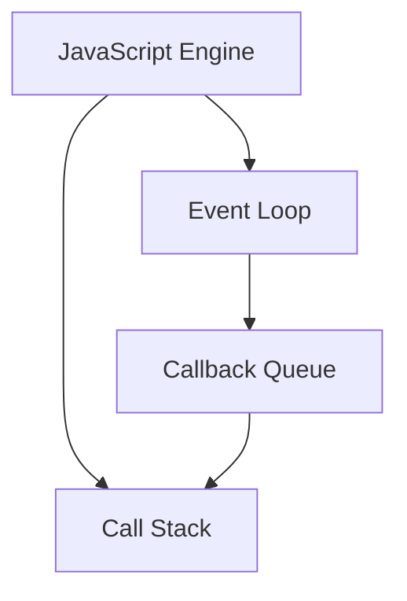

## A.1.3 JavaScript and TypeScript Features

JavaScript and TypeScript are two of the most popular languages in web development today. They offer a rich set of features that enable developers to write efficient, maintainable, and scalable code. In this article, we will explore the key features of both languages, discuss how they impact coding practices, and provide insights into transitioning from JavaScript to TypeScript.

### Key Features of JavaScript

JavaScript is a versatile, high-level programming language that is essential for web development. Over the years, it has evolved significantly, introducing a variety of features that enhance its functionality and usability.

#### Closures

Closures are a fundamental concept in JavaScript that allows functions to access variables from an enclosing scope even after the outer function has finished executing. This feature is particularly useful for creating private variables and functions.

```javascript
function createCounter() {
  let count = 0;
  return function() {
    count++;
    return count;
  };
}

const counter = createCounter();
console.log(counter()); // 1
console.log(counter()); // 2
```

In this example, the inner function maintains access to the `count` variable, demonstrating how closures can encapsulate data.

#### Prototypes

JavaScript uses prototypes to achieve inheritance. Every object in JavaScript has a prototype, which is another object from which it inherits properties and methods.

```javascript
function Person(name) {
  this.name = name;
}

Person.prototype.greet = function() {
  console.log(`Hello, my name is ${this.name}`);
};

const alice = new Person('Alice');
alice.greet(); // Hello, my name is Alice
```

Prototypal inheritance allows objects to share behavior without duplicating code, making it a powerful feature for building complex applications.

#### First-Class Functions

In JavaScript, functions are first-class citizens, meaning they can be assigned to variables, passed as arguments, and returned from other functions.

```javascript
const add = (a, b) => a + b;
const operate = (operation, x, y) => operation(x, y);

console.log(operate(add, 5, 3)); // 8
```

This flexibility enables functional programming techniques and enhances the expressiveness of the language.

### TypeScript: Enhancing JavaScript with Static Typing

TypeScript is a superset of JavaScript that introduces static typing and other features to improve code quality and developer productivity.

#### Static Typing

One of the most significant features of TypeScript is its static type system, which allows developers to define types for variables, function parameters, and return values.

```typescript
function greet(name: string): string {
  return `Hello, ${name}`;
}

console.log(greet('Alice')); // Hello, Alice
```

Static typing helps catch errors at compile time, reducing runtime errors and improving code reliability.

#### Interfaces and Abstract Classes

TypeScript provides interfaces and abstract classes to define contracts and enforce consistency across different parts of an application.

```typescript
interface Animal {
  name: string;
  speak(): void;
}

class Dog implements Animal {
  name: string;
  constructor(name: string) {
    this.name = name;
  }
  speak() {
    console.log('Woof!');
  }
}
```

Interfaces define the shape of an object, while abstract classes can provide shared behavior for subclasses.

#### Generics

Generics in TypeScript allow developers to create reusable components that work with any data type.

```typescript
function identity<T>(arg: T): T {
  return arg;
}

console.log(identity<number>(42)); // 42
console.log(identity<string>('Hello')); // Hello
```

Generics enhance code reusability and type safety, making it easier to build flexible and maintainable applications.

#### Enums

Enums provide a way to define a set of named constants, improving code readability and maintainability.

```typescript
enum Direction {
  Up,
  Down,
  Left,
  Right
}

function move(direction: Direction) {
  console.log(`Moving ${Direction[direction]}`);
}

move(Direction.Up); // Moving Up
```

Enums are particularly useful for representing a fixed set of values, such as directions or states.

#### Decorators

Decorators are a powerful feature in TypeScript that allow developers to modify classes and their members at design time.

```typescript
function log(target: any, key: string) {
  const originalMethod = target[key];
  target[key] = function(...args: any[]) {
    console.log(`Calling ${key} with`, args);
    return originalMethod.apply(this, args);
  };
}

class Calculator {
  @log
  add(a: number, b: number): number {
    return a + b;
  }
}

const calculator = new Calculator();
calculator.add(2, 3); // Calling add with [2, 3]
```

Decorators enable aspect-oriented programming, allowing cross-cutting concerns to be separated from business logic.

### Benefits of Using TypeScript in Large-Scale Applications

TypeScript offers several advantages for large-scale applications:

- **Improved Code Quality:** Static typing helps catch errors early, reducing bugs and improving code reliability.
- **Better Tooling:** TypeScript's type system enables advanced IDE features like autocompletion, refactoring, and navigation.
- **Scalability:** TypeScript's features, such as interfaces and generics, make it easier to manage complex codebases.
- **Interoperability:** TypeScript seamlessly integrates with existing JavaScript code, allowing gradual adoption.

### Modern JavaScript (ES6+) Features

The introduction of ES6 and subsequent versions brought many new features to JavaScript, enhancing its capabilities and improving developer experience.

#### Arrow Functions

Arrow functions provide a concise syntax for writing functions and lexically bind the `this` value.

```javascript
const add = (a, b) => a + b;
```

Arrow functions simplify function expressions and are particularly useful in functional programming.

#### Template Literals

Template literals allow for easier string interpolation and multi-line strings.

```javascript
const name = 'Alice';
console.log(`Hello, ${name}!`); // Hello, Alice!
```

Template literals improve code readability and reduce the need for string concatenation.

#### Destructuring

Destructuring enables unpacking values from arrays or objects into distinct variables.

```javascript
const [x, y] = [1, 2];
const { name, age } = { name: 'Alice', age: 25 };
```

Destructuring simplifies data extraction and enhances code clarity.

#### Modules

Modules provide a way to organize code into separate files, improving maintainability and reusability.

```javascript
// math.js
export const add = (a, b) => a + b;

// app.js
import { add } from './math.js';
console.log(add(2, 3)); // 5
```

Modules facilitate code organization and enable better dependency management.

### Async/Await and Asynchronous Programming

Async/await is a modern syntax for handling asynchronous operations, making code easier to read and write.

```javascript
async function fetchData() {
  try {
    const response = await fetch('https://api.example.com/data');
    const data = await response.json();
    console.log(data);
  } catch (error) {
    console.error('Error fetching data:', error);
  }
}
```

Async/await simplifies asynchronous code by eliminating the need for chaining promises, making it more intuitive and less error-prone.

### Understanding JavaScript's Event Loop and Concurrency Model

JavaScript's event loop is a crucial concept for understanding how asynchronous code is executed. It allows JavaScript to perform non-blocking I/O operations, making it highly efficient for web applications.



The event loop continuously checks the call stack and the callback queue, executing tasks as they become available.

### TypeScript's Type System and Code Reliability

TypeScript's type system enhances code reliability by providing compile-time checks and reducing runtime errors.

- **Type Inference:** TypeScript can automatically infer types, reducing the need for explicit type annotations.
- **Union and Intersection Types:** These allow for more flexible type definitions, accommodating a wider range of values.
- **Type Guards:** These are used to narrow down the type of a variable within a conditional block.

```typescript
function isString(value: any): value is string {
  return typeof value === 'string';
}

function print(value: string | number) {
  if (isString(value)) {
    console.log(`String: ${value}`);
  } else {
    console.log(`Number: ${value}`);
  }
}
```

TypeScript's type system provides a robust framework for building reliable applications.

### Interfaces and Abstract Classes in TypeScript

Interfaces and abstract classes are essential for defining contracts and creating reusable components.

- **Interfaces:** Define the shape of an object and can be implemented by classes.
- **Abstract Classes:** Provide a base class with shared behavior and can define abstract methods to be implemented by subclasses.

```typescript
interface Shape {
  area(): number;
}

abstract class Polygon implements Shape {
  abstract area(): number;
}

class Rectangle extends Polygon {
  constructor(private width: number, private height: number) {
    super();
  }
  area(): number {
    return this.width * this.height;
  }
}
```

These features promote code reuse and consistency across large codebases.

### Transitioning from JavaScript to TypeScript

Transitioning from JavaScript to TypeScript can be a gradual process, allowing teams to adopt TypeScript features incrementally.

- **Start with Type Annotations:** Begin by adding type annotations to existing JavaScript code to catch errors early.
- **Use TypeScript Compiler:** Configure the TypeScript compiler to check for type errors and enforce coding standards.
- **Leverage TypeScript's Features:** Gradually introduce interfaces, generics, and other TypeScript features to improve code quality.

### Compatibility Considerations with TypeScript

When using TypeScript in JavaScript projects, it's essential to consider compatibility issues:

- **Interop with JavaScript Libraries:** TypeScript can seamlessly integrate with JavaScript libraries, but type definitions may be required.
- **Build Process:** Configure the build process to compile TypeScript to JavaScript, ensuring compatibility with existing code.
- **Tooling Support:** Ensure that development tools and IDEs support TypeScript for a smooth transition.

### Staying Updated with Language Developments

JavaScript and TypeScript are continuously evolving, with new features and improvements being introduced regularly. Staying updated with these developments is crucial for leveraging the latest language capabilities.

- **Follow ECMAScript Proposals:** Keep an eye on upcoming ECMAScript proposals to understand future JavaScript features.
- **Engage with the Community:** Participate in developer forums, attend conferences, and contribute to open-source projects to stay informed.
- **Continuous Learning:** Invest in ongoing education through online courses, books, and tutorials to deepen your understanding of the languages.

### Practical Knowledge and Trade-Offs

Demonstrating practical knowledge of JavaScript and TypeScript features is essential for making informed decisions about their use in projects.

- **Code Examples:** Practice writing code examples that showcase the use of closures, prototypes, and TypeScript features.
- **Understand Trade-Offs:** Be prepared to discuss the trade-offs between using JavaScript and TypeScript, such as development speed versus code reliability.
- **Apply Best Practices:** Follow best practices for code organization, error handling, and performance optimization to build robust applications.

### Conclusion

JavaScript and TypeScript offer a rich set of features that empower developers to build modern, scalable applications. By understanding and leveraging these features, developers can improve code quality, enhance productivity, and create more maintainable codebases. Whether you're transitioning from JavaScript to TypeScript or exploring new language features, staying informed and practicing regularly will ensure you remain at the forefront of web development.

## Quiz Time!



### What is a closure in JavaScript?

- [x] A function that retains access to its lexical scope even after the outer function has finished executing
- [ ] A method of achieving inheritance in JavaScript
- [ ] A way to define a set of named constants
- [ ] A feature that allows functions to be passed as arguments

> **Explanation:** A closure is a function that retains access to its lexical scope, allowing it to access variables from an enclosing scope even after the outer function has completed.

### How does TypeScript enhance JavaScript?

- [x] By adding static typing and interfaces
- [ ] By introducing a new syntax for asynchronous programming
- [ ] By providing built-in support for reactive programming
- [ ] By removing the need for prototypes

> **Explanation:** TypeScript enhances JavaScript by adding static typing, interfaces, and other features that improve code quality and developer productivity.

### What is the purpose of TypeScript's generics?

- [x] To create reusable components that work with any data type
- [ ] To define a set of named constants
- [ ] To provide a way to organize code into separate files
- [ ] To simplify asynchronous code

> **Explanation:** Generics in TypeScript allow developers to create reusable components that work with any data type, enhancing code reusability and type safety.

### What is the role of async/await in JavaScript?

- [x] To simplify asynchronous code by eliminating the need for chaining promises
- [ ] To provide a new way to define functions
- [ ] To enable the use of modules in JavaScript
- [ ] To offer a mechanism for handling errors

> **Explanation:** Async/await simplifies asynchronous code by eliminating the need for chaining promises, making it more intuitive and less error-prone.

### How do modules impact code organization in JavaScript?

- [x] They allow code to be organized into separate files, improving maintainability and reusability
- [ ] They provide a way to define a set of named constants
- [ ] They enable the use of closures in JavaScript
- [ ] They simplify asynchronous programming

> **Explanation:** Modules allow code to be organized into separate files, improving maintainability and reusability by facilitating better dependency management.

### What is a key benefit of using TypeScript in large-scale applications?

- [x] Improved code quality through static typing
- [ ] Faster runtime execution
- [ ] Built-in support for reactive programming
- [ ] Simplified syntax for defining functions

> **Explanation:** TypeScript's static typing helps catch errors early, reducing bugs and improving code reliability, which is particularly beneficial in large-scale applications.

### What is the purpose of TypeScript's interfaces?

- [x] To define the shape of an object and enforce consistency across parts of an application
- [ ] To provide a way to define a set of named constants
- [ ] To simplify asynchronous code
- [ ] To enable the use of closures in JavaScript

> **Explanation:** Interfaces in TypeScript define the shape of an object and enforce consistency across different parts of an application by specifying contracts that must be adhered to.

### Why is understanding JavaScript's event loop important?

- [x] It is crucial for understanding how asynchronous code is executed
- [ ] It provides a new way to define functions
- [ ] It simplifies the use of modules in JavaScript
- [ ] It offers a mechanism for handling errors

> **Explanation:** Understanding JavaScript's event loop is crucial for understanding how asynchronous code is executed, as it allows JavaScript to perform non-blocking I/O operations.

### What is a trade-off of using TypeScript over JavaScript?

- [x] Development speed versus code reliability
- [ ] Increased runtime performance
- [ ] Built-in support for reactive programming
- [ ] Simplified syntax for defining functions

> **Explanation:** A trade-off of using TypeScript over JavaScript is development speed versus code reliability. TypeScript's static typing can slow down development but improves code reliability.

### True or False: TypeScript can seamlessly integrate with existing JavaScript code.

- [x] True
- [ ] False

> **Explanation:** True. TypeScript is designed to seamlessly integrate with existing JavaScript code, allowing for gradual adoption and interoperability with JavaScript libraries.


