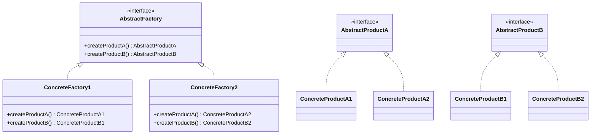

## 2.2.4 Abstract Factory Pattern

In the world of software design, the Abstract Factory Pattern stands out as a sophisticated method for creating families of related objects without specifying their concrete classes. This pattern is a cornerstone of creational design patterns, providing a framework that encapsulates a group of individual factories with a common interface. By doing so, it promotes consistency among products and enhances the scalability of applications.

### Understanding the Abstract Factory Pattern

The Abstract Factory Pattern is used when a system needs to be independent of how its objects are created, composed, and represented. It provides an interface for creating families of related or dependent objects without specifying their concrete classes. This pattern is particularly useful in scenarios where a system must support multiple product variants, such as different themes in a user interface or various database backends.

**Key Characteristics:**
- **Encapsulation of Factories:** The pattern encapsulates a set of factories that create related objects, ensuring that the client code is decoupled from the concrete classes.
- **Product Consistency:** By using a common interface, the pattern ensures that products created by different factories are consistent with each other.
- **Scalability and Flexibility:** The Abstract Factory Pattern allows for easy scalability and flexibility, as new product families can be introduced without altering existing code.

### Structure of the Abstract Factory Pattern

The Abstract Factory Pattern involves several key components:

1. **Abstract Factory Interface:** Declares a set of methods for creating abstract products.
2. **Concrete Factories:** Implement the abstract factory interface to create concrete products.
3. **Abstract Products:** Declare interfaces for a set of related products.
4. **Concrete Products:** Implement the abstract product interfaces.
5. **Client:** Uses the abstract factory to create products. It works with products through their abstract interfaces.

Below is a UML diagram illustrating the structure of the Abstract Factory Pattern:



### Implementing the Abstract Factory Pattern in TypeScript

Let's consider a practical example where we use the Abstract Factory Pattern to create UI components for different operating systems, such as Windows and macOS. Each operating system has its own style of buttons and checkboxes.

#### Step 1: Define Abstract Products

First, we define interfaces for the abstract products:

```typescript
interface Button {
    render(): void;
}

interface Checkbox {
    check(): void;
}
```

#### Step 2: Create Concrete Products

Next, we implement concrete products for each operating system:

```typescript
class WindowsButton implements Button {
    render(): void {
        console.log('Rendering a button in Windows style.');
    }
}

class MacOSButton implements Button {
    render(): void {
        console.log('Rendering a button in macOS style.');
    }
}

class WindowsCheckbox implements Checkbox {
    check(): void {
        console.log('Checking a checkbox in Windows style.');
    }
}

class MacOSCheckbox implements Checkbox {
    check(): void {
        console.log('Checking a checkbox in macOS style.');
    }
}
```

#### Step 3: Define the Abstract Factory Interface

We then define an abstract factory interface for creating these products:

```typescript
interface GUIFactory {
    createButton(): Button;
    createCheckbox(): Checkbox;
}
```

#### Step 4: Implement Concrete Factories

Concrete factories implement the abstract factory interface to create specific products:

```typescript
class WindowsFactory implements GUIFactory {
    createButton(): Button {
        return new WindowsButton();
    }
    createCheckbox(): Checkbox {
        return new WindowsCheckbox();
    }
}

class MacOSFactory implements GUIFactory {
    createButton(): Button {
        return new MacOSButton();
    }
    createCheckbox(): Checkbox {
        return new MacOSCheckbox();
    }
}
```

#### Step 5: Use the Abstract Factory in Client Code

Finally, the client code uses the abstract factory to create products:

```typescript
function createUI(factory: GUIFactory) {
    const button = factory.createButton();
    const checkbox = factory.createCheckbox();
    button.render();
    checkbox.check();
}

// Usage
const windowsFactory = new WindowsFactory();
createUI(windowsFactory);

const macFactory = new MacOSFactory();
createUI(macFactory);
```

### Benefits and Challenges of the Abstract Factory Pattern

#### Benefits
- **Promotes Consistency:** Ensures that products created by different factories are consistent with each other.
- **Enhances Scalability:** New product families can be introduced without altering existing code.
- **Decouples Client Code:** The client code is decoupled from the concrete classes, making it easier to manage and extend.

#### Challenges
- **Increased Complexity:** The pattern introduces additional complexity by requiring multiple classes and interfaces.
- **Overhead:** May introduce unnecessary overhead if the system does not require multiple product families.

### Applicability and Best Practices

The Abstract Factory Pattern is most beneficial in scenarios where:
- A system needs to support multiple product variants.
- Consistency among related products is crucial.
- The system must be scalable and flexible to accommodate future changes.

**Best Practices:**
- **Use Interfaces and Abstract Classes:** Define product families using interfaces and abstract classes to ensure flexibility and consistency.
- **Organize Code Effectively:** Keep factories and products organized in separate modules to manage dependencies and improve maintainability.
- **Test for Consistency:** Implement testing strategies to ensure that product families are correctly instantiated and consistent.

### Testing Strategies

Testing the Abstract Factory Pattern involves ensuring that the correct products are created by each factory and that they behave as expected. Consider the following strategies:

- **Unit Tests:** Write unit tests for each factory method to verify that the correct products are created.
- **Integration Tests:** Test the interaction between different products to ensure consistency.
- **Mocking and Stubbing:** Use mocking and stubbing to isolate tests and simulate different product families.

### Extending and Maintaining the Abstract Factory Pattern

When extending the Abstract Factory Pattern, consider the following:

- **Future Extensions:** Plan for future extensions by designing flexible interfaces and abstract classes.
- **Maintenance:** Regularly refactor and review code to manage complexity and ensure scalability.
- **Documentation:** Maintain clear documentation to aid in understanding and extending the pattern.

### Conclusion

The Abstract Factory Pattern is a powerful tool for creating families of related objects while ensuring consistency and scalability. By encapsulating a group of individual factories, it decouples client code from concrete classes, promoting flexibility and maintainability. However, it is important to carefully consider the pattern's applicability to the problem at hand, as it introduces additional complexity. By following best practices and testing strategies, developers can effectively implement and extend the Abstract Factory Pattern in their applications.

## Quiz Time!



### What is the primary purpose of the Abstract Factory Pattern?

- [x] To create families of related objects without specifying their concrete classes.
- [ ] To provide a single interface for creating an object.
- [ ] To define a one-to-many dependency between objects.
- [ ] To encapsulate the construction of complex objects.

> **Explanation:** The Abstract Factory Pattern is designed to create families of related objects without specifying their concrete classes, promoting consistency and scalability.

### Which component in the Abstract Factory Pattern is responsible for declaring a set of methods for creating abstract products?

- [x] Abstract Factory Interface
- [ ] Concrete Factory
- [ ] Abstract Product
- [ ] Concrete Product

> **Explanation:** The Abstract Factory Interface declares a set of methods for creating abstract products.

### What is a key benefit of using the Abstract Factory Pattern?

- [x] It promotes consistency among products created by different factories.
- [ ] It reduces the number of classes needed in a system.
- [ ] It simplifies the creation of individual objects.
- [ ] It eliminates the need for interfaces.

> **Explanation:** The Abstract Factory Pattern promotes consistency among products created by different factories, ensuring that related products are compatible.

### In the provided TypeScript example, what does the `createUI` function do?

- [x] It uses the factory to create and render UI components.
- [ ] It defines the structure of the UI components.
- [ ] It implements the abstract factory interface.
- [ ] It manages the lifecycle of UI components.

> **Explanation:** The `createUI` function uses the factory to create and render UI components, demonstrating the use of the Abstract Factory Pattern.

### What is a potential challenge when using the Abstract Factory Pattern?

- [x] Increased complexity due to multiple classes and interfaces.
- [ ] Difficulty in creating new instances of objects.
- [ ] Lack of flexibility in changing product families.
- [ ] Inability to support multiple product variants.

> **Explanation:** The Abstract Factory Pattern introduces increased complexity due to the need for multiple classes and interfaces, which can be challenging to manage.

### How does the Abstract Factory Pattern enhance scalability?

- [x] By allowing new product families to be introduced without altering existing code.
- [ ] By reducing the number of dependencies in the system.
- [ ] By simplifying the creation of complex objects.
- [ ] By eliminating the need for concrete classes.

> **Explanation:** The Abstract Factory Pattern enhances scalability by allowing new product families to be introduced without altering existing code, making it easier to extend the system.

### What is the role of concrete factories in the Abstract Factory Pattern?

- [x] To implement the abstract factory interface and create specific products.
- [ ] To declare interfaces for related products.
- [ ] To use the abstract factory to create products.
- [ ] To manage the lifecycle of products.

> **Explanation:** Concrete factories implement the abstract factory interface and create specific products, providing the actual implementation for product creation.

### Why is it important to use interfaces and abstract classes in the Abstract Factory Pattern?

- [x] To ensure flexibility and consistency among product families.
- [ ] To simplify the implementation of concrete products.
- [ ] To eliminate the need for concrete classes.
- [ ] To reduce the number of dependencies in the system.

> **Explanation:** Using interfaces and abstract classes ensures flexibility and consistency among product families, allowing for easier extension and maintenance.

### What type of tests are recommended for ensuring product families are correctly instantiated in the Abstract Factory Pattern?

- [x] Unit tests and integration tests
- [ ] Only unit tests
- [ ] Only integration tests
- [ ] Performance tests

> **Explanation:** Both unit tests and integration tests are recommended to ensure that product families are correctly instantiated and behave as expected.

### True or False: The Abstract Factory Pattern can introduce unnecessary overhead if the system does not require multiple product families.

- [x] True
- [ ] False

> **Explanation:** True. The Abstract Factory Pattern can introduce unnecessary overhead if the system does not require multiple product families, as it involves additional complexity and classes.


