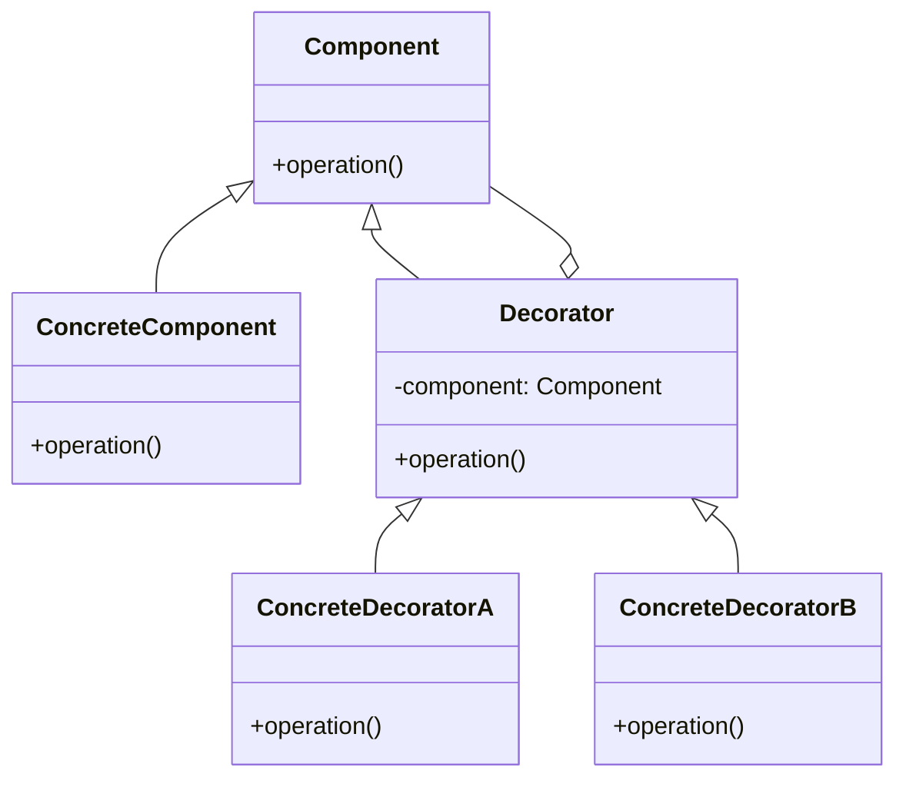

## 3.2.1 Understanding the Decorator Pattern

In the vast landscape of software design patterns, the Decorator pattern stands out as a versatile and dynamic way to add responsibilities to objects. Unlike static inheritance, which can lead to a rigid class hierarchy, the Decorator pattern offers a flexible alternative that enhances objects without modifying their structure. This chapter delves into the intricacies of the Decorator pattern, exploring its structure, benefits, potential challenges, and practical applications in JavaScript and TypeScript.

### The Decorator Pattern Defined

The Decorator pattern is a structural design pattern that allows behavior to be added to individual objects, either statically or dynamically, without affecting the behavior of other objects from the same class. It is particularly useful when you need to add responsibilities to objects without altering their code, thereby adhering to the Open/Closed Principle of software design.

In essence, the Decorator pattern involves a set of decorator classes that are used to wrap concrete components. These decorators add new functionality to the wrapped objects, allowing for the dynamic extension of object behavior.

#### Purpose of the Decorator Pattern

The primary purpose of the Decorator pattern is to provide a flexible alternative to subclassing for extending functionality. Subclassing can lead to a proliferation of classes and a rigid hierarchy, making it difficult to manage and extend. The Decorator pattern, on the other hand, allows you to compose behaviors at runtime, offering a more modular and maintainable approach.

### Real-World Analogies

To better understand the Decorator pattern, consider the analogy of clothing. Imagine you are dressing for a cold day. You start with a basic layer, such as a t-shirt. To add warmth, you might put on a sweater, followed by a jacket. Each layer adds additional functionality (warmth) without altering the fundamental nature of the t-shirt. Similarly, decorators add layers of behavior to objects.

### Structure of the Decorator Pattern

The Decorator pattern is composed of several key elements:

- **Component Interface**: This defines the interface for objects that can have responsibilities added to them dynamically.
- **Concrete Component**: This is the class of objects to which additional responsibilities can be attached.
- **Decorator**: This maintains a reference to a component object and defines an interface that conforms to the component's interface.
- **Concrete Decorators**: These extend the functionality of the component by adding new responsibilities.

The following UML diagram illustrates the structure of the Decorator pattern:



### Implementing the Decorator Pattern

Let's explore how the Decorator pattern can be implemented in JavaScript and TypeScript.

#### JavaScript Example

Consider a simple example where we have a `Coffee` class, and we want to add additional features like milk and sugar without altering the original class.

```javascript
// Component
class Coffee {
    cost() {
        return 5;
    }
}

// Decorator
class CoffeeDecorator {
    constructor(coffee) {
        this.coffee = coffee;
    }

    cost() {
        return this.coffee.cost();
    }
}

// Concrete Decorators
class MilkDecorator extends CoffeeDecorator {
    cost() {
        return super.cost() + 1;
    }
}

class SugarDecorator extends CoffeeDecorator {
    cost() {
        return super.cost() + 0.5;
    }
}

// Usage
let myCoffee = new Coffee();
myCoffee = new MilkDecorator(myCoffee);
myCoffee = new SugarDecorator(myCoffee);

console.log(`Cost of coffee: $${myCoffee.cost()}`); // Output: Cost of coffee: $6.5
```

In this example, `MilkDecorator` and `SugarDecorator` are concrete decorators that add additional cost to the base `Coffee` object.

#### TypeScript Example

TypeScript's type system allows us to define interfaces and ensure that our decorators adhere to the component's interface.

```typescript
// Component Interface
interface Coffee {
    cost(): number;
}

// Concrete Component
class SimpleCoffee implements Coffee {
    cost(): number {
        return 5;
    }
}

// Decorator
class CoffeeDecorator implements Coffee {
    protected coffee: Coffee;

    constructor(coffee: Coffee) {
        this.coffee = coffee;
    }

    cost(): number {
        return this.coffee.cost();
    }
}

// Concrete Decorators
class MilkDecorator extends CoffeeDecorator {
    cost(): number {
        return super.cost() + 1;
    }
}

class SugarDecorator extends CoffeeDecorator {
    cost(): number {
        return super.cost() + 0.5;
    }
}

// Usage
let myCoffee: Coffee = new SimpleCoffee();
myCoffee = new MilkDecorator(myCoffee);
myCoffee = new SugarDecorator(myCoffee);

console.log(`Cost of coffee: $${myCoffee.cost()}`); // Output: Cost of coffee: $6.5
```

### Enhancing Functionality Without Modifying the Original Object

One of the key advantages of the Decorator pattern is its ability to enhance functionality without altering the original object. This is particularly useful in scenarios where you need to extend the behavior of objects in a flexible and reusable manner.

Consider a scenario where you have a logging system. You might start with a basic logger that writes messages to a console. Over time, you may want to add features like writing logs to a file, sending logs to a remote server, or formatting log messages. Using the Decorator pattern, you can add these features incrementally without modifying the base logger.

### Adhering to the Same Interface

A critical aspect of the Decorator pattern is that decorators must adhere to the same interface as the components they wrap. This ensures that decorated objects can be used interchangeably with undecorated ones, maintaining the integrity of the system.

### Benefits of the Decorator Pattern

The Decorator pattern offers several benefits:

- **Flexibility**: It allows for the dynamic composition of behaviors at runtime.
- **Adherence to the Open/Closed Principle**: By adding new functionality through decorators, the original component remains unchanged, adhering to the Open/Closed Principle.
- **Reusability**: Decorators can be reused across different components, promoting code reuse and reducing duplication.

### Potential Issues with Multiple Decorators

While the Decorator pattern offers flexibility, it can also introduce complexity when multiple decorators are involved. The order in which decorators are applied can affect the final behavior of the object. It's essential to carefully manage the sequence of decorators to ensure the desired outcome.

### Distinction Between Decorators and Simple Wrappers

It's important to distinguish between decorators and simple wrappers. While both involve wrapping an object, decorators add new behavior, whereas wrappers typically provide a different interface or simplify interaction with the object.

### Impact on Performance and Memory Usage

The Decorator pattern can impact performance and memory usage, particularly when many decorators are applied. Each decorator adds a layer of abstraction, which can introduce overhead. It's crucial to balance the benefits of dynamic behavior with the potential performance costs.

### Promoting Code Reuse

By encapsulating additional behavior in decorators, the Decorator pattern promotes code reuse. Decorators can be applied to different components, allowing for the modular composition of features.

### Conclusion

The Decorator pattern is a powerful tool in the software engineer's toolkit, offering a flexible alternative to subclassing for extending object behavior. By understanding and applying this pattern, developers can create more modular, maintainable, and reusable code.

### Further Exploration

For those interested in exploring the Decorator pattern further, consider the following resources:

- **"Design Patterns: Elements of Reusable Object-Oriented Software" by Erich Gamma et al.**: This classic book provides a comprehensive introduction to design patterns, including the Decorator pattern.
- **MDN Web Docs**: The Mozilla Developer Network offers extensive documentation on JavaScript, including design patterns and best practices.
- **TypeScript Handbook**: The official TypeScript documentation provides insights into using TypeScript's type system to implement design patterns effectively.

By mastering the Decorator pattern, developers can enhance their ability to create dynamic and flexible software systems, adhering to best practices in modern software design.

## Quiz Time!



### What is the primary purpose of the Decorator pattern?

- [x] To provide a flexible alternative to subclassing for extending functionality
- [ ] To enforce strict type checking in JavaScript
- [ ] To simplify the creation of complex objects
- [ ] To improve the performance of algorithms

> **Explanation:** The primary purpose of the Decorator pattern is to provide a flexible alternative to subclassing for extending functionality, allowing behavior to be added to individual objects dynamically.

### Which principle does the Decorator pattern adhere to?

- [x] Open/Closed Principle
- [ ] Single Responsibility Principle
- [ ] Liskov Substitution Principle
- [ ] Interface Segregation Principle

> **Explanation:** The Decorator pattern adheres to the Open/Closed Principle by allowing new functionality to be added to existing objects without modifying their code.

### In the Decorator pattern, what must decorators adhere to?

- [x] The same interface as the components they wrap
- [ ] A different interface to distinguish them from components
- [ ] A simplified interface for ease of use
- [ ] No specific interface requirements

> **Explanation:** Decorators must adhere to the same interface as the components they wrap to ensure that decorated objects can be used interchangeably with undecorated ones.

### What is a potential issue when using multiple decorators?

- [x] The order of decorators can affect the final behavior of the object
- [ ] Decorators cannot be reused across different components
- [ ] Decorators increase the complexity of the component interface
- [ ] Decorators reduce the flexibility of the system

> **Explanation:** The order in which decorators are applied can affect the final behavior of the object, making it essential to manage the sequence of decorators carefully.

### How does the Decorator pattern promote code reuse?

- [x] By encapsulating additional behavior in decorators that can be applied to different components
- [ ] By simplifying the component interface for easier use
- [x] By allowing decorators to be reused across different components
- [ ] By enforcing strict adherence to a single interface

> **Explanation:** The Decorator pattern promotes code reuse by encapsulating additional behavior in decorators that can be applied to different components, allowing for modular composition of features.

### What is the impact of the Decorator pattern on performance?

- [x] It can introduce overhead due to additional layers of abstraction
- [ ] It always improves performance by simplifying object interactions
- [ ] It has no impact on performance
- [ ] It significantly reduces memory usage

> **Explanation:** The Decorator pattern can introduce overhead due to additional layers of abstraction, which can impact performance and memory usage.

### What is a key difference between decorators and simple wrappers?

- [x] Decorators add new behavior, while wrappers provide a different interface
- [ ] Decorators simplify the interface, while wrappers add complexity
- [x] Decorators enhance functionality, while wrappers typically simplify interaction
- [ ] Decorators and wrappers are essentially the same

> **Explanation:** Decorators add new behavior and enhance functionality, while wrappers typically provide a different interface or simplify interaction with the object.

### Which of the following is a real-world analogy for the Decorator pattern?

- [x] Adding layers of clothing for warmth
- [ ] Building a house from the ground up
- [ ] Assembling a car engine
- [ ] Writing a novel

> **Explanation:** Adding layers of clothing for warmth is a real-world analogy for the Decorator pattern, as each layer adds additional functionality (warmth) without altering the fundamental nature of the underlying clothing.

### What is a benefit of using the Decorator pattern?

- [x] It allows for dynamic composition of behaviors at runtime
- [ ] It simplifies the class hierarchy by reducing the number of classes
- [ ] It enforces strict adherence to a single interface
- [ ] It guarantees improved performance

> **Explanation:** The Decorator pattern allows for the dynamic composition of behaviors at runtime, offering flexibility and modularity in extending object functionality.

### True or False: The Decorator pattern modifies the original object.

- [x] False
- [ ] True

> **Explanation:** False. The Decorator pattern enhances functionality without modifying the original object, allowing for dynamic extension of behavior.


