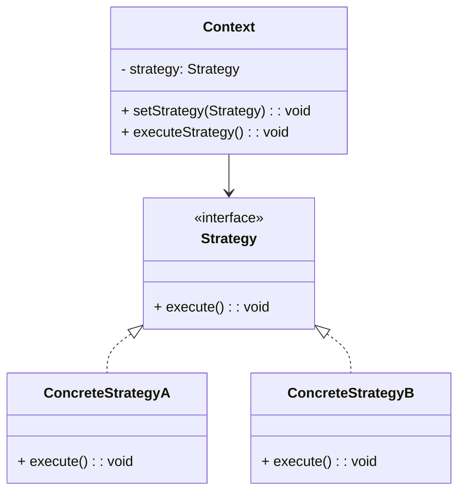

## 4.2.1 Understanding the Strategy Pattern

The Strategy pattern is a vital part of the behavioral design patterns family, offering a robust solution for defining a family of algorithms, encapsulating each one, and making them interchangeable. This pattern is pivotal in software design, allowing algorithms to vary independently from the clients that use them, enhancing flexibility and maintainability. In this comprehensive guide, we will delve deep into the Strategy pattern, exploring its purpose, components, benefits, and implementation in JavaScript and TypeScript.

### Defining the Strategy Pattern

The Strategy pattern is a design pattern that enables selecting an algorithm's behavior at runtime. It defines a family of algorithms, encapsulates each one, and makes them interchangeable. This pattern allows the algorithm to vary independently from the clients that use it, promoting flexibility and adherence to the Open/Closed Principle, which states that software entities should be open for extension but closed for modification.

#### Purpose and Benefits

- **Interchangeable Algorithms**: The Strategy pattern allows you to define multiple algorithms and switch between them easily without altering the client code.
- **Independent Variation**: Algorithms can evolve independently, enabling developers to introduce new strategies without affecting existing code.
- **Open/Closed Principle**: The pattern supports the Open/Closed Principle by allowing new strategies to be added without modifying the existing codebase.
- **Code Reuse and Maintainability**: By encapsulating algorithms, the Strategy pattern promotes code reuse and makes the system easier to maintain.

### Real-World Analogies

To better understand the Strategy pattern, let's consider a real-world analogy: a navigation app. When you use a navigation app, you can choose different routes based on various factors such as traffic conditions, distance, or scenic value. Each route represents a different strategy for reaching your destination. The app can switch between these strategies based on user preference or real-time data, providing flexibility and adaptability.

Another example is a payment processing system that supports multiple payment methods such as credit cards, PayPal, and cryptocurrencies. Each payment method is a strategy that can be selected based on user choice or transaction context.

### Scenarios for Interchangeable Algorithms

The Strategy pattern is particularly useful in scenarios where multiple algorithms can be used interchangeably based on context. Some common scenarios include:

- **Sorting Algorithms**: Different sorting algorithms can be applied based on data characteristics or performance requirements.
- **Compression Algorithms**: Various compression techniques can be selected based on data type and compression ratio needs.
- **Authentication Methods**: Different authentication strategies can be employed based on security requirements and user preferences.

### Key Components of the Strategy Pattern

The Strategy pattern consists of three main components:

1. **Context**: The context is the object that uses a strategy. It maintains a reference to a strategy object and delegates the algorithm's execution to this strategy.
2. **Strategy Interface**: This defines a common interface for all supported algorithms. The context uses this interface to call the algorithm defined by a concrete strategy.
3. **Concrete Strategies**: These are classes that implement the strategy interface. Each concrete strategy encapsulates a specific algorithm or behavior.

#### Diagram of the Strategy Pattern

Below is a diagram illustrating the Strategy pattern:



### Implementing the Strategy Pattern in JavaScript

Let's implement a simple example in JavaScript to illustrate the Strategy pattern. We'll create a text formatting application that can format text in different styles.

```javascript
// Strategy Interface
class TextFormatter {
    format(text) {
        throw new Error("This method should be overridden");
    }
}

// Concrete Strategy A
class UpperCaseFormatter extends TextFormatter {
    format(text) {
        return text.toUpperCase();
    }
}

// Concrete Strategy B
class LowerCaseFormatter extends TextFormatter {
    format(text) {
        return text.toLowerCase();
    }
}

// Context
class TextEditor {
    constructor(formatter) {
        this.formatter = formatter;
    }

    setFormatter(formatter) {
        this.formatter = formatter;
    }

    publishText(text) {
        return this.formatter.format(text);
    }
}

// Usage
const upperCaseFormatter = new UpperCaseFormatter();
const lowerCaseFormatter = new LowerCaseFormatter();

const editor = new TextEditor(upperCaseFormatter);
console.log(editor.publishText("Hello World")); // Outputs: HELLO WORLD

editor.setFormatter(lowerCaseFormatter);
console.log(editor.publishText("Hello World")); // Outputs: hello world
```

### Implementing the Strategy Pattern in TypeScript

TypeScript's type system enhances the implementation of the Strategy pattern by providing compile-time checks and interfaces. Let's implement the same example in TypeScript.

```typescript
// Strategy Interface
interface TextFormatter {
    format(text: string): string;
}

// Concrete Strategy A
class UpperCaseFormatter implements TextFormatter {
    format(text: string): string {
        return text.toUpperCase();
    }
}

// Concrete Strategy B
class LowerCaseFormatter implements TextFormatter {
    format(text: string): string {
        return text.toLowerCase();
    }
}

// Context
class TextEditor {
    private formatter: TextFormatter;

    constructor(formatter: TextFormatter) {
        this.formatter = formatter;
    }

    setFormatter(formatter: TextFormatter): void {
        this.formatter = formatter;
    }

    publishText(text: string): string {
        return this.formatter.format(text);
    }
}

// Usage
const upperCaseFormatter = new UpperCaseFormatter();
const lowerCaseFormatter = new LowerCaseFormatter();

const editor = new TextEditor(upperCaseFormatter);
console.log(editor.publishText("Hello World")); // Outputs: HELLO WORLD

editor.setFormatter(lowerCaseFormatter);
console.log(editor.publishText("Hello World")); // Outputs: hello world
```

### Avoiding Conditional Statements

One of the significant advantages of the Strategy pattern is its ability to avoid conditional statements for algorithm selection. Instead of using `if-else` or `switch` statements to choose an algorithm, the Strategy pattern allows you to set the desired strategy at runtime, promoting cleaner and more maintainable code.

### Managing Multiple Strategies

Managing multiple strategies can be challenging, especially when selecting them at runtime. It is crucial to understand the context in which each strategy is appropriate and ensure that the strategies are well-documented. Parameterizing strategies can increase flexibility, allowing for more dynamic behavior and customization.

### Promoting Code Reuse and Maintainability

The Strategy pattern promotes code reuse by encapsulating algorithms in separate classes, making it easier to reuse them across different contexts. It also enhances maintainability by decoupling the algorithm from the client, allowing changes to be made to the algorithm without affecting the client code.

### Defining Clear Interfaces

Defining clear interfaces for strategies is essential to ensure that the context can interact with different strategies seamlessly. A well-defined interface provides a contract that all concrete strategies must adhere to, ensuring consistency and reliability.

### Impact on Testing

The Strategy pattern has a positive impact on testing, as it allows individual strategies to be tested in isolation. By encapsulating algorithms in separate classes, each strategy can be unit tested independently, ensuring that it behaves as expected. This modular approach to testing enhances test coverage and reliability.

### Documenting Strategy Behavior

Documenting each strategy's behavior is crucial for clarity and understanding. Clear documentation helps developers understand the purpose and functionality of each strategy, making it easier to select the appropriate strategy for a given context. It also aids in maintaining the codebase by providing insights into how different strategies can be extended or modified.

### Conclusion

The Strategy pattern is a powerful tool in the software design arsenal, offering flexibility, maintainability, and adherence to the Open/Closed Principle. By defining a family of interchangeable algorithms, the Strategy pattern enables developers to create adaptable and robust systems. Whether you're working with JavaScript or TypeScript, understanding and implementing the Strategy pattern can significantly enhance your codebase's quality and scalability.

### Further Exploration

To deepen your understanding of the Strategy pattern, consider exploring the following resources:

- **Books**: "Design Patterns: Elements of Reusable Object-Oriented Software" by Erich Gamma et al.
- **Online Courses**: "Design Patterns in JavaScript" on platforms like Udemy or Coursera.
- **Documentation**: Explore the official TypeScript documentation for insights into interfaces and type safety.

By applying the Strategy pattern in your projects, you can create flexible, maintainable, and scalable software solutions that stand the test of time.

## Quiz Time!



### What is the primary purpose of the Strategy pattern?

- [x] To define a family of algorithms and make them interchangeable
- [ ] To encapsulate data and behavior in a single class
- [ ] To provide a way to create objects without specifying the exact class
- [ ] To allow one class to inherit the behavior of another

> **Explanation:** The Strategy pattern's primary purpose is to define a family of algorithms, encapsulate each one, and make them interchangeable.

### Which principle does the Strategy pattern promote?

- [x] Open/Closed Principle
- [ ] Single Responsibility Principle
- [ ] Liskov Substitution Principle
- [ ] Interface Segregation Principle

> **Explanation:** The Strategy pattern promotes the Open/Closed Principle by allowing new strategies to be added without modifying existing code.

### What are the key components of the Strategy pattern?

- [x] Context, Strategy Interface, Concrete Strategies
- [ ] Singleton, Factory, Prototype
- [ ] Observer, Subject, Event
- [ ] Client, Server, Middleware

> **Explanation:** The key components of the Strategy pattern are the Context, Strategy Interface, and Concrete Strategies.

### How does the Strategy pattern avoid conditional statements for algorithm selection?

- [x] By allowing strategies to be set at runtime
- [ ] By using inheritance to extend behavior
- [ ] By encapsulating data and behavior in a single class
- [ ] By using static methods for algorithm selection

> **Explanation:** The Strategy pattern avoids conditional statements by allowing the strategy to be set at runtime, promoting cleaner code.

### What is a real-world analogy for the Strategy pattern?

- [x] Selecting different routes in a navigation app
- [ ] A vending machine dispensing products
- [ ] A thermostat regulating temperature
- [ ] A library lending books

> **Explanation:** A real-world analogy for the Strategy pattern is selecting different routes in a navigation app based on traffic conditions.

### What is a potential challenge when using the Strategy pattern?

- [x] Managing multiple strategies and selecting them at runtime
- [ ] Ensuring all classes inherit from a single base class
- [ ] Maintaining a single instance of a class
- [ ] Avoiding circular dependencies

> **Explanation:** A potential challenge with the Strategy pattern is managing multiple strategies and selecting them appropriately at runtime.

### How does the Strategy pattern impact testing?

- [x] It allows individual strategies to be tested in isolation
- [ ] It requires testing all strategies together
- [ ] It makes testing more complex due to interdependencies
- [ ] It eliminates the need for testing

> **Explanation:** The Strategy pattern allows individual strategies to be tested in isolation, enhancing test coverage and reliability.

### Why is it important to define clear interfaces for strategies?

- [x] To ensure consistency and reliability across different strategies
- [ ] To reduce the number of classes in the system
- [ ] To allow strategies to be modified without testing
- [ ] To increase the complexity of the system

> **Explanation:** Clear interfaces ensure consistency and reliability, allowing the context to interact seamlessly with different strategies.

### What is the benefit of parameterizing strategies?

- [x] It increases flexibility and allows for more dynamic behavior
- [ ] It reduces the need for multiple strategies
- [ ] It simplifies the implementation of the Strategy pattern
- [ ] It limits the number of algorithms that can be used

> **Explanation:** Parameterizing strategies increases flexibility, allowing for more dynamic behavior and customization.

### True or False: The Strategy pattern can only be implemented in object-oriented languages.

- [ ] True
- [x] False

> **Explanation:** The Strategy pattern can be implemented in various programming paradigms, including functional programming, not limited to object-oriented languages.


