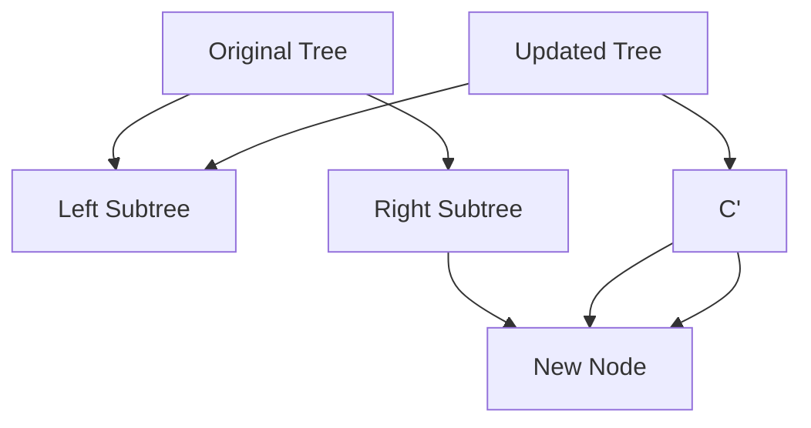

## 8.4.2 Building Immutable Data Structures

In the realm of software development, immutability has emerged as a cornerstone of robust and maintainable code, particularly within functional programming paradigms. This section delves into the construction and utilization of immutable data structures in JavaScript and TypeScript, exploring their profound impact on application design and performance.

### The Need for Advanced Immutable Data Structures

Immutability refers to the concept of data that cannot be altered after its creation. In JavaScript, primitive values such as numbers, strings, and booleans are inherently immutable. However, objects and arrays are mutable by default, leading to potential side effects when shared across different parts of an application. This mutability can introduce bugs that are difficult to trace and fix.

Advanced immutable data structures extend beyond basic objects and arrays, offering a way to manage state changes without altering existing data. These structures are particularly beneficial in scenarios involving concurrent data access and complex state management, such as in React applications or Redux state management.

#### Benefits of Immutability

- **Predictability**: Immutable data ensures that functions produce consistent outputs for the same inputs, enhancing predictability and reducing side effects.
- **Concurrency**: Immutability facilitates safe concurrent operations, as shared data is never modified in place.
- **Debugging**: Immutable data structures simplify debugging by eliminating unexpected mutations.
- **Undo/Redo Operations**: In applications like editors, immutability allows easy implementation of undo/redo functionality by preserving previous states.

### Persistent Data Structures: Efficient Immutable Updates

Persistent data structures provide a mechanism for creating new versions of data structures while preserving previous versions. This concept is crucial for implementing immutability efficiently, as it avoids the need to duplicate entire data structures on each update.

#### Structural Sharing

Structural sharing is a technique used by persistent data structures to optimize memory usage. Instead of copying the entire data structure, only the parts that have changed are duplicated, while the unchanged parts are shared between versions. This approach significantly reduces the overhead associated with immutable updates.

Consider the following example using a simple binary tree:



In this diagram, updating a node in the tree results in a new tree structure where only the path to the updated node is changed, while other nodes are shared.

### Libraries for Immutable Collections

Several libraries provide robust implementations of persistent data structures, making it easier to work with immutable collections in JavaScript and TypeScript.

#### Immutable.js

Immutable.js is a popular library that offers a comprehensive suite of immutable data structures, including Lists, Maps, Sets, and more. It leverages structural sharing to provide efficient updates.

```javascript
import { Map } from 'immutable';

// Creating an immutable Map
const map1 = Map({ a: 1, b: 2, c: 3 });

// Creating a new Map with an updated value
const map2 = map1.set('b', 50);

console.log(map1.get('b')); // Output: 2
console.log(map2.get('b')); // Output: 50
```

In this example, `map1` remains unchanged after `map2` is created, demonstrating immutability.

#### Mori

Mori is another library inspired by Clojure's immutable data structures. It provides similar capabilities to Immutable.js but is designed to be more lightweight.

```javascript
const mori = require('mori');

// Creating an immutable vector
const vector1 = mori.vector(1, 2, 3);

// Adding an element to the vector
const vector2 = mori.conj(vector1, 4);

console.log(mori.toJs(vector1)); // Output: [1, 2, 3]
console.log(mori.toJs(vector2)); // Output: [1, 2, 3, 4]
```

### Trade-offs and Integration

While immutable data structures offer numerous benefits, they also come with trade-offs. Understanding these trade-offs is crucial for integrating immutability into existing codebases effectively.

#### Performance Considerations

- **Memory Usage**: Although structural sharing mitigates memory overhead, immutable data structures can still consume more memory than their mutable counterparts due to additional metadata.
- **Performance Overhead**: Operations on immutable structures may be slower than native operations due to the need to create new instances on updates.

Despite these considerations, the benefits of immutability often outweigh the costs, particularly in applications where data integrity and predictability are paramount.

#### Integrating Immutable Data Structures

To integrate immutable data structures into an existing codebase, consider the following strategies:

- **Incremental Adoption**: Start by introducing immutability in new modules or components, gradually refactoring existing code.
- **Immutable Boundaries**: Define clear boundaries where immutable data structures interact with mutable code, ensuring consistency and avoiding unexpected mutations.
- **Tooling and Debugging**: Leverage tools like Redux DevTools, which support immutable data structures, to aid in debugging and state inspection.

### Best Practices for Immutability

Maintaining immutability without sacrificing performance requires adherence to best practices:

- **Use Immutable Libraries**: Utilize libraries like Immutable.js or Mori to handle complex data structures efficiently.
- **Avoid Deep Nesting**: Flatten deeply nested structures where possible to simplify updates and reduce complexity.
- **Immutable APIs**: Design APIs that return new instances rather than modifying existing ones, promoting immutability by design.

### Deep vs. Shallow Immutability

Immutability can be applied at different levels within data structures:

- **Shallow Immutability**: Only the top-level structure is immutable, while nested objects may remain mutable. This approach is simpler but can lead to unintended mutations.
- **Deep Immutability**: All levels of the structure are immutable, providing stronger guarantees against mutations but requiring more effort to implement.

#### Handling Nested Data

When dealing with nested data, consider using helper functions to manage updates:

```javascript
import { fromJS } from 'immutable';

// Deeply nested immutable structure
const data = fromJS({
  user: {
    name: 'Alice',
    address: {
      city: 'Wonderland',
      zip: '12345'
    }
  }
});

// Updating nested data
const updatedData = data.setIn(['user', 'address', 'city'], 'New Wonderland');

console.log(data.getIn(['user', 'address', 'city'])); // Output: Wonderland
console.log(updatedData.getIn(['user', 'address', 'city'])); // Output: New Wonderland
```

### Equality Checks and Comparison

In immutable contexts, equality checks are crucial for performance optimization. Libraries like Immutable.js provide efficient equality checks through structural sharing:

- **Reference Equality**: Immutable structures often allow for fast reference equality checks, as unchanged parts are shared.
- **Value Equality**: When reference equality is insufficient, deep value equality checks can be performed, albeit at a higher computational cost.

### Implementing Complex Operations

Immutable data structures support complex operations that would be cumbersome with mutable structures. Consider a scenario where you need to merge two collections:

```javascript
import { List } from 'immutable';

// Merging two immutable lists
const list1 = List([1, 2, 3]);
const list2 = List([4, 5, 6]);

const mergedList = list1.concat(list2);

console.log(mergedList.toArray()); // Output: [1, 2, 3, 4, 5, 6]
```

### Consistent Use of Immutable Patterns

Consistency is key when adopting immutable patterns. Ensure that immutability is applied uniformly across the application to avoid inconsistencies and potential bugs.

### Impact on Application Architecture

Immutable data structures influence application architecture, particularly in state management:

- **State Management**: Libraries like Redux promote immutability by default, leveraging immutable updates to manage application state efficiently.
- **Component Design**: In React, components can be designed to accept immutable props, reducing the likelihood of unintended side effects.

### Exercises

To reinforce the concepts covered, consider the following exercises:

1. **Implement a To-Do List**: Create a simple to-do list application using Immutable.js, focusing on adding, removing, and updating tasks.
2. **Nested Structure Updates**: Practice updating deeply nested structures using `setIn` and `updateIn` methods from Immutable.js.
3. **Performance Comparison**: Compare the performance of immutable and mutable data structures in a scenario involving frequent updates and reads.

### Debugging and Tooling Support

Working with immutable data structures can present challenges in debugging, particularly when inspecting deeply nested structures. Tools like Redux DevTools provide support for inspecting immutable state, aiding in the debugging process.

### Migrating from Mutable to Immutable

Migrating an existing codebase from mutable to immutable data structures can be daunting. Consider the following tips for a smooth transition:

- **Incremental Refactoring**: Refactor one module or component at a time, ensuring stability before proceeding.
- **Automated Tests**: Leverage automated tests to verify the correctness of refactored code and catch regressions early.
- **Training and Documentation**: Provide training and documentation to help team members understand and adopt immutable patterns effectively.

### Benefits of Immutability in Functional Programming

Immutability is a fundamental principle of functional programming, enabling several key benefits:

- **Referential Transparency**: Functions that rely on immutable data are referentially transparent, meaning they can be replaced with their output without affecting the program's behavior.
- **Ease of Reasoning**: Immutable data structures simplify reasoning about code, as functions cannot alter their inputs.
- **Functional Composition**: Immutability facilitates function composition, allowing complex operations to be built from simpler functions.

### Conclusion

Building and utilizing immutable data structures in JavaScript and TypeScript offers significant advantages in terms of predictability, performance, and maintainability. By leveraging libraries like Immutable.js and Mori, developers can efficiently manage state changes and embrace functional programming paradigms. As you integrate these concepts into your projects, consider the trade-offs and best practices discussed in this section to maximize the benefits of immutability.

## Quiz Time!



### What is the primary benefit of using immutable data structures?

- [x] They prevent unintended side effects by ensuring data cannot be altered after creation.
- [ ] They allow for faster data manipulation compared to mutable structures.
- [ ] They reduce the need for data serialization in applications.
- [ ] They automatically optimize memory usage without developer intervention.

> **Explanation:** Immutable data structures prevent unintended side effects by ensuring that data cannot be altered after creation, which enhances predictability and reduces bugs.

### How do persistent data structures optimize memory usage?

- [x] By using structural sharing to avoid duplicating unchanged parts of the data structure.
- [ ] By compressing data into smaller formats.
- [ ] By using native JavaScript objects for all operations.
- [ ] By storing data in external databases.

> **Explanation:** Persistent data structures use structural sharing to optimize memory usage, sharing unchanged parts of the data structure between versions.

### Which library is commonly used in JavaScript for working with immutable data structures?

- [x] Immutable.js
- [ ] Lodash
- [ ] jQuery
- [ ] Axios

> **Explanation:** Immutable.js is a commonly used library in JavaScript for working with immutable data structures, providing efficient implementations of various data types.

### What is a key trade-off of using immutable data structures?

- [x] They may consume more memory due to additional metadata.
- [ ] They require less computational power than mutable structures.
- [ ] They automatically handle all concurrency issues.
- [ ] They eliminate the need for state management libraries.

> **Explanation:** A key trade-off of using immutable data structures is that they may consume more memory due to additional metadata, despite optimizing memory usage through structural sharing.

### How can you update a deeply nested value in an immutable structure using Immutable.js?

- [x] Using the `setIn` method.
- [ ] Directly modifying the nested object.
- [ ] Using the `splice` method.
- [ ] Using the `push` method.

> **Explanation:** The `setIn` method in Immutable.js is used to update a deeply nested value in an immutable structure, ensuring immutability is maintained.

### What is the impact of immutability on debugging?

- [x] It simplifies debugging by eliminating unexpected mutations.
- [ ] It complicates debugging due to increased memory usage.
- [ ] It makes debugging unnecessary.
- [ ] It requires specialized debugging tools that are not widely available.

> **Explanation:** Immutability simplifies debugging by eliminating unexpected mutations, making it easier to trace and fix bugs.

### What is the difference between shallow and deep immutability?

- [x] Shallow immutability affects only the top-level structure, while deep immutability affects all levels.
- [ ] Deep immutability is faster to implement than shallow immutability.
- [ ] Shallow immutability is more memory-intensive than deep immutability.
- [ ] There is no difference; they are interchangeable terms.

> **Explanation:** Shallow immutability affects only the top-level structure, while deep immutability ensures that all levels of the structure are immutable.

### Which of the following is a benefit of using immutability in functional programming?

- [x] It facilitates referential transparency and ease of reasoning.
- [ ] It allows for in-place updates, reducing code complexity.
- [ ] It enables automatic garbage collection.
- [ ] It eliminates the need for function composition.

> **Explanation:** Immutability facilitates referential transparency and ease of reasoning, as functions cannot alter their inputs, which is a core benefit in functional programming.

### How can you incrementally migrate an existing codebase to use immutable data structures?

- [x] Refactor one module or component at a time, ensuring stability before proceeding.
- [ ] Rewrite the entire codebase from scratch using immutable structures.
- [ ] Use mutable structures in parallel with immutable ones indefinitely.
- [ ] Avoid automated tests to speed up the migration process.

> **Explanation:** Incremental migration involves refactoring one module or component at a time, ensuring stability before proceeding, which helps manage the transition effectively.

### True or False: Immutable data structures automatically handle all concurrency issues in an application.

- [ ] True
- [x] False

> **Explanation:** False. While immutable data structures facilitate safe concurrent operations by preventing in-place modifications, they do not automatically handle all concurrency issues. Developers must still design their applications to manage concurrency appropriately.


