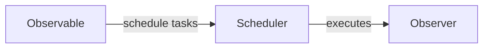

## 9.1.4 Scheduling and Concurrency in Reactive Programming

In the world of reactive programming, especially when working with RxJS, understanding how tasks are scheduled and executed is crucial for building efficient, responsive applications. This section delves into the concept of Schedulers in reactive programming, their role in managing concurrency, and how they can be leveraged to optimize performance and responsiveness in JavaScript and TypeScript applications.

### Understanding Schedulers in Reactive Programming

Schedulers in reactive programming are mechanisms that control when and how tasks are executed. They are fundamental to managing the flow of data through Observables and determining the timing of emissions to Observers. Schedulers provide a layer of abstraction over the execution context, allowing developers to specify whether tasks should run synchronously or asynchronously, and on which thread or event loop.

Schedulers play a pivotal role in:

- **Controlling Execution Timing:** They determine when a particular piece of code runs, which is essential for coordinating complex asynchronous operations.
- **Managing Concurrency:** Schedulers help manage concurrent tasks, ensuring that operations don't interfere with each other and that resources are used efficiently.
- **Optimizing Performance:** By choosing the right Scheduler, developers can enhance the responsiveness of applications, ensuring smooth UI updates and efficient background processing.

### Types of Schedulers in RxJS

RxJS provides several built-in Schedulers, each suited for different types of tasks and execution contexts. Understanding these Schedulers and their use cases is key to leveraging their full potential.

#### 1. `asyncScheduler`

The `asyncScheduler` is used for scheduling tasks asynchronously, typically using `setTimeout`. It is suitable for tasks that should not block the main thread, such as background processing or delayed actions.

**Example:**

```javascript
import { of, asyncScheduler } from 'rxjs';
import { observeOn } from 'rxjs/operators';

const source$ = of(1, 2, 3).pipe(
  observeOn(asyncScheduler)
);

source$.subscribe(value => console.log(`Received: ${value}`));
```

In this example, the emissions from the `source$` Observable are scheduled asynchronously, meaning they won't block the main thread.

#### 2. `queueScheduler`

The `queueScheduler` executes tasks synchronously in a queue-like fashion. It is ideal for scenarios where tasks need to be executed in a strict sequence without introducing asynchronous behavior.

**Example:**

```javascript
import { of, queueScheduler } from 'rxjs';
import { observeOn } from 'rxjs/operators';

const source$ = of(1, 2, 3).pipe(
  observeOn(queueScheduler)
);

source$.subscribe(value => console.log(`Received: ${value}`));
```

Here, the emissions are processed synchronously, maintaining the order of execution.

#### 3. `animationFrameScheduler`

The `animationFrameScheduler` is designed for scheduling tasks in sync with the browser's repaint cycle, making it perfect for animations and UI updates.

**Example:**

```javascript
import { interval, animationFrameScheduler } from 'rxjs';

const source$ = interval(0, animationFrameScheduler);

source$.subscribe(value => console.log(`Frame: ${value}`));
```

This example demonstrates using `animationFrameScheduler` to synchronize emissions with the browser's animation frames.

#### 4. `asapScheduler`

The `asapScheduler` schedules tasks to execute as soon as possible, but after the current synchronous code has completed. It is faster than `setTimeout`, making it suitable for high-priority tasks.

**Example:**

```javascript
import { of, asapScheduler } from 'rxjs';
import { observeOn } from 'rxjs/operators';

const source$ = of(1, 2, 3).pipe(
  observeOn(asapScheduler)
);

source$.subscribe(value => console.log(`Received: ${value}`));
```

In this case, tasks are scheduled to execute immediately after the current stack frame, providing a balance between synchronous and asynchronous execution.

### Specifying Schedulers in Observables and Operators

Schedulers can be specified when creating Observables or using operators to control the execution context of the emitted values. This flexibility allows developers to tailor the behavior of reactive streams to suit specific application needs.

**Example of Specifying a Scheduler:**

```javascript
import { interval } from 'rxjs';
import { take } from 'rxjs/operators';

const source$ = interval(1000, asyncScheduler).pipe(
  take(5)
);

source$.subscribe(value => console.log(`Tick: ${value}`));
```

In this example, the `interval` Observable uses `asyncScheduler` to emit values every second, demonstrating how Schedulers can be applied to control timing.

### Concurrency Concerns in Reactive Programming

Concurrency is a critical concern in reactive programming, as it involves managing multiple tasks that may execute simultaneously. RxJS addresses these concerns through its Schedulers and operators, providing tools to manage concurrency effectively.

#### Handling Multi-threading and Asynchronous Operations

While JavaScript is single-threaded, RxJS allows for managing concurrency through asynchronous operations and event loops. Schedulers play a key role in this by determining the execution context and timing of tasks.

- **Multi-threading Simulation:** Although JavaScript doesn't support true multi-threading, RxJS can simulate concurrent behavior by scheduling tasks on different event loops or using Web Workers for parallel processing.
- **Asynchronous Operations:** By using Schedulers like `asyncScheduler`, tasks can be offloaded from the main thread, allowing for non-blocking execution and improved application responsiveness.

#### Impact of Schedulers on Performance and Responsiveness

Schedulers can significantly impact the performance and responsiveness of an application. Choosing the right Scheduler ensures that tasks are executed efficiently, without blocking the main thread or causing unnecessary delays.

- **UI Updates:** Use `animationFrameScheduler` for tasks that affect the UI, ensuring smooth animations and transitions.
- **Background Processing:** Offload intensive computations to `asyncScheduler` to keep the UI responsive.
- **Immediate Execution:** Use `asapScheduler` for high-priority tasks that need to execute quickly after the current code.

### Visualizing Scheduler Interaction with Observables

To better understand how Schedulers interact with Observables, consider the following diagram:



This diagram illustrates the flow of data from an Observable to an Observer, with the Scheduler controlling the timing and context of execution.

### Common Use Cases for Different Schedulers

Schedulers are versatile tools that can be applied to a variety of use cases in reactive programming:

- **UI Updates and Animations:** Use `animationFrameScheduler` to synchronize with the browser's repaint cycle, ensuring smooth animations.
- **Background Processing:** Utilize `asyncScheduler` for tasks that can be deferred, such as data fetching or computations.
- **Sequential Execution:** Apply `queueScheduler` for tasks that require strict sequential processing without asynchronous delays.
- **High-priority Tasks:** Leverage `asapScheduler` for tasks that need to be executed immediately after the current stack.

### Choosing the Appropriate Scheduler

Selecting the right Scheduler depends on the specific requirements of your application. Consider the following factors:

- **Task Priority:** Determine whether tasks need to be executed immediately or can be deferred.
- **UI Responsiveness:** Ensure that UI updates are smooth and non-blocking.
- **Resource Management:** Balance resource usage to prevent overloading the event loop.

### Addressing Race Conditions and Mitigating Issues

Race conditions can occur when multiple tasks compete for the same resources, leading to unpredictable behavior. RxJS provides tools to mitigate these issues:

- **Use Schedulers Wisely:** Ensure that tasks are scheduled appropriately to avoid conflicts.
- **Leverage Operators:** Operators like `merge`, `concat`, and `switchMap` can help manage concurrent streams and prevent race conditions.
- **Test Thoroughly:** Regularly test and profile your application to identify and resolve concurrency issues.

### Creating Custom Schedulers

While RxJS provides a range of built-in Schedulers, there may be scenarios where custom Schedulers are necessary. Creating a custom Scheduler involves implementing the `SchedulerLike` interface, allowing for tailored execution contexts.

**Example of a Custom Scheduler:**

```typescript
import { SchedulerLike, Subscription } from 'rxjs';

class CustomScheduler implements SchedulerLike {
  now(): number {
    return Date.now();
  }

  schedule<T>(work: (state?: T) => void, delay: number = 0, state?: T): Subscription {
    const id = setTimeout(() => work(state), delay);
    return new Subscription(() => clearTimeout(id));
  }
}

const customScheduler = new CustomScheduler();
```

This example demonstrates a simple custom Scheduler that uses `setTimeout` to schedule tasks.

### Best Practices for Managing Resources

To prevent blocking the event loop and ensure efficient resource management, consider the following best practices:

- **Avoid Long-running Tasks:** Break down intensive computations into smaller chunks and schedule them using `asyncScheduler`.
- **Throttle and Debounce:** Use operators like `throttleTime` and `debounceTime` to control the rate of emissions and prevent overwhelming the event loop.
- **Profile Regularly:** Continuously profile your application to identify performance bottlenecks and optimize accordingly.

### Scheduling in Action: Delaying Emissions and Throttling Events

Schedulers can be used to implement various patterns, such as delaying emissions or throttling events, to enhance application performance and responsiveness.

**Example of Delaying Emissions:**

```javascript
import { of } from 'rxjs';
import { delay } from 'rxjs/operators';

const source$ = of(1, 2, 3).pipe(
  delay(1000, asyncScheduler)
);

source$.subscribe(value => console.log(`Delayed: ${value}`));
```

In this example, emissions are delayed by 1 second using `asyncScheduler`.

**Example of Throttling Events:**

```javascript
import { fromEvent } from 'rxjs';
import { throttleTime } from 'rxjs/operators';

const clicks$ = fromEvent(document, 'click').pipe(
  throttleTime(1000, asyncScheduler)
);

clicks$.subscribe(event => console.log(`Throttled click: ${event}`));
```

This example demonstrates throttling click events to occur at most once per second.

### Importance of Testing and Profiling

Testing and profiling are essential to ensure that your application handles concurrency effectively. By understanding the default behaviors of operators concerning scheduling and regularly profiling your application, you can optimize performance and responsiveness.

- **Test Edge Cases:** Ensure that your application behaves correctly under various conditions, including high load and concurrent operations.
- **Profile Resource Usage:** Use profiling tools to monitor CPU and memory usage, identifying areas for optimization.
- **Continuous Improvement:** Regularly review and refine your scheduling strategies to keep up with changing application requirements.

### Conclusion

Schedulers and concurrency management are integral to reactive programming, providing the tools necessary to build efficient, responsive applications. By understanding the different types of Schedulers, their use cases, and how to apply them effectively, developers can harness the full power of RxJS to create robust, scalable solutions.

By following best practices, addressing concurrency concerns, and continuously testing and profiling your applications, you can ensure optimal performance and responsiveness, delivering a seamless user experience.

## Quiz Time!



### What is the primary role of Schedulers in reactive programming?

- [x] To control when and how tasks are executed
- [ ] To manage data storage
- [ ] To create Observables
- [ ] To handle errors in streams

> **Explanation:** Schedulers are responsible for controlling the timing and execution context of tasks in reactive programming, allowing for effective concurrency management.

### Which Scheduler is best suited for tasks that need to synchronize with the browser's repaint cycle?

- [ ] asyncScheduler
- [ ] queueScheduler
- [x] animationFrameScheduler
- [ ] asapScheduler

> **Explanation:** The `animationFrameScheduler` is designed to schedule tasks in sync with the browser's animation frames, making it ideal for UI updates and animations.

### How does the `asyncScheduler` schedule tasks?

- [ ] Synchronously
- [x] Asynchronously using setTimeout
- [ ] Using requestAnimationFrame
- [ ] Immediately after the current stack frame

> **Explanation:** The `asyncScheduler` schedules tasks asynchronously, typically using `setTimeout`, which helps in non-blocking execution.

### What is a common use case for the `queueScheduler`?

- [ ] Background processing
- [x] Sequential task execution
- [ ] High-priority tasks
- [ ] UI animations

> **Explanation:** The `queueScheduler` executes tasks synchronously in a queue-like manner, making it suitable for scenarios requiring strict sequential execution.

### What is the key benefit of using `asapScheduler`?

- [ ] It delays tasks
- [x] It executes tasks as soon as possible after the current stack
- [ ] It synchronizes with the UI
- [ ] It manages data storage

> **Explanation:** The `asapScheduler` executes tasks as soon as possible after the current stack frame, providing a balance between synchronous and asynchronous execution.

### How can race conditions be mitigated in RxJS?

- [x] By using appropriate Schedulers
- [ ] By avoiding Observables
- [ ] By using only synchronous code
- [ ] By not using operators

> **Explanation:** Using appropriate Schedulers and operators can help manage concurrent streams and prevent race conditions in RxJS.

### What is a potential issue when using long-running tasks on the main thread?

- [ ] Improved performance
- [x] Blocking the event loop
- [ ] Increased memory usage
- [ ] Faster execution

> **Explanation:** Long-running tasks can block the event loop, leading to a non-responsive UI and degraded performance.

### Which operator can be used to control the rate of emissions in a stream?

- [x] throttleTime
- [ ] map
- [ ] filter
- [ ] reduce

> **Explanation:** The `throttleTime` operator is used to control the rate of emissions, allowing only one emission within a specified time frame.

### What is a best practice for managing resources in reactive programming?

- [ ] Avoid using Schedulers
- [ ] Use only synchronous operations
- [x] Break down intensive computations into smaller chunks
- [ ] Always use the same Scheduler

> **Explanation:** Breaking down intensive computations into smaller chunks and scheduling them appropriately helps prevent blocking the event loop and ensures efficient resource usage.

### True or False: Creating custom Schedulers is not possible in RxJS.

- [ ] True
- [x] False

> **Explanation:** It is possible to create custom Schedulers in RxJS by implementing the `SchedulerLike` interface, allowing for tailored execution contexts.


