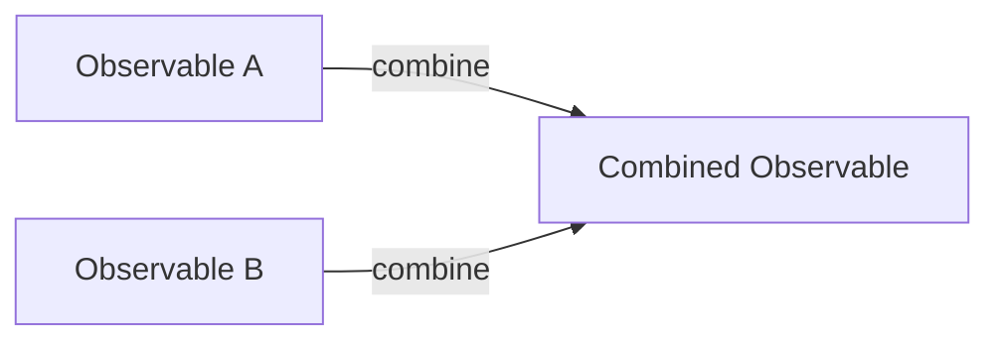

## 9.2.3 Combining Observables

In the world of reactive programming, Observables are the backbone that allow us to handle asynchronous data streams efficiently. However, real-world applications often require us to manage multiple data streams simultaneously, combining them to form complex relationships. This is where the power of combining Observables comes into play. In this section, we will delve into the need for combining Observables, explore key combination operators, and provide practical examples to illustrate their use.

### The Need for Combining Observables

In many applications, data does not exist in isolation. For instance, consider a dashboard application that displays data from multiple sources, such as user activity, notifications, and live updates from a server. Each of these data sources can be represented as an Observable. To create a cohesive user experience, we need to combine these Observables, synchronizing data streams to update the UI seamlessly.

Combining Observables allows us to:

- **Synchronize multiple data streams**: Handle events that occur at different times but need to be processed together.
- **Manage complex data relationships**: Create derived data streams based on multiple source streams.
- **Optimize performance**: Reduce redundant operations by processing combined data streams efficiently.

### Key Combination Operators

RxJS provides a rich set of operators for combining Observables, each with its own characteristics and use cases. Let's explore some of the most commonly used combination operators:

#### Merge

The `merge` operator combines multiple Observables into a single Observable by merging their emissions. It emits values from all source Observables as they occur.

**Use Case**: Use `merge` when you want to handle multiple input streams concurrently and process their emissions as soon as they happen.

```typescript
import { merge, of } from 'rxjs';
import { delay } from 'rxjs/operators';

const obs1 = of('A').pipe(delay(1000));
const obs2 = of('B').pipe(delay(500));
const obs3 = of('C');

const merged = merge(obs1, obs2, obs3);
merged.subscribe(value => console.log(value)); // Output: C, B, A
```

#### Concat

The `concat` operator sequentially combines multiple Observables, emitting all values from one Observable before moving to the next.

**Use Case**: Use `concat` when you need to process streams in a specific order, ensuring that one stream completes before starting the next.

```typescript
import { concat, of } from 'rxjs';
import { delay } from 'rxjs/operators';

const obs1 = of('A').pipe(delay(1000));
const obs2 = of('B').pipe(delay(500));
const obs3 = of('C');

const concatenated = concat(obs1, obs2, obs3);
concatenated.subscribe(value => console.log(value)); // Output: A, B, C
```

#### CombineLatest

The `combineLatest` operator combines multiple Observables by emitting the latest value from each, whenever any of the source Observables emit.

**Use Case**: Use `combineLatest` when you need to react to changes in multiple streams, using the most recent values from each.

```typescript
import { combineLatest, of } from 'rxjs';
import { delay } from 'rxjs/operators';

const obs1 = of(1).pipe(delay(1000));
const obs2 = of(2).pipe(delay(500));
const obs3 = of(3);

const combined = combineLatest([obs1, obs2, obs3]);
combined.subscribe(values => console.log(values)); // Output: [1, 2, 3]
```

#### Zip

The `zip` operator combines multiple Observables by pairing their emissions based on index. It emits tuples of values from each Observable.

**Use Case**: Use `zip` when you need to process streams in lockstep, ensuring that values are paired together based on their index.

```typescript
import { zip, of } from 'rxjs';
import { delay } from 'rxjs/operators';

const obs1 = of('A').pipe(delay(1000));
const obs2 = of('B').pipe(delay(500));
const obs3 = of('C');

const zipped = zip(obs1, obs2, obs3);
zipped.subscribe(values => console.log(values)); // Output: ['A', 'B', 'C']
```

#### WithLatestFrom

The `withLatestFrom` operator combines a primary Observable with the latest value from one or more other Observables whenever the primary Observable emits.

**Use Case**: Use `withLatestFrom` when you need to combine a primary event with the latest context from other streams.

```typescript
import { withLatestFrom, interval } from 'rxjs';
import { map, take } from 'rxjs/operators';

const obs1 = interval(1000).pipe(take(3)); // Emits 0, 1, 2
const obs2 = interval(500).pipe(take(5));  // Emits 0, 1, 2, 3, 4

const combined = obs1.pipe(
  withLatestFrom(obs2),
  map(([val1, val2]) => `Obs1: ${val1}, Obs2: ${val2}`)
);

combined.subscribe(value => console.log(value));
// Possible Output: Obs1: 0, Obs2: 1, Obs1: 1, Obs2: 3, Obs1: 2, Obs2: 4
```

#### ForkJoin

The `forkJoin` operator combines multiple Observables by emitting an array of the last values from each source Observable, only after all Observables complete.

**Use Case**: Use `forkJoin` when you need to wait for multiple Observables to complete before processing their final results.

```typescript
import { forkJoin, of } from 'rxjs';
import { delay } from 'rxjs/operators';

const obs1 = of('A').pipe(delay(1000));
const obs2 = of('B').pipe(delay(500));
const obs3 = of('C');

const forked = forkJoin([obs1, obs2, obs3]);
forked.subscribe(values => console.log(values)); // Output: ['A', 'B', 'C']
```

### Differences Between Combination Operators

Understanding the differences between these operators is crucial for selecting the right tool for your use case. Here's a comparison based on timing, emission, and completion behavior:

- **Merge**: Emits values as they occur from any input Observable. Does not wait for completion.
- **Concat**: Waits for each Observable to complete before moving to the next. Emits values sequentially.
- **CombineLatest**: Emits whenever any input Observable emits, using the latest values from all inputs.
- **Zip**: Emits only when all input Observables have emitted, pairing values by index.
- **WithLatestFrom**: Emits only when the primary Observable emits, combining with the latest values from others.
- **ForkJoin**: Waits for all input Observables to complete, emitting the last values from each.

### Handling Synchronization Issues

When combining asynchronous streams, synchronization issues can arise, leading to unexpected results. To handle these effectively:

- **Understand the emission behavior** of each operator to anticipate how values will be combined.
- **Use operators like `combineLatest` and `withLatestFrom`** to ensure you have the most recent context when processing events.
- **Leverage `zip`** for strict synchronization, ensuring that values are processed in pairs.

### Error Management in Combined Observables

Errors in any of the combined Observables can affect the entire stream. Here are some strategies for managing errors:

- **Use `catchError`** to handle errors gracefully and prevent them from terminating the entire stream.
- **Consider `retry` or `retryWhen`** to attempt recovery from transient errors.
- **Employ `onErrorResumeNext`** to continue with the next Observable in the sequence despite errors.

### Performance Considerations

Combining Observables can introduce performance overhead, especially with complex data relationships. To optimize performance:

- **Minimize unnecessary emissions** by using operators like `debounceTime` and `distinctUntilChanged`.
- **Profile your application** to identify bottlenecks and optimize critical paths.
- **Consider the use of `scheduler`** to control the execution context and improve responsiveness.

### Handling Cancellation and Unsubscription

Properly managing cancellation and unsubscription is essential to prevent memory leaks and ensure efficient resource usage:

- **Use the `takeUntil` operator** to automatically unsubscribe when a condition is met.
- **Leverage `unsubscribe` in your component lifecycle** (e.g., in Angular's `ngOnDestroy`) to clean up subscriptions.
- **Consider `take` and `first`** for finite streams that automatically complete after a certain number of emissions.

### Experimentation and Debugging

Experimenting with different combination operators is key to mastering their nuances. Here are some tips for debugging complex observable combinations:

- **Use the `tap` operator** to log intermediate values and gain insights into the data flow.
- **Leverage RxJS debugging tools** like `rxjs-spy` to visualize and analyze stream behavior.
- **Document your logic** to make it easier for others (and yourself) to understand and maintain the code.

### Higher-Order Observables

Higher-order Observables are Observables that emit other Observables. They play a crucial role in combining streams, allowing for dynamic stream creation and transformation. Operators like `switchMap`, `mergeMap`, and `concatMap` are essential for working with higher-order Observables.

### Best Practices for Combining Observables

To maintain readability and maintainability when combining Observables:

- **Use descriptive variable names** to convey the purpose of each stream.
- **Break down complex combinations into smaller, reusable functions**.
- **Document the logic and reasoning** behind each combination to aid future developers.

### Conclusion

Combining Observables is a powerful technique in reactive programming, enabling the management of complex data relationships in a clean and efficient manner. By understanding the behavior of different combination operators, you can choose the right tool for your specific use case, optimize performance, and ensure robust error handling. Remember to experiment, document your logic, and adhere to best practices to maintain code readability and maintainability.

### Visualizing Combining Observables

To further illustrate the concept of combining Observables, consider the following diagram:



This diagram represents the process of combining two Observables, A and B, into a single Combined Observable, C.

## Quiz Time!



### What is the primary use case for the `merge` operator?

- [x] To handle multiple input streams concurrently and process their emissions as soon as they happen.
- [ ] To ensure that one stream completes before starting the next.
- [ ] To pair emissions from multiple Observables based on index.
- [ ] To wait for all Observables to complete before processing their final results.

> **Explanation:** The `merge` operator is used to handle multiple input streams concurrently, emitting values from all source Observables as they occur.

### Which operator should you use when you need to process streams in a specific order?

- [ ] merge
- [x] concat
- [ ] combineLatest
- [ ] zip

> **Explanation:** The `concat` operator is used when you need to process streams in a specific order, ensuring that one stream completes before moving to the next.

### What does the `combineLatest` operator emit?

- [ ] The first value from each source Observable.
- [ ] Values paired by index from each Observable.
- [x] The latest value from each source Observable whenever any of them emit.
- [ ] An array of the last values from each source Observable after all complete.

> **Explanation:** The `combineLatest` operator emits the latest value from each source Observable whenever any of the source Observables emit.

### When is the `zip` operator most useful?

- [ ] When you want to handle multiple input streams concurrently.
- [ ] When you need to process streams in a specific order.
- [x] When you need to process streams in lockstep, pairing values by index.
- [ ] When you want to wait for all Observables to complete before processing results.

> **Explanation:** The `zip` operator is most useful when you need to process streams in lockstep, ensuring that values are paired together based on their index.

### How does the `withLatestFrom` operator work?

- [x] It combines a primary Observable with the latest value from one or more other Observables whenever the primary Observable emits.
- [ ] It emits values from all source Observables as they occur.
- [ ] It waits for each Observable to complete before moving to the next.
- [ ] It emits an array of the last values from each source Observable after all complete.

> **Explanation:** The `withLatestFrom` operator combines a primary Observable with the latest value from one or more other Observables whenever the primary Observable emits.

### Which operator waits for all input Observables to complete before emitting?

- [ ] merge
- [ ] concat
- [ ] combineLatest
- [x] forkJoin

> **Explanation:** The `forkJoin` operator waits for all input Observables to complete before emitting an array of the last values from each source Observable.

### What is a key strategy for managing errors in combined Observables?

- [ ] Ignore errors and continue processing.
- [x] Use `catchError` to handle errors gracefully.
- [ ] Use `zip` to synchronize error handling.
- [ ] Use `merge` to combine error streams.

> **Explanation:** Using `catchError` allows you to handle errors gracefully and prevent them from terminating the entire stream.

### How can you handle cancellation and unsubscription in combined Observables?

- [ ] By using the `merge` operator.
- [x] By using the `takeUntil` operator.
- [ ] By using the `zip` operator.
- [ ] By using the `forkJoin` operator.

> **Explanation:** The `takeUntil` operator can be used to automatically unsubscribe from Observables when a condition is met, helping to manage cancellation and unsubscription.

### What is a higher-order Observable?

- [ ] An Observable that emits primitive values.
- [x] An Observable that emits other Observables.
- [ ] An Observable that combines values by index.
- [ ] An Observable that waits for all inputs to complete.

> **Explanation:** A higher-order Observable is an Observable that emits other Observables, allowing for dynamic stream creation and transformation.

### True or False: The `tap` operator can be used for logging intermediate values in a stream.

- [x] True
- [ ] False

> **Explanation:** The `tap` operator is used to perform side effects such as logging intermediate values in a stream without affecting the stream's emissions.


