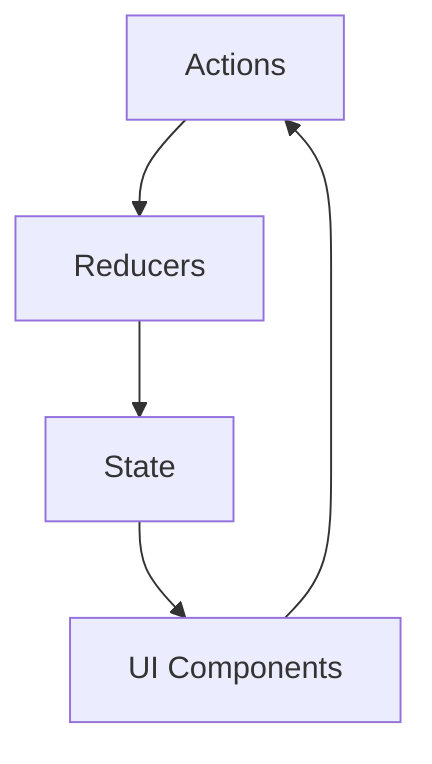

## 9.3.1 Reactive State Management

In the realm of modern web applications, managing state is one of the most challenging aspects of user interface development. As applications grow in complexity, the need for an efficient and scalable state management solution becomes paramount. Reactive state management offers a powerful approach to handle the dynamic nature of application state, leveraging the principles of reactive programming to synchronize state changes with UI components seamlessly. This section delves into the intricacies of reactive state management, exploring its benefits, challenges, and implementation strategies using JavaScript and TypeScript.

### Challenges of State Management in Complex User Interfaces

State management in complex user interfaces involves several challenges:

- **Complexity and Scale:** As applications grow, managing state becomes more complex due to the sheer number of components and interactions.
- **Synchronization:** Keeping the UI in sync with the underlying state can be difficult, especially when multiple components depend on the same state.
- **Predictability:** Ensuring predictable state changes is crucial for maintaining application stability and preventing bugs.
- **Performance:** Efficiently updating the UI in response to state changes without unnecessary re-renders is vital for performance.
- **Asynchronous Operations:** Handling asynchronous data, such as API requests, adds another layer of complexity.

### Introducing Reactive State Management

Reactive state management leverages the principles of reactive programming to address these challenges. At its core, it utilizes **Observables** to represent state changes as streams of data that can be observed and reacted to. This approach simplifies the synchronization between state and UI components by treating state changes as events that propagate through the system.

#### Key Concepts of Reactive State Management

- **Observables:** Core to reactive programming, observables represent streams of data that can be subscribed to, allowing components to react to state changes in real-time.
- **Unidirectional Data Flow:** Ensures a predictable flow of data through the application, making state changes easier to trace and debug.
- **Immutability:** Helps maintain a consistent state by preventing direct mutations, thus reducing bugs and side effects.

### Simplifying Synchronization with Reactive Programming

Reactive programming simplifies the synchronization between state and UI components by:

- **Decoupling State and UI:** Components subscribe to state changes rather than directly accessing state, reducing coupling and improving modularity.
- **Automatic Updates:** When state changes, all subscribed components are automatically updated, ensuring consistency across the UI.
- **Efficient Rendering:** Only components affected by state changes are re-rendered, improving performance.

### Implementing Reactive State Management

Reactive state management can be implemented using libraries like **Redux Observable** or **NgRx**. These libraries provide a structured way to manage state using observables, actions, and reducers.

#### Example: Using Redux Observable

Redux Observable is a middleware for Redux that uses RxJS to handle asynchronous actions.

```typescript
import { ofType } from 'redux-observable';
import { mapTo } from 'rxjs/operators';
import { Action } from 'redux';

const pingEpic = (action$: Observable<Action>) =>
  action$.pipe(
    ofType('PING'),
    mapTo({ type: 'PONG' })
  );
```

In this example, `pingEpic` listens for `PING` actions and maps them to `PONG` actions using RxJS operators.

#### Example: Using NgRx in Angular

NgRx is a reactive state management library for Angular applications.

```typescript
import { createReducer, on } from '@ngrx/store';
import { increment, decrement, reset } from './counter.actions';

export const initialState = 0;

const _counterReducer = createReducer(
  initialState,
  on(increment, (state) => state + 1),
  on(decrement, (state) => state - 1),
  on(reset, (state) => 0)
);

export function counterReducer(state, action) {
  return _counterReducer(state, action);
}
```

In this example, a simple counter reducer is defined using NgRx, handling `increment`, `decrement`, and `reset` actions.

### Unidirectional Data Flow Pattern

The unidirectional data flow pattern is a cornerstone of reactive state management. It ensures that data flows in a single direction, making state changes predictable and easier to debug.



- **Actions:** Represent user interactions or events that trigger state changes.
- **Reducers:** Pure functions that take the current state and an action, returning a new state.
- **State:** The single source of truth for the application.
- **UI Components:** Render the UI based on the current state and dispatch actions in response to user interactions.

### Using Subjects and BehaviorSubjects

In reactive state management, **Subjects** and **BehaviorSubjects** are often used to represent state streams.

- **Subject:** A multicast observable that can emit new values to its subscribers.
- **BehaviorSubject:** Similar to a Subject but also stores the current value, making it useful for representing state.

Example using RxJS:

```typescript
import { BehaviorSubject } from 'rxjs';

const state$ = new BehaviorSubject<number>(0);

state$.subscribe(value => console.log(value)); // Logs the current state
state$.next(1); // Update state
```

### Splitting State into Slices

Managing state in large applications can be simplified by splitting it into smaller, manageable slices. Each slice represents a specific part of the application state, allowing for more modular and maintainable code.

#### Example: Slicing State in Redux

```typescript
import { combineReducers } from 'redux';
import { userReducer } from './userReducer';
import { productReducer } from './productReducer';

const rootReducer = combineReducers({
  user: userReducer,
  product: productReducer
});
```

### Best Practices for Reactive State Management

- **Avoid Shared Mutable State:** Use immutability to prevent unintended side effects.
- **Use Selectors and Memoization:** Optimize state access and prevent unnecessary computations.
- **Handle Asynchronous Updates Carefully:** Use middleware like Redux Thunk or Redux Saga to manage side effects.
- **Structure for Scalability:** Organize state management logic to accommodate future growth.

### Handling Asynchronous State Updates

Asynchronous state updates can introduce complexity, especially when dealing with side effects like API calls. Reactive state management provides tools to handle these scenarios effectively.

#### Example: Handling Asynchronous Actions with Redux Observable

```typescript
import { ofType } from 'redux-observable';
import { switchMap } from 'rxjs/operators';
import { ajax } from 'rxjs/ajax';

const fetchUserEpic = (action$) =>
  action$.pipe(
    ofType('FETCH_USER'),
    switchMap(action =>
      ajax.getJSON(`/api/users/${action.payload}`).pipe(
        map(response => ({ type: 'FETCH_USER_FULFILLED', payload: response }))
      )
    )
  );
```

### Reactive State Management in Angular and React

Both Angular and React can benefit from reactive state management using libraries like RxJS.

#### Angular with NgRx

NgRx integrates seamlessly with Angular, providing a reactive approach to state management.

```typescript
import { Store } from '@ngrx/store';
import { increment } from './counter.actions';

@Component({
  selector: 'app-counter',
  template: `
    <button (click)="increment()">Increment</button>
    <div>Count: {{ count$ | async }}</div>
  `
})
export class CounterComponent {
  count$ = this.store.select('count');

  constructor(private store: Store<{ count: number }>) {}

  increment() {
    this.store.dispatch(increment());
  }
}
```

#### React with Redux Observable

Redux Observable can be used with React to manage state reactively.

```javascript
import React from 'react';
import { useSelector, useDispatch } from 'react-redux';
import { ping } from './actions';

const PingPongComponent = () => {
  const dispatch = useDispatch();
  const pong = useSelector(state => state.pong);

  return (
    <div>
      <button onClick={() => dispatch(ping())}>Ping</button>
      <div>{pong ? 'Pong!' : 'No Pong Yet'}</div>
    </div>
  );
};

export default PingPongComponent;
```

### Immutability and Reactive Patterns

Immutability is a key principle in reactive state management, ensuring that state changes are predictable and traceable.

- **Benefits of Immutability:**
  - **Predictable State Changes:** Immutable state ensures that changes are explicit and traceable.
  - **Easier Debugging:** Immutable data structures make it easier to track state changes over time.
  - **Improved Performance:** Immutability allows for optimizations like memoization, reducing unnecessary computations.

### Integrating Reactive State Management with Existing Applications

Integrating reactive state management into existing applications requires careful planning and execution.

- **Gradual Integration:** Start by introducing reactive patterns in new features or components.
- **Use Adapters:** Create adapters to connect existing state management logic with reactive streams.
- **Leverage Middleware:** Use middleware to handle side effects and asynchronous operations.

### Role of Selectors and Memoization

Selectors and memoization play a crucial role in optimizing state access and improving performance.

- **Selectors:** Functions that extract specific pieces of state, often using memoization to prevent unnecessary recomputations.
- **Memoization:** Caches the results of expensive computations, improving performance by avoiding redundant calculations.

#### Example: Creating a Selector with Reselect

```typescript
import { createSelector } from 'reselect';

const selectUser = (state) => state.user;
const selectUserName = createSelector(
  [selectUser],
  (user) => user.name
);
```

### Debugging and Testing with Reactive State Management

Reactive state management offers several benefits for debugging and testing:

- **Time-Travel Debugging:** Tools like Redux DevTools allow developers to inspect and replay state changes.
- **Predictable State Changes:** Unidirectional data flow and immutability make it easier to trace and debug state changes.
- **Testable Logic:** Pure functions and selectors can be easily tested, improving code quality.

### Conclusion

Reactive state management provides a robust solution for managing complex application state in modern user interfaces. By leveraging the principles of reactive programming, developers can create applications that are more predictable, scalable, and maintainable. As you integrate reactive state management into your projects, consider the best practices and strategies discussed in this section to maximize the benefits and minimize potential pitfalls.

## Quiz Time!



### What is a key challenge of state management in complex user interfaces?

- [x] Synchronization between UI components and state
- [ ] Implementing CSS styles
- [ ] Writing HTML templates
- [ ] Using JavaScript libraries

> **Explanation:** Synchronization between UI components and state is a key challenge because it requires ensuring that all parts of the UI reflect the current state accurately and efficiently.

### What is a primary benefit of using reactive state management?

- [x] Simplifies synchronization between state and UI components
- [ ] Increases code complexity
- [ ] Requires more manual updates
- [ ] Decreases application performance

> **Explanation:** Reactive state management simplifies synchronization by using observables to automatically update UI components when state changes.

### Which library can be used for reactive state management in Angular?

- [x] NgRx
- [ ] Redux
- [ ] MobX
- [ ] Vuex

> **Explanation:** NgRx is a popular library for implementing reactive state management in Angular applications.

### What is the role of a BehaviorSubject in reactive state management?

- [x] To represent state streams and store the current value
- [ ] To create new components
- [ ] To manage CSS styles
- [ ] To handle routing

> **Explanation:** A BehaviorSubject represents state streams and stores the current value, making it useful for managing application state.

### What pattern ensures a predictable flow of data in reactive state management?

- [x] Unidirectional data flow
- [ ] Bidirectional data flow
- [ ] Multidirectional data flow
- [ ] Circular data flow

> **Explanation:** Unidirectional data flow ensures a predictable flow of data, making state changes easier to trace and debug.

### Which operator is commonly used in Redux Observable to handle asynchronous actions?

- [x] switchMap
- [ ] map
- [ ] filter
- [ ] reduce

> **Explanation:** The `switchMap` operator is used to handle asynchronous actions by switching to a new observable based on the action.

### How does immutability benefit reactive state management?

- [x] Ensures predictable state changes and easier debugging
- [ ] Makes state changes unpredictable
- [ ] Increases memory usage
- [ ] Complicates state updates

> **Explanation:** Immutability ensures predictable state changes and easier debugging by preventing direct mutations of state.

### What is the purpose of selectors in state management?

- [x] To extract specific pieces of state
- [ ] To handle user input
- [ ] To manage component lifecycle
- [ ] To style components

> **Explanation:** Selectors are used to extract specific pieces of state, often using memoization to improve performance.

### What tool allows for time-travel debugging in Redux?

- [x] Redux DevTools
- [ ] Chrome DevTools
- [ ] Firefox Developer Edition
- [ ] Visual Studio Code

> **Explanation:** Redux DevTools allows developers to inspect and replay state changes, providing time-travel debugging capabilities.

### True or False: Reactive state management can be integrated gradually into existing applications.

- [x] True
- [ ] False

> **Explanation:** Reactive state management can be integrated gradually, starting with new features or components and using adapters to connect existing logic.


