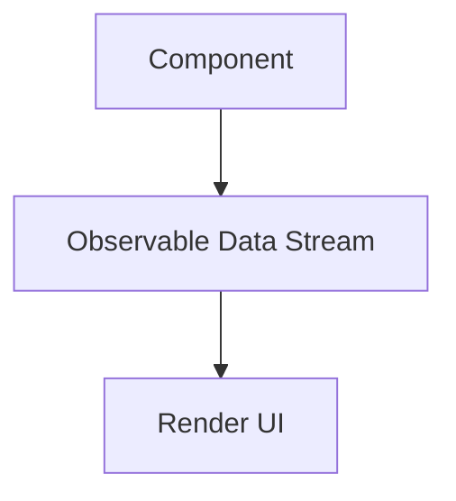

---

linkTitle: "9.3.4 Integration with Frameworks (e.g., Angular, React)"
title: "Reactive Programming Integration with Angular and React Frameworks"
description: "Explore how modern frameworks like Angular and React leverage reactive programming patterns to enhance UI development. Learn to integrate Observables, manage state reactively, and optimize performance with practical examples and best practices."
categories:
- Front-end Development
- Reactive Programming
- JavaScript Frameworks
tags:
- Angular
- React
- RxJS
- Observables
- UI Development
date: 2024-10-25
type: docs
nav_weight: 934000
---

## 9.3.4 Integration with Frameworks (e.g., Angular, React)

In the realm of modern front-end development, frameworks like Angular and React have become integral to building dynamic, responsive user interfaces. These frameworks support reactive programming patterns, offering developers powerful tools to manage data flows and UI state efficiently. This section delves into how Angular and React integrate with reactive programming, focusing on the use of RxJS, Observables, and related libraries to enhance application performance and maintainability.

### Understanding Reactive Programming in Modern Frameworks

Reactive programming is a paradigm that allows developers to work with asynchronous data streams and propagate changes through a declarative approach. In the context of UI development, this means creating components that react to changes in data or state, leading to more responsive and interactive applications.

#### Key Benefits of Reactive Programming in UI Development

- **Simplified Component Logic**: Reactive programming abstracts the complexity of managing state and asynchronous operations, making component logic more straightforward.
- **Improved Performance**: By efficiently managing data streams and updates, reactive programming can reduce unnecessary re-renders and optimize performance.
- **Enhanced Maintainability**: With a clear separation of concerns and declarative data flow, applications become easier to maintain and extend.

### Using RxJS with Angular

Angular has built-in support for RxJS, a library for reactive programming using Observables. RxJS provides a robust set of operators to manipulate and transform data streams, making it a perfect fit for Angular's reactive architecture.

#### Integrating RxJS in Angular Applications

Angular's architecture naturally aligns with reactive programming, leveraging RxJS for handling asynchronous operations such as HTTP requests, user input, and state management.

**Example: Reactive Data Fetching with RxJS in Angular**

```typescript
import { Component, OnInit } from '@angular/core';
import { HttpClient } from '@angular/common/http';
import { Observable } from 'rxjs';
import { map, catchError } from 'rxjs/operators';

@Component({
  selector: 'app-data-fetch',
  template: `
    <div *ngIf="data$ | async as data; else loading">
      <pre>{{ data | json }}</pre>
    </div>
    <ng-template #loading>Loading...</ng-template>
  `
})
export class DataFetchComponent implements OnInit {
  data$: Observable<any>;

  constructor(private http: HttpClient) {}

  ngOnInit() {
    this.data$ = this.http.get('/api/data').pipe(
      map(response => response),
      catchError(error => {
        console.error('Error fetching data', error);
        return [];
      })
    );
  }
}
```

**Best Practices for Using RxJS in Angular**

- **Leverage Angular's HttpClient**: Use Angular's HttpClient, which returns Observables, to handle HTTP requests reactively.
- **Use Async Pipe**: The `async` pipe in Angular templates automatically subscribes to Observables, managing subscriptions and avoiding memory leaks.
- **Handle Errors Gracefully**: Use RxJS operators like `catchError` to manage errors in data streams.

### Integrating Observables with React Components

React, while not inherently reactive, can be enhanced with reactive patterns using libraries like `rxjs-hooks` or `redux-observable`. These libraries allow developers to integrate Observables into React components, managing state and side effects reactively.

#### Using `rxjs-hooks` in React

`rxjs-hooks` is a library that provides hooks for using RxJS Observables in React components, enabling reactive state management and side effects.

**Example: Using `rxjs-hooks` for Reactive State Management**

```javascript
import React from 'react';
import { useObservable } from 'rxjs-hooks';
import { of } from 'rxjs';
import { delay } from 'rxjs/operators';

const DelayedMessage = () => {
  const message$ = of('Hello, Reactive World!').pipe(delay(1000));
  const message = useObservable(() => message$, 'Loading...');

  return <div>{message}</div>;
};

export default DelayedMessage;
```

**Integrating `redux-observable` for Side Effects**

`redux-observable` is a middleware for Redux that uses RxJS to handle asynchronous actions and side effects.

**Example: Handling Side Effects with `redux-observable`**

```javascript
import { combineEpics, ofType } from 'redux-observable';
import { ajax } from 'rxjs/ajax';
import { map, mergeMap } from 'rxjs/operators';
import { FETCH_DATA, fetchDataSuccess } from './actions';

const fetchDataEpic = action$ => action$.pipe(
  ofType(FETCH_DATA),
  mergeMap(action =>
    ajax.getJSON('/api/data').pipe(
      map(response => fetchDataSuccess(response))
    )
  )
);

export const rootEpic = combineEpics(fetchDataEpic);
```

### Managing Component State and Side Effects Reactively

Reactive programming allows developers to manage component state and side effects more effectively, using Observables to model changes over time.

#### Strategies for Reactive State Management

- **Use Observables for State**: Model component state as an Observable, allowing for declarative updates and transformations.
- **Combine Streams**: Use RxJS operators to combine multiple data streams, simplifying complex state management logic.
- **Isolate Side Effects**: Handle side effects separately from component logic, using libraries like `redux-observable` or custom hooks.

### Reactive Patterns for Data Fetching, Caching, and Error Handling

Reactive programming provides powerful patterns for managing data fetching, caching, and error handling, ensuring that applications remain responsive and robust.

#### Data Fetching and Caching

- **Leverage RxJS Operators**: Use operators like `switchMap` and `mergeMap` to handle data fetching and updates efficiently.
- **Implement Caching**: Cache data streams to reduce unnecessary network requests and improve performance.

**Example: Caching Data with RxJS**

```typescript
import { of, from } from 'rxjs';
import { switchMap, shareReplay } from 'rxjs/operators';

const fetchData = () => from(fetch('/api/data').then(res => res.json()));

const cachedData$ = fetchData().pipe(
  switchMap(data => of(data)),
  shareReplay(1)
);
```

#### Error Handling

- **Graceful Degradation**: Use operators like `catchError` to handle errors gracefully, providing fallback data or error messages.
- **Centralized Error Management**: Centralize error handling logic to streamline debugging and maintenance.

### Benefits of Reactive Programming in Frameworks

Reactive programming offers several benefits when integrated into modern frameworks like Angular and React:

- **Declarative Data Flow**: Simplifies component logic by modeling data flows declaratively.
- **Efficient State Management**: Reduces the complexity of managing component state and side effects.
- **Enhanced Performance**: Optimizes rendering and updates, minimizing unnecessary operations.

### Handling Component Lifecycle Events and Subscriptions

Managing component lifecycle events and subscriptions is crucial to prevent memory leaks and ensure optimal performance.

#### Best Practices for Managing Subscriptions

- **Unsubscribe on Component Unmount**: Ensure that subscriptions are cleaned up when components unmount, using mechanisms like `ngOnDestroy` in Angular or the `useEffect` cleanup function in React.
- **Use Subscription Management Libraries**: Consider using libraries like `takeUntil` or `unsubscribeOnDestroy` to automate subscription management.

### Optimizing Rendering and Avoiding Unnecessary Updates

Reactive programming can help optimize rendering and avoid unnecessary updates, improving application performance.

#### Strategies for Optimizing Rendering

- **Use Memoization**: Use memoization techniques to prevent unnecessary re-renders, leveraging tools like `React.memo` or Angular's `OnPush` change detection strategy.
- **Batch Updates**: Batch multiple state updates to minimize re-renders and improve performance.

### Common Challenges and Solutions

Reactive programming introduces several challenges, such as managing subscriptions and preventing memory leaks. Here are some solutions:

- **Subscription Management**: Use best practices for managing subscriptions, ensuring they are disposed of correctly.
- **Debugging and Profiling**: Leverage tools like React DevTools or Angular DevTools to debug and profile reactive code effectively.

### Real-World Examples and Case Studies

Several organizations have successfully integrated reactive programming into their applications, leading to improved performance and maintainability. For instance, Netflix uses RxJS extensively in their UI components to manage data streams and user interactions efficiently.

### Staying Updated with Frameworks and Community Practices

The landscape of front-end development is constantly evolving. It's crucial to stay updated with framework updates and community practices to leverage the latest features and improvements.

### Consistency and Code Conventions

Maintaining consistency and adhering to code conventions is essential when using reactive programming in teams. Establishing guidelines and best practices can help ensure that code remains maintainable and understandable.

### Supporting Team Members in Adopting Reactive Patterns

Reactive programming can have a steep learning curve. Supporting team members through training, code reviews, and pair programming can help them adopt reactive patterns more effectively.

### Conclusion

Integrating reactive programming into frameworks like Angular and React offers numerous benefits, from simplified component logic to enhanced performance. By leveraging tools like RxJS and libraries such as `rxjs-hooks` and `redux-observable`, developers can create responsive, maintainable applications that scale effectively. As you continue to explore reactive programming, consider the best practices and strategies discussed in this section to maximize the benefits in your projects.



## Quiz Time!



### What is the primary benefit of using reactive programming in UI development?

- [x] Simplified component logic
- [ ] Increased code complexity
- [ ] Reduced application performance
- [ ] More manual state management

> **Explanation:** Reactive programming simplifies component logic by abstracting state and asynchronous operations, making it more manageable and declarative.

### Which library is commonly used in Angular for reactive programming?

- [x] RxJS
- [ ] Lodash
- [ ] Redux
- [ ] jQuery

> **Explanation:** Angular uses RxJS to handle reactive programming, providing a robust set of operators for managing data streams.

### How can React components integrate Observables?

- [x] Using libraries like `rxjs-hooks` or `redux-observable`
- [ ] By directly using Angular services
- [ ] Through jQuery event handlers
- [ ] Using synchronous functions

> **Explanation:** Libraries like `rxjs-hooks` and `redux-observable` allow React components to integrate Observables for reactive state management and side effects.

### What is the purpose of the `async` pipe in Angular?

- [x] To automatically subscribe to Observables and manage subscriptions
- [ ] To convert Observables to Promises
- [ ] To handle synchronous data updates
- [ ] To manage CSS styles

> **Explanation:** The `async` pipe in Angular templates automatically subscribes to Observables, managing subscriptions and preventing memory leaks.

### Which RxJS operator is used to handle errors in data streams?

- [x] catchError
- [ ] map
- [ ] filter
- [ ] debounceTime

> **Explanation:** The `catchError` operator is used in RxJS to handle errors in data streams, providing a mechanism for graceful degradation.

### What is a common challenge when using reactive programming?

- [x] Managing subscriptions and preventing memory leaks
- [ ] Writing more code
- [ ] Reducing application performance
- [ ] Increasing code complexity

> **Explanation:** Managing subscriptions and preventing memory leaks is a common challenge in reactive programming, requiring careful handling of component lifecycle events.

### How can React developers optimize rendering to avoid unnecessary updates?

- [x] Use memoization techniques like `React.memo`
- [ ] Increase the frequency of re-renders
- [ ] Avoid using state management libraries
- [ ] Use synchronous data fetching

> **Explanation:** Memoization techniques like `React.memo` help optimize rendering by preventing unnecessary updates and re-renders in React components.

### What is a benefit of using `redux-observable` in React applications?

- [x] Handling asynchronous actions and side effects
- [ ] Managing CSS styles
- [ ] Directly manipulating the DOM
- [ ] Simplifying HTML structure

> **Explanation:** `redux-observable` is a middleware for Redux that uses RxJS to handle asynchronous actions and side effects in React applications.

### How can developers prevent memory leaks in Angular components?

- [x] Use `ngOnDestroy` to unsubscribe from Observables
- [ ] Avoid using Observables
- [ ] Use synchronous functions only
- [ ] Increase the number of subscriptions

> **Explanation:** In Angular, developers can use the `ngOnDestroy` lifecycle hook to unsubscribe from Observables, preventing memory leaks.

### Reactive programming is beneficial for managing which type of operations in UI development?

- [x] Asynchronous operations
- [ ] Synchronous calculations
- [ ] Static HTML content
- [ ] CSS animations

> **Explanation:** Reactive programming is particularly beneficial for managing asynchronous operations, such as data fetching and user interactions, in UI development.


