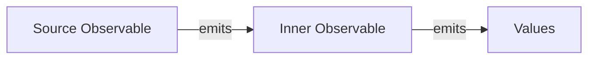

## 9.4.1 Higher-order Observables

In the realm of reactive programming, Observables play a pivotal role in handling asynchronous data streams. As applications grow in complexity, the need to manage multiple asynchronous operations simultaneously becomes crucial. This is where higher-order Observables come into play. In this section, we will delve into the concept of higher-order Observables, explore the operators that help manage them, and discuss best practices for their use in JavaScript and TypeScript.

### Understanding Higher-order Observables

Higher-order Observables are Observables that emit other Observables rather than emitting simple values. This concept is fundamental in complex reactive scenarios where multiple streams of data need to be coordinated and managed efficiently. Higher-order Observables allow for the composition of multiple asynchronous operations, enabling developers to build more sophisticated and responsive applications.

#### The Need for Higher-order Observables

In many real-world applications, you may encounter situations where you need to handle nested asynchronous operations. For example, consider a scenario where a user action triggers an API call, and the response from that API triggers another asynchronous operation. Managing these nested operations efficiently can be challenging, and higher-order Observables provide a structured way to handle such complexity.

Higher-order Observables are particularly useful in scenarios involving:

- **Complex User Interactions:** Where a single user action may lead to multiple asynchronous operations.
- **Chained API Calls:** Where the result of one API call determines the next.
- **Real-time Data Streams:** Where data from multiple sources needs to be combined or processed in sequence.

### Flattening Operators: Managing Higher-order Observables

To work effectively with higher-order Observables, we need operators that can flatten these nested Observables into a single stream of values. The RxJS library provides several operators for this purpose, each with distinct characteristics and use cases. The primary flattening operators are `switchMap`, `mergeMap`, `concatMap`, and `exhaustMap`.

#### `switchMap`

The `switchMap` operator is used when you need to switch to a new inner Observable whenever a new value is emitted by the source Observable. It cancels the previous inner Observable and subscribes to the new one. This is particularly useful in scenarios where only the latest value matters, such as autocomplete suggestions.

**Example:**

```typescript
import { fromEvent, of } from 'rxjs';
import { switchMap, delay } from 'rxjs/operators';

// Simulate an API call
function fakeApiCall(query: string) {
  return of(`Result for ${query}`).pipe(delay(1000));
}

const searchBox = document.getElementById('searchBox');
const search$ = fromEvent(searchBox, 'input');

search$.pipe(
  switchMap((event: InputEvent) => {
    const query = (event.target as HTMLInputElement).value;
    return fakeApiCall(query);
  })
).subscribe(result => console.log(result));
```

**Use Cases:**
- **Autocomplete:** Where you want to display suggestions based on the latest input.
- **Live Data Feeds:** Where only the latest data is relevant.

#### `mergeMap`

The `mergeMap` operator allows multiple inner Observables to be active simultaneously, merging their emissions into a single Observable. It is useful when you need to handle multiple concurrent operations without canceling any.

**Example:**

```typescript
import { fromEvent, interval } from 'rxjs';
import { mergeMap, take } from 'rxjs/operators';

const clicks$ = fromEvent(document, 'click');
const result$ = clicks$.pipe(
  mergeMap(() => interval(1000).pipe(take(4)))
);

result$.subscribe(x => console.log(x));
```

**Use Cases:**
- **Parallel API Calls:** When you need to fetch data from multiple endpoints concurrently.
- **Batch Processing:** When processing multiple items simultaneously.

#### `concatMap`

The `concatMap` operator queues inner Observables and subscribes to them one at a time. It waits for each inner Observable to complete before moving to the next, preserving the order of emissions.

**Example:**

```typescript
import { fromEvent, of } from 'rxjs';
import { concatMap, delay } from 'rxjs/operators';

// Simulate an API call
function fakeApiCall(query: string) {
  return of(`Result for ${query}`).pipe(delay(1000));
}

const button = document.getElementById('button');
const clicks$ = fromEvent(button, 'click');

clicks$.pipe(
  concatMap(() => fakeApiCall('request'))
).subscribe(result => console.log(result));
```

**Use Cases:**
- **Sequential API Calls:** When the order of operations is important.
- **Queue Processing:** When tasks need to be processed in sequence.

#### `exhaustMap`

The `exhaustMap` operator ignores new emissions from the source Observable while an inner Observable is active. It is useful when you want to prevent overlapping operations, such as handling button clicks that trigger network requests.

**Example:**

```typescript
import { fromEvent, of } from 'rxjs';
import { exhaustMap, delay } from 'rxjs/operators';

// Simulate an API call
function fakeApiCall(query: string) {
  return of(`Result for ${query}`).pipe(delay(1000));
}

const button = document.getElementById('button');
const clicks$ = fromEvent(button, 'click');

clicks$.pipe(
  exhaustMap(() => fakeApiCall('request'))
).subscribe(result => console.log(result));
```

**Use Cases:**
- **Form Submissions:** To prevent multiple submissions from rapid button clicks.
- **Rate Limiting:** When you want to ensure only one operation is in progress at a time.

### Visualizing Higher-order Observables

To better understand the concept of higher-order Observables, consider the following diagram:



This diagram illustrates how a source Observable can emit inner Observables, each of which emits its own stream of values. The flattening operators help manage these emissions and ensure that the desired behavior is achieved.

### Managing Concurrency and Cancellation

One of the key challenges with higher-order Observables is managing concurrency and cancellation. Each flattening operator provides different concurrency behavior:

- **`switchMap`:** Cancels the previous inner Observable when a new one is emitted.
- **`mergeMap`:** Allows multiple inner Observables to run concurrently.
- **`concatMap`:** Ensures inner Observables are processed sequentially.
- **`exhaustMap`:** Ignores new emissions while an inner Observable is active.

Choosing the right operator depends on the specific requirements of your application. Consider the following guidelines:

- Use `switchMap` when you only care about the latest emission.
- Use `mergeMap` for parallel processing without cancellation.
- Use `concatMap` when order matters and operations should not overlap.
- Use `exhaustMap` to prevent overlapping operations.

### Best Practices for Error Handling

Error handling is a crucial aspect of working with higher-order Observables. Here are some best practices to consider:

- **Use `catchError`:** To handle errors gracefully within the Observable pipeline.
- **Retry Strategies:** Implement retry logic for transient errors using operators like `retry` or `retryWhen`.
- **Error Notifications:** Provide meaningful error messages to users or log them for debugging.

### Potential Pitfalls and Strategies

When working with higher-order Observables, be aware of potential pitfalls such as race conditions or unexpected emissions. Here are some strategies to mitigate these issues:

- **Throttling and Debouncing:** Use operators like `throttleTime` or `debounceTime` to limit the frequency of emissions.
- **Testing:** Thoroughly test your Observables to ensure they behave as expected under various conditions.
- **Operator Selection:** Choose the right operator based on the desired concurrency and cancellation behavior.

### Optimizing Performance

Performance optimization is essential when working with nested Observables. Consider the following tips:

- **Minimize Nested Subscriptions:** Avoid unnecessary nesting of Observables to reduce complexity.
- **Efficient Data Handling:** Use operators like `map` and `filter` to process data efficiently.
- **Memory Management:** Be mindful of memory usage, especially when dealing with large data streams.

### Integrating with Asynchronous Tasks

Higher-order Observables integrate seamlessly with asynchronous tasks and side effects. Use them to manage complex workflows involving API calls, user interactions, and real-time data processing.

### Common Patterns and Antipatterns

Understanding common patterns and antipatterns can help you leverage higher-order Observables effectively:

**Patterns:**
- **Reactive Forms:** Use higher-order Observables to manage form state and validation.
- **Chained API Calls:** Coordinate multiple API calls using flattening operators.

**Antipatterns:**
- **Overusing Nested Observables:** Avoid excessive nesting, which can lead to complex and hard-to-maintain code.
- **Ignoring Errors:** Always handle errors to prevent unexpected application behavior.

### Encouraging Experimentation

Experimenting with different operators and scenarios is key to mastering higher-order Observables. Try implementing various use cases and observe how different operators affect the behavior of your Observables.

### Conclusion

Higher-order Observables are a powerful tool in reactive programming, enabling you to manage complex asynchronous operations with ease. By understanding the different flattening operators and their use cases, you can build more responsive and efficient applications. Remember to consider concurrency, cancellation, and error handling when working with higher-order Observables, and always test your implementations thoroughly.

## Quiz Time!



### What is a higher-order Observable?

- [x] An Observable that emits other Observables
- [ ] An Observable that emits only primitive values
- [ ] An Observable that emits arrays of values
- [ ] An Observable that emits only once

> **Explanation:** A higher-order Observable is one that emits other Observables, allowing for complex reactive scenarios.

### Which operator should you use when you only care about the latest emission from a source Observable?

- [x] switchMap
- [ ] mergeMap
- [ ] concatMap
- [ ] exhaustMap

> **Explanation:** `switchMap` cancels the previous inner Observable and subscribes to the new one, making it ideal for scenarios where only the latest value matters.

### Which operator allows multiple inner Observables to run concurrently?

- [ ] switchMap
- [x] mergeMap
- [ ] concatMap
- [ ] exhaustMap

> **Explanation:** `mergeMap` allows multiple inner Observables to be active simultaneously, merging their emissions into a single Observable.

### Which operator ensures inner Observables are processed sequentially?

- [ ] switchMap
- [ ] mergeMap
- [x] concatMap
- [ ] exhaustMap

> **Explanation:** `concatMap` queues inner Observables and subscribes to them one at a time, preserving the order of emissions.

### Which operator ignores new emissions while an inner Observable is active?

- [ ] switchMap
- [ ] mergeMap
- [ ] concatMap
- [x] exhaustMap

> **Explanation:** `exhaustMap` ignores new emissions from the source Observable while an inner Observable is active.

### What is a common use case for `switchMap`?

- [x] Autocomplete suggestions
- [ ] Parallel API calls
- [ ] Sequential API calls
- [ ] Rate limiting

> **Explanation:** `switchMap` is often used in scenarios like autocomplete where only the latest input matters.

### What is a potential pitfall when working with higher-order Observables?

- [x] Race conditions
- [ ] Efficient data handling
- [ ] Memory management
- [ ] Throttling

> **Explanation:** Race conditions can occur if the concurrency and cancellation behavior of higher-order Observables is not managed properly.

### Which operator should you use for parallel processing without cancellation?

- [ ] switchMap
- [x] mergeMap
- [ ] concatMap
- [ ] exhaustMap

> **Explanation:** `mergeMap` is suitable for parallel processing as it allows multiple inner Observables to be active concurrently.

### Which operator is best for handling form submissions to prevent multiple submissions from rapid clicks?

- [ ] switchMap
- [ ] mergeMap
- [ ] concatMap
- [x] exhaustMap

> **Explanation:** `exhaustMap` is useful for preventing multiple overlapping submissions by ignoring new emissions while an inner Observable is active.

### True or False: Higher-order Observables cannot integrate with asynchronous tasks.

- [ ] True
- [x] False

> **Explanation:** Higher-order Observables are designed to manage complex asynchronous tasks and can integrate seamlessly with them.


