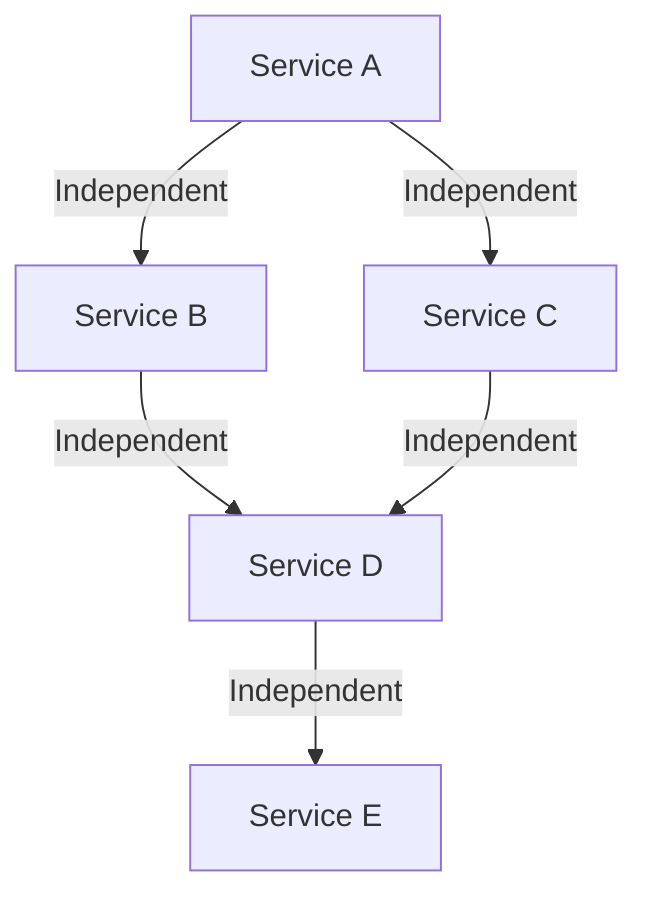

## 1.2.1 Service Autonomy

In the realm of microservices architecture, service autonomy is a fundamental principle that empowers each service to operate independently. This independence is crucial for achieving the scalability, resilience, and flexibility that modern software systems demand. In this section, we will delve into the concept of service autonomy, exploring its benefits, implementation strategies, and best practices.

### Defining Service Autonomy

Service autonomy refers to the ability of a microservice to function independently, without relying on the internal workings of other services. This independence is achieved by ensuring that each service has its own distinct responsibilities, data management, and deployment lifecycle. The goal is to create a loosely coupled system where services can evolve, scale, and fail independently, minimizing the impact on the overall system.

### Benefits of Autonomy

#### Scalability

Autonomous services can be scaled independently based on their specific needs. For instance, a service experiencing high demand can be scaled out without affecting other services. This targeted scaling approach optimizes resource utilization and reduces costs.

#### Resilience

By isolating services, autonomy enhances system resilience. If one service fails, it does not necessarily lead to a system-wide failure. This isolation allows for graceful degradation, where the system continues to function with reduced capabilities.

#### Flexibility

Autonomy provides the flexibility to update, replace, or retire services without disrupting the entire system. This flexibility accelerates innovation and reduces time-to-market for new features.

### Decentralized Data Management

A key aspect of service autonomy is decentralized data management. Each service should manage its own database, ensuring that it has complete control over its data. This approach prevents data coupling between services, allowing them to evolve independently.

**Example: Decentralized Data Management in Java**

```java
// Example of a service managing its own database connection
public class OrderService {

    private final DataSource dataSource;

    public OrderService(DataSource dataSource) {
        this.dataSource = dataSource;
    }

    public Order getOrderById(String orderId) {
        // Query the database specific to the Order service
        // Ensures data independence and autonomy
        try (Connection connection = dataSource.getConnection()) {
            // Perform database operations
        } catch (SQLException e) {
            // Handle exceptions
        }
        return null; // Return the order
    }
}
```

### Independent Deployment

One of the significant advantages of service autonomy is the ability to deploy services independently. This capability enables faster release cycles and reduces the risk associated with deployments.

**Example: Independent Deployment**

Consider a scenario where a new feature needs to be added to a payment service. With autonomous services, the payment service can be updated and deployed without affecting other services like order processing or inventory management.

### Technology Diversity

Service autonomy allows each service to choose the most suitable technology stack for its requirements. This diversity enables teams to leverage the best tools and frameworks for their specific use cases.

**Example: Technology Diversity**

- A service handling real-time data processing might use a reactive framework like Spring WebFlux.
- Another service focused on data analytics might use Apache Spark for batch processing.

### Ownership and Responsibility

Autonomous services are typically managed by dedicated teams responsible for the entire lifecycle of the service. This ownership model promotes accountability and efficiency, as teams have the authority to make decisions and implement changes swiftly.

### Avoiding Single Points of Failure

By designing services to be autonomous, the system can avoid single points of failure. Each service is isolated, meaning that a failure in one service does not cascade to others, preserving the overall system's integrity.

**Diagram: Service Autonomy and Isolation**



### Best Practices for Service Autonomy

1. **Define Clear Service Boundaries:** Ensure each service has a well-defined scope and responsibility.
2. **Minimize Interdependencies:** Reduce dependencies between services to maintain autonomy.
3. **Implement Robust APIs:** Use well-designed APIs to facilitate communication between services.
4. **Embrace Decentralized Data:** Allow each service to manage its own data to prevent tight coupling.
5. **Foster a Culture of Ownership:** Encourage teams to take full responsibility for their services.

### Conclusion

Service autonomy is a cornerstone of effective microservices architecture. By embracing autonomy, organizations can build systems that are scalable, resilient, and flexible. The principles of decentralized data management, independent deployment, and technology diversity are essential for achieving true service autonomy. By following best practices and fostering a culture of ownership, teams can create robust microservices that drive innovation and efficiency.

## Quiz Time!



### What is service autonomy in microservices?

- [x] The ability of a service to function independently without relying on other services
- [ ] The ability of a service to share data with other services
- [ ] The ability of a service to use the same technology stack as other services
- [ ] The ability of a service to be deployed with other services

> **Explanation:** Service autonomy refers to the independence of a service, allowing it to operate without relying on other services.

### How does service autonomy enhance scalability?

- [x] By allowing services to be scaled independently based on demand
- [ ] By requiring all services to be scaled together
- [ ] By using a single database for all services
- [ ] By deploying all services at once

> **Explanation:** Service autonomy allows each service to be scaled independently, optimizing resource utilization and reducing costs.

### What is a key aspect of decentralized data management?

- [x] Each service manages its own database
- [ ] All services share a single database
- [ ] Data is stored in a central repository
- [ ] Data is managed by a third-party service

> **Explanation:** Decentralized data management involves each service managing its own database, ensuring independence and autonomy.

### What is the benefit of independent deployment in microservices?

- [x] Faster release cycles and reduced deployment risk
- [ ] All services must be deployed together
- [ ] Services cannot be updated independently
- [ ] Deployment is managed by a central team

> **Explanation:** Independent deployment allows for faster release cycles and reduces the risk associated with deployments.

### How does service autonomy allow for technology diversity?

- [x] Each service can choose the most suitable technology stack
- [ ] All services must use the same technology stack
- [ ] Technology choices are limited to a single framework
- [ ] Services cannot use different programming languages

> **Explanation:** Service autonomy enables each service to choose the most appropriate technology stack for its specific needs.

### Why is ownership important in autonomous services?

- [x] It promotes accountability and efficiency
- [ ] It centralizes decision-making
- [ ] It limits the team's ability to make changes
- [ ] It requires approval from other teams

> **Explanation:** Ownership promotes accountability and efficiency, as teams have the authority to make decisions and implement changes swiftly.

### How does service autonomy help avoid single points of failure?

- [x] By isolating services, preventing failures from cascading
- [ ] By centralizing all services in one location
- [ ] By sharing resources among all services
- [ ] By using a single database for all services

> **Explanation:** Service autonomy isolates services, preventing failures in one service from affecting others.

### What is a best practice for maintaining service autonomy?

- [x] Define clear service boundaries
- [ ] Share databases between services
- [ ] Use a single technology stack for all services
- [ ] Deploy all services together

> **Explanation:** Defining clear service boundaries helps maintain autonomy by ensuring each service has a well-defined scope and responsibility.

### What role do APIs play in service autonomy?

- [x] They facilitate communication between services
- [ ] They centralize data management
- [ ] They limit the independence of services
- [ ] They enforce a single technology stack

> **Explanation:** APIs facilitate communication between services, allowing them to interact while maintaining independence.

### True or False: Service autonomy allows for faster innovation and reduced time-to-market.

- [x] True
- [ ] False

> **Explanation:** Service autonomy provides the flexibility to update, replace, or retire services without disrupting the entire system, accelerating innovation and reducing time-to-market.


