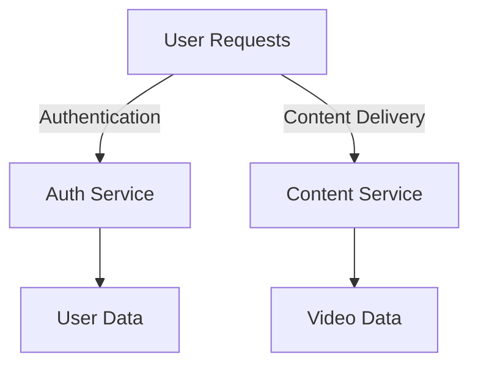

## 1.3.3 When to Use Microservices

Microservices architecture has become a popular choice for building scalable and maintainable systems. However, it's not a one-size-fits-all solution. Understanding when to use microservices involves evaluating several factors, including project size, complexity, scalability requirements, organizational structure, and more. This section provides a comprehensive guide to help you determine if microservices are the right fit for your project.

### Assessing Project Size and Complexity

Microservices are particularly beneficial for large, complex projects that encompass multiple business domains. In such projects, dividing the system into smaller, manageable services can significantly enhance development efficiency and system maintainability.

**Example Scenario:**
Consider an e-commerce platform with distinct domains such as user management, product catalog, order processing, and payment handling. Each domain can be developed as a separate microservice, allowing teams to focus on specific business functions without interfering with others.

**Java Code Example:**
```java
// Example of a simple microservice for user management
@RestController
@RequestMapping("/users")
public class UserController {

    @Autowired
    private UserService userService;

    @GetMapping("/{id}")
    public ResponseEntity<User> getUser(@PathVariable Long id) {
        User user = userService.findUserById(id);
        return ResponseEntity.ok(user);
    }

    @PostMapping("/")
    public ResponseEntity<User> createUser(@RequestBody User user) {
        User createdUser = userService.createUser(user);
        return ResponseEntity.status(HttpStatus.CREATED).body(createdUser);
    }
}
```

### Scalability Requirements

Microservices shine in scenarios where different parts of an application need to scale independently. This is crucial for applications experiencing varying loads across different components.

**Example Scenario:**
A video streaming service might need to scale its content delivery service significantly more than its user authentication service. By using microservices, each component can be scaled according to its specific load requirements.

**Mermaid Diagram:**


### Organizational Structure

Organizations with multiple, cross-functional teams can greatly benefit from the autonomy and independence offered by microservices. Each team can own and manage a specific service, promoting agility and faster development cycles.

**Example Scenario:**
A large enterprise with dedicated teams for different product lines can assign each team to develop and maintain its own set of microservices, aligning technical ownership with business responsibilities.

### Technology Diversity Needs

Microservices allow different services to use different technology stacks, which can be advantageous when specific requirements or capabilities are needed.

**Example Scenario:**
A financial application might use Java for its core transaction processing service for reliability and performance, while using Python for its data analytics service to leverage powerful data processing libraries.

### Deployment Flexibility

Microservices enable frequent and independent deployments of different application components, which is ideal for environments that require rapid iteration and continuous delivery.

**Example Scenario:**
A SaaS company can deploy updates to its billing service without affecting the rest of the application, allowing for quick bug fixes and feature releases.

### Maintenance and Upgradability

Projects where ease of maintenance, updates, and lifecycle management are critical can benefit from microservices. Each service can be updated or replaced independently, reducing the risk and complexity of system-wide changes.

**Example Scenario:**
An online marketplace can update its recommendation engine without impacting the checkout process, ensuring continuous service availability.

### Clear Business Boundaries

Having well-defined business domains is essential for effectively translating them into separate services. This clarity helps in aligning technical architecture with business goals.

**Example Scenario:**
A healthcare application can separate patient management, appointment scheduling, and billing into distinct services, each reflecting a clear business domain.

### Team Expertise and Readiness

Implementing microservices requires skilled teams and organizational maturity to handle the complexities involved. Teams need to be proficient in distributed systems, DevOps practices, and continuous integration/deployment pipelines.

**Example Scenario:**
A tech-savvy startup with experienced engineers and a strong DevOps culture is well-positioned to adopt microservices, leveraging their expertise to manage the architecture's complexities.

### Cost-Benefit Analysis

Conducting a cost-benefit analysis is crucial to determine if the benefits of microservices outweigh the associated complexities and operational costs. Consider factors such as development time, infrastructure costs, and potential performance gains.

**Example Scenario:**
A company evaluates the cost of migrating its monolithic application to microservices against the expected improvements in scalability and maintainability.

### Decision Framework

To assist in evaluating whether microservices are the right fit, consider the following checklist:

1. **Project Complexity:** Is the project large and complex with multiple business domains?
2. **Scalability Needs:** Do different parts of the application require independent scaling?
3. **Organizational Structure:** Does the organization have multiple cross-functional teams?
4. **Technology Diversity:** Are there specific technology requirements for different services?
5. **Deployment Frequency:** Is there a need for frequent and independent deployments?
6. **Maintenance Requirements:** Is ease of maintenance and upgradability a priority?
7. **Business Domain Clarity:** Are business domains well-defined and separable?
8. **Team Expertise:** Does the team have the necessary skills and experience?
9. **Cost-Benefit Analysis:** Do the benefits outweigh the costs and complexities?

By carefully considering these factors, organizations can make informed decisions about adopting microservices, ensuring alignment with their technical and business objectives.

## Quiz Time!



### Which project characteristic makes microservices particularly beneficial?

- [x] Large and complex with multiple business domains
- [ ] Small and simple with a single business domain
- [ ] Projects with no clear business boundaries
- [ ] Projects with minimal scalability needs

> **Explanation:** Microservices are ideal for large, complex projects with multiple business domains, allowing for better management and scalability.

### What is a key advantage of microservices in terms of scalability?

- [x] Independent scaling of different application components
- [ ] Uniform scaling of the entire application
- [ ] No need for scaling
- [ ] Scaling only during initial deployment

> **Explanation:** Microservices allow different parts of an application to scale independently, which is crucial for handling varying loads.

### How can microservices benefit organizations with multiple cross-functional teams?

- [x] By providing autonomy and independence to each team
- [ ] By enforcing a single team to manage all services
- [ ] By reducing the need for team collaboration
- [ ] By centralizing all decision-making processes

> **Explanation:** Microservices enable cross-functional teams to manage their own services independently, promoting agility and faster development cycles.

### Why might an organization choose different technology stacks for different microservices?

- [x] To meet specific requirements or leverage unique capabilities
- [ ] To simplify the overall technology landscape
- [ ] To reduce the number of technologies used
- [ ] To enforce a single technology standard

> **Explanation:** Microservices allow for technology diversity, enabling different services to use the most suitable technology stack for their specific needs.

### What deployment advantage do microservices offer?

- [x] Frequent and independent deployments of different components
- [ ] A single deployment for the entire application
- [ ] Infrequent deployments to minimize changes
- [ ] Deployments only during major updates

> **Explanation:** Microservices support frequent and independent deployments, allowing for rapid iteration and continuous delivery.

### What is essential for effectively translating business domains into microservices?

- [x] Well-defined business boundaries
- [ ] A single, unified business domain
- [ ] Minimal business domain separation
- [ ] Undefined business boundaries

> **Explanation:** Clear business boundaries are crucial for effectively translating them into separate microservices.

### What is a critical factor in determining the readiness for microservices adoption?

- [x] Team expertise and organizational maturity
- [ ] The number of available developers
- [ ] The simplicity of the existing system
- [ ] The absence of any existing architecture

> **Explanation:** Skilled teams and organizational maturity are necessary to handle the complexities of microservices.

### What should be considered in a cost-benefit analysis for microservices?

- [x] Development time, infrastructure costs, and performance gains
- [ ] Only the initial development cost
- [ ] The cost of maintaining a monolithic system
- [ ] The number of services to be developed

> **Explanation:** A comprehensive cost-benefit analysis should include development time, infrastructure costs, and potential performance gains.

### What is a key question in the decision framework for adopting microservices?

- [x] Does the project require independent scaling of components?
- [ ] Is the project small and simple?
- [ ] Are there no clear business domains?
- [ ] Is there a need for a single deployment strategy?

> **Explanation:** Independent scaling needs are a critical consideration in deciding whether to adopt microservices.

### True or False: Microservices are suitable for every project regardless of size and complexity.

- [ ] True
- [x] False

> **Explanation:** Microservices are not suitable for every project; they are best suited for large, complex projects with specific needs for scalability, technology diversity, and independent deployments.


