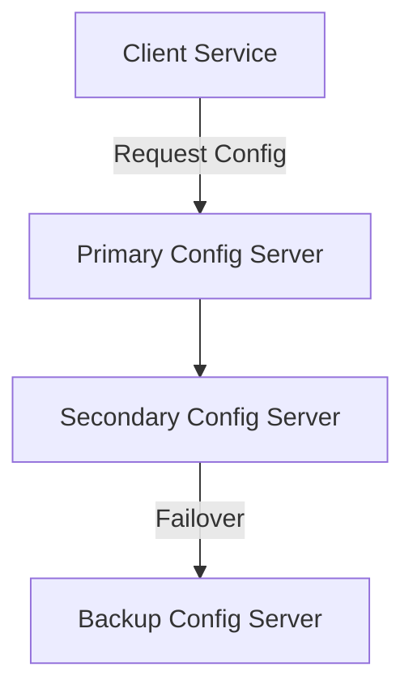
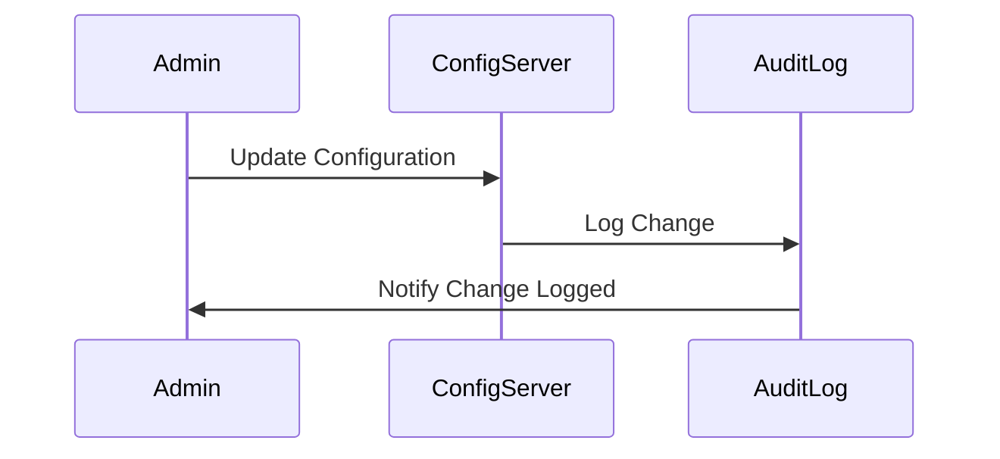

## 10.2.1 Managing Configurations at Scale

In the dynamic world of microservices, managing configurations at scale is a critical challenge. As systems grow in complexity, the need for a robust configuration management strategy becomes paramount. This section delves into the intricacies of centralized configuration management, exploring its necessity, implementation strategies, and best practices.

### Understanding the Need for Centralization

Centralized configuration management is essential for maintaining consistency, ease of management, and scalability in large-scale microservices architectures. In a microservices environment, each service may have its own configuration settings, which can lead to inconsistencies and difficulties in managing configurations across the system. Centralization addresses these issues by:

- **Ensuring Consistency:** By storing all configurations in a central repository, teams can ensure that every service uses the same configuration settings, reducing discrepancies and potential errors.
- **Simplifying Management:** Centralized management allows for easier updates and modifications, as changes can be made in one place and propagated across all services.
- **Enhancing Scalability:** As the number of services grows, centralized configuration management scales more effectively than managing configurations individually for each service.

### Implement Centralized Configuration Repositories

To implement centralized configuration management, organizations can use tools like Spring Cloud Config Server, HashiCorp Consul, or etcd. These tools provide a centralized repository for storing and managing configuration data.

#### Spring Cloud Config Server

Spring Cloud Config Server provides server-side and client-side support for externalized configuration in a distributed system. It allows you to manage configurations for multiple environments and applications.

```java
// Example of a Spring Cloud Config Server setup
@SpringBootApplication
@EnableConfigServer
public class ConfigServerApplication {
    public static void main(String[] args) {
        SpringApplication.run(ConfigServerApplication.class, args);
    }
}
```

#### HashiCorp Consul

Consul is a service mesh solution that provides service discovery, configuration, and segmentation functionality. It can be used to store configuration data and distribute it to services.

```hcl
// Example Consul configuration for storing key-value pairs
key = "config/serviceA/database"
value = "jdbc:mysql://localhost:3306/mydb"
```

#### etcd

etcd is a distributed key-value store that provides a reliable way to store data across a cluster of machines. It is often used for storing configuration data and service discovery.

```bash
etcdctl put /config/serviceA/database "jdbc:mysql://localhost:3306/mydb"
```

### Use Hierarchical Configuration Structures

Organizing configurations hierarchically allows for inheritance and overriding of settings, simplifying management and promoting reusability. This approach enables you to define common configurations at a higher level and override them at a more specific level when necessary.

```yaml
default:
  database:
    url: jdbc:mysql://localhost:3306/defaultdb
    username: defaultUser
    password: defaultPass

development:
  database:
    url: jdbc:mysql://localhost:3306/devdb

production:
  database:
    url: jdbc:mysql://prod-db-server:3306/proddb
    username: prodUser
    password: prodPass
```

### Leverage Version Control Systems

Integrating centralized configuration repositories with version control systems like Git is crucial for tracking changes, enabling rollbacks, and facilitating collaborative configuration management. This integration ensures that all changes are documented and can be audited.

```bash
git init
git add config.yml
git commit -m "Initial configuration setup"
git push origin main
```

### Ensure High Availability

High availability is critical for centralized configuration servers to prevent single points of failure. Implement redundancy and failover mechanisms to ensure that configurations are always accessible.



### Implement Access Controls

Security is paramount in configuration management. Implement strict access controls and authentication mechanisms to secure centralized configuration repositories, ensuring that only authorized personnel can modify configurations.

- **Role-Based Access Control (RBAC):** Define roles and permissions for accessing and modifying configurations.
- **Authentication:** Use secure authentication methods such as OAuth2 or LDAP.

### Automate Configuration Deployment

Automating the deployment and distribution of configurations using CI/CD pipelines reduces manual errors and ensures timely updates. Automation tools can trigger configuration updates whenever changes are committed to the repository.

```yaml
stages:
  - deploy

deploy:
  script:
    - echo "Deploying configurations..."
    - ./deploy-configs.sh
```

### Monitor and Audit Configurations

Monitoring and auditing configuration changes are essential for maintaining visibility, detecting unauthorized modifications, and ensuring compliance with governance policies. Implement logging and alerting mechanisms to track changes and notify relevant stakeholders.



### Conclusion

Managing configurations at scale in a microservices architecture requires a strategic approach that emphasizes centralization, security, and automation. By implementing centralized configuration repositories, leveraging hierarchical structures, and integrating with version control systems, organizations can achieve consistency, scalability, and ease of management. Ensuring high availability, implementing access controls, and automating deployment further enhance the robustness of the configuration management process. Monitoring and auditing provide the necessary oversight to maintain compliance and security.

For further exploration, consider diving into the official documentation of tools like Spring Cloud Config, HashiCorp Consul, and etcd, as well as exploring resources on CI/CD best practices and security in configuration management.

## Quiz Time!



### Why is centralized configuration management essential in microservices?

- [x] It ensures consistency and ease of management.
- [ ] It allows each service to have its own unique configuration.
- [ ] It eliminates the need for version control.
- [ ] It reduces the number of services needed.

> **Explanation:** Centralized configuration management ensures consistency across services and simplifies management, which is crucial in a microservices architecture.

### Which tool is NOT typically used for centralized configuration management?

- [ ] Spring Cloud Config Server
- [ ] HashiCorp Consul
- [x] Apache Kafka
- [ ] etcd

> **Explanation:** Apache Kafka is primarily used for messaging and event streaming, not for configuration management.

### What is a benefit of using hierarchical configuration structures?

- [x] They allow inheritance and overriding of settings.
- [ ] They eliminate the need for centralized repositories.
- [ ] They make configurations more complex.
- [ ] They require more manual intervention.

> **Explanation:** Hierarchical configuration structures allow for inheritance and overriding, simplifying management and promoting reusability.

### How does integrating with version control systems benefit configuration management?

- [x] It enables tracking changes and rollbacks.
- [ ] It makes configurations immutable.
- [ ] It requires manual updates for every change.
- [ ] It eliminates the need for CI/CD pipelines.

> **Explanation:** Version control systems track changes, enable rollbacks, and facilitate collaborative management of configurations.

### What is the purpose of implementing access controls in configuration management?

- [x] To secure repositories and restrict unauthorized access.
- [ ] To allow anyone to modify configurations.
- [ ] To simplify configuration structures.
- [ ] To automate deployment processes.

> **Explanation:** Access controls secure configuration repositories, ensuring only authorized personnel can modify configurations.

### Which of the following is a method to ensure high availability of configuration servers?

- [x] Implementing redundancy and failover mechanisms
- [ ] Using a single server for all configurations
- [ ] Disabling authentication
- [ ] Storing configurations locally on each service

> **Explanation:** Redundancy and failover mechanisms ensure high availability, preventing single points of failure.

### What role does automation play in configuration deployment?

- [x] It reduces manual errors and ensures timely updates.
- [ ] It increases the complexity of deployment.
- [ ] It requires manual intervention for each update.
- [ ] It eliminates the need for centralized repositories.

> **Explanation:** Automation reduces manual errors and ensures timely updates by deploying configurations automatically.

### Why is monitoring and auditing configurations important?

- [x] To maintain visibility and detect unauthorized modifications.
- [ ] To make configurations more complex.
- [ ] To eliminate the need for access controls.
- [ ] To ensure configurations are never changed.

> **Explanation:** Monitoring and auditing provide visibility, detect unauthorized changes, and ensure compliance with governance policies.

### Which of the following is NOT a benefit of centralized configuration management?

- [ ] Consistency across services
- [ ] Simplified management
- [ ] Enhanced scalability
- [x] Increased complexity

> **Explanation:** Centralized configuration management reduces complexity by providing a single source of truth for configurations.

### True or False: Centralized configuration management eliminates the need for security measures.

- [ ] True
- [x] False

> **Explanation:** Security measures are still essential in centralized configuration management to protect sensitive data and ensure only authorized access.


