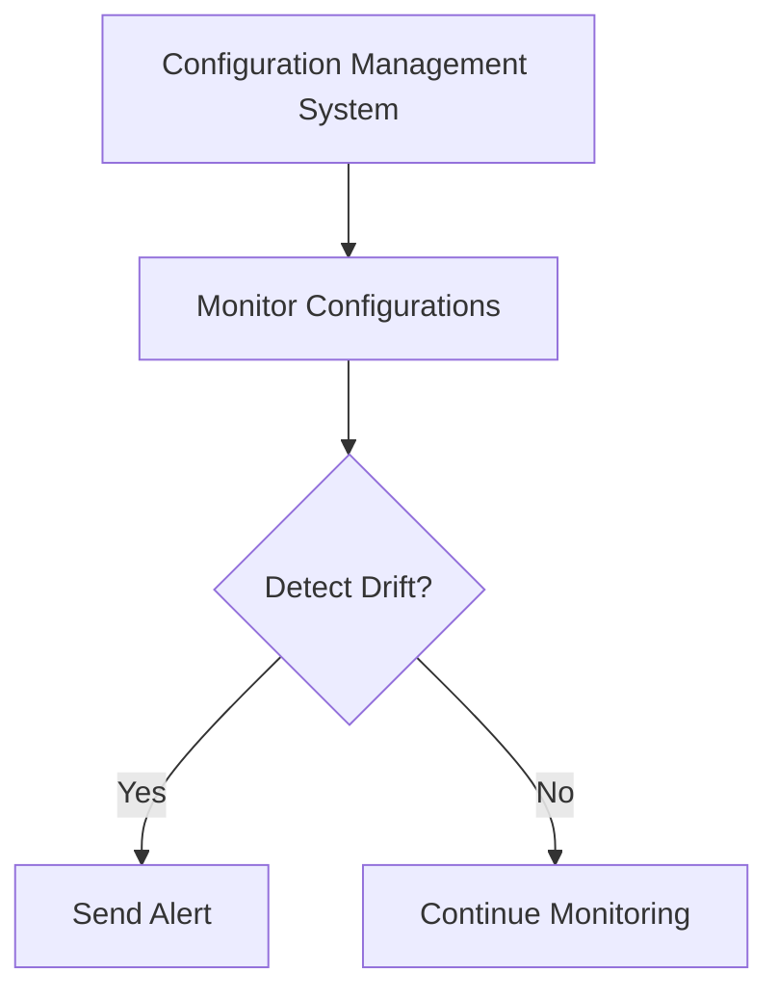

---

linkTitle: "10.2.3 Consistency Across Services"
title: "Ensuring Consistency Across Microservices: Configuration Management Patterns"
description: "Explore strategies for maintaining configuration consistency across microservices, including validation, naming conventions, templates, automation, and centralized policy enforcement."
categories:
- Microservices
- Configuration Management
- Software Architecture
tags:
- Microservices
- Configuration Consistency
- Centralized Configuration
- Automation
- Policy Enforcement
date: 2024-10-25
type: docs
nav_weight: 10230

---

## 10.2.3 Consistency Across Services

In the realm of microservices, ensuring consistency across services is paramount to maintaining a stable and reliable system. Configuration consistency involves ensuring that all microservices have coherent and compatible configuration settings, preventing conflicts and inconsistencies that can lead to system failures or degraded performance. This section delves into the strategies and best practices for achieving configuration consistency across microservices.

### Defining Configuration Consistency

Configuration consistency refers to the practice of maintaining uniform and compatible configuration settings across all microservices within a system. This involves ensuring that each service operates under a coherent set of parameters that align with the overall system architecture and business requirements. Inconsistent configurations can lead to unexpected behaviors, security vulnerabilities, and operational inefficiencies.

### Implementing Configuration Validation

To prevent configuration-related errors, it's crucial to implement validation mechanisms that check configuration data for correctness and compatibility before applying it to services. This can be achieved through:

- **Schema Validation:** Use JSON Schema or XML Schema to define the structure and constraints of configuration files. This ensures that configurations adhere to expected formats and values.
  
- **Automated Testing:** Integrate configuration validation into your CI/CD pipeline to automatically test configurations for correctness before deployment.

- **Compatibility Checks:** Implement checks to ensure that configuration changes do not introduce incompatibilities with other services or system components.

#### Example: Java Configuration Validation

```java
import org.everit.json.schema.Schema;
import org.everit.json.schema.loader.SchemaLoader;
import org.json.JSONObject;
import org.json.JSONTokener;

public class ConfigurationValidator {
    public static void main(String[] args) {
        JSONObject jsonSchema = new JSONObject(
            new JSONTokener(ConfigurationValidator.class.getResourceAsStream("/config-schema.json")));
        JSONObject jsonSubject = new JSONObject(
            new JSONTokener(ConfigurationValidator.class.getResourceAsStream("/config.json")));

        Schema schema = SchemaLoader.load(jsonSchema);
        schema.validate(jsonSubject); // throws a ValidationException if this object is invalid
    }
}
```

In this example, a JSON schema is used to validate a configuration file, ensuring it meets predefined criteria before being applied.

### Use Consistent Naming Conventions

Adopting consistent naming conventions for configuration parameters across all microservices enhances clarity and reduces misunderstandings. Consistent naming helps developers and operators quickly understand the purpose and usage of configuration settings.

- **Standard Prefixes:** Use standard prefixes for related configuration parameters (e.g., `db.connection.timeout`, `api.rate.limit`).

- **Descriptive Names:** Ensure parameter names are descriptive and self-explanatory.

- **Case and Separator Consistency:** Decide on a case (camelCase, snake_case) and separator (dots, underscores) and apply it consistently.

### Leverage Templates and Standards

Using configuration templates and standards ensures uniformity in configuration structures, promoting consistency and simplifying management. Templates can be used to define common configuration patterns that can be reused across services.

- **Configuration Templates:** Create templates for common configurations such as database connections, logging, and security settings.

- **Standardized Formats:** Use standardized formats like YAML or JSON for configuration files to facilitate parsing and validation.

#### Example: Configuration Template

```yaml
database:
  host: ${DB_HOST}
  port: ${DB_PORT}
  username: ${DB_USER}
  password: ${DB_PASS}

logging:
  level: INFO
  format: json
```

This YAML template can be used across multiple services, ensuring consistent database and logging configurations.

### Automate Consistency Checks

Automating consistency checks using tools or scripts is essential to verify configurations across services, ensuring adherence to established standards. Automation reduces the risk of human error and ensures timely detection of inconsistencies.

- **Configuration Linting:** Use linting tools to automatically check configurations for adherence to style and structure guidelines.

- **Continuous Monitoring:** Implement continuous monitoring of configurations to detect and alert on deviations from expected values.

### Implement Centralized Policy Enforcement

Centralized policy enforcement involves establishing policies that govern configuration settings, ensuring all microservices comply with organizational standards and requirements. This can be achieved through:

- **Policy Definition:** Define policies for critical configuration aspects such as security, performance, and compliance.

- **Policy Enforcement Tools:** Use tools like Open Policy Agent (OPA) to enforce policies across services.

#### Example: Open Policy Agent for Configuration Policies

```rego
package config.policies

default allow = false

allow {
    input.database.port == 5432
    input.logging.level == "INFO"
}
```

This OPA policy ensures that the database port is set to 5432 and the logging level is INFO, enforcing consistency across services.

### Use Environment Segmentation

Segmenting environments (e.g., development, staging, production) and enforcing consistent configurations within each segment maintains uniformity across services in the same environment. This approach helps manage configuration differences between environments while ensuring consistency within each.

- **Environment-Specific Configurations:** Use environment variables or configuration files to manage environment-specific settings.

- **Segmentation Strategies:** Define clear boundaries and rules for configuration changes across environments.

### Monitor and Alert on Inconsistencies

Monitoring configurations for inconsistencies and setting up alerts to notify teams when discrepancies are detected is crucial for prompt resolution. Effective monitoring involves:

- **Configuration Drift Detection:** Use tools to detect and report configuration drift, where configurations deviate from the desired state.

- **Alerting Systems:** Implement alerting systems to notify relevant teams of inconsistencies, enabling quick corrective actions.

#### Example: Configuration Drift Detection



This diagram illustrates a simple workflow for detecting configuration drift and alerting teams to take action.

### Best Practices and Common Pitfalls

- **Best Practices:**
  - Regularly review and update configuration templates and standards.
  - Involve cross-functional teams in defining configuration policies.
  - Use version control for configuration files to track changes and facilitate rollback.

- **Common Pitfalls:**
  - Ignoring environment-specific configuration needs can lead to inconsistencies.
  - Over-reliance on manual processes increases the risk of errors.
  - Failing to automate validation and consistency checks can result in undetected issues.

### Conclusion

Ensuring consistency across microservices is a critical aspect of configuration management. By implementing validation mechanisms, adopting consistent naming conventions, leveraging templates, automating checks, enforcing centralized policies, segmenting environments, and monitoring for inconsistencies, organizations can achieve reliable and coherent configurations across their microservices architecture. These practices not only enhance system stability but also streamline operations and reduce the risk of configuration-related issues.

## Quiz Time!



### What is configuration consistency in microservices?

- [x] Ensuring all microservices have coherent and compatible configuration settings
- [ ] Ensuring all microservices use the same programming language
- [ ] Ensuring all microservices are deployed on the same server
- [ ] Ensuring all microservices have the same number of instances

> **Explanation:** Configuration consistency involves maintaining uniform and compatible configuration settings across all microservices to prevent conflicts and inconsistencies.

### How can configuration validation be implemented?

- [x] Using schema validation and automated testing
- [ ] By manually checking each configuration file
- [ ] By deploying configurations without validation
- [ ] By using the same configuration for all services

> **Explanation:** Configuration validation can be implemented using schema validation and automated testing to ensure correctness and compatibility before deployment.

### What is a benefit of using consistent naming conventions for configuration parameters?

- [x] Enhances clarity and reduces misunderstandings
- [ ] Increases the size of configuration files
- [ ] Makes configurations harder to read
- [ ] Forces all services to use the same settings

> **Explanation:** Consistent naming conventions enhance clarity and reduce misunderstandings by making configuration parameters more understandable.

### What role do configuration templates play in consistency?

- [x] They ensure uniformity in configuration structures
- [ ] They increase the complexity of configurations
- [ ] They are only used in development environments
- [ ] They replace the need for configuration validation

> **Explanation:** Configuration templates ensure uniformity in configuration structures, promoting consistency and simplifying management.

### Why is automating consistency checks important?

- [x] It reduces the risk of human error
- [ ] It eliminates the need for configuration files
- [ ] It ensures all services use the same codebase
- [ ] It makes manual checks unnecessary

> **Explanation:** Automating consistency checks reduces the risk of human error and ensures timely detection of inconsistencies.

### What is the purpose of centralized policy enforcement?

- [x] To ensure all microservices comply with organizational standards
- [ ] To centralize all microservices on a single server
- [ ] To enforce the use of a single programming language
- [ ] To eliminate the need for configuration files

> **Explanation:** Centralized policy enforcement ensures that all microservices comply with organizational standards and requirements.

### How does environment segmentation help in configuration management?

- [x] It maintains uniformity across services in the same environment
- [ ] It forces all environments to use the same configurations
- [ ] It eliminates the need for environment-specific settings
- [ ] It complicates the deployment process

> **Explanation:** Environment segmentation helps maintain uniformity across services in the same environment while managing configuration differences between environments.

### What is configuration drift detection?

- [x] Detecting and reporting deviations from the desired configuration state
- [ ] Automatically updating configurations to the latest version
- [ ] Ensuring all configurations are identical
- [ ] Removing unused configuration parameters

> **Explanation:** Configuration drift detection involves detecting and reporting deviations from the desired configuration state to maintain consistency.

### What is a common pitfall in configuration management?

- [x] Over-reliance on manual processes
- [ ] Automating consistency checks
- [ ] Using configuration templates
- [ ] Implementing validation mechanisms

> **Explanation:** Over-reliance on manual processes increases the risk of errors and is a common pitfall in configuration management.

### True or False: Using version control for configuration files is unnecessary.

- [ ] True
- [x] False

> **Explanation:** Using version control for configuration files is essential for tracking changes and facilitating rollback, making it a necessary practice.


