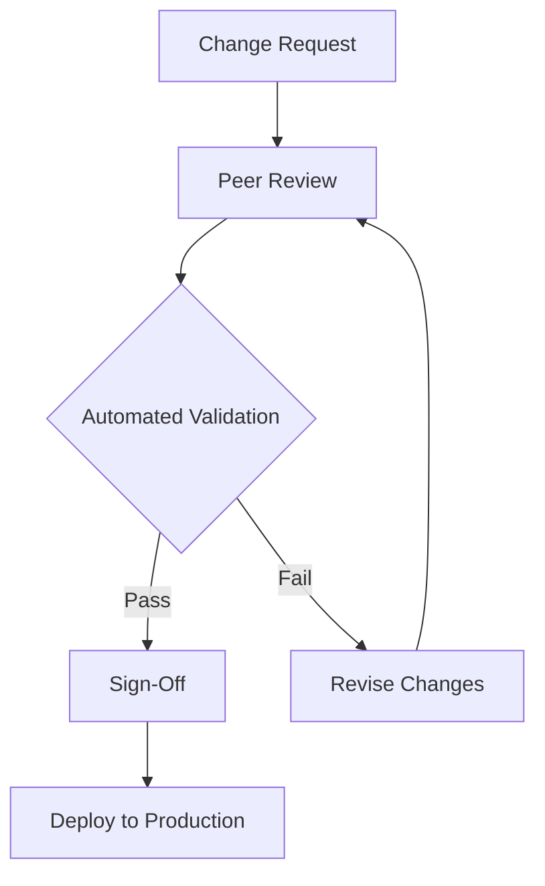

## 10.4.2 Handling Configuration Changes

In the dynamic world of microservices, configuration changes are inevitable. These changes can range from simple updates to environment variables to more complex alterations in service behavior. Properly managing these changes is crucial to ensure system stability and reliability. This section delves into the structured approach of configuration change management, offering insights and best practices for handling these changes effectively.

### Configuration Change Management

Configuration change management refers to the systematic approach to handling modifications in configuration settings. It ensures that changes are implemented smoothly, safely, and with minimal disruption to the system. This involves planning, testing, approving, and monitoring changes to maintain system integrity and performance.

**Key Components of Configuration Change Management:**

- **Planning:** Identify the scope and impact of the change.
- **Testing:** Validate changes in a controlled environment.
- **Approval:** Obtain necessary approvals before deployment.
- **Deployment:** Implement changes using safe deployment strategies.
- **Monitoring:** Track the impact of changes in real-time.

### Implementing Change Approval Processes

A robust change approval process is vital to prevent unauthorized or potentially harmful changes from reaching production. This process typically involves:

- **Peer Reviews:** Engage team members to review changes for potential issues.
- **Automated Validation:** Use automated tools to validate changes against predefined criteria.
- **Sign-Offs:** Require formal approval from stakeholders or change advisory boards.

**Example of a Change Approval Workflow:**



### Using Blue-Green or Canary Deployments for Changes

Deployment strategies like Blue-Green and Canary Releases are effective in minimizing risks associated with configuration changes.

- **Blue-Green Deployment:** Maintain two identical environments (Blue and Green). Deploy changes to the inactive environment and switch traffic once validated.

- **Canary Release:** Gradually roll out changes to a small subset of users, monitoring for issues before full deployment.

**Benefits:**

- **Risk Reduction:** Limits the impact of potential issues.
- **Quick Rollback:** Allows easy reversion to the previous state if problems arise.

### Employing Feature Flags for Configurations

Feature flags are a powerful tool for managing configuration changes. They allow you to toggle features on or off without deploying new code, facilitating incremental rollouts and quick rollbacks.

**Advantages of Feature Flags:**

- **Granular Control:** Enable or disable features for specific user groups.
- **Safe Testing:** Test new configurations in production without affecting all users.
- **Rapid Rollback:** Instantly revert changes if issues are detected.

**Java Example Using a Feature Flag Library:**

```java
import com.example.FeatureFlagManager;

public class FeatureToggleExample {
    public static void main(String[] args) {
        FeatureFlagManager featureFlagManager = new FeatureFlagManager();

        if (featureFlagManager.isFeatureEnabled("newConfigFeature")) {
            // New configuration logic
            System.out.println("New configuration is active.");
        } else {
            // Fallback to old configuration
            System.out.println("Using old configuration.");
        }
    }
}
```

### Defining Rollback Procedures for Configurations

Having a well-documented rollback procedure is crucial for quickly reverting configuration changes if they lead to issues.

**Steps for Effective Rollback Procedures:**

1. **Document Changes:** Keep detailed records of all configuration changes.
2. **Automate Rollback:** Use scripts or tools to automate the rollback process.
3. **Test Rollback:** Regularly test rollback procedures to ensure they work as expected.

### Automating Testing of Configuration Changes

Automated testing is essential to validate configuration changes and assess their impact before they reach production.

**Types of Tests to Automate:**

- **Unit Tests:** Validate individual configuration settings.
- **Integration Tests:** Ensure configurations work across services.
- **Load Tests:** Assess performance under expected load conditions.

**Example of a Simple Configuration Test in Java:**

```java
import org.junit.jupiter.api.Test;
import static org.junit.jupiter.api.Assertions.*;

public class ConfigurationTest {
    @Test
    public void testConfigurationSetting() {
        String expectedValue = "expectedValue";
        String actualValue = System.getProperty("configKey");

        assertEquals(expectedValue, actualValue, "Configuration setting does not match expected value.");
    }
}
```

### Communicating Configuration Changes

Effective communication is key to ensuring all relevant teams and stakeholders are aware of configuration changes and prepared for potential impacts.

**Best Practices for Communication:**

- **Change Logs:** Maintain detailed logs of all changes.
- **Notifications:** Use email, chat, or dashboards to notify teams.
- **Documentation:** Update documentation to reflect changes.

### Monitoring and Auditing Configuration Changes

Monitoring and auditing are critical for maintaining accountability and traceability of configuration changes.

**Tools and Techniques:**

- **Logging:** Record all configuration changes and access attempts.
- **Monitoring:** Use tools to track the impact of changes in real-time.
- **Auditing:** Regularly review logs to identify unauthorized changes or anomalies.

**Example of a Simple Logging Setup in Java:**

```java
import java.util.logging.Logger;

public class ConfigurationLogger {
    private static final Logger logger = Logger.getLogger(ConfigurationLogger.class.getName());

    public static void logChange(String configKey, String oldValue, String newValue) {
        logger.info(String.format("Configuration changed: %s from %s to %s", configKey, oldValue, newValue));
    }
}
```

### Conclusion

Handling configuration changes in microservices requires a structured approach to ensure stability and reliability. By implementing change approval processes, using deployment strategies like Blue-Green or Canary Releases, employing feature flags, defining rollback procedures, automating testing, communicating effectively, and monitoring changes, organizations can manage configuration changes effectively and minimize risks.

## Quiz Time!



### What is the primary goal of configuration change management?

- [x] To ensure changes are implemented smoothly and safely
- [ ] To increase the frequency of configuration changes
- [ ] To eliminate the need for configuration changes
- [ ] To automate all configuration changes

> **Explanation:** Configuration change management aims to ensure that changes are implemented smoothly and safely, minimizing disruption to the system.

### Which deployment strategy involves maintaining two identical environments for safe deployment?

- [x] Blue-Green Deployment
- [ ] Canary Release
- [ ] Rolling Update
- [ ] A/B Testing

> **Explanation:** Blue-Green Deployment involves maintaining two identical environments (Blue and Green) to safely deploy changes and switch traffic once validated.

### What is a key advantage of using feature flags for configuration changes?

- [x] Granular control over feature rollout
- [ ] Eliminating the need for testing
- [ ] Reducing the number of configuration changes
- [ ] Increasing system complexity

> **Explanation:** Feature flags provide granular control over feature rollout, allowing for safe testing and rapid rollback if issues are detected.

### What is a critical step in defining rollback procedures for configurations?

- [x] Documenting changes and automating rollback
- [ ] Increasing the frequency of changes
- [ ] Eliminating rollback procedures
- [ ] Reducing testing efforts

> **Explanation:** Documenting changes and automating rollback procedures are critical steps to ensure quick reversion if issues arise.

### Why is automated testing important for configuration changes?

- [x] To validate changes and assess impact before production
- [ ] To eliminate the need for manual testing
- [ ] To increase the number of configuration changes
- [ ] To reduce system complexity

> **Explanation:** Automated testing is important to validate configuration changes and assess their impact before they reach production, ensuring stability.

### How can effective communication of configuration changes be achieved?

- [x] Using change logs, notifications, and updated documentation
- [ ] By reducing the number of changes
- [ ] By eliminating communication channels
- [ ] By increasing system complexity

> **Explanation:** Effective communication can be achieved through change logs, notifications, and updated documentation to ensure all stakeholders are informed.

### What is the purpose of monitoring and auditing configuration changes?

- [x] To maintain accountability and traceability
- [ ] To eliminate the need for configuration changes
- [ ] To increase system complexity
- [ ] To reduce the frequency of changes

> **Explanation:** Monitoring and auditing configuration changes help maintain accountability and traceability, ensuring system integrity.

### Which tool is commonly used for logging configuration changes in Java?

- [x] java.util.logging.Logger
- [ ] System.out.println
- [ ] java.io.FileWriter
- [ ] java.sql.Connection

> **Explanation:** The `java.util.logging.Logger` is commonly used for logging configuration changes in Java, providing a structured approach to logging.

### What is a benefit of using automated validation in change approval processes?

- [x] Ensuring changes meet predefined criteria before deployment
- [ ] Eliminating the need for peer reviews
- [ ] Increasing the number of configuration changes
- [ ] Reducing system complexity

> **Explanation:** Automated validation ensures that changes meet predefined criteria before deployment, reducing the risk of introducing issues.

### True or False: Feature flags allow for incremental rollout and easy rollback of configuration changes.

- [x] True
- [ ] False

> **Explanation:** Feature flags allow for incremental rollout and easy rollback of configuration changes, providing flexibility and control.


