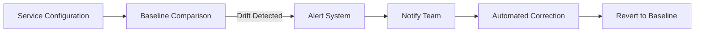

## 10.4.3 Monitoring Configuration Drift

In the dynamic world of microservices, maintaining consistent configurations across distributed services is crucial for ensuring reliability, security, and performance. Configuration drift, the gradual divergence between the intended configuration state and the actual configuration state of services, poses significant challenges to system integrity. This section delves into the intricacies of monitoring configuration drift, offering practical insights and strategies to detect, correct, and prevent it effectively.

### Understanding Configuration Drift

Configuration drift occurs when the configuration of a system deviates from its intended state over time. This can happen due to manual changes, software updates, or environmental changes that are not reflected in the configuration management system. Drift can lead to inconsistencies, security vulnerabilities, and operational issues, making it essential to monitor and manage proactively.

### Implementing Drift Detection Tools

To effectively monitor configuration drift, organizations can leverage a variety of tools designed to detect and report discrepancies. Some popular tools include:

- **Chef InSpec:** A compliance automation tool that allows you to define the desired state of your infrastructure as code and continuously verify that your systems are configured correctly.
  
- **Ansible Compliance:** Ansible provides modules and playbooks to check system configurations against predefined policies, ensuring compliance and detecting drift.
  
- **Terraform Sentinel:** A policy-as-code framework that integrates with Terraform to enforce compliance and detect configuration drift during infrastructure provisioning.

These tools automate the process of detecting drift, providing real-time insights into configuration changes and enabling swift corrective actions.

### Establishing Baseline Configurations

A baseline configuration serves as a reference point representing the desired state of a system. By establishing and maintaining baseline configurations, organizations can compare current configurations against these baselines to identify drift. Baselines should be version-controlled and updated regularly to reflect any intentional changes in the system.

```java
// Example of defining a baseline configuration in Java
public class BaselineConfiguration {
    private String serviceName;
    private Map<String, String> expectedConfig;

    public BaselineConfiguration(String serviceName, Map<String, String> expectedConfig) {
        this.serviceName = serviceName;
        this.expectedConfig = expectedConfig;
    }

    public boolean isCompliant(Map<String, String> currentConfig) {
        return expectedConfig.equals(currentConfig);
    }
}
```

In this example, a `BaselineConfiguration` class is used to define the expected configuration for a service. The `isCompliant` method checks if the current configuration matches the baseline.

### Automating Drift Correction

Automating the correction of configuration drift is crucial for maintaining system integrity. This can be achieved by integrating remediation actions within CI/CD pipelines or using configuration management tools to enforce desired states. For instance, if a drift is detected, an automated script can be triggered to revert the configuration to its baseline state.

```java
// Example of automating drift correction
public class DriftCorrection {
    public void correctDrift(BaselineConfiguration baseline, Map<String, String> currentConfig) {
        if (!baseline.isCompliant(currentConfig)) {
            // Logic to revert to baseline configuration
            System.out.println("Drift detected. Reverting to baseline configuration.");
            // Code to apply baseline configuration
        }
    }
}
```

This Java snippet demonstrates a simple drift correction mechanism that checks for compliance and reverts configurations if drift is detected.

### Monitoring Drift in Real-Time

Real-time monitoring and alerting systems are essential for detecting configuration drift as it occurs. By setting up alerts, teams can respond promptly to discrepancies, minimizing potential impacts on system performance and security. Tools like Prometheus and Grafana can be configured to monitor configuration metrics and trigger alerts when deviations are detected.



This diagram illustrates a real-time drift monitoring workflow, where configuration changes are continuously compared to baselines, triggering alerts and automated corrections when drift is detected.

### Auditing Configuration Histories

Auditing configuration histories and change logs is vital for understanding the origins of configuration drift and preventing future occurrences. By maintaining detailed records of configuration changes, teams can identify patterns and root causes of drift, informing future configuration management practices.

### Implementing Policy Enforcement

Policy enforcement mechanisms automatically prevent or rectify configuration drift by ensuring that all services adhere to defined configuration policies. Tools like Terraform Sentinel can enforce policies during infrastructure provisioning, while Chef InSpec can continuously verify compliance.

### Educating Teams on Configuration Best Practices

Educating development and operations teams on best practices for configuration management is crucial for minimizing the likelihood of configuration drift. Training should focus on the importance of maintaining consistent configurations, using version control for configuration files, and adhering to established policies and procedures.

### Conclusion

Monitoring configuration drift is a critical aspect of maintaining robust and reliable microservices architectures. By leveraging automated tools, establishing baseline configurations, and implementing real-time monitoring and policy enforcement, organizations can effectively manage configuration drift, ensuring system integrity and performance.

## Quiz Time!



### What is configuration drift?

- [x] The divergence between the intended configuration state and the actual configuration state over time.
- [ ] The process of updating configurations to match new requirements.
- [ ] The synchronization of configurations across multiple services.
- [ ] The manual adjustment of configurations by developers.

> **Explanation:** Configuration drift refers to the divergence between the intended configuration state and the actual configuration state of services over time.

### Which tool is used for compliance automation and drift detection?

- [x] Chef InSpec
- [ ] Docker
- [ ] Jenkins
- [ ] Git

> **Explanation:** Chef InSpec is a compliance automation tool that helps detect configuration drift by verifying that systems are configured correctly.

### What is the purpose of a baseline configuration?

- [x] To serve as a reference point for the desired state of a system.
- [ ] To automate the deployment of new services.
- [ ] To provide a backup of configuration files.
- [ ] To manage user access and permissions.

> **Explanation:** A baseline configuration serves as a reference point representing the desired state of a system, against which current configurations are compared to identify drift.

### How can configuration drift be corrected automatically?

- [x] By integrating remediation actions within CI/CD pipelines.
- [ ] By manually updating configuration files.
- [ ] By restarting the affected services.
- [ ] By disabling configuration management tools.

> **Explanation:** Automating the correction of configuration drift can be achieved by integrating remediation actions within CI/CD pipelines or using configuration management tools to enforce desired states.

### What is the role of real-time monitoring in configuration drift management?

- [x] To detect configuration drift as it occurs and enable prompt responses.
- [ ] To archive configuration files for future reference.
- [ ] To automate the deployment of new configurations.
- [ ] To manage user access to configuration tools.

> **Explanation:** Real-time monitoring and alerting systems are essential for detecting configuration drift as it occurs, enabling prompt responses to discrepancies.

### Why is auditing configuration histories important?

- [x] To understand the origins of configuration drift and prevent future occurrences.
- [ ] To automate the correction of configuration drift.
- [ ] To manage user access and permissions.
- [ ] To provide a backup of configuration files.

> **Explanation:** Auditing configuration histories and change logs helps understand the origins of configuration drift and informs future configuration management practices.

### How can policy enforcement help in managing configuration drift?

- [x] By ensuring that all services adhere to defined configuration policies.
- [ ] By automatically updating configuration files.
- [ ] By providing real-time alerts for configuration changes.
- [ ] By managing user access to configuration tools.

> **Explanation:** Policy enforcement mechanisms automatically prevent or rectify configuration drift by ensuring that all services adhere to defined configuration policies.

### What is the benefit of educating teams on configuration best practices?

- [x] To minimize the likelihood of configuration drift and promote accountability.
- [ ] To automate the correction of configuration drift.
- [ ] To manage user access and permissions.
- [ ] To provide a backup of configuration files.

> **Explanation:** Educating teams on configuration best practices helps minimize the likelihood of configuration drift and promotes accountability in maintaining consistent configurations.

### Which of the following is a tool for policy enforcement during infrastructure provisioning?

- [x] Terraform Sentinel
- [ ] Docker
- [ ] Jenkins
- [ ] Git

> **Explanation:** Terraform Sentinel is a policy-as-code framework that integrates with Terraform to enforce compliance and detect configuration drift during infrastructure provisioning.

### Configuration drift can lead to security vulnerabilities.

- [x] True
- [ ] False

> **Explanation:** Configuration drift can lead to inconsistencies and security vulnerabilities, making it essential to monitor and manage proactively.


