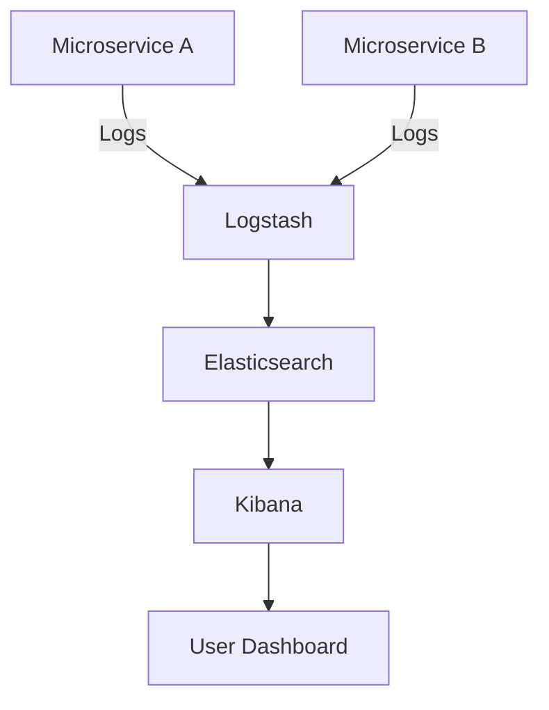

## 11.1.1 Logging Strategies

In the realm of microservices, observability is crucial for understanding the behavior and performance of distributed systems. Logging is one of the three pillars of observability, alongside metrics and tracing. It involves recording events, errors, and informational messages generated by microservices, providing a detailed trail of application behavior. This section delves into effective logging strategies that enhance observability in microservices architectures.

### Defining Logging in Observability

Logging serves as the backbone of observability by capturing granular details about the execution of microservices. It provides insights into the internal state and operations of services, helping developers and operators diagnose issues, understand system behavior, and ensure smooth operation. Logs can include a variety of information, such as error messages, transaction details, user activities, and system events.

### Implement Structured Logging

Structured logging is a practice that involves logging data in a consistent, machine-readable format, such as JSON. This approach facilitates easier parsing, searching, and analysis of log data. Unlike traditional unstructured logs, structured logs allow for more efficient data processing and integration with log management tools.

#### Benefits of Structured Logging

- **Enhanced Searchability:** Structured logs can be easily indexed and searched, enabling quick retrieval of relevant information.
- **Improved Analysis:** Tools can parse structured logs to generate insights, identify patterns, and detect anomalies.
- **Consistency:** A uniform log format across services simplifies log aggregation and analysis.

#### Implementing Structured Logging in Java

Here's a simple example of structured logging using the popular logging library SLF4J with Logback in a Java microservice:

```java
import org.slf4j.Logger;
import org.slf4j.LoggerFactory;
import org.slf4j.MDC;

public class OrderService {
    private static final Logger logger = LoggerFactory.getLogger(OrderService.class);

    public void processOrder(String orderId) {
        // Add orderId to the MDC (Mapped Diagnostic Context)
        MDC.put("orderId", orderId);

        logger.info("Processing order");

        try {
            // Order processing logic
        } catch (Exception e) {
            logger.error("Error processing order", e);
        } finally {
            // Clear the MDC
            MDC.clear();
        }
    }
}
```

In this example, the `orderId` is added to the MDC, ensuring that it is included in every log entry, facilitating easier correlation of logs.

### Centralize Log Management

Centralizing log management is essential for efficiently aggregating, storing, and retrieving log data from multiple services. Platforms like the ELK Stack (Elasticsearch, Logstash, Kibana), Splunk, or Fluentd provide robust solutions for centralized log management.

#### Benefits of Centralized Log Management

- **Aggregation:** Collect logs from various sources into a single repository.
- **Visualization:** Use dashboards to visualize log data and gain insights.
- **Alerting:** Set up alerts based on specific log patterns or anomalies.

#### Example of Centralized Log Management with ELK Stack



In this diagram, logs from multiple microservices are sent to Logstash, which processes and forwards them to Elasticsearch. Kibana then provides a user-friendly interface for querying and visualizing the logs.

### Set Log Levels Appropriately

Setting appropriate log levels is crucial to balance the granularity of information and the volume of log data generated. Common log levels include DEBUG, INFO, WARN, and ERROR.

- **DEBUG:** Detailed information for diagnosing issues, typically disabled in production.
- **INFO:** General information about application operations.
- **WARN:** Indications of potential issues that do not interrupt service.
- **ERROR:** Errors that require immediate attention.

#### Guidelines for Setting Log Levels

- Use DEBUG for development and testing environments to capture detailed information.
- Limit INFO logs to significant events or state changes.
- Reserve WARN and ERROR for issues that need attention or indicate failures.

### Ensure Correlation of Logs

In a microservices architecture, requests often span multiple services. Correlating logs across these services is essential for tracing requests and transactions through the system. This can be achieved using unique identifiers, such as correlation IDs.

#### Implementing Correlation IDs

Correlation IDs can be passed through HTTP headers or message payloads. Here's an example of adding a correlation ID to HTTP requests in a Java Spring Boot application:

```java
import org.springframework.web.filter.OncePerRequestFilter;

import javax.servlet.FilterChain;
import javax.servlet.ServletException;
import javax.servlet.http.HttpServletRequest;
import javax.servlet.http.HttpServletResponse;
import java.io.IOException;
import java.util.UUID;

public class CorrelationIdFilter extends OncePerRequestFilter {

    @Override
    protected void doFilterInternal(HttpServletRequest request, HttpServletResponse response, FilterChain filterChain)
            throws ServletException, IOException {
        String correlationId = request.getHeader("X-Correlation-ID");
        if (correlationId == null) {
            correlationId = UUID.randomUUID().toString();
        }
        MDC.put("correlationId", correlationId);
        response.setHeader("X-Correlation-ID", correlationId);

        try {
            filterChain.doFilter(request, response);
        } finally {
            MDC.clear();
        }
    }
}
```

This filter ensures that each request has a correlation ID, which is included in the logs for tracing purposes.

### Implement Log Rotation and Retention Policies

Log rotation and retention policies help manage disk space usage and ensure compliance with data retention regulations. These policies define how long logs are kept and when they are archived or deleted.

#### Best Practices for Log Rotation and Retention

- **Rotate Logs Regularly:** Use tools like Logrotate to automatically rotate logs based on size or time.
- **Define Retention Periods:** Set retention periods based on business and compliance requirements.
- **Archive Logs:** Move old logs to cheaper storage for long-term retention.

### Secure Log Data

Securing log data is critical to prevent unauthorized access and ensure that logs do not expose confidential information. Implement access controls, encrypt sensitive information, and regularly audit log access.

#### Security Measures for Log Data

- **Access Controls:** Restrict log access to authorized personnel.
- **Encryption:** Encrypt logs at rest and in transit.
- **Redaction:** Remove or mask sensitive information in logs.

### Automate Log Analysis

Automating log analysis can proactively identify issues and patterns within log data. Tools and techniques like log parsers, anomaly detection, and machine learning can enhance log analysis.

#### Benefits of Automated Log Analysis

- **Proactive Issue Detection:** Identify issues before they impact users.
- **Pattern Recognition:** Detect unusual patterns or trends in log data.
- **Reduced Manual Effort:** Automate routine log analysis tasks.

### Conclusion

Effective logging strategies are vital for achieving observability in microservices architectures. By implementing structured logging, centralizing log management, setting appropriate log levels, ensuring log correlation, and securing log data, organizations can gain valuable insights into their systems. Automating log analysis further enhances the ability to detect and resolve issues proactively.

For further exploration, consider resources like the official documentation for ELK Stack, Splunk, and Fluentd, as well as books and online courses on observability and logging in microservices.

## Quiz Time!



### What is the primary purpose of logging in microservices?

- [x] To provide a detailed trail of application behavior
- [ ] To replace metrics and tracing
- [ ] To reduce the need for monitoring
- [ ] To eliminate the need for debugging

> **Explanation:** Logging provides a detailed trail of application behavior, helping diagnose issues and understand system operations.

### What is a key benefit of structured logging?

- [x] Enhanced searchability and analysis
- [ ] Reduced log file size
- [ ] Increased complexity
- [ ] Decreased performance

> **Explanation:** Structured logging enhances searchability and analysis by using consistent, machine-readable formats like JSON.

### Which tool is commonly used for centralized log management?

- [x] ELK Stack
- [ ] Jenkins
- [ ] Docker
- [ ] Git

> **Explanation:** The ELK Stack (Elasticsearch, Logstash, Kibana) is commonly used for centralized log management.

### What is the purpose of setting log levels?

- [x] To balance information granularity and log volume
- [ ] To increase log file size
- [ ] To decrease system performance
- [ ] To eliminate the need for debugging

> **Explanation:** Log levels help balance the granularity of information and the volume of log data generated.

### How can logs be correlated across microservices?

- [x] Using correlation IDs
- [ ] By increasing log verbosity
- [ ] By reducing log levels
- [ ] By using different log formats

> **Explanation:** Correlation IDs help trace requests and transactions across microservices.

### What is a best practice for log rotation?

- [x] Rotate logs based on size or time
- [ ] Keep all logs indefinitely
- [ ] Delete logs immediately after use
- [ ] Rotate logs manually

> **Explanation:** Rotating logs based on size or time helps manage disk space and compliance.

### Why is securing log data important?

- [x] To prevent unauthorized access and protect sensitive information
- [ ] To reduce log file size
- [ ] To increase system performance
- [ ] To eliminate the need for encryption

> **Explanation:** Securing log data prevents unauthorized access and protects sensitive information.

### What is a benefit of automating log analysis?

- [x] Proactive issue detection
- [ ] Increased manual effort
- [ ] Decreased pattern recognition
- [ ] Reduced searchability

> **Explanation:** Automating log analysis helps proactively detect issues and recognize patterns.

### Which log level is typically used for development and testing environments?

- [x] DEBUG
- [ ] INFO
- [ ] WARN
- [ ] ERROR

> **Explanation:** DEBUG level is used for detailed information during development and testing.

### True or False: Structured logging formats like JSON make it easier to parse and analyze log data.

- [x] True
- [ ] False

> **Explanation:** Structured logging formats like JSON facilitate easier parsing and analysis of log data.


