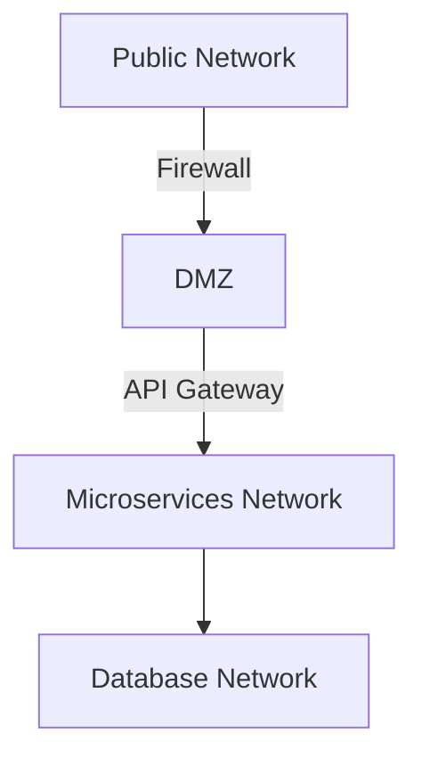

---

linkTitle: "12.1.2 Defense in Depth"
title: "Defense in Depth: A Multilayered Security Approach for Microservices"
description: "Explore Defense in Depth as a comprehensive security strategy for microservices, emphasizing perimeter security, network segmentation, IAM, encryption, IDPS, and more."
categories:
- Security
- Microservices
- Architecture
tags:
- Defense in Depth
- Microservices Security
- Network Segmentation
- IAM
- Encryption
date: 2024-10-25
type: docs
nav_weight: 1212000
---

## 12.1.2 Defense in Depth

In the rapidly evolving landscape of microservices, ensuring robust security is paramount. The Defense in Depth strategy offers a comprehensive approach to safeguarding microservices by implementing multiple layers of security controls. This multilayered approach ensures that if one layer is compromised, others continue to protect the system, thereby reducing the risk of a successful attack. Let's delve into the key components of Defense in Depth and how they can be effectively applied to microservices architecture.

### Defining Defense in Depth

Defense in Depth is a security strategy that employs a series of defensive mechanisms to protect information and systems. In the context of microservices, it involves deploying multiple overlapping security measures across different layers of the architecture. This approach is akin to having multiple lines of defense, where each layer provides a unique form of protection, collectively enhancing the overall security posture.

### Implement Perimeter Security

Perimeter security serves as the first line of defense against external threats. It involves establishing controls at the boundary of the microservices architecture to prevent unauthorized access. Key components include:

- **Firewalls:** These act as barriers between trusted internal networks and untrusted external networks, filtering incoming and outgoing traffic based on predefined security rules.

- **API Gateways:** Acting as intermediaries, API gateways manage and secure API traffic by enforcing policies, rate limiting, and authentication. They also provide a centralized point for logging and monitoring API requests.

```java
// Example of using a firewall rule in a Java-based application
public class FirewallRule {
    private String sourceIp;
    private String destinationIp;
    private String protocol;
    private int port;

    public FirewallRule(String sourceIp, String destinationIp, String protocol, int port) {
        this.sourceIp = sourceIp;
        this.destinationIp = destinationIp;
        this.protocol = protocol;
        this.port = port;
    }

    public boolean isAllowed() {
        // Implement logic to check if the traffic is allowed
        return true; // Placeholder for actual logic
    }
}
```

### Enforce Network Segmentation

Network segmentation involves dividing a network into smaller, isolated segments or zones. This practice limits the scope of potential breaches and prevents lateral movement within the network. By isolating microservices into different network zones, organizations can:

- **Reduce Attack Surface:** Limit the exposure of critical services to potential threats.

- **Enhance Security Controls:** Apply tailored security policies to each segment based on its specific needs and risk profile.



### Apply Identity and Access Management (IAM)

Identity and Access Management (IAM) is crucial for controlling access to microservices. A robust IAM system ensures that only authorized users and services can access specific resources. Key aspects include:

- **Authentication:** Verifying the identity of users and services using methods such as OAuth 2.0, OpenID Connect, or SAML.

- **Authorization:** Defining and enforcing policies that determine what authenticated users and services can do.

- **Role-Based Access Control (RBAC):** Assigning permissions based on user roles, ensuring that users have the minimum necessary access.

```java
// Example of implementing RBAC in Java
public class AccessControl {
    private Map<String, Set<String>> rolePermissions;

    public AccessControl() {
        rolePermissions = new HashMap<>();
        rolePermissions.put("admin", Set.of("read", "write", "delete"));
        rolePermissions.put("user", Set.of("read"));
    }

    public boolean hasPermission(String role, String permission) {
        return rolePermissions.getOrDefault(role, Collections.emptySet()).contains(permission);
    }
}
```

### Use Encryption at All Layers

Encryption is a fundamental component of Defense in Depth, protecting data both in transit and at rest. By encrypting sensitive information, organizations can prevent unauthorized access and ensure data integrity.

- **Data in Transit:** Use Transport Layer Security (TLS) to encrypt data as it moves between microservices and external clients.

- **Data at Rest:** Employ encryption standards such as AES to secure stored data, ensuring it remains protected even if storage media are compromised.

```java
// Example of encrypting data using AES in Java
import javax.crypto.Cipher;
import javax.crypto.KeyGenerator;
import javax.crypto.SecretKey;
import javax.crypto.spec.SecretKeySpec;

public class EncryptionExample {
    public static byte[] encrypt(String data, SecretKey key) throws Exception {
        Cipher cipher = Cipher.getInstance("AES");
        cipher.init(Cipher.ENCRYPT_MODE, key);
        return cipher.doFinal(data.getBytes());
    }

    public static void main(String[] args) throws Exception {
        KeyGenerator keyGen = KeyGenerator.getInstance("AES");
        SecretKey secretKey = keyGen.generateKey();
        byte[] encryptedData = encrypt("Sensitive Data", secretKey);
        System.out.println("Encrypted Data: " + new String(encryptedData));
    }
}
```

### Implement Intrusion Detection and Prevention Systems (IDPS)

Intrusion Detection and Prevention Systems (IDPS) are essential for monitoring network traffic and identifying potential threats. These systems provide real-time alerts and automated responses to suspicious activities, helping to mitigate risks before they escalate.

- **Intrusion Detection Systems (IDS):** Monitor network traffic for signs of malicious activity and generate alerts.

- **Intrusion Prevention Systems (IPS):** Actively block detected threats, preventing them from reaching the target.

### Deploy Security Monitoring Tools

Continuous security monitoring is vital for maintaining a secure microservices environment. By deploying monitoring tools, organizations can track and analyze security events, ensuring timely detection and remediation of vulnerabilities.

- **Log Management:** Collect and analyze logs from various sources to identify patterns and anomalies.

- **Security Information and Event Management (SIEM):** Aggregate and analyze security data from across the network to provide a comprehensive view of the security posture.

### Encourage Regular Security Audits

Regular security audits and penetration testing are critical for evaluating the effectiveness of implemented security measures. These practices help identify gaps, ensure compliance with security policies, and provide insights for continuous improvement.

- **Security Audits:** Systematic evaluations of the security controls and practices in place.

- **Penetration Testing:** Simulated attacks to identify vulnerabilities and assess the resilience of the system.

### Conclusion

Defense in Depth is a comprehensive security strategy that provides multiple layers of protection for microservices. By implementing perimeter security, network segmentation, IAM, encryption, IDPS, and continuous monitoring, organizations can significantly enhance their security posture. Regular audits and testing further ensure that security measures remain effective and up-to-date. By adopting these practices, organizations can safeguard their microservices against a wide range of threats, ensuring the integrity, confidentiality, and availability of their systems.

## Quiz Time!



### What is the primary goal of Defense in Depth?

- [x] To provide multiple layers of security controls
- [ ] To eliminate all security threats
- [ ] To simplify security management
- [ ] To reduce the cost of security

> **Explanation:** Defense in Depth aims to provide multiple layers of security controls to protect against various threats.

### Which component is essential for perimeter security in microservices?

- [x] API Gateway
- [ ] Database
- [ ] Load Balancer
- [ ] Message Queue

> **Explanation:** An API Gateway is essential for perimeter security, managing and securing API traffic.

### What is the purpose of network segmentation?

- [x] To isolate microservices into different network zones
- [ ] To increase network speed
- [ ] To reduce network costs
- [ ] To simplify network architecture

> **Explanation:** Network segmentation isolates microservices into different zones, reducing the risk of lateral movement in case of a breach.

### Which protocol is commonly used to encrypt data in transit?

- [x] TLS
- [ ] HTTP
- [ ] FTP
- [ ] SMTP

> **Explanation:** TLS (Transport Layer Security) is commonly used to encrypt data in transit.

### What does IAM stand for in the context of security?

- [x] Identity and Access Management
- [ ] Internet Access Management
- [ ] Information Access Management
- [ ] Integrated Access Management

> **Explanation:** IAM stands for Identity and Access Management, which controls user identities and access.

### What is the role of an Intrusion Detection System (IDS)?

- [x] To monitor network traffic for signs of malicious activity
- [ ] To encrypt data at rest
- [ ] To manage user identities
- [ ] To optimize network performance

> **Explanation:** An IDS monitors network traffic for signs of malicious activity and generates alerts.

### Why are regular security audits important?

- [x] To evaluate the effectiveness of security measures
- [ ] To increase system performance
- [ ] To reduce operational costs
- [ ] To simplify system architecture

> **Explanation:** Regular security audits evaluate the effectiveness of security measures and identify gaps.

### What is a common encryption standard for data at rest?

- [x] AES
- [ ] HTTP
- [ ] SSL
- [ ] DNS

> **Explanation:** AES (Advanced Encryption Standard) is a common encryption standard for data at rest.

### Which tool is used for aggregating and analyzing security data?

- [x] SIEM
- [ ] VPN
- [ ] CDN
- [ ] DNS

> **Explanation:** SIEM (Security Information and Event Management) aggregates and analyzes security data.

### Defense in Depth is a single-layer security approach.

- [ ] True
- [x] False

> **Explanation:** Defense in Depth is a multilayered security approach, not a single-layer one.


