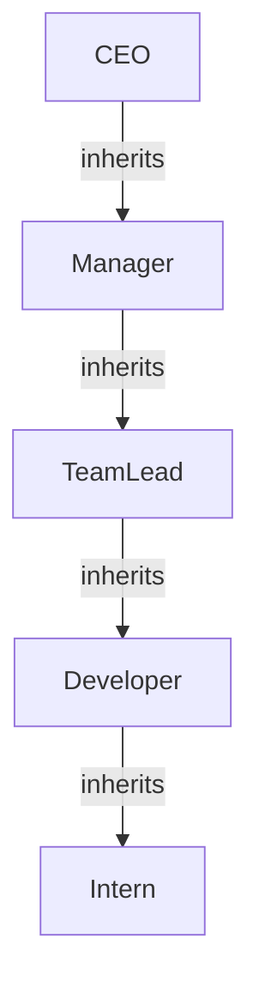

## 12.2.3 Role-Based Access Control (RBAC)

In the realm of microservices, managing access control efficiently and securely is paramount. Role-Based Access Control (RBAC) is a widely adopted method that restricts system access based on user roles, ensuring that individuals can only perform actions and access resources necessary for their roles. This approach not only enhances security but also simplifies the management of permissions across distributed systems.

### Understanding Role-Based Access Control (RBAC)

RBAC is a method of access control where permissions are assigned to roles rather than individual users. Users are then assigned to roles, thereby inheriting the permissions associated with those roles. This model is particularly effective in environments where users' responsibilities are well-defined and can be grouped into roles.

#### Key Concepts of RBAC

- **Roles:** A collection of permissions that define what actions a user can perform and what resources they can access.
- **Permissions:** Specific rights to perform certain operations or access particular resources.
- **Users:** Individuals who are assigned roles, thereby gaining the permissions associated with those roles.

### Designing Role Hierarchies

Designing effective role hierarchies is crucial for implementing RBAC. A well-structured hierarchy reflects the organizational structure and job functions, promoting clear and manageable access control policies.

#### Steps to Design Role Hierarchies

1. **Identify Organizational Units:** Understand the different departments and teams within the organization.
2. **Define Job Functions:** List the specific tasks and responsibilities associated with each role.
3. **Create Role Hierarchies:** Organize roles in a hierarchy that reflects the organizational structure, allowing for inheritance of permissions where applicable.

#### Example of Role Hierarchy



In this hierarchy, a CEO inherits all permissions from Manager, TeamLead, Developer, and Intern roles, while a Developer inherits permissions from the Intern role.

### Assigning Permissions to Roles

Assigning permissions to roles requires a balance between granularity and complexity. The principle of least privilege should guide this process, ensuring that roles have only the permissions necessary to perform their functions.

#### Guidelines for Assigning Permissions

- **Granularity:** Define permissions at a level that supports specific job functions without being overly broad.
- **Least Privilege:** Assign the minimum necessary permissions to each role.
- **Review and Adjust:** Regularly review permissions to adapt to changes in job functions or security requirements.

### Implementing RBAC in Microservices

Implementing RBAC in a microservices architecture involves using middleware or authorization services that enforce role-based permissions for API requests and service interactions.

#### Middleware for RBAC

Middleware can intercept requests to microservices, checking the user's role and associated permissions before allowing access. This approach centralizes access control logic, making it easier to manage and audit.

#### Example: Java Implementation with Spring Security

```java
import org.springframework.security.config.annotation.web.builders.HttpSecurity;
import org.springframework.security.config.annotation.web.configuration.EnableWebSecurity;
import org.springframework.security.config.annotation.web.configuration.WebSecurityConfigurerAdapter;

@EnableWebSecurity
public class SecurityConfig extends WebSecurityConfigurerAdapter {

    @Override
    protected void configure(HttpSecurity http) throws Exception {
        http
            .authorizeRequests()
            .antMatchers("/admin/**").hasRole("ADMIN")
            .antMatchers("/user/**").hasAnyRole("USER", "ADMIN")
            .antMatchers("/public/**").permitAll()
            .and()
            .formLogin();
    }
}
```

In this example, Spring Security is used to define access rules based on roles. The `hasRole` and `hasAnyRole` methods specify which roles are required to access certain endpoints.

### Managing Role Assignments

Dynamic management of role assignments is essential for adapting to changing job functions and security requirements. Administrators should be able to assign or revoke roles as needed.

#### Best Practices for Role Management

- **Automated Role Assignment:** Use identity management systems to automate role assignments based on user attributes.
- **Audit Trails:** Maintain logs of role assignments and changes for accountability.
- **Regular Reviews:** Periodically review role assignments to ensure they align with current job functions.

### Auditing and Monitoring RBAC Policies

Regular auditing and monitoring of RBAC policies and role assignments are crucial for ensuring compliance and detecting anomalies.

#### Importance of Auditing

- **Compliance:** Ensure that access control policies meet regulatory requirements.
- **Anomaly Detection:** Identify unauthorized access attempts or unusual role assignments.
- **Policy Enforcement:** Verify that RBAC policies are being correctly enforced across all services.

### Integrating RBAC with Identity Providers

Integrating RBAC systems with external identity providers can streamline role and permission management across different services and applications.

#### Benefits of Integration

- **Centralized Management:** Manage roles and permissions from a single platform.
- **Synchronization:** Ensure consistent role assignments across all services.
- **Scalability:** Easily scale access control as the organization grows.

### RBAC Best Practices

Implementing RBAC effectively requires adherence to best practices that ensure security and manageability.

#### Key Best Practices

- **Regular Role Reviews:** Periodically review role definitions to ensure they reflect current organizational needs.
- **Minimize High-Privilege Roles:** Limit the number of roles with extensive permissions to reduce security risks.
- **Track Role Changes:** Log all role changes for accountability and audit purposes.

### Conclusion

Role-Based Access Control (RBAC) is a powerful tool for managing access in microservices architectures. By defining clear role hierarchies, assigning appropriate permissions, and leveraging middleware for enforcement, organizations can achieve secure and scalable access management. Regular auditing, integration with identity providers, and adherence to best practices further enhance the effectiveness of RBAC implementations.

## Quiz Time!



### What is the primary purpose of Role-Based Access Control (RBAC)?

- [x] To restrict system access based on user roles
- [ ] To provide unrestricted access to all users
- [ ] To manage network configurations
- [ ] To encrypt data in transit

> **Explanation:** RBAC is designed to restrict system access based on user roles, ensuring that users can only perform actions and access resources necessary for their roles.

### Which principle should guide the assignment of permissions to roles in RBAC?

- [x] Principle of least privilege
- [ ] Principle of maximum privilege
- [ ] Principle of equal access
- [ ] Principle of redundancy

> **Explanation:** The principle of least privilege ensures that roles have only the permissions necessary to perform their functions, reducing security risks.

### In a role hierarchy, what does a higher-level role inherit from a lower-level role?

- [x] Permissions
- [ ] Users
- [ ] Data
- [ ] Network access

> **Explanation:** In a role hierarchy, a higher-level role inherits the permissions of lower-level roles, allowing for efficient management of access rights.

### What is a key benefit of integrating RBAC with external identity providers?

- [x] Centralized management of roles and permissions
- [ ] Increased complexity in role assignments
- [ ] Decentralized access control
- [ ] Reduced security

> **Explanation:** Integrating RBAC with external identity providers allows for centralized management of roles and permissions, ensuring consistency across services.

### What is a common tool used in Java for implementing RBAC in microservices?

- [x] Spring Security
- [ ] Apache Kafka
- [ ] Docker
- [ ] Jenkins

> **Explanation:** Spring Security is a popular framework in Java for implementing RBAC, providing tools to define and enforce access control policies.

### Why is auditing RBAC policies important?

- [x] To ensure compliance and detect anomalies
- [ ] To increase the number of roles
- [ ] To simplify network configurations
- [ ] To encrypt data

> **Explanation:** Auditing RBAC policies is crucial for ensuring compliance with regulations and detecting unauthorized access attempts or anomalies.

### What is a recommended practice for managing role assignments?

- [x] Regular reviews of role assignments
- [ ] Assigning maximum privileges to all users
- [ ] Avoiding automation in role management
- [ ] Using static role assignments only

> **Explanation:** Regular reviews of role assignments help ensure that they align with current job functions and security requirements.

### How can middleware be used in RBAC implementation?

- [x] By intercepting requests and enforcing role-based permissions
- [ ] By encrypting data at rest
- [ ] By managing network traffic
- [ ] By storing user credentials

> **Explanation:** Middleware can intercept requests to microservices, checking user roles and permissions before granting access, thus enforcing RBAC policies.

### What should be minimized to reduce security risks in RBAC?

- [x] High-privilege roles
- [ ] Low-privilege roles
- [ ] Number of users
- [ ] Network connections

> **Explanation:** Minimizing high-privilege roles reduces the risk of unauthorized access and potential security breaches.

### True or False: RBAC eliminates the need for regular audits and monitoring.

- [ ] True
- [x] False

> **Explanation:** Regular audits and monitoring are essential in RBAC to ensure compliance, detect anomalies, and maintain effective access control.


