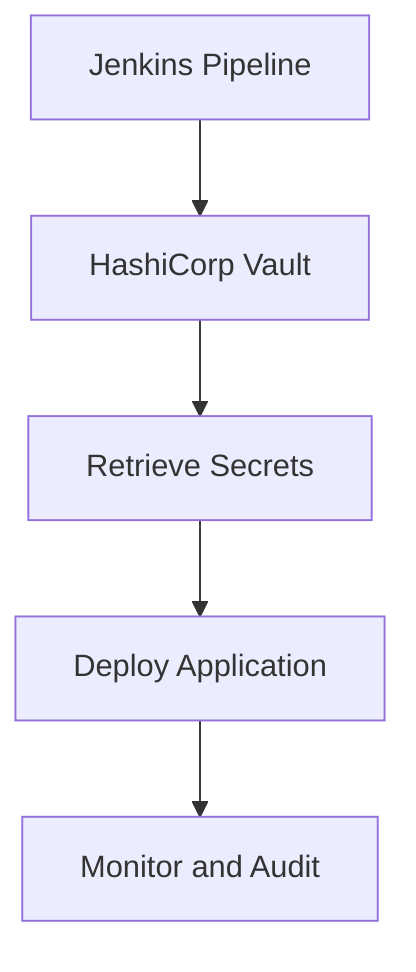

---

linkTitle: "12.4.2 Secret Management Solutions"
title: "Secret Management Solutions: Securely Managing Sensitive Information in Microservices"
description: "Explore comprehensive strategies for secret management in microservices, including centralized secret stores, strong authentication, encryption, secret rotation, and integration with CI/CD pipelines."
categories:
- Microservices
- Security
- DevOps
tags:
- Secret Management
- HashiCorp Vault
- AWS Secrets Manager
- Encryption
- CI/CD
date: 2024-10-25
type: docs
nav_weight: 12420

---

## 12.4.2 Secret Management Solutions

In the world of microservices, managing sensitive information such as API keys, passwords, certificates, and tokens is crucial for maintaining the security and integrity of your applications. This section delves into the best practices and solutions for secret management, ensuring that your microservices architecture remains secure and resilient.

### Defining Secret Management

Secret management is the practice of securely storing, accessing, and managing sensitive information required by applications and services. In a microservices architecture, where services are distributed and often communicate over networks, the risk of exposing sensitive data increases. Effective secret management mitigates these risks by providing a secure mechanism to handle sensitive information.

### Implement Centralized Secret Stores

Centralized secret stores are essential for managing secrets across a distributed microservices architecture. Tools like HashiCorp Vault, AWS Secrets Manager, Azure Key Vault, and Kubernetes Secrets offer robust solutions for securely storing and distributing secrets.

#### HashiCorp Vault

HashiCorp Vault is a popular open-source tool that provides a secure store for secrets. It supports dynamic secrets, encryption as a service, and access control policies.

```java
// Example: Retrieving a secret from HashiCorp Vault using Java
import com.bettercloud.vault.Vault;
import com.bettercloud.vault.VaultConfig;
import com.bettercloud.vault.response.LogicalResponse;

public class VaultExample {
    public static void main(String[] args) throws Exception {
        VaultConfig config = new VaultConfig()
            .address("http://127.0.0.1:8200")
            .token("your-vault-token")
            .build();

        Vault vault = new Vault(config);
        LogicalResponse response = vault.logical().read("secret/data/myapp/config");

        String secretValue = response.getData().get("my-secret-key");
        System.out.println("Retrieved secret: " + secretValue);
    }
}
```

#### AWS Secrets Manager

AWS Secrets Manager allows you to easily rotate, manage, and retrieve database credentials, API keys, and other secrets throughout their lifecycle.

#### Azure Key Vault

Azure Key Vault helps safeguard cryptographic keys and secrets used by cloud applications and services. It provides secure key management capabilities.

#### Kubernetes Secrets

Kubernetes Secrets allow you to store and manage sensitive information, such as passwords, OAuth tokens, and SSH keys, in your Kubernetes cluster.

### Use Strong Authentication for Secret Access

Strong authentication is vital to ensure that only authorized entities can access secrets. Implementing IAM roles, service accounts, and other authentication mechanisms helps control access to secret management systems.

- **IAM Roles:** Use IAM roles to grant permissions to access secrets based on the principle of least privilege.
- **Service Accounts:** In Kubernetes, use service accounts to authenticate applications and services accessing secrets.

### Encrypt Secrets at Rest and in Transit

Encryption is a fundamental security measure to protect secrets from unauthorized access. Ensure that secrets are encrypted both at rest and in transit.

- **Encryption at Rest:** Use encryption algorithms to secure secrets stored in databases or secret management systems.
- **Encryption in Transit:** Use TLS/SSL to encrypt data transmitted over networks, preventing interception by unauthorized parties.

### Implement Secret Rotation Policies

Regularly rotating secrets reduces the risk of long-term compromise. Implement secret rotation policies to automatically update and distribute new secrets.

- **Automated Rotation:** Use tools like AWS Secrets Manager to automate the rotation of secrets, minimizing manual intervention.
- **Policy Definition:** Define policies that specify the frequency and conditions for secret rotation.

### Manage Secret Versioning and History

Secret versioning and history management allow you to track changes, audit access, and roll back to previous versions if necessary.

- **Version Control:** Maintain a history of secret versions to facilitate auditing and rollback.
- **Audit Trails:** Keep detailed logs of secret access and modifications for compliance and security analysis.

### Integrate Secrets with CI/CD Pipelines

Integrating secret management solutions with CI/CD pipelines ensures that automated deployments can access necessary secrets without exposing them in code repositories or logs.

- **Environment Variables:** Use environment variables to pass secrets to applications during deployment.
- **Secret Injection:** Inject secrets into containers or applications at runtime, avoiding hardcoding in source code.

### Audit and Monitor Secret Access

Auditing and monitoring secret access activities are crucial for detecting and responding to unauthorized access attempts or anomalies.

- **Access Logs:** Maintain logs of who accessed which secrets and when.
- **Anomaly Detection:** Use monitoring tools to detect unusual access patterns and respond promptly.

### Practical Example: Integrating HashiCorp Vault with a CI/CD Pipeline

Let's consider a scenario where you integrate HashiCorp Vault with a Jenkins CI/CD pipeline to securely manage secrets.



In this setup, Jenkins retrieves secrets from HashiCorp Vault during the build process, ensuring that sensitive information is not exposed in the pipeline logs or source code.

### Best Practices and Common Pitfalls

- **Best Practices:**
  - Use centralized secret stores for consistent management.
  - Implement strong authentication and encryption.
  - Regularly rotate secrets and maintain version history.
  - Integrate secrets securely with CI/CD pipelines.

- **Common Pitfalls:**
  - Hardcoding secrets in source code.
  - Failing to rotate secrets regularly.
  - Inadequate access controls and monitoring.

### Conclusion

Effective secret management is a cornerstone of secure microservices architecture. By implementing centralized secret stores, strong authentication, encryption, and secret rotation policies, you can significantly enhance the security of your applications. Integrating these practices with CI/CD pipelines and maintaining rigorous auditing and monitoring will help you manage secrets securely and efficiently.

For further exploration, consider reviewing the official documentation of tools like HashiCorp Vault, AWS Secrets Manager, and Azure Key Vault. Additionally, explore resources on best practices for secret management and security in microservices.

## Quiz Time!



### What is secret management?

- [x] The practice of securely storing, accessing, and managing sensitive information like API keys, passwords, certificates, and tokens.
- [ ] A method for encrypting all data in a database.
- [ ] A technique for optimizing microservices performance.
- [ ] A strategy for scaling microservices horizontally.

> **Explanation:** Secret management involves securely handling sensitive information required by applications and services.

### Which tool is NOT typically used for centralized secret management?

- [ ] HashiCorp Vault
- [ ] AWS Secrets Manager
- [ ] Azure Key Vault
- [x] Jenkins

> **Explanation:** Jenkins is a CI/CD tool, not a secret management solution.

### Why is strong authentication important for secret access?

- [x] To ensure that only authorized entities can retrieve secrets.
- [ ] To improve the performance of secret management systems.
- [ ] To simplify the process of secret rotation.
- [ ] To reduce the cost of secret management.

> **Explanation:** Strong authentication controls access to secret management systems, ensuring only authorized entities can access secrets.

### What is the purpose of encrypting secrets at rest and in transit?

- [x] To prevent unauthorized interception and access.
- [ ] To increase the speed of data retrieval.
- [ ] To reduce storage costs.
- [ ] To simplify data management.

> **Explanation:** Encryption protects secrets from unauthorized access both when stored and during transmission.

### How does secret rotation enhance security?

- [x] By regularly changing and updating secrets to reduce the risk of long-term compromise.
- [ ] By increasing the complexity of secret management.
- [ ] By reducing the number of secrets needed.
- [ ] By making secrets more accessible to all services.

> **Explanation:** Regularly rotating secrets reduces the risk of them being compromised over time.

### What is a benefit of managing secret versioning and history?

- [x] It allows tracking changes, auditing access, and rolling back to previous versions if necessary.
- [ ] It simplifies the process of secret rotation.
- [ ] It reduces the need for encryption.
- [ ] It eliminates the need for strong authentication.

> **Explanation:** Versioning and history management facilitate auditing and rollback, enhancing security and compliance.

### How can secrets be securely integrated with CI/CD pipelines?

- [x] By using environment variables and secret injection to avoid exposing them in code repositories or logs.
- [ ] By hardcoding them into the source code.
- [ ] By storing them in plain text files.
- [ ] By sharing them across all services without restrictions.

> **Explanation:** Secure integration involves using environment variables and secret injection to protect secrets during deployment.

### Why is auditing and monitoring secret access important?

- [x] To detect and respond to unauthorized access attempts or anomalies promptly.
- [ ] To increase the speed of secret retrieval.
- [ ] To simplify secret management.
- [ ] To reduce the number of secrets needed.

> **Explanation:** Auditing and monitoring help detect unauthorized access and ensure security compliance.

### Which of the following is a common pitfall in secret management?

- [x] Hardcoding secrets in source code.
- [ ] Regularly rotating secrets.
- [ ] Using centralized secret stores.
- [ ] Implementing strong authentication.

> **Explanation:** Hardcoding secrets in source code is a common security risk that should be avoided.

### True or False: Secret management solutions should be integrated with CI/CD pipelines to enhance security.

- [x] True
- [ ] False

> **Explanation:** Integrating secret management with CI/CD pipelines ensures that secrets are securely accessed during automated deployments.


