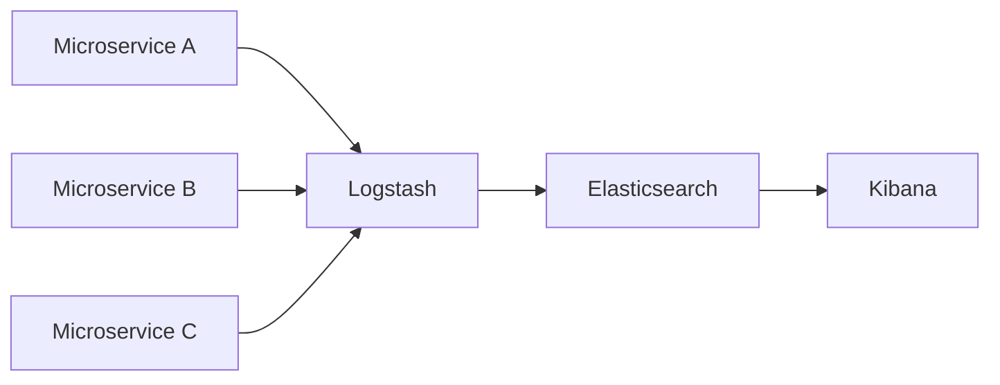

## 12.5.3 Audit Trails and Monitoring

In the realm of microservices, where systems are inherently distributed and complex, maintaining robust security is paramount. Audit trails and monitoring play a crucial role in this security landscape, providing the means to track, analyze, and respond to activities within the system. This section delves into the intricacies of audit trails and monitoring, offering insights into best practices and implementation strategies.

### Defining Audit Trails

Audit trails are comprehensive records of activities, changes, and access events within a system. In microservices, they serve as a vital tool for ensuring accountability, enabling forensic analysis, and supporting compliance with regulatory requirements. An audit trail typically includes:

- **User Actions:** Records of who did what, when, and where within the system.
- **Service Interactions:** Details of interactions between microservices, including API calls and data exchanges.
- **Configuration Changes:** Logs of changes to system configurations, ensuring that any modifications are tracked.
- **Access Events:** Documentation of access to sensitive data or resources, helping to detect unauthorized access.

Audit trails are not just about recording data; they are about creating a reliable and secure history of system activities that can be used for analysis and decision-making.

### Implement Comprehensive Logging

Comprehensive logging is the foundation of effective audit trails. By capturing relevant information for each service interaction, configuration change, and user action, you can create a detailed record of system activities. Here are some best practices for implementing comprehensive logging:

- **Standardize Log Formats:** Use a consistent format for logs across all microservices to facilitate easy aggregation and analysis.
- **Capture Contextual Information:** Include metadata such as timestamps, user IDs, request IDs, and service names to provide context for each log entry.
- **Log at Appropriate Levels:** Use different logging levels (e.g., DEBUG, INFO, WARN, ERROR) to capture the right amount of detail without overwhelming the system.
- **Avoid Sensitive Data:** Ensure that logs do not contain sensitive information such as passwords or personal data, adhering to privacy regulations.

Here's a simple Java example demonstrating how to implement logging in a microservice:

```java
import org.slf4j.Logger;
import org.slf4j.LoggerFactory;

public class UserService {

    private static final Logger logger = LoggerFactory.getLogger(UserService.class);

    public void createUser(String username) {
        logger.info("Creating user: {}", username);
        // User creation logic
        logger.debug("User {} created successfully", username);
    }

    public void deleteUser(String username) {
        logger.warn("Deleting user: {}", username);
        // User deletion logic
        logger.error("Failed to delete user: {}", username);
    }
}
```

### Use Immutable Logs

The integrity of audit trails is paramount, and using immutable logs ensures that records cannot be altered or deleted. Immutable logs provide a reliable historical record that can be trusted for audits and investigations. Implementing immutable logs involves:

- **Write-Once, Read-Many (WORM) Storage:** Use storage solutions that support WORM capabilities, preventing modification of existing logs.
- **Cryptographic Hashing:** Apply cryptographic hashes to log entries to detect any unauthorized changes.
- **Append-Only Log Systems:** Use systems like Apache Kafka or Amazon Kinesis that support append-only operations, ensuring logs are immutable by design.

### Centralize Log Storage

Centralizing log storage is essential for managing and retrieving logs efficiently. By aggregating logs from all microservices into a single location, you can simplify log management and facilitate comprehensive analysis. Consider using solutions like:

- **ELK Stack (Elasticsearch, Logstash, Kibana):** A popular open-source solution for log aggregation and visualization.
- **Graylog:** A powerful log management platform that supports centralized log storage and analysis.
- **Splunk:** A commercial platform offering advanced features for log management and analytics.

Here's a diagram illustrating a centralized log storage architecture using the ELK Stack:



### Enable Real-Time Monitoring

Real-time monitoring of audit trails is crucial for detecting and responding to unauthorized activities or suspicious behaviors promptly. By leveraging monitoring tools, you can gain insights into system performance and security. Consider using:

- **Prometheus:** An open-source monitoring system that collects metrics and provides real-time alerts.
- **Grafana:** A visualization tool that integrates with Prometheus to create dashboards for monitoring system health.
- **Datadog:** A cloud-based monitoring service that offers real-time insights and anomaly detection.

### Define Retention Policies

Log retention policies determine how long logs are stored and when they are archived or deleted. Balancing the need for historical data analysis with storage capacity constraints and compliance requirements is essential. Consider the following when defining retention policies:

- **Compliance Requirements:** Ensure that retention policies align with legal and regulatory obligations.
- **Storage Costs:** Balance the cost of storage with the need to retain logs for analysis and audits.
- **Data Archiving:** Implement archiving strategies for older logs that may still be needed for long-term analysis.

### Implement Access Controls for Logs

Audit logs often contain sensitive information, making it essential to implement strict access controls. Only authorized personnel should be able to view or manage log data. Consider these best practices:

- **Role-Based Access Control (RBAC):** Define roles and permissions to control who can access logs.
- **Audit Log Access:** Maintain a separate audit trail for access to log data, ensuring accountability.
- **Encryption:** Encrypt logs both at rest and in transit to protect against unauthorized access.

### Conduct Regular Audits and Reviews

Regular audits and reviews of audit trails are essential for identifying patterns, detecting anomalies, and ensuring compliance with security policies and regulatory standards. Conducting audits involves:

- **Analyzing Historical Data:** Use audit trails to analyze past activities and identify potential security issues.
- **Detecting Anomalies:** Look for unusual patterns or behaviors that may indicate security breaches.
- **Ensuring Compliance:** Verify that system activities align with security policies and regulatory requirements.

### Conclusion

Audit trails and monitoring are integral components of a robust microservices security strategy. By implementing comprehensive logging, using immutable logs, centralizing log storage, enabling real-time monitoring, and conducting regular audits, organizations can enhance their security posture and ensure accountability. These practices not only help in detecting and responding to security incidents but also support compliance with regulatory requirements.

### Further Reading and Resources

- [The Logback Project](https://logback.qos.ch/)
- [Elasticsearch Documentation](https://www.elastic.co/guide/en/elasticsearch/reference/current/index.html)
- [Prometheus Documentation](https://prometheus.io/docs/introduction/overview/)
- [Grafana Documentation](https://grafana.com/docs/grafana/latest/)

## Quiz Time!



### What is the primary purpose of audit trails in microservices?

- [x] To provide a comprehensive record of activities, changes, and access events
- [ ] To store user credentials securely
- [ ] To optimize microservices performance
- [ ] To manage microservices deployment

> **Explanation:** Audit trails are designed to provide a comprehensive record of activities, changes, and access events within a system, enabling accountability and forensic analysis.

### Which logging practice is essential for creating effective audit trails?

- [x] Capturing contextual information
- [ ] Logging sensitive data
- [ ] Using inconsistent log formats
- [ ] Logging only errors

> **Explanation:** Capturing contextual information such as timestamps, user IDs, and request IDs is essential for creating effective audit trails, as it provides the necessary context for each log entry.

### What is the benefit of using immutable logs?

- [x] Ensures the integrity and reliability of audit trails
- [ ] Reduces storage costs
- [ ] Increases system performance
- [ ] Simplifies log formatting

> **Explanation:** Immutable logs ensure the integrity and reliability of audit trails by preventing unauthorized alterations or deletions, providing a trustworthy historical record.

### Which tool is commonly used for centralized log storage?

- [x] ELK Stack
- [ ] Jenkins
- [ ] GitHub
- [ ] Docker

> **Explanation:** The ELK Stack (Elasticsearch, Logstash, Kibana) is commonly used for centralized log storage, aggregation, and visualization.

### What is a key advantage of real-time monitoring of audit trails?

- [x] Prompt detection and response to unauthorized activities
- [ ] Reduced need for storage
- [ ] Simplified log formatting
- [ ] Enhanced user experience

> **Explanation:** Real-time monitoring of audit trails allows for the prompt detection and response to unauthorized activities or suspicious behaviors, enhancing system security.

### Why is it important to define log retention policies?

- [x] To balance historical data analysis with storage constraints
- [ ] To increase system performance
- [ ] To simplify log formatting
- [ ] To enhance user experience

> **Explanation:** Log retention policies help balance the need for historical data analysis with storage capacity constraints and compliance requirements.

### What is the purpose of implementing access controls for logs?

- [x] To ensure only authorized personnel can view or manage log data
- [ ] To increase system performance
- [ ] To simplify log formatting
- [ ] To enhance user experience

> **Explanation:** Implementing access controls for logs ensures that only authorized personnel can view or manage sensitive log data, protecting it from unauthorized access.

### What should be included in regular audits and reviews of audit trails?

- [x] Analyzing historical data to identify patterns and detect anomalies
- [ ] Simplifying log formatting
- [ ] Increasing system performance
- [ ] Enhancing user experience

> **Explanation:** Regular audits and reviews of audit trails should include analyzing historical data to identify patterns, detect anomalies, and ensure compliance with security policies.

### Which of the following is a best practice for logging?

- [x] Avoid logging sensitive data
- [ ] Log everything at the DEBUG level
- [ ] Use inconsistent log formats
- [ ] Log only errors

> **Explanation:** Avoiding logging sensitive data is a best practice to ensure privacy and compliance with regulations.

### True or False: Immutable logs can be altered to correct errors.

- [ ] True
- [x] False

> **Explanation:** False. Immutable logs cannot be altered, ensuring the integrity and reliability of audit trails.


