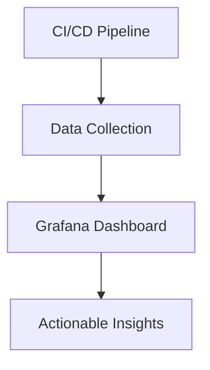

---

linkTitle: "13.4.3 Monitoring Test Effectiveness"
title: "Monitoring Test Effectiveness in Microservices Testing"
description: "Explore strategies and tools for monitoring test effectiveness in microservices, focusing on metrics, coverage tools, defect detection, and continuous improvement."
categories:
- Software Testing
- Microservices
- Continuous Integration
tags:
- Test Effectiveness
- Test Coverage
- Continuous Testing
- Automation
- Microservices
date: 2024-10-25
type: docs
nav_weight: 1343000
---

## 13.4.3 Monitoring Test Effectiveness

In the dynamic world of microservices, ensuring the effectiveness of your testing strategy is crucial for maintaining system reliability and performance. Monitoring test effectiveness involves a comprehensive approach to evaluating how well your tests are performing and identifying areas for improvement. This section delves into the key metrics, tools, and practices that can help you achieve a robust testing framework.

### Defining Test Effectiveness Metrics

To effectively monitor test effectiveness, it's essential to define clear metrics that provide insights into the quality and performance of your test suite. Here are some critical metrics to consider:

- **Test Coverage:** Measures the percentage of code executed by your tests. High test coverage indicates that a significant portion of your codebase is being tested, reducing the likelihood of undetected bugs.
- **Defect Detection Rate:** Tracks the number of defects found by automated tests compared to those discovered in production. A high defect detection rate suggests that your tests are effective at catching issues early.
- **Test Execution Time:** Monitors how long it takes for tests to run. Efficient test execution is vital for maintaining a fast CI/CD pipeline.
- **False Positive/Negative Rates:** Evaluates the accuracy of your tests in identifying defects. High false positive rates can lead to wasted time investigating non-issues, while false negatives can allow defects to slip through.

### Implementing Test Coverage Tools

Test coverage tools are invaluable for assessing the extent of code exercised by your tests. For Java applications, **JaCoCo** is a popular choice. Here's a basic setup for integrating JaCoCo with a Maven project:

```xml
<build>
    <plugins>
        <plugin>
            <groupId>org.jacoco</groupId>
            <artifactId>jacoco-maven-plugin</artifactId>
            <version>0.8.7</version>
            <executions>
                <execution>
                    <goals>
                        <goal>prepare-agent</goal>
                    </goals>
                </execution>
                <execution>
                    <id>report</id>
                    <phase>verify</phase>
                    <goals>
                        <goal>report</goal>
                    </goals>
                </execution>
            </executions>
        </plugin>
    </plugins>
</build>
```

This configuration enables JaCoCo to generate coverage reports, helping you identify untested areas and improve overall test coverage.

### Analyzing Defect Detection Rates

Analyzing defect detection rates involves tracking the number of defects found by automated tests versus those found in production. This data can be visualized using dashboards to provide insights into test quality. For instance, a high number of production defects may indicate gaps in your test coverage or ineffective test cases.

### Monitoring Test Execution Times

Efficient test execution is crucial for a smooth CI/CD pipeline. Monitoring test execution times helps identify slow or resource-intensive tests. Tools like **JUnit** provide annotations to measure test execution time:

```java
@Test
@Timeout(value = 500, unit = TimeUnit.MILLISECONDS)
public void testMethod() {
    // Test logic here
}
```

This example sets a timeout for a test method, ensuring it completes within the specified time. Identifying and optimizing slow tests can significantly enhance pipeline performance.

### Tracking Flaky Tests

Flaky tests, which intermittently pass or fail, can undermine trust in your test suite. To track and mitigate flaky tests, consider using tools like **FlakyTestDetector**. Implement strategies such as:

- **Retry Mechanisms:** Automatically retry failed tests to confirm flakiness.
- **Isolation:** Run tests in isolated environments to minimize external dependencies.
- **Logging and Analysis:** Enhance logging to capture detailed information for analysis.

### Using Dashboards and Reports

Dashboards and reporting tools like **Grafana** and **Kibana** can visualize test effectiveness metrics, providing actionable insights for continuous improvement. Here's an example of a basic Grafana dashboard setup:



This diagram illustrates the flow from data collection in the CI/CD pipeline to actionable insights via a Grafana dashboard.

### Conducting Regular Test Audits

Regular test audits involve reviewing and assessing the effectiveness of your test suite. This process helps identify gaps, redundant tests, and optimization opportunities. Consider the following steps:

1. **Review Test Cases:** Evaluate the relevance and coverage of existing test cases.
2. **Analyze Test Results:** Examine test outcomes to identify patterns or recurring issues.
3. **Optimize Test Suite:** Remove redundant tests and enhance coverage where needed.

### Promoting a Feedback Loop

Creating a feedback loop between development and testing teams is vital for continuous improvement. Use insights from monitoring test effectiveness to inform test case development and drive quality enhancements. Regular meetings and collaborative tools can facilitate this feedback loop, ensuring that testing remains aligned with development goals.

### Conclusion

Monitoring test effectiveness is an ongoing process that requires a strategic approach and the right tools. By defining clear metrics, implementing coverage tools, analyzing defect detection rates, and maintaining efficient test execution, you can enhance the quality and reliability of your microservices. Regular audits and a strong feedback loop further ensure that your testing strategy evolves with your development needs.

## Quiz Time!



### Which metric measures the percentage of code executed by tests?

- [x] Test Coverage
- [ ] Defect Detection Rate
- [ ] Test Execution Time
- [ ] False Positive Rate

> **Explanation:** Test coverage measures the percentage of code executed by tests, indicating how much of the codebase is being tested.

### What tool is commonly used for test coverage in Java applications?

- [x] JaCoCo
- [ ] Istanbul
- [ ] Coverage.py
- [ ] Grafana

> **Explanation:** JaCoCo is a popular tool for measuring test coverage in Java applications.

### Why is monitoring test execution time important?

- [x] To ensure tests run efficiently and do not hinder the CI/CD pipeline
- [ ] To increase the number of defects found
- [ ] To reduce test coverage
- [ ] To identify false positives

> **Explanation:** Monitoring test execution time ensures that tests run efficiently, maintaining a fast CI/CD pipeline.

### What is a flaky test?

- [x] A test that intermittently passes or fails without consistent reasons
- [ ] A test that always fails
- [ ] A test that always passes
- [ ] A test that measures execution time

> **Explanation:** A flaky test is one that intermittently passes or fails without consistent reasons, undermining trust in the test suite.

### Which tool can be used to visualize test effectiveness metrics?

- [x] Grafana
- [ ] JaCoCo
- [ ] JUnit
- [ ] FlakyTestDetector

> **Explanation:** Grafana is a tool used to visualize test effectiveness metrics, providing actionable insights.

### What is the purpose of conducting regular test audits?

- [x] To review and assess the effectiveness of the test suite
- [ ] To increase test execution time
- [ ] To reduce test coverage
- [ ] To create more flaky tests

> **Explanation:** Regular test audits help review and assess the effectiveness of the test suite, identifying gaps and optimization opportunities.

### How can a feedback loop benefit testing and development teams?

- [x] By using insights to inform test case development and drive quality enhancements
- [ ] By increasing test execution time
- [ ] By reducing test coverage
- [ ] By creating more flaky tests

> **Explanation:** A feedback loop allows testing and development teams to use insights to inform test case development and drive quality enhancements.

### Which annotation in JUnit can be used to set a timeout for a test method?

- [x] @Timeout
- [ ] @Test
- [ ] @Retry
- [ ] @Flaky

> **Explanation:** The @Timeout annotation in JUnit is used to set a timeout for a test method, ensuring it completes within the specified time.

### What is the role of defect detection rate in monitoring test effectiveness?

- [x] It tracks the number of defects found by automated tests compared to those found in production
- [ ] It measures test execution time
- [ ] It identifies flaky tests
- [ ] It visualizes test metrics

> **Explanation:** Defect detection rate tracks the number of defects found by automated tests compared to those found in production, evaluating test quality.

### True or False: High false positive rates in tests can lead to wasted time investigating non-issues.

- [x] True
- [ ] False

> **Explanation:** High false positive rates can lead to wasted time investigating non-issues, reducing the efficiency of the testing process.


