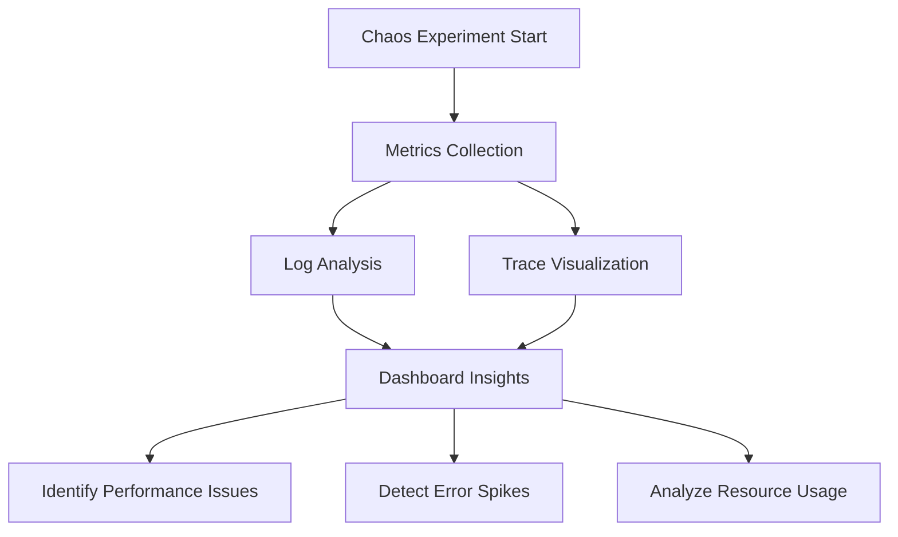

## 13.5.3 Analyzing Results in Chaos Engineering: Enhancing Microservices Resilience

Chaos engineering is a powerful practice that helps teams identify weaknesses in their systems by intentionally introducing failures and observing how the system responds. Analyzing the results of chaos experiments is crucial for understanding system behavior under stress and implementing improvements to enhance resilience. In this section, we will explore the comprehensive process of analyzing chaos engineering results, from collecting observability data to integrating findings into development processes.

### Collect Observability Data

The first step in analyzing chaos engineering results is to collect comprehensive observability data. This includes metrics, logs, and traces that provide insights into the system's behavior during chaos experiments. Observability data helps identify how the system reacts to failures, revealing potential bottlenecks and vulnerabilities.

- **Metrics:** Collect key performance indicators such as CPU usage, memory consumption, request latency, and error rates. These metrics help quantify the impact of chaos experiments on system performance.
- **Logs:** Capture logs from various components to trace the sequence of events leading up to and following a failure. Logs provide detailed information about system activities and error messages.
- **Traces:** Use distributed tracing to follow the flow of requests across microservices. Traces help identify where delays or failures occur in the service call chain.

#### Practical Example: Java Observability with OpenTelemetry

```java
import io.opentelemetry.api.GlobalOpenTelemetry;
import io.opentelemetry.api.trace.Tracer;
import io.opentelemetry.api.trace.Span;

public class ChaosExperiment {
    private static final Tracer tracer = GlobalOpenTelemetry.getTracer("chaos-experiment");

    public void simulateFailure() {
        Span span = tracer.spanBuilder("simulateFailure").startSpan();
        try {
            // Simulate a failure scenario
            performCriticalOperation();
        } catch (Exception e) {
            span.recordException(e);
            span.setStatus(StatusCode.ERROR, "Failure during critical operation");
        } finally {
            span.end();
        }
    }

    private void performCriticalOperation() {
        // Simulate a critical operation that may fail
        throw new RuntimeException("Simulated failure");
    }
}
```

### Use Dashboards for Visualization

Visualizing the impact of chaos experiments is essential for understanding how failures affect system performance. Observability dashboards provide a real-time view of metrics, logs, and traces, helping teams identify performance degradations, error spikes, and unusual resource consumption patterns.

- **Performance Degradations:** Use dashboards to monitor changes in response times and throughput during chaos experiments. Look for patterns that indicate performance bottlenecks.
- **Error Spikes:** Identify spikes in error rates that occur during chaos experiments. These spikes can reveal components that are particularly vulnerable to failures.
- **Resource Consumption:** Analyze resource usage patterns to detect unusual consumption that may indicate inefficiencies or potential points of failure.

#### Example Dashboard Visualization



### Perform Root Cause Analysis

Root cause analysis (RCA) is a critical step in understanding the underlying causes of system weaknesses and failures revealed by chaos experiments. RCA involves investigating incidents to identify the root causes and implementing measures to prevent recurrence.

- **Incident Investigation:** Analyze logs and traces to reconstruct the sequence of events leading to a failure. Identify the components involved and the interactions that contributed to the incident.
- **Cause Identification:** Determine the root causes of failures, such as configuration errors, resource contention, or network issues. Use this information to guide remediation efforts.

### Evaluate Recovery Strategies

Evaluating the effectiveness of recovery strategies and failover mechanisms is crucial for ensuring that the system can recover gracefully from failures. Chaos experiments provide an opportunity to test these strategies under controlled conditions.

- **Recovery Time:** Measure the time it takes for the system to recover from a failure. Aim to minimize recovery time to maintain availability.
- **Failover Effectiveness:** Assess the effectiveness of failover mechanisms, such as load balancing and redundancy, in maintaining service continuity during failures.

### Document Findings and Recommendations

Documenting the findings from chaos experiments is essential for capturing insights and guiding future improvements. This documentation should include observed issues, impact assessments, and actionable recommendations for enhancing system resilience.

- **Observed Issues:** Record the specific issues identified during chaos experiments, including performance degradations, error spikes, and resource inefficiencies.
- **Impact Assessments:** Evaluate the impact of identified issues on system performance and user experience. Quantify the potential risks associated with these issues.
- **Actionable Recommendations:** Provide clear recommendations for addressing identified issues, such as code changes, configuration updates, or architectural adjustments.

### Track Improvement Over Time

Tracking improvements in system resilience over time is crucial for measuring the effectiveness of remediation measures. By comparing results from successive chaos experiments, teams can identify trends and assess the impact of implemented changes.

- **Trend Analysis:** Analyze trends in performance metrics, error rates, and recovery times across multiple chaos experiments. Look for improvements that indicate increased resilience.
- **Effectiveness Measurement:** Measure the effectiveness of remediation measures by comparing pre- and post-implementation results. Use this information to refine strategies and prioritize future efforts.

### Share Insights Across Teams

Sharing insights and lessons learned from chaos experiments across development, operations, and security teams fosters a culture of continuous improvement and proactive resilience enhancement. Collaboration and knowledge sharing are key to building resilient systems.

- **Cross-Team Collaboration:** Encourage collaboration between teams to address identified issues and implement improvements. Share insights and best practices to enhance overall system resilience.
- **Continuous Improvement Culture:** Promote a culture of continuous improvement by regularly conducting chaos experiments and sharing findings. Encourage teams to proactively identify and address potential vulnerabilities.

### Integrate Findings into Development Processes

Integrating findings from chaos experiments into development and deployment processes is essential for addressing identified vulnerabilities and enhancing overall system robustness. This integration involves updating architecture designs, security measures, and operational practices.

- **Architecture Updates:** Revise architecture designs to address identified weaknesses, such as improving redundancy or optimizing resource allocation.
- **Security Enhancements:** Implement security measures to mitigate vulnerabilities revealed by chaos experiments, such as enhancing access controls or encrypting sensitive data.
- **Operational Practices:** Update operational practices to incorporate lessons learned from chaos experiments, such as refining incident response procedures or improving monitoring and alerting.

### Conclusion

Analyzing the results of chaos engineering experiments is a critical step in enhancing the resilience of microservices architectures. By collecting observability data, visualizing impacts, performing root cause analysis, evaluating recovery strategies, and integrating findings into development processes, teams can build more robust and reliable systems. Continuous improvement and collaboration across teams are key to achieving long-term resilience and maintaining system availability in the face of failures.

## Quiz Time!



### What is the first step in analyzing chaos engineering results?

- [x] Collecting observability data
- [ ] Performing root cause analysis
- [ ] Evaluating recovery strategies
- [ ] Documenting findings

> **Explanation:** Collecting observability data is the first step in analyzing chaos engineering results, as it provides the necessary information to understand system behavior during experiments.

### Which type of data helps identify the flow of requests across microservices?

- [ ] Metrics
- [ ] Logs
- [x] Traces
- [ ] Dashboards

> **Explanation:** Traces help identify the flow of requests across microservices, providing insights into where delays or failures occur in the service call chain.

### What is the purpose of using dashboards in chaos engineering?

- [ ] To simulate failures
- [x] To visualize the impact of chaos experiments
- [ ] To perform root cause analysis
- [ ] To document findings

> **Explanation:** Dashboards are used to visualize the impact of chaos experiments, helping teams identify performance degradations, error spikes, and unusual resource consumption patterns.

### What is root cause analysis used for in chaos engineering?

- [ ] To collect observability data
- [ ] To visualize experiment impacts
- [x] To identify underlying causes of failures
- [ ] To evaluate recovery strategies

> **Explanation:** Root cause analysis is used to identify the underlying causes of failures revealed by chaos experiments, guiding remediation efforts.

### Why is it important to evaluate recovery strategies during chaos experiments?

- [ ] To simulate more failures
- [x] To ensure the system can recover gracefully
- [ ] To document findings
- [ ] To share insights across teams

> **Explanation:** Evaluating recovery strategies is important to ensure that the system can recover gracefully and maintain availability during and after failures.

### What should be included in the documentation of chaos experiment findings?

- [x] Observed issues and impact assessments
- [ ] Only performance metrics
- [ ] Only error logs
- [ ] Only traces

> **Explanation:** Documentation should include observed issues, impact assessments, and actionable recommendations for improving system resilience.

### How can teams track improvements in system resilience over time?

- [ ] By conducting fewer chaos experiments
- [x] By comparing results from successive chaos experiments
- [ ] By ignoring error spikes
- [ ] By focusing only on metrics

> **Explanation:** Teams can track improvements in system resilience by comparing results from successive chaos experiments, identifying trends, and measuring the effectiveness of implemented changes.

### Why is sharing insights across teams important in chaos engineering?

- [ ] To reduce the number of experiments
- [ ] To avoid collaboration
- [x] To foster a culture of continuous improvement
- [ ] To limit knowledge sharing

> **Explanation:** Sharing insights across teams fosters a culture of continuous improvement and proactive resilience enhancement, encouraging collaboration and knowledge sharing.

### What should be updated in development processes based on chaos experiment findings?

- [ ] Only security measures
- [ ] Only architecture designs
- [ ] Only operational practices
- [x] Architecture designs, security measures, and operational practices

> **Explanation:** Development processes should be updated to address identified vulnerabilities, including architecture designs, security measures, and operational practices.

### True or False: Chaos engineering results should only be shared with the development team.

- [ ] True
- [x] False

> **Explanation:** Chaos engineering results should be shared across development, operations, and security teams to foster collaboration and continuous improvement.


