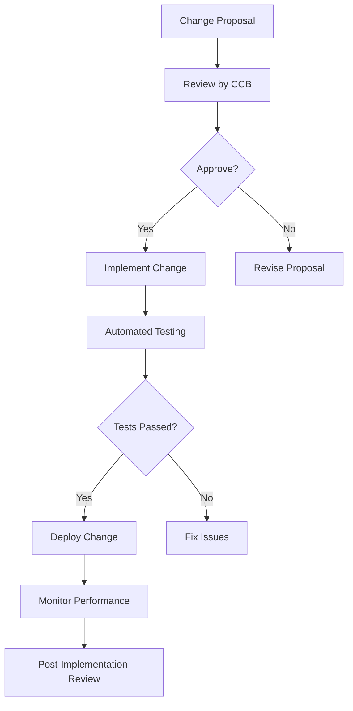

## 14.3.2 Change Management

In the dynamic world of microservices, change is inevitable. However, managing these changes effectively is crucial to maintaining the stability and reliability of the system. Change management in microservices involves a structured approach to proposing, reviewing, approving, and implementing changes. This section delves into the essential components of change management, providing practical insights and strategies to ensure seamless transitions and minimal disruptions.

### Defining Change Management Processes

Change management processes are the backbone of any successful microservices architecture. These processes define how changes are proposed, reviewed, approved, and implemented. A robust change management process ensures that changes are made systematically and with minimal risk.

**Key Components of Change Management Processes:**

1. **Proposal and Review:** Changes should be proposed through a formal process, often involving documentation that outlines the change, its purpose, and its expected impact. This proposal is then reviewed by relevant stakeholders to assess its feasibility and alignment with business goals.

2. **Approval:** Once reviewed, changes must be approved by designated authorities, such as a Change Control Board (CCB), to ensure they meet organizational standards and do not introduce unnecessary risks.

3. **Implementation:** Approved changes are implemented following a predefined plan, often involving multiple stages such as development, testing, and deployment.

4. **Post-Implementation Review:** After implementation, changes are reviewed to ensure they achieve the desired outcomes without adverse effects.

### Implementing Change Control Boards

Change Control Boards (CCBs) play a pivotal role in managing changes to microservices. They are responsible for reviewing and approving significant changes, ensuring they align with architectural and governance standards.

**Role of Change Control Boards:**

- **Review Changes:** CCBs assess proposed changes for their technical feasibility, potential impact, and alignment with strategic objectives.
- **Approve or Reject Changes:** Based on their review, CCBs approve or reject changes, providing feedback and recommendations for improvement.
- **Ensure Compliance:** CCBs ensure that changes comply with organizational policies, standards, and regulatory requirements.

### Using Version Control Systems

Version control systems, such as Git, are indispensable tools for managing changes to microservices codebases. They facilitate collaboration, track changes, and enable rollbacks if necessary.

**Benefits of Version Control Systems:**

- **Collaboration:** Multiple developers can work on the same codebase simultaneously, with changes merged seamlessly.
- **Change Tracking:** Every change is recorded, providing a detailed history of modifications and facilitating audits.
- **Rollback Capability:** In case of issues, changes can be reverted to a previous stable state, minimizing downtime.

**Example: Using Git for Version Control**

```java
// Example of a simple version control workflow using Git

// Clone the repository
git clone https://github.com/example/microservice-repo.git

// Create a new branch for your change
git checkout -b feature/new-change

// Make changes to the codebase
// Example: Update a service endpoint
public class ExampleService {
    public String getGreeting() {
        return "Hello, Microservices!";
    }
}

// Add and commit your changes
git add .
git commit -m "Update greeting message"

// Push changes to the remote repository
git push origin feature/new-change

// Create a pull request for review and approval
```

### Adopting Feature Flagging

Feature flagging is a powerful technique that allows teams to introduce changes incrementally, enabling controlled rollouts and easy rollbacks without affecting all users or services simultaneously.

**Advantages of Feature Flagging:**

- **Controlled Rollouts:** Features can be enabled for specific user groups, allowing for gradual exposure and feedback collection.
- **Easy Rollbacks:** If a feature causes issues, it can be disabled instantly without redeploying the entire service.
- **Experimentation:** Teams can experiment with new features in production environments, gathering real-world data to inform decisions.

**Example: Implementing Feature Flags in Java**

```java
// Example of using a feature flag in Java

public class FeatureToggleService {
    private static final boolean NEW_FEATURE_ENABLED = true; // Flag to control feature

    public void executeFeature() {
        if (NEW_FEATURE_ENABLED) {
            // New feature logic
            System.out.println("Executing new feature");
        } else {
            // Existing feature logic
            System.out.println("Executing existing feature");
        }
    }
}
```

### Integrating CI/CD Pipelines with Change Management

Integrating change management processes with Continuous Integration and Continuous Deployment (CI/CD) pipelines automates the validation and deployment of changes while ensuring they undergo necessary reviews and approvals.

**Guidelines for Integration:**

- **Automated Testing:** Incorporate automated tests in the CI/CD pipeline to validate changes before deployment.
- **Approval Gates:** Implement approval gates in the pipeline to ensure changes are reviewed and approved by relevant stakeholders.
- **Rollback Mechanisms:** Include rollback mechanisms to revert changes quickly in case of failures.

**Example: CI/CD Pipeline Integration**

```yaml

name: CI/CD Pipeline

on:
  push:
    branches:
      - main

jobs:
  build:
    runs-on: ubuntu-latest
    steps:
      - name: Checkout code
        uses: actions/checkout@v2

      - name: Set up JDK
        uses: actions/setup-java@v1
        with:
          java-version: '11'

      - name: Build with Maven
        run: mvn clean install

      - name: Run tests
        run: mvn test

      - name: Deploy to production
        if: success()
        run: ./deploy.sh
```

### Communicating Changes Effectively

Effective communication is vital to inform all relevant stakeholders about upcoming changes, their impacts, and any required actions or precautions.

**Strategies for Effective Communication:**

- **Change Announcements:** Use emails, newsletters, or internal communication platforms to announce changes and their expected impacts.
- **Documentation:** Maintain up-to-date documentation detailing changes, including user guides and FAQs.
- **Feedback Channels:** Provide channels for stakeholders to ask questions and provide feedback on changes.

### Implementing Automated Testing for Changes

Automated testing is crucial for validating changes and detecting potential issues before they reach production. It includes unit, integration, and end-to-end tests.

**Types of Automated Testing:**

- **Unit Testing:** Tests individual components or functions for correctness.
- **Integration Testing:** Tests interactions between different components or services.
- **End-to-End Testing:** Tests the entire system flow from start to finish, simulating real user scenarios.

**Example: Automated Testing with JUnit**

```java
// Example of a JUnit test case for a microservice

import static org.junit.jupiter.api.Assertions.assertEquals;
import org.junit.jupiter.api.Test;

public class ExampleServiceTest {

    @Test
    public void testGetGreeting() {
        ExampleService service = new ExampleService();
        String greeting = service.getGreeting();
        assertEquals("Hello, Microservices!", greeting);
    }
}
```

### Monitoring and Reviewing Post-Change Performance

Monitoring microservices after changes are deployed is essential to ensure they perform as expected and to identify and address any unexpected issues promptly.

**Key Monitoring Practices:**

- **Performance Metrics:** Track key performance indicators (KPIs) such as response time, throughput, and error rates.
- **Log Analysis:** Analyze logs for errors or anomalies that may indicate issues.
- **User Feedback:** Collect and analyze user feedback to identify any usability issues or unexpected behaviors.

**Example: Monitoring with Prometheus and Grafana**

```yaml

scrape_configs:
  - job_name: 'example-service'
    static_configs:
      - targets: ['localhost:8080']
```



### Conclusion

Effective change management is critical to the success of microservices architectures. By defining robust processes, leveraging tools like version control and feature flagging, integrating with CI/CD pipelines, and maintaining clear communication, organizations can manage changes efficiently and minimize risks. Automated testing and post-change monitoring further ensure that changes enhance the system without compromising stability or reliability.

## Quiz Time!



### What is the primary role of a Change Control Board (CCB) in microservices?

- [x] Reviewing and approving significant changes
- [ ] Implementing changes directly
- [ ] Monitoring system performance
- [ ] Writing code for new features

> **Explanation:** The primary role of a Change Control Board (CCB) is to review and approve significant changes to ensure they align with architectural and governance standards.

### Which tool is commonly used for version control in microservices?

- [x] Git
- [ ] Docker
- [ ] Jenkins
- [ ] Prometheus

> **Explanation:** Git is a widely used version control system that helps manage changes to codebases, facilitating collaboration and tracking changes.

### What is a key benefit of feature flagging?

- [x] Controlled rollouts and easy rollbacks
- [ ] Increased system complexity
- [ ] Reduced testing requirements
- [ ] Faster code execution

> **Explanation:** Feature flagging allows for controlled rollouts and easy rollbacks, enabling teams to introduce changes incrementally without affecting all users simultaneously.

### How can CI/CD pipelines be integrated with change management?

- [x] By automating validation and deployment of changes
- [ ] By eliminating the need for testing
- [ ] By bypassing approval processes
- [ ] By reducing code quality

> **Explanation:** CI/CD pipelines can automate the validation and deployment of changes, ensuring they undergo necessary reviews and approvals.

### Why is effective communication important in change management?

- [x] To inform stakeholders about changes and their impacts
- [ ] To reduce the need for documentation
- [ ] To eliminate the need for testing
- [ ] To increase system complexity

> **Explanation:** Effective communication ensures that all relevant stakeholders are informed about upcoming changes, their impacts, and any required actions or precautions.

### What type of testing validates interactions between different components?

- [ ] Unit Testing
- [x] Integration Testing
- [ ] End-to-End Testing
- [ ] Load Testing

> **Explanation:** Integration testing validates interactions between different components or services to ensure they work together correctly.

### What is the purpose of post-change monitoring?

- [x] To ensure changes perform as expected and identify issues
- [ ] To eliminate the need for testing
- [ ] To increase system complexity
- [ ] To reduce system performance

> **Explanation:** Post-change monitoring ensures that changes perform as expected and helps identify and address any unexpected issues promptly.

### Which tool is used for monitoring microservices performance?

- [ ] Git
- [ ] Docker
- [x] Prometheus
- [ ] Jenkins

> **Explanation:** Prometheus is a tool used for monitoring microservices performance by tracking metrics such as response time and error rates.

### What is a key component of change management processes?

- [x] Proposal and Review
- [ ] Direct Implementation
- [ ] Ignoring Stakeholder Feedback
- [ ] Eliminating Documentation

> **Explanation:** Proposal and review are key components of change management processes, ensuring changes are assessed for feasibility and alignment with business goals.

### True or False: Automated testing is unnecessary in change management.

- [ ] True
- [x] False

> **Explanation:** Automated testing is crucial in change management to validate changes and detect potential issues before they reach production.


