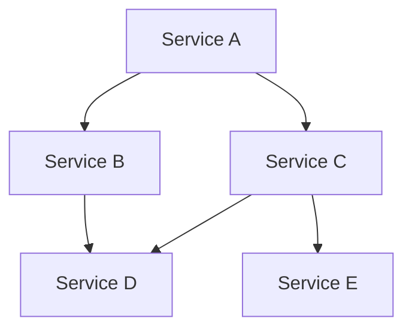

## 14.3.3 Dependency Management

In the realm of microservices architecture, managing dependencies effectively is crucial for maintaining a scalable, resilient, and flexible system. As microservices are inherently distributed and interconnected, understanding and controlling these dependencies is vital to prevent cascading failures, ensure smooth service interactions, and facilitate continuous delivery. This section delves into various strategies and best practices for managing dependencies in microservices, providing practical insights and tools to enhance your service lifecycle management.

### Identifying Microservices Dependencies

The first step in effective dependency management is to identify and map out the dependencies between microservices. This involves understanding both direct and indirect interactions within the system architecture. By doing so, you can pinpoint potential impact points and areas that require attention.

#### Mapping Dependencies

To map dependencies, consider the following steps:

1. **Catalog Services**: List all microservices within your architecture.
2. **Identify Interactions**: Document how each service interacts with others, including API calls, message exchanges, and data flows.
3. **Classify Dependencies**: Categorize dependencies as synchronous or asynchronous, critical or non-critical, to prioritize management efforts.

### Implementing Dependency Graphs

Visualizing dependencies through graphs can provide a clearer understanding of the system's architecture. Tools like Graphviz or specialized microservices management platforms can be used to create these dependency graphs.

#### Using Graphviz for Visualization

Graphviz is a powerful tool for creating visual representations of complex systems. Here's a simple example of how you might use Graphviz to depict microservices dependencies:



In this diagram, Service A depends on Services B and C, while Service C has dependencies on Services D and E. Such visualizations help in understanding the flow of data and control within the system.

### Using Service Registries

Service registries like Consul and Eureka play a crucial role in managing and discovering microservices. They help dynamically resolve dependencies, reducing tight coupling and enhancing system flexibility.

#### Benefits of Service Registries

- **Dynamic Discovery**: Services can discover each other at runtime, adapting to changes in the environment.
- **Load Balancing**: Registries can provide load balancing capabilities, distributing requests among service instances.
- **Health Checks**: Regular health checks ensure that only healthy instances are available for service.

### Adopting Loose Coupling Principles

Loose coupling is a fundamental principle in microservices architecture, aimed at minimizing dependencies between services. This enhances scalability, flexibility, and resilience by reducing the impact of individual service failures.

#### Strategies for Loose Coupling

- **Use Asynchronous Communication**: Implement message queues or event streams to decouple services.
- **Define Clear Interfaces**: Use well-defined APIs to abstract service functionality.
- **Implement Service Contracts**: Establish contracts that specify service interactions, reducing the need for direct dependencies.

### Implementing Circuit Breaker Patterns

Circuit breaker patterns are essential for managing dependencies gracefully, preventing cascading failures when dependent services are unavailable or experiencing issues.

#### Circuit Breaker Implementation

In Java, libraries like Hystrix or Resilience4j can be used to implement circuit breakers. Here's a basic example using Resilience4j:

```java
import io.github.resilience4j.circuitbreaker.CircuitBreaker;
import io.github.resilience4j.circuitbreaker.CircuitBreakerConfig;
import io.github.resilience4j.circuitbreaker.CircuitBreakerRegistry;

import java.time.Duration;

public class CircuitBreakerExample {
    public static void main(String[] args) {
        CircuitBreakerConfig config = CircuitBreakerConfig.custom()
                .failureRateThreshold(50)
                .waitDurationInOpenState(Duration.ofMillis(1000))
                .build();

        CircuitBreakerRegistry registry = CircuitBreakerRegistry.of(config);
        CircuitBreaker circuitBreaker = registry.circuitBreaker("myService");

        // Use the circuit breaker in your service calls
    }
}
```

This example sets up a circuit breaker with a failure rate threshold and a wait duration in the open state, allowing your service to handle failures gracefully.

### Managing API Contracts Effectively

Effective management of API contracts is crucial to ensure that changes to dependent services do not break existing integrations. This involves versioning and clear communication of contracts.

#### Best Practices for API Contract Management

- **Version APIs**: Use versioning strategies to manage changes without disrupting clients.
- **Document Contracts**: Provide comprehensive documentation using tools like Swagger or OpenAPI.
- **Communicate Changes**: Notify stakeholders of changes well in advance to allow for adaptation.

### Monitoring and Analyzing Dependencies

Continuous monitoring and analysis of dependencies help identify potential bottlenecks, single points of failure, and opportunities for optimization.

#### Monitoring Tools and Techniques

- **Use APM Tools**: Application Performance Management tools like New Relic or Dynatrace can provide insights into service interactions.
- **Implement Distributed Tracing**: Tools like Jaeger or Zipkin help trace requests across services, identifying latency and failure points.

### Automating Dependency Updates

Automating dependency updates ensures that microservices remain up-to-date with the latest versions of dependent services and libraries, reducing manual intervention and potential errors.

#### Tools for Automation

- **Dependabot**: Automates dependency updates for various package managers.
- **Renovate**: Provides customizable automation for dependency updates, supporting a wide range of languages and ecosystems.

### Conclusion

Effective dependency management is a cornerstone of successful microservices architecture. By identifying dependencies, visualizing them through graphs, leveraging service registries, adopting loose coupling principles, implementing circuit breakers, managing API contracts, monitoring dependencies, and automating updates, you can enhance the resilience, scalability, and flexibility of your microservices ecosystem. These strategies not only prevent cascading failures but also facilitate smoother service interactions and continuous delivery.

## Quiz Time!



### What is the first step in effective dependency management for microservices?

- [x] Identifying and mapping out dependencies between microservices
- [ ] Implementing circuit breaker patterns
- [ ] Using service registries
- [ ] Automating dependency updates

> **Explanation:** The first step is to identify and map out dependencies to understand the system architecture and potential impact points.

### Which tool can be used to create visual representations of microservices dependencies?

- [x] Graphviz
- [ ] Dependabot
- [ ] Resilience4j
- [ ] Swagger

> **Explanation:** Graphviz is a tool used for creating visual representations of complex systems, including microservices dependencies.

### What is a key benefit of using service registries like Consul or Eureka?

- [x] Dynamic discovery of services
- [ ] Automating dependency updates
- [ ] Implementing circuit breaker patterns
- [ ] Managing API contracts

> **Explanation:** Service registries enable dynamic discovery of services, allowing them to adapt to changes in the environment.

### What principle helps reduce dependencies between microservices?

- [x] Loose coupling
- [ ] Tight coupling
- [ ] Direct communication
- [ ] Synchronous interactions

> **Explanation:** Loose coupling reduces dependencies, enhancing scalability, flexibility, and resilience.

### Which Java library can be used to implement circuit breaker patterns?

- [x] Resilience4j
- [ ] Dependabot
- [ ] Graphviz
- [ ] Swagger

> **Explanation:** Resilience4j is a Java library used to implement circuit breaker patterns.

### Why is managing API contracts important in microservices?

- [x] To ensure changes do not break existing integrations
- [ ] To automate dependency updates
- [ ] To visualize dependencies
- [ ] To implement circuit breakers

> **Explanation:** Managing API contracts ensures that changes to dependent services do not break existing integrations.

### What tool can be used to automate dependency updates?

- [x] Dependabot
- [ ] Graphviz
- [ ] Resilience4j
- [ ] Swagger

> **Explanation:** Dependabot automates dependency updates for various package managers.

### Which monitoring tool helps trace requests across services?

- [x] Jaeger
- [ ] Dependabot
- [ ] Graphviz
- [ ] Swagger

> **Explanation:** Jaeger is a tool used for distributed tracing, helping trace requests across services.

### What is a benefit of using asynchronous communication in microservices?

- [x] It decouples services
- [ ] It increases direct dependencies
- [ ] It requires synchronous interactions
- [ ] It tightens coupling

> **Explanation:** Asynchronous communication decouples services, reducing dependencies.

### True or False: Automating dependency updates reduces manual intervention and potential errors.

- [x] True
- [ ] False

> **Explanation:** Automating dependency updates ensures that microservices remain up-to-date, reducing manual intervention and potential errors.


