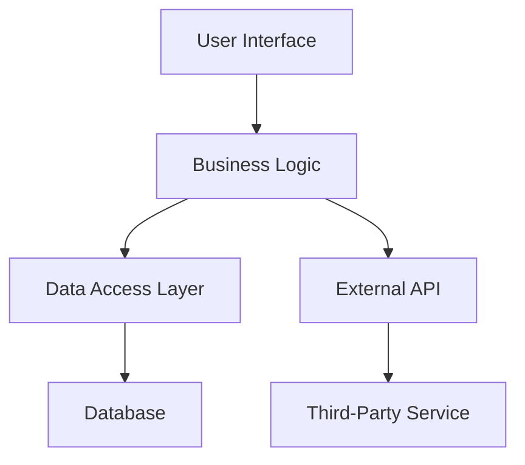
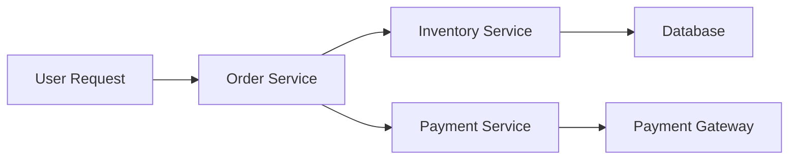

---

linkTitle: "15.1.1 Assessing the Monolith"
title: "Assessing the Monolith: A Comprehensive Guide to Transitioning to Microservices"
description: "Explore the essential steps in assessing a monolithic application before migrating to microservices, including architecture analysis, codebase evaluation, and stakeholder engagement."
categories:
- Microservices
- Software Architecture
- Migration Strategies
tags:
- Monolithic Architecture
- Microservices Migration
- Codebase Analysis
- Technical Debt
- Stakeholder Engagement
date: 2024-10-25
type: docs
nav_weight: 1511000
---

## 15.1.1 Assessing the Monolith

Transitioning from a monolithic architecture to a microservices-based system is a significant undertaking that requires careful planning and assessment. This section provides a detailed guide on how to effectively assess a monolithic application in preparation for migration to microservices. By understanding the existing architecture, evaluating the codebase, and engaging stakeholders, you can lay a solid foundation for a successful migration.

### Analyze Monolithic Architecture

The first step in assessing a monolith is to conduct a thorough analysis of its architecture. This involves understanding the overall structure, components, and how they interact with each other. Here are some key aspects to consider:

- **Component Identification:** Break down the monolith into its constituent components. Identify the core functionalities and how they are grouped within the system.
- **Interdependencies:** Examine the dependencies between components. Understanding these relationships is crucial for determining how to decouple them into independent microservices.
- **Architecture Diagrams:** Create detailed architecture diagrams that visually represent the monolith's structure. These diagrams should include components, data flows, and external integrations.

#### Example Diagram



### Evaluate Codebase Modularity

Assessing the modularity of the codebase is essential to identify areas that may pose challenges during the migration. A modular codebase is easier to decompose into microservices. Consider the following:

- **Cohesion and Coupling:** Evaluate the cohesion within modules and the coupling between them. High cohesion and low coupling are desirable for microservices.
- **Code Smells:** Identify code smells that indicate poor modularity, such as large classes, long methods, and excessive dependencies.
- **Refactoring Opportunities:** Look for opportunities to refactor the codebase to improve modularity before migration.

#### Java Code Example

```java
// Example of a tightly coupled class
public class OrderService {
    private PaymentService paymentService;
    private InventoryService inventoryService;

    public void processOrder(Order order) {
        if (inventoryService.isInStock(order)) {
            paymentService.processPayment(order);
            // Further processing...
        }
    }
}

// Refactored for better modularity
public class OrderProcessor {
    private final PaymentService paymentService;
    private final InventoryService inventoryService;

    public OrderProcessor(PaymentService paymentService, InventoryService inventoryService) {
        this.paymentService = paymentService;
        this.inventoryService = inventoryService;
    }

    public void processOrder(Order order) {
        if (inventoryService.isInStock(order)) {
            paymentService.processPayment(order);
            // Further processing...
        }
    }
}
```

### Identify Performance Bottlenecks

Performance bottlenecks within a monolith can significantly impact scalability. Identifying and addressing these bottlenecks is crucial for a successful migration:

- **Profiling and Monitoring:** Use profiling tools to monitor the application's performance and identify slow components or processes.
- **Load Testing:** Conduct load testing to simulate high-traffic scenarios and pinpoint areas that struggle under load.
- **Prioritization:** Prioritize components with performance issues for early migration to microservices, where they can be independently scaled.

### Assess Technology Stack

The current technology stack plays a vital role in determining the feasibility of a microservices architecture. Evaluate the stack with the following considerations:

- **Scalability:** Determine if the existing technologies support horizontal scaling, which is essential for microservices.
- **Flexibility:** Assess the flexibility of the stack to integrate with new tools and technologies required for microservices.
- **Maintainability:** Consider the ease of maintaining and updating the stack over time.

### Map Data Flows and Dependencies

Understanding data flows and dependencies within the monolith is critical for defining data ownership boundaries in microservices:

- **Data Flow Diagrams:** Create diagrams that map how data moves through the system, highlighting critical dependencies.
- **Data Ownership:** Identify which components own specific data sets, as this will inform the design of microservices.
- **Potential Boundaries:** Use the data flow analysis to propose potential boundaries for microservices.

#### Example Data Flow Diagram



### Conduct Technical Debt Analysis

Technical debt can hinder the migration process if not addressed. Perform a technical debt analysis to identify and prioritize issues:

- **Outdated Libraries:** Identify libraries and frameworks that are outdated and need updating.
- **Poor Documentation:** Assess the quality of documentation and plan improvements to support the migration.
- **Code Quality:** Evaluate code quality using static analysis tools to identify areas that require refactoring.

### Engage Stakeholders

Engaging stakeholders is crucial for gathering insights and ensuring a comprehensive understanding of the monolith:

- **Developers and Architects:** Involve developers and architects who have in-depth knowledge of the system to provide valuable insights.
- **Operations Teams:** Engage operations teams to understand deployment and operational challenges.
- **Business Stakeholders:** Include business stakeholders to align the migration with business goals and priorities.

### Create Comprehensive Documentation

Comprehensive documentation serves as a foundation for the migration plan:

- **Architecture Diagrams:** Include detailed diagrams of the current architecture and proposed microservices architecture.
- **Component Inventories:** Document all components, their responsibilities, and interactions.
- **Dependency Maps:** Create maps of dependencies between components and external systems.

### Conclusion

Assessing a monolithic application is a critical first step in the journey to microservices. By thoroughly analyzing the architecture, evaluating the codebase, identifying performance bottlenecks, and engaging stakeholders, you can develop a clear understanding of the monolith's strengths and weaknesses. This assessment will guide the migration strategy, ensuring a smoother transition to a scalable and flexible microservices architecture.

## Quiz Time!



### What is the first step in assessing a monolithic application for migration to microservices?

- [x] Conducting a thorough analysis of its architecture
- [ ] Evaluating the technology stack
- [ ] Identifying performance bottlenecks
- [ ] Engaging stakeholders

> **Explanation:** The first step is to conduct a thorough analysis of the monolithic architecture to understand its structure and components.

### Why is it important to evaluate codebase modularity during the assessment?

- [x] To identify tightly coupled modules that may pose challenges during decomposition
- [ ] To determine the technology stack's scalability
- [ ] To engage stakeholders
- [ ] To create comprehensive documentation

> **Explanation:** Evaluating codebase modularity helps identify tightly coupled modules, which can be challenging to decompose into microservices.

### What tool can be used to identify performance bottlenecks in a monolith?

- [x] Profiling tools
- [ ] Static analysis tools
- [ ] Documentation tools
- [ ] Dependency maps

> **Explanation:** Profiling tools are used to monitor the application's performance and identify slow components or processes.

### What should be considered when assessing the technology stack for microservices suitability?

- [x] Scalability, flexibility, and maintainability
- [ ] Codebase modularity
- [ ] Performance bottlenecks
- [ ] Stakeholder engagement

> **Explanation:** The technology stack should be evaluated for scalability, flexibility, and maintainability to determine its suitability for microservices.

### How can data flows and dependencies be visually represented?

- [x] Data flow diagrams
- [ ] Architecture diagrams
- [ ] Code snippets
- [ ] Technical debt analysis

> **Explanation:** Data flow diagrams visually represent how data moves through the system, highlighting critical dependencies.

### What is the purpose of conducting a technical debt analysis?

- [x] To identify existing issues that need to be addressed during migration
- [ ] To evaluate codebase modularity
- [ ] To engage stakeholders
- [ ] To create comprehensive documentation

> **Explanation:** A technical debt analysis identifies existing issues, such as outdated libraries or poor documentation, that need to be addressed during migration.

### Who should be engaged as stakeholders during the assessment?

- [x] Developers, architects, operations teams, and business stakeholders
- [ ] Only developers and architects
- [ ] Only operations teams
- [ ] Only business stakeholders

> **Explanation:** Engaging a broad range of stakeholders, including developers, architects, operations teams, and business stakeholders, ensures a comprehensive understanding of the monolith.

### What should comprehensive documentation include?

- [x] Architecture diagrams, component inventories, and dependency maps
- [ ] Only architecture diagrams
- [ ] Only component inventories
- [ ] Only dependency maps

> **Explanation:** Comprehensive documentation should include architecture diagrams, component inventories, and dependency maps to serve as a foundation for the migration plan.

### True or False: High cohesion and low coupling are desirable characteristics for microservices.

- [x] True
- [ ] False

> **Explanation:** High cohesion and low coupling are desirable because they make it easier to decompose a monolith into independent microservices.

### What is the role of architecture diagrams in the assessment process?

- [x] To visually represent the monolith's structure, components, and interactions
- [ ] To identify performance bottlenecks
- [ ] To evaluate the technology stack
- [ ] To conduct a technical debt analysis

> **Explanation:** Architecture diagrams visually represent the monolith's structure, components, and interactions, aiding in the assessment process.


