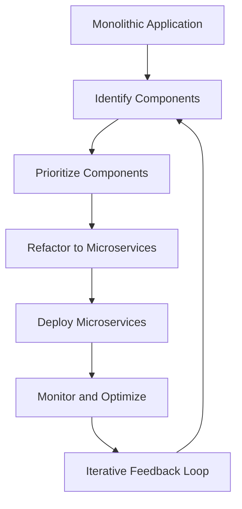

## 15.1.2 Setting Migration Goals

Transitioning from a monolithic architecture to a microservices-based system is a significant undertaking that requires careful planning and execution. Setting clear and effective migration goals is crucial to ensure that the migration process aligns with both technical and business objectives. This section will guide you through the essential steps to establish robust migration goals, providing practical insights and examples to facilitate a successful transition.

### Define Clear Objectives

The first step in setting migration goals is to define clear and specific objectives. These objectives should address the primary reasons for migrating to microservices, such as:

- **Improving Scalability:** Microservices allow individual components to scale independently, which can enhance the system's ability to handle increased loads.
- **Enhancing Maintainability:** By breaking down a monolith into smaller, manageable services, teams can improve code maintainability and reduce technical debt.
- **Enabling Independent Deployments:** Microservices facilitate continuous delivery and deployment, allowing teams to deploy updates to specific services without affecting the entire system.

**Example Objective:**
A retail company aims to improve its e-commerce platform's scalability to handle peak shopping seasons without performance degradation.

### Align with Business Goals

Migration goals should not only focus on technical improvements but also align with the broader business objectives. This alignment ensures that the migration supports business processes and meets customer needs effectively.

- **Facilitate Business Processes:** Ensure that the migration enhances the efficiency of business operations, such as order processing or customer service.
- **Support Customer Needs:** Consider how the migration will improve customer experience, such as faster response times or more reliable service.

**Example Alignment:**
The retail company aligns its migration goal with the business objective of increasing online sales by ensuring the platform can handle high traffic during promotional events.

### Prioritize Migration Efforts

Not all parts of a monolithic system need to be migrated at once. Prioritization helps focus efforts on areas that will deliver the most significant impact.

- **Business Impact:** Prioritize components that directly affect business operations or customer experience.
- **Technical Feasibility:** Assess the technical complexity of migrating each component and prioritize those that are easier to decouple.
- **Resource Availability:** Consider the availability of resources, including personnel and tools, when prioritizing migration efforts.

**Example Prioritization:**
The retail company prioritizes migrating the checkout and payment processing modules first, as these are critical for sales and revenue generation.

### Establish Success Metrics

Defining measurable success metrics is essential to evaluate the effectiveness of the migration. These metrics should reflect both technical and business improvements.

- **Reduced Deployment Times:** Measure the time taken to deploy updates before and after migration.
- **Improved System Performance:** Track performance metrics such as response times and error rates.
- **Increased Team Productivity:** Assess changes in team productivity, such as the time spent on maintenance tasks.

**Example Metrics:**
The retail company sets a success metric of reducing checkout page load times by 50% and achieving zero downtime during peak sales periods.

### Set Realistic Timelines

Developing realistic timelines is crucial for managing expectations and ensuring the migration progresses smoothly. Consider the complexity of the monolith, team capacity, and potential risks when setting timelines.

- **Complexity of the Monolith:** Larger and more complex systems may require longer timelines.
- **Team Capacity:** Ensure that the team has the necessary skills and bandwidth to execute the migration.
- **Potential Risks:** Account for risks such as data loss or service disruptions and build contingency plans.

**Example Timeline:**
The retail company sets a timeline of 12 months to complete the migration, with quarterly reviews to assess progress and adjust plans as needed.

### Identify Key Milestones

Breaking down the migration into key milestones helps track progress and maintain momentum. Milestones provide clear targets and facilitate communication with stakeholders.

- **Pilot Migration:** Complete a pilot migration to validate the approach and identify potential challenges.
- **Refactoring Modules:** Set milestones for refactoring specific modules or services.
- **Deploying Microservices:** Establish milestones for deploying the first set of microservices and integrating them with existing systems.

**Example Milestones:**
The retail company sets milestones for completing a pilot migration of the inventory management module and deploying the first microservices by the end of the first quarter.

### Allocate Resources Effectively

Ensuring that sufficient resources are allocated to the migration process is critical for success. This includes personnel, tools, and budget.

- **Personnel:** Assign skilled team members to lead and execute the migration.
- **Tools:** Invest in tools that facilitate microservices development, testing, and deployment.
- **Budget:** Allocate a budget that covers all aspects of the migration, including training and infrastructure costs.

**Example Resource Allocation:**
The retail company allocates a dedicated team of developers and invests in a microservices platform to support the migration.

### Plan for Iterative Migration

Adopting an iterative approach to migration allows for continuous assessment and adjustment of goals based on ongoing findings and changing requirements.

- **Continuous Assessment:** Regularly evaluate progress and adjust goals as needed.
- **Feedback Loops:** Establish feedback loops to gather insights from stakeholders and end-users.
- **Flexibility:** Be prepared to adapt the migration plan based on new information or changing business priorities.

**Example Iterative Plan:**
The retail company implements an iterative migration plan with monthly feedback sessions to gather insights and make necessary adjustments.

### Practical Java Code Example

To illustrate the migration process, let's consider a simple example of refactoring a monolithic Java application into microservices. Suppose we have a monolithic application with a `UserService` class responsible for user management.

**Monolithic UserService:**

```java
public class UserService {
    public void createUser(String username, String password) {
        // Logic to create a user
    }

    public void updateUser(String userId, String newUsername) {
        // Logic to update a user
    }

    public void deleteUser(String userId) {
        // Logic to delete a user
    }
}
```

**Refactored Microservices:**

1. **User Creation Service:**

```java
public class UserCreationService {
    public void createUser(String username, String password) {
        // Logic to create a user
    }
}
```

2. **User Update Service:**

```java
public class UserUpdateService {
    public void updateUser(String userId, String newUsername) {
        // Logic to update a user
    }
}
```

3. **User Deletion Service:**

```java
public class UserDeletionService {
    public void deleteUser(String userId) {
        // Logic to delete a user
    }
}
```

By breaking down the `UserService` into separate services, we can deploy and scale each service independently, aligning with the migration goals of improving scalability and maintainability.

### Diagram: Migration Workflow

Below is a diagram illustrating a typical migration workflow from a monolithic architecture to microservices:



### Best Practices and Common Pitfalls

- **Best Practices:**
  - Involve stakeholders early and often to ensure alignment with business goals.
  - Use automated testing to ensure the reliability of microservices during migration.
  - Document the migration process to facilitate knowledge sharing and future reference.

- **Common Pitfalls:**
  - Underestimating the complexity of the migration, leading to unrealistic timelines.
  - Failing to allocate sufficient resources, resulting in delays and increased costs.
  - Neglecting to establish clear success metrics, making it difficult to evaluate progress.

### References and Further Reading

- **Books:**
  - "Building Microservices" by Sam Newman
  - "Domain-Driven Design: Tackling Complexity in the Heart of Software" by Eric Evans

- **Online Courses:**
  - "Microservices with Spring Cloud" on Coursera
  - "Architecting Microservices" on Udemy

- **Open Source Projects:**
  - Spring Cloud: [https://spring.io/projects/spring-cloud](https://spring.io/projects/spring-cloud)
  - Netflix OSS: [https://github.com/Netflix](https://github.com/Netflix)

## Quiz Time!



### What is the primary reason for defining clear migration objectives?

- [x] To address the primary reasons for migrating to microservices
- [ ] To ensure the migration is completed quickly
- [ ] To reduce the cost of migration
- [ ] To avoid involving stakeholders

> **Explanation:** Defining clear migration objectives helps address the primary reasons for migrating to microservices, such as improving scalability and maintainability.

### Why is it important to align migration goals with business objectives?

- [x] To ensure the migration supports business processes and meets customer needs
- [ ] To reduce the technical complexity of the migration
- [ ] To minimize the number of microservices
- [ ] To increase the migration budget

> **Explanation:** Aligning migration goals with business objectives ensures that the migration supports business processes and meets customer needs effectively.

### What factors should be considered when prioritizing migration efforts?

- [x] Business impact, technical feasibility, and resource availability
- [ ] The number of developers available
- [ ] The age of the monolithic system
- [ ] The location of the development team

> **Explanation:** Prioritizing migration efforts involves considering business impact, technical feasibility, and resource availability.

### What is a key benefit of establishing success metrics for migration?

- [x] To evaluate the effectiveness of the migration
- [ ] To reduce the number of microservices
- [ ] To increase the migration budget
- [ ] To avoid technical challenges

> **Explanation:** Establishing success metrics allows organizations to evaluate the effectiveness of the migration by measuring improvements in deployment times, system performance, and team productivity.

### What should be considered when setting realistic timelines for migration?

- [x] Complexity of the monolith, team capacity, and potential risks
- [ ] The number of microservices to be created
- [ ] The color scheme of the user interface
- [ ] The location of the data center

> **Explanation:** Realistic timelines should consider the complexity of the monolith, team capacity, and potential risks to ensure a smooth migration process.

### Why is it important to identify key milestones in the migration process?

- [x] To track progress and maintain momentum
- [ ] To reduce the number of microservices
- [ ] To increase the migration budget
- [ ] To avoid technical challenges

> **Explanation:** Identifying key milestones helps track progress and maintain momentum, providing clear targets and facilitating communication with stakeholders.

### What resources should be allocated effectively to support the migration process?

- [x] Personnel, tools, and budget
- [ ] Only personnel
- [ ] Only tools
- [ ] Only budget

> **Explanation:** Effective allocation of personnel, tools, and budget is crucial to support the migration process without hindering other operations.

### What is the advantage of adopting an iterative approach to migration?

- [x] Allows for continuous assessment and adjustment of goals
- [ ] Reduces the number of microservices
- [ ] Increases the migration budget
- [ ] Avoids technical challenges

> **Explanation:** An iterative approach allows for continuous assessment and adjustment of goals based on ongoing findings and changing requirements.

### What is a common pitfall in the migration process?

- [x] Underestimating the complexity of the migration
- [ ] Overestimating the number of microservices
- [ ] Choosing the wrong programming language
- [ ] Using too many diagrams

> **Explanation:** Underestimating the complexity of the migration can lead to unrealistic timelines and increased costs.

### True or False: Aligning migration goals with business objectives is unnecessary if the technical goals are clear.

- [ ] True
- [x] False

> **Explanation:** Aligning migration goals with business objectives is essential to ensure the migration supports business processes and meets customer needs effectively.


